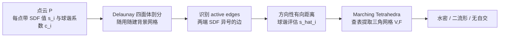

## 一句话总结

TetWeave 提出一种用于梯度优化的可微等值面表示：不再依赖预定义网格，而是对任意点云做 Delaunay 四面体剖分并"随用随建"背景网格，配合一个用球谐函数编码的方向性有向距离，用 Marching Tetrahedra 提取出保证水密、二流形、无自交的三角网格，实现接近线性的内存伸缩与自适应细分。

## 研究背景

在可微三维应用（形状生成、文本到三维、逆渲染、多视图重建）里，人们常希望优化一个隐式表示再用等值面提取算法转成三角网格。经典 Marching Cubes 会产生阶梯状伪影；DMTet 与 FlexiCubes 这类"网格自适应"方法通过联合优化隐式场与空间网格结构来改善质量，但仍存在三类核心痛点：

- 内存消耗高、伸缩性差。以 FlexiCubes 为例，它从体素网格出发，每个网格单元要存 21 个参数、每个网格点存 3 个参数；分辨率翻倍时参数量呈立方增长，而输出顶点仅呈平方增长，因此难以捕捉高频细节。
- 容易自交。FlexiCubes 无法保证输出网格无自相交。
- 缺乏在复杂多尺度网格上做自适应细分的原则性机制。

作者强调 TetWeave 并非通用自适应网格化工具，也不是为固定标量场做等值面提取而设计，而是专门服务于梯度式网格处理，尤其适合多视图三维重建这类任务。

## 方法

### 整体流程

TetWeave 的形状表示极其简单：一个点云 $$P=\{p_1,p_2,\dots,p_n\},\quad p_i\in\mathbb{R}^3$$，每个点关联一个基础有向距离值 $$s_i\in\mathbb{R}$$ 与一个特征向量 $$c_i\in\mathbb{R}^q$$。从该表示提取网格分三步。

关键在于背景网格不是变形一个预算好的固定结构，而是对任意点云直接做 Delaunay 三角剖分得到，点可以自由移动到空间任意位置，只需存位置和该处的 SDF 值。这带来了自适应性并大幅降低参数量。

### 关键设计一：方向性有向距离（Spherical Harmonics）

若每个点只存一个 SDF 值，那么在 Marching Tetrahedra 沿边定位顶点时，一个点连出的所有 active edge 只能共用一个折中距离，导致重建不精确。为此作者定义方向性有向距离：对连接 $$p_i,p_j$$ 的 active edge $$e$$，

$$\hat{s}_i(e)=\bigl(1+\tanh(SH(\theta_{i\to j},\phi_{i\to j},c_i))\bigr)\,s_i$$

其中 $$\theta_{i\to j},\phi_{i\to j}$$ 是向量 $$p_j-p_i$$ 的极角与方位角，$$SH$$ 在给定角度处评估球谐，系数 $$c_i\in\mathbb{R}^q$$，$$q=(d+1)^2$$，$$d$$ 为球谐阶数。该式保证 $$\hat{s}_i(e)$$ 与 $$s_i$$ 同号且取值落在 $$(0,2s_i)$$，既与 Marching Tetrahedra 兼容，又允许每条边上放置不同的顶点位置。选球谐而非梯度向量的理由：线性基组合易求导、低频球谐可强制方向函数平滑、增删系数即可灵活扩展自由度（有助处理 SDF 中的尖点，如龙的颈部与身体之间）。

### 关键设计二：网格提取

称至少属于一条 active edge 的点为 active point。每条 active edge 恰好产生一个网格顶点，由两端点线性插值：

$$v_e=\frac{\hat{s}_2(e)\,p_1-\hat{s}_1(e)\,p_2}{\hat{s}_2(e)-\hat{s}_1(e)}$$

连接关系 $$F$$ 由与标准 Marching Tetrahedra 相同的查找表按边符号得到。

### 关键设计三：正则项

- ODT 能量（最优 Delaunay 三角化）：鼓励四面体均匀、良态。对四面体 $$T_i$$ 有 $$E_{ODT}(T_i)=\vert M_{ST_i}-M_{T_i}\vert $$，全局损失 $$L_{ODT}=\sum_{T_i\in T}\vert M_{ST_i}-M_{T_i}\vert $$。因 ODT 恰以 Delaunay 连接为最优，与本方法随用随建的流程天然一致，正则四面体对正则形状能量为零。
- 三角公平性损失：惩罚偏离 $$\pi/3$$ 的角，鼓励等边三角形，$$L_{fairness}=\sum_{f\in F}\frac{1}{3}\sum_{i=1}^{3}\bigl(\theta_i-\frac{\pi}{3}\bigr)^2$$。
- 符号变化正则（同 FlexiCubes）：抑制无监督空间中的伪几何，对每条 active edge 用交叉熵惩罚基础 SDF 的符号变化 $$L_{sign}=\sum_{(a,b)\in E_A}H(\sigma(s_a),\mathrm{sgn}(s_b))$$。

### 关键设计四：点云细分与自适应网格化

由于不依赖固定网格，可以把点自适应放在需要的地方。细分分两步：先移除 passive point（不与任何 active point 相邻、对优化无贡献的点），再在网格包围盒的体素栅格 $$G$$ 上按重要度 $$h(g_i)$$ 归一化得到概率分布 $$\rho(g_i)$$，用多项分布采样各体素内新增点数、再插值初始化其 SDF 与球谐系数。

对逆渲染场景，作者用渲染误差驱动 $$h$$：对每个像素算误差 $$E_k(u,v)=\vert \tilde{I}_k(u,v)-I(V,F,\theta_k)(u,v)\vert $$，投影到网格后按所落体素累积并归一化：

$$h(g_i)=\frac{\sum_k\sum_{(u,v)\in N_{g_i}}E_k(u,v)}{\vert N_{g_i}\vert }$$

这样三角面会在高频/高曲率区域加密。$$h$$ 也可自定义（常值=均匀，沿轴立方=渐变加密，径向=远离中心加密）。

### 多阶段优化

- 主阶段（5000 次迭代）：同时更新点位置与 SDF 值并施加全部正则，通过重采样逐步增点到目标数量。为控成本，默认每 $$m$$ 步才重算一次 Delaunay，其间固定点位并累积梯度（类似梯度累积）。
- 后期微调阶段（2000 次迭代）：固定点位、不再重算 Delaunay，仅优化 SDF 值与球谐系数，且关闭 ODT 与公平性正则。该阶段显著提升重建保真度、抑制噪声几何。

多视图重建损失：$$L_{recons}=\lambda_M\|M-M_{gt}\|+\lambda_D\|M_{gt}(D-D_{gt})\|^2+\lambda_N\|M_{gt}(N-N_{gt})\|^2$$。

## 实验结果

### 重建质量对比（ThreeDScan 数据集，处理后 75 个形状，每形采样 100 万点）

主表忠实数字（CD 单位 1e-5，ECD 单位 1e-2，百分比为占比）：

| 方法 | CD ↓ | F1 ↑ | ECD ↓ | EF1 ↑ | NC ↑ | IN>5° ↓ | AR>4 ↓ | RR>4 ↓ | SA<10° ↓ | SI ↓ | #V | #F |
|---|---|---|---|---|---|---|---|---|---|---|---|---|
| DMTet (128³) | 1.043 | 0.339 | 1.681 | 0.272 | 0.965 | 48.393 | 12.026 | 11.826 | 12.351 | 0.000 | 20677 | 41364 |
| FlexiCubes (128³) | 0.752 | 0.416 | 1.254 | 0.393 | 0.979 | 36.911 | 5.418 | 6.701 | 4.588 | 0.203 | 28430 | 56873 |
| TetWeave (16K) | 0.517 | 0.409 | 1.475 | 0.353 | 0.974 | 43.380 | 2.350 | 3.344 | 1.743 | 0.000 | 26484 | 53015 |
| TetWeave (64K) | 0.419 | 0.446 | 0.962 | 0.518 | 0.984 | 33.700 | 2.251 | 3.252 | 1.616 | 0.000 | 81027 | 162102 |
| TetWeave (128K) | 0.393 | 0.455 | 0.708 | 0.588 | 0.987 | 29.361 | 2.507 | 3.556 | 1.829 | 0.000 | 146514 | 293074 |

TetWeave 在相当复杂度下持续获得更低 Chamfer 距离、更高法向一致性、更少退化三角形，且随点数从 16K 增到 128K 各几何指标近乎单调提升，任意分辨率下自交率恒为 0（设计保证）。FlexiCubes 因 GPU 显存限制几乎无法超过 128³，因而无法重建如 Gutenberg 雕像底座铭文这类精细高频；不过 FlexiCubes 在 16K 点级别的边缘锐度（ECD/EF1）略优。

### 消融

- 方向性有向距离（球谐）：对 CD/F1 影响不大，但持续提升 EF1、降低不准确法向占比，在最坏情形下改善明显。
- 正则：公平性项大幅改善三角质量（AR、RR、小角占比），并因剔除极小面积三角形带来约 36% 顶点数下降、几乎不损保真，代价是不准确法向略升；ODT 能量使边缘 Chamfer 距离改善逾 10%。
- 自适应网格化：与均匀采样相比，CD/F1 相近，但均匀采样在锐特征上（ECD、EF1、不准确法向）明显更差，凸显误差驱动采样对高频细节的优势。

### 性能（NVIDIA RTX 3090）

- 内存与伸缩性：TetWeave 仅存点、SDF 值与可选球谐系数，不存连接关系（Delaunay 推断），单点可生成多个输出顶点，因此在同等 Chamfer 距离下所需点数远少于 FlexiCubes，实现接近线性的内存伸缩（FlexiCubes 图中最大约 145³，TetWeave 展示到 500K 点仍更优）。示例形状从 8K 到 128K 点，模型文件（仅保留 active point、float16）约 108kB 到 1.2MB。
- 运行时：以牺牲速度换内存。前向大部分时间花在 Delaunay 三角剖分（理论 $$O(n\ln n)$$，Tetgen 实测近线性）。整体运行时约从 8K 点的两分钟到 128K 点的不到八分钟。

### 应用

- 网格压缩：$$N$$ 个点的表示大小为 $$B(4+q)N$$ 字节（$$B=4$$ 或 $$8$$）。对高分辨率雕像，参考网格 37.4MB，Draco 压到 2.3MB 但有高频伪影，NGF 仅 267.3kB 但非自适应且可能自交，TetWeave（64K，无球谐，丢弃非活跃点、float16）达 319.8kB。
- 几何纹理：借鉴 Paparazzi 思路，固定点位与 SDF 只优化球谐系数，可用引导滤波、$$L_0$$ 平滑、K-means 量化等图像滤波，或对法向图施加 CLIP 损失（"a wave-like style"）、可展性能量生成分片可展曲面。
- 摄影测量：接入 NVDiffRec 管线，用蓝噪声初始化点云、多阶段（粗重建→拟合 8K 自适应网格→仅优化 SDF 精修），在 Stanford ORB 上新光照/新视图合成质量与三角化更好，但几何指标未超过 FlexiCubes/DMTet（对手低分辨率网格更抗高频伪影，其网格结构本身起正则作用）。

## 亮点与局限

亮点：

- 用任意点云的 Delaunay 剖分 + Marching Tetrahedra 做梯度式网格优化，天然保证水密、二流形、无自交。
- 方向性有向距离（球谐）让同一点在不同边上放置不同顶点，更贴合局部法向。
- 误差驱动的重采样实现可定制的自适应网格化，把三角面集中到高频区域。
- 接近线性的内存伸缩，参数量与文件体积远小于 FlexiCubes，适合压缩。

局限：

- 薄结构敏感：Delaunay 可能连接同号点，在薄壁处产生错误的孔洞。
- Delaunay 可能出现超线性运行时，时间复杂度可能先于内存成为瓶颈。
- 与其他网格自适应方法一样，若不加正则可能出现内部空腔。
- 摄影测量等高度欠约束反演问题中，过高的自适应自由度反而不利，需谨慎的多阶段策略且避免使用球谐。

## 延伸思考

- 作者指出 Marching Tetrahedra 只需一致定向的四面体网格，因此"随用随建"非 Delaunay 连接可能带来更大灵活性，是一条值得探索的路。
- 另一个方向是把任意网格直接转成该表示，从而实现近无损压缩，并为生成模型提供便利的参数空间——这对学习式任务尤其有价值，但可行性与实现仍是开放问题。
- 本方法把"网格质量/自适应性"作为可优化目标而非纯几何准则，思路上把有限元网格质量度量（ODT）与可微渲染误差信号结合，这种"用下游误差反向指导背景网格分布"的范式可迁移到其他需要离散化的可微几何任务。
