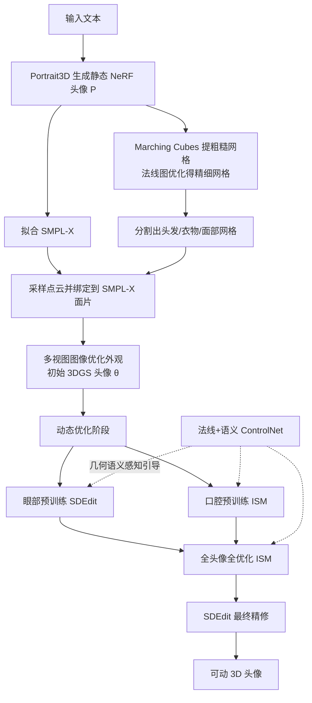

## 一句话总结

本文提出 AnimPortrait3D 框架，先用预训练文本到 3D 模型初始化出外观、几何都稳健且与参数化模型（SMPL-X）对齐的 3DGS 头像，再用一个以法线图与语义分割图为条件的 ControlNet 引导动态优化，从而只凭文本就能生成高质量、可用形变模型参数驱动的可动 3D 头像。

## 研究背景

从文本生成高质量、可动画的 3D 头部头像，在游戏、影视和具身虚拟助手等内容创作场景中有巨大潜力。当前主流做法把参数化头部模型与 2D 扩散模型结合，通过分数蒸馏采样（Score Distillation Sampling, SDS）把 2D 信息注入 3D 表示，以获得 3D 一致的结果。

但作者指出这类方法有两个根本性的模糊来源，导致合成细节不真实、外观与驱动参数化模型错位，进而产生不自然的动画：

其一，外观与几何被文本严重欠约束。单条文本提示在扩散模型中对应大量可能图像，蒸馏出的结果往往模糊，还会出现多面朝向的「Janus」问题。Portrait3D 用外观-几何联合先验缓解了这点，但几何噪声大且只能做静态重建，无法驱动。

其二，预测与参数化模型之间的语义对齐不足。扩散模型本身无法感知参数化模型的信息，导致刚性绑定（rigging）不准、动画出现伪影。HeadStudio 用基于关键点（landmarks）的 ControlNet 引导，但稀疏关键点提供的 3D 约束仍然不够。

核心难题因此变成：如何把同时感知几何与语义的稳健引导信号，注入到 3D 头像的优化过程中。

## 方法

### 整体框架

AnimPortrait3D 选用 3DGS 作为 3D 表示（渲染高效、便于绑定驱动），整体分两个阶段：**3D 头像初始化阶段**消除外观与几何模糊，产出一个绑定到 SMPL-X、语义对齐良好的初始头像；**动态优化阶段**用 2D 扩散模型加 ControlNet 修复新表情、新姿态下的动画伪影，补足眼部与口腔内部细节，最终做精修。

### 关键设计

**3D 头像初始化。** 给定文本提示 $$y$$，先用 Portrait3D 生成静态 NeRF 头像 $$P$$，再用多视图头部跟踪拟合出 SMPL-X 模型 $$M_{SMPL-X}$$。由于 SMPL-X 无法表达头发和衣物，作者用 Marching Cubes 从 $$P$$ 提取粗糙网格 $$M_{raw}$$、经拉普拉斯平滑得 $$M_{smooth}$$，再用 Unique3D 的法线估计器从多视图渲染 $$\{I_i^{raw}\}$$ 得到法线图，据此把 $$M_{smooth}$$ 优化成细节更丰富的 $$M_{refined}$$。随后借鉴 MeshSegmenter 的 Face Revoting，配合 Sapiens 面部分割与专门的头发分割模型，把 $$M_{refined}$$ 切成头发、衣物、面部三类资产网格。

接着借鉴 GaussianAvatars，从 $$M_{SMPL-X}$$、头发网格、衣物网格表面采样点云并绑定到 SMPL-X 面片：SMPL-X 采样点直接继承所在面片的绑定关系，头发和衣物采样点则各自找到头皮、身体分区上最近的面片继承其绑定参数。该绑定点云初始化 3DGS 的可动位置，再用 $$\{I_i^{raw}\}$$ 优化外观；由于中性表情下口腔完全不可见，作者用通用代理几何与颜色初始化牙齿。初始头像记作可训练参数 $$\theta$$。

**动态优化。** 初始头像虽可驱动，但新表情下会出现明显伪影，根因有二：眼睑与眼球和对应高斯的轻微错位造成绑定行为异常；初始化时口腔闭合，口腔内部表征不足。作者的解法是训练一个 ControlNet 提供几何与语义感知引导。借鉴 Joker，ControlNet 以法线图为条件输入（训练法线图由预训练人脸重建方法从 RGB 肖像提取），并补充牙齿、眼睛、虹膜的分割图作为补充控制信号，因为这些区域仅靠法线图欠定；训练集含 453,385 对高质量的 RGB 与条件配对数据。推理时以 SMPL-X 渲染的法线图与分割图作为条件。

动态优化按「预训练 → 全优化 → 精修」三步递进：

眼部预训练用 ControlNet 生成的图像做监督。随机采样眼睑参数（控制睁闭）和眼球姿态参数（控制注视方向）施加到 SMPL-X 上形变头像，用 ControlNet 做 SDEdit（编辑强度 0.9）生成精修眼部图像，损失为：

$$L_{eye\_pre} = L_2\left(I_e,\ \mathrm{SDEdit}(\epsilon_D, \epsilon_C, I_e, y, N_e, S_e)\right)$$

其中 $$I_e$$ 为渲染眼部图像，$$N_e$$、$$S_e$$ 为其法线图与分割掩码，$$\epsilon_D$$、$$\epsilon_C$$ 分别为预训练扩散模型与 ControlNet。

口腔内部只有通用代理初始化，因此改用间隔分数匹配（Interval Score Matching, ISM）优化。ISM 损失定义为：

$$\nabla_\theta L_{ISM}(\theta, I, t, y, N, S) \triangleq \mathbb{E}_t\left[\omega(t)\left(\epsilon_D(z_t, t, y, F_{ctrl}) - \epsilon_D(z_t, s, \varnothing)\right)\frac{\partial z_0}{\partial I}\frac{\partial I}{\partial \theta}\right]$$

其中 $$F_{ctrl} = \epsilon_C(z_t, t, y, N, S)$$，$$z_0$$ 由图像 $$I$$ 经 VAE 编码得到，$$s = t - \delta T$$ 为调整后的时间步（反演步长 $$\delta T = 50$$），$$\varnothing$$ 表示无条件。口腔预训练从 NeRSemble 数据集采张嘴表情以保证口腔可见：

$$\nabla_\theta L_{mouth\_pre}(\theta) = \nabla_\theta L_{ISM}(\theta, I_m, t, y, N_m, S_m)$$

全优化阶段随机采样 NeRSemble 的姿态、表情与相机视角，对眼部、口腔、面部裁剪区域施加带 ControlNet 引导的 ISM，并对整幅渲染施加不带 ControlNet 的 ISM：

$$\nabla_\theta L_{full}(\theta) \triangleq \sum_{r\in\{e,m,f\}}\nabla_\theta L_{ISM}(\theta, I_r, t, y, N_r, S_r) + \nabla_\theta L_{ISM}(\theta, I_{full}, t, y)$$

作者发现整幅渲染中受表情影响、可被法线与语义图控制的区域太小，用 ControlNet 无增益，故省去以加速。

最终精修用 SDEdit（编辑强度 0.3，不用 ControlNet）在随机表情、姿态、视角下精修各区域，结合 L1 与 LPIPS 损失兼顾像素精度与感知质量：

$$L_{refine} = \sum_{r\in\{e,m,f,full\}} L_1\left(\mathrm{SDEdit}(\epsilon_D, I_r, y), I_r\right) + L_{lpips}\left(\mathrm{SDEdit}(\epsilon_D, I_r, y), I_r\right)$$

其中整幅更新时会屏蔽非面部区域，避免干扰放大后的眼、口、脸区域的更精细更新。

## 实验结果

作者与可动 3D 头像生成的代表方法（HeadStudio、TADA、HumanGaussian）、3D 头像编辑方法（PortraitGen）以及基于 3DGS 的头部重建方法（GPAvatar、GAGAvatar）比较。评测生成 20 个头像（男女各 10），每个渲染 100 张随机视角、随机参数图像。指标含：几何对齐用预测面部关键点与参数模型对应点的偏差（Landmarks），语义对齐用平均表情距离（AED）与 CLIP 相似度，质量用无参考的 HyperIQA 与专门的人脸质量指标 DSL-FIQA。

| 方法 | Landmarks ↓ | AED ↓ | CLIP ↑ | HyperIQA ↑ | DSL-FIQA ↑ |
|------|-------------|-------|--------|------------|------------|
| Ours | 0.0148 | 0.1265 | 0.2749 | 59.6879 | 0.6426 |
| HeadStudio | 0.0263 | 0.3136 | 0.2687 | 46.7009 | 0.3819 |
| TADA | 0.1353 | 0.2162 | 0.2492 | 60.1467 | 0.4190 |
| HumanGaussian | 0.0429 | 0.2754 | 0.2661 | 23.8779 | 0.1123 |
| PortraitGen | 0.0269 | 0.1618 | 0.2485 | 38.1552 | 0.2714 |
| GPAvatar | 0.0220 | 0.1265 | 0.2131 | 49.4826 | 0.5157 |
| GAGAvatar | 0.0199 | 0.1267 | 0.2627 | 51.2861 | 0.5550 |

本方法在几何对齐、语义对齐（CLIP）与人脸质量（DSL-FIQA）上均居首。唯一例外是通用质量分 HyperIQA 上 TADA 反而得分最高，作者认为这是 HyperIQA 对 TADA 强伪影不敏感所致，与定性观察矛盾，而人脸专用的 DSL-FIQA 更贴合人类偏好。

消融分为递进式与减法式两类。递进式展示流水线各阶段效果：初始化后的头像存在绑定不准、颜色失真、空洞等动画伪影；眼口预训练显著缓解伪影；全优化补充细节但残留伪影；最终精修得到高度真实、驱动稳健的头像。减法式逐一移除组件：去掉外观初始化会出现不自然色调、衣物模糊；去掉几何初始化难以刻画复杂真实人体特征；去掉眼口预训练会削弱这两个区域的真实感与几何对齐；去掉 ControlNet 即便有良好初始化与预训练，仍会出现眼睛过大、绑定不准、嘴唇伪影等明显质量退化。

## 亮点与局限

亮点：一是初始化策略把外观与几何先验联合注入，并同时建立与参数化模型的稳健绑定关系，从源头消除外观模糊；二是提出几何与语义感知的动态优化，用以稠密法线图与分割图为条件的 ControlNet 替代稀疏关键点引导，对齐精度明显更好；三是针对眼睑、口腔内部等复杂遮挡区域设计专门的预训练策略（眼部用 SDEdit、口腔用 ISM），把传统方法难处理的区域做实。

局限：作者坦言其一，静态高斯特征把光影烘焙进固定颜色，牙齿等对光照敏感区域受限，也难渲染皱纹等动态细节，未来可引入动态高斯属性与面部数据；其二，网格分割质量依赖 2D 分割性能，效果不佳会导致绑定错误或漂浮高斯；其三，动画表现力受限于底层 3DMM 的混合形状（blend shapes），长发和复杂衣物往往需物理仿真，且用视频提取的混合形状会带来唇形同步伪影、缺失注视动画、表情欠真实，用美术设计或工业级混合形状可望更好。

## 延伸思考

这篇工作的核心方法论价值在于「用强先验消除蒸馏模糊」——与其让单一扩散模型在欠约束的文本条件下硬蒸馏，不如先借一个成熟的文本到 3D 模型（Portrait3D）把外观与几何锚定下来，把生成问题转化为「初始化 + 对齐修复」。这种「先拿到一个足够好的起点，再用条件化引导精修」的范式，对其他容易陷入模糊与多义的生成蒸馏任务同样有借鉴意义。

另一个值得注意的点是把「可驱动性」当作一等目标贯穿全流程：从初始化阶段就建立与 SMPL-X 的绑定关系，再用 NeRSemble 采样真实表情、姿态在优化中显式覆盖动态分布，而非事后再套动画。这提示生成可动资产时，动画约束应尽早介入而非后处理。局限中反复提到的静态高斯光影烘焙与 3DMM 混合形状表达力上限，也指向下一步方向：可重光照的动态高斯表示，以及超越线性混合形状的更强表情基，或许是让文本生成头像真正走向影视级可用的关键。
