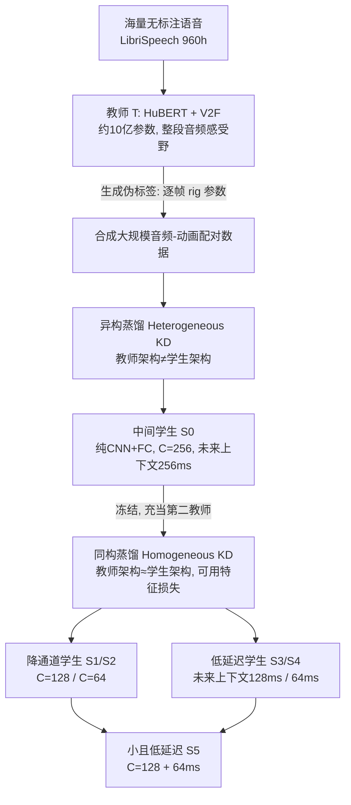

## 一句话总结

用"混合知识蒸馏 + 伪标签"把一个 10 亿参数、需要吞下整段音频的语音驱动面部动画大模型，压缩成 0.8M 参数、内存约 3.4–8 MB、未来上下文仅 64 ms 的纯卷积小模型，在游戏场景里做到 CPU 上实时、低延迟且几乎不掉画质。

## 研究背景

高质量的语音驱动 3D 面部动画模型如今普遍依赖大型预训练语音编码器（Wav2Vec 2.0、HuBERT）来获得跨说话人、跨语言、跨录音质量的鲁棒特征。代价是模型体量巨大（本文教师约 10 亿参数），且 Transformer 编码器的感受野是整段音频，只能在专用机器上离线推理。

而游戏运行时的现实约束完全相反：大部分算力被渲染和游戏逻辑占用，机器学习模型必须小到能在 CPU 上跑（作者引用布料模拟 Swish 约 6000 参数、角色动画约 100 万参数，单帧推理均低于 1 ms）。云端推理虽然可行，但成本随用户数线性增长，长期不划算。作者据此设定三条硬指标：

- 低延迟：未来音频上下文 + 推理时间之和尽量小。综合文献取"可接受延迟"约 140 ms（90 ms 与 185 ms 阈值的折中），越低越好。
- 低资源：内存占用（含参数与推理中间量）在 float32 下 $\leq 8$ MB。
- 高质量：以双唇音（/p/、/b/、/m/）的闭唇准确率作为画质代理指标，保持在教师质量的 70–80% 以上。

核心难题是缺乏大规模、高质量的"音频—动画"配对数据集。作者的思路是：用少量动捕数据训练一个强教师，再让教师给海量无标注语音"打伪标签"，合成大规模配对数据来监督小学生模型。

## 方法

整体是一个两阶段的混合知识蒸馏（Hybrid KD）框架：先做异构蒸馏得到中间学生 $S_0$，再把 $S_0$ 冻结当作第二教师做同构蒸馏，训练更小或更低延迟的学生。

关键设计一：异构蒸馏与学生架构。教师采用基于 Voice2Face（V2F）的高质量模型，把原来的 MFCC 输入替换为 HuBERT xlarge 特征（从 50 fps 插值到 30 fps），其余的 CVAE 网格生成器与 Mesh2Rig 模块保持不变；推理时固定隐变量、只让音频驱动，输出 78 维 rig 参数 $r_t \in \mathbb{R}^{78}$。学生则完全抛弃注意力和循环结构，只用一维卷积 + 全连接：输入是 512 ms、$1\times 8192$ 的原始波形窗口（16 kHz），其中 $512-d$ ms 为过去、$d$ ms 为未来，未来长度 $d$ 直接决定初始延迟。网络先用多层不同核宽/步长的一维卷积下采样，再接一个大核（kernel=64、两侧各补 32 个零）卷积捕获全局特征，并通过残差连接融合局部与全局特征，最后压到时间维为 1、经三层全连接输出 rig。

关键设计二：损失函数。异构阶段用重建损失加速度/速度平滑损失：

$$\mathcal{L}_{rec} = \mathbb{E}_t \lVert r_t - \hat{r}_t \rVert_2^2$$

$$v_t = r_t - r_{t-1},\quad \hat{v}_t = \hat{r}_t - \hat{r}_{t-1},\quad \mathcal{L}_{vel} = \mathbb{E}_t \lVert v_t - \hat{v}_t \rVert_2^2$$

$$\mathcal{L} = \alpha_{rec}\mathcal{L}_{rec} + \alpha_{vel}\mathcal{L}_{vel}$$

速度损失用于抑制抖动。实验中一般取 $\alpha_{rec}=0.1$、$\alpha_{vel}=0.9$。

关键设计三：混合蒸馏中的特征监督。当直接把学生做小或做低延迟时，教师与学生的容量差距过大，性能下降。作者把已训好的 $S_0$ 冻结作为"同构第二教师"，因架构相同，可以在中间层加特征损失。针对降通道学生（down-scaling）：

$$\mathcal{L}_{feat}(S_0, S) = \mathbb{E}_t \left[ \sum_{l \in [-4:-2]} \lVert F^{S_0}_l(w^d_t) - F^{S}_l(w^d_t) \rVert_2^2 \right]$$

其中只在最后几层全连接（高层、任务相关特征）上对齐。针对低延迟学生（predictive feature supervision），第二教师看的是含 $d$ ms 未来的窗口，而低延迟学生看的是 $d' \ll d$ 的窗口：

$$\mathcal{L}_{feat}(S_0, S) = \mathbb{E}_t \left[ \sum_{l \in [-4:-2]} \lVert F^{S_0}_l(w^d_t) - F^{S}_l(w^{d'}_t) \rVert_2^2 \right]$$

这迫使低延迟学生学到"能预测未来音频"的高层特征。混合阶段总损失为：

$$\mathcal{L} = \alpha_{rec}\mathcal{L}_{rec} + \alpha_{vel}\mathcal{L}_{vel} + \alpha_{feat}\mathcal{L}_{feat}$$

关键设计四：实时集成预测（平滑）。对个别抖动严重的低延迟模型，用 60 fps 生成、对相邻三帧加权平均，再以 30 fps 渲染：

$$\hat{r}^{smooth}_t = \alpha_1 \hat{r}_{t-16.7ms} + \alpha_2 \hat{r}_t + \alpha_3 \hat{r}_{t+16.7ms}$$

实践取 $\alpha_1=\alpha_2=\alpha_3=\tfrac{1}{3}$，代价是延迟增加 16.7 ms、推理频率翻倍导致内存约翻倍（峰值内存不变）。

训练用 LibriSpeech（960 小时，含 clean 与 other 子集）做大规模监督，另有约 50 分钟内部动捕语音—动画对训练教师、约 3 小时内部纯语音；学生的动画标签一律用教师生成的中性表情伪标签替换。异构阶段后在干净内部语音上微调可提升闭唇；混合阶段一般无需微调（第二教师已隐式传递了微调知识），仅极低延迟模型需额外微调。

## 实验结果

模型命名：$T$ 为教师；$S_0$ 为中间学生（$C=256$、$d=256$ ms）；$S_1$（$C=128$）、$S_2$（$C=64$）为降通道；$S_3$（$d=128$ ms）、$S_4$（$d=64$ ms）为低延迟；$S_5$（$C=128$、$d=64$ ms）为兼顾两者。$S_i$ 为异构蒸馏，$S_i+$ 为混合蒸馏，$\tilde{S}_i$ 为加平滑版本。基线包括 MFCC 输入模型（$M_{-KD}$/$M_{KD}$）和冻结 HuBERT-CNN 编码器模型（$H_{-KD}$/$H_{KD}$）。

主表关键数字（PBM 闭唇准确率、参数量、内存、延迟；括号内为相对教师的百分比，内部语音测试集）：

- 教师 $T$：内部语音 PBM 93.1%，约 9.67 亿参数，内存 > 4096 MB，未来上下文 260 ms，CPU 单帧推理约 33 ms。
- $S_0$：PBM 92.4%（99.25%），仅约 300 万参数（教师的 0.3%）、0.33 十亿 FLOPs、内存 21 MB，CPU 推理约 4.6 ms。以极小体量几乎复刻教师质量。
- $S_1$/$S_1+$：0.8M 参数、内存 8 MB；$S_1$ 为 86.2%（92.59%），$S_1+$ 提升到 90.3%（96.99%）。
- $S_2$/$S_2+$：0.23M 参数、内存仅 3.4 MB；$S_2$ 掉到 75.9%（81.53%），混合蒸馏后 $S_2+$ 大幅回升到 87.6%（94.09%）。
- 低延迟：$S_3+$（128 ms）达 91.0%（97.74%）几乎无损；$S_4$（64 ms）跌到 73.1%，$S_4+$ 回升到 82.1%，但抖动明显（jitter > 0.06）。
- $S_5+$：$C=128$、64 ms 延迟、内存 8 MB，PBM 80.0%（85.93%）。这是同时满足延迟 $\leq 140$ ms 与内存 $\leq 8$ MB 两项硬约束的目标模型。加平滑的 $\tilde{S}_5+$ 延迟约 81 ms、内存 16 MB。

内存约束（$\leq 8$ MB @ float32）由 $S_1$、$S_2$、$S_5$ 系列满足；延迟约束（$\leq 140$ ms）由 $S_3$、$S_4$、$S_5$ 系列满足。所有学生 CPU 单帧推理都远低于 33 ms，可在 30 fps 下实时渲染。

其他关键发现：

- KD 的必要性：$M_{-KD}$（仅 50 分钟内部数据）PBM 仅约 49%，用异构蒸馏在大规模数据上训练的 $M_{KD}$ 提升到 71.7%；$H_{-KD}$ 与 $H_{KD}$ 也呈同样跃升。说明伪标签蒸馏在语音编码不理想时依然有效。
- 学生设计优于 MFCC：同等体量下 $S_0$（原始波形 + 学得特征）在所有指标上都优于 $M_{KD}$（MFCC）。
- 任务专用编码器很关键：$H_{KD}$（借用 HuBERT 的通用 CNN 编码器）虽算力更高，仍不及任务专用训练的 $S_0$，且内存翻倍以上不适合低资源。
- 用户研究：16 名参与者、10 段音频，将教师设为 10/10 打分。所有模型平均分均高于 5，$S_0$ 突破 7 分且显著优于其他学生。平滑版 $\tilde{S}_4+$ 显著优于 $S_4$ 与 $S_4+$，印证降低抖动对感知质量很重要；混合蒸馏在与教师对比时的感知提升较微弱。
- 消融：去掉速度损失会让 jitter 从 0.0412 升到 0.0536（超阈值）；去掉微调 PBM 从 92.4% 掉到 86.2%；把教师感受野限制到 512 ms（$T_{512}$）PBM 从 93.1% 降到 89.0%，说明教师的无限感受野对最优性能重要。
- 表示分析：用不同层嵌入去分类音素/视素，音素分类 F1 很低而视素较高，且约在第 13 层达峰后回落——说明模型把不同音素映射到相近的"粗粒度嘴型"表示，中间层编码高层特征、末层更任务相关。
- 泛化：换成 CodeTalker（基于 VOCA 的网格式教师，先 PCA 降到 50 维）作教师，$S_0$ 仍保住教师大部分闭唇质量（如 in-house PBM 达教师的 100%），证明框架对 rig-based 与 mesh-based 教师都适用。

## 亮点与局限

亮点：

- 把大型语音编码器的知识蒸馏首次系统地引入音频驱动面部动画，用"伪标签 + 混合蒸馏"绕开了高质量配对数据稀缺的根本困境。
- 两阶段设计巧妙：异构阶段跨越架构鸿沟拿到强中间学生 $S_0$；同构阶段借相同架构启用特征监督，专门救回"做小"和"做低延迟"两类困难学生。
- 工程落地性强：模型缩小约 1000 倍、内存低至 3.4 MB、延迟压到 64–87 ms，CPU 上实时，并给出 Maya 流式语音实时动画的完整演示。
- 学生纯用卷积和全连接，无注意力、无循环，部署友好，且能泛化到未见语言（德/西/日/粤/普通话）。

局限：

- 特征损失用的是 L2，对所有特征一视同仁、且对量级差异敏感，未考虑特征间语义/结构关系；作者建议未来换用注意力损失等更合适的度量。
- 64 ms 超低延迟模型（$S_4+$、$S_5+$）因未来上下文过少，特征对齐带来帧间时序不一致、产生明显抖动，只能靠后处理（集成平滑）缓解，而非从根本上解决。
- 学生架构只探索了卷积路线，未尝试 SincNet 等更高效的语音专用结构；降通道比例（50%、25%）与延迟都是手工选定，未系统搜索最优点与下界。
- 学生输出仅限中性表情，未纳入表情等更多面部属性；对某些非语音声音（如日语音轨末尾的咔哒声）教师和学生都会误张嘴，鲁棒性仍有缺口。

## 延伸思考

这篇工作最值得借鉴的是"用大模型当数据工厂、再蒸馏到可部署小模型"的范式在图形/游戏落地中的完整闭环：自监督语音编码器（HuBERT）→ 小数据训强教师 → 教师造海量伪标签 → 蒸馏出 CPU 可跑的小模型，把昂贵的动捕数据需求从上千小时压到不足一小时。这条链路对其他"数据昂贵但有强预训练骨干"的图形任务（如手部/身体动作、表情、口型到多语言配音）都有直接参照价值。

混合蒸馏中"同构第二教师 + 预测式特征监督"的设计也提示了一个更一般的思路：当想同时压缩两个维度（体量与延迟）时，与其硬训一个双重受限的学生，不如先训一个只受单一约束的强中间体，再用它的高层特征去"拉住"更困难的学生。低延迟场景里让特征具备"预测未来"的能力，本质上是把时间维度上的信息缺口转化为一个表示学习问题，这一点对流式、实时推理系统普遍适用。

未解的开放问题包括：64–128 ms 之间平滑与延迟的真正下界在哪、如何在不做后处理的前提下同时保住低延迟与时序一致性、以及把中性表情扩展到可控表情/情绪。这些都指向"实时数字人"更完整的形态。
