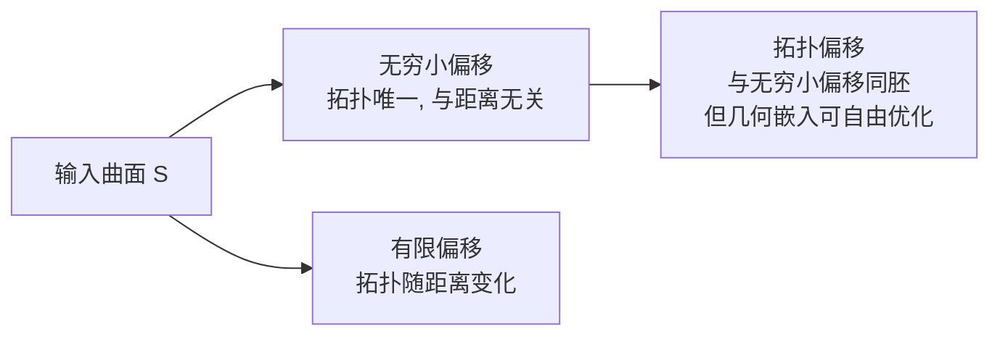
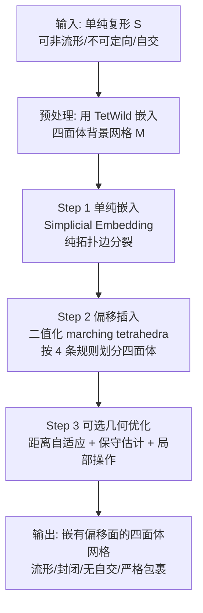

## 一句话总结

本文提出"拓扑偏移(Topological Offset)"这一新概念与算法：通过把输入嵌入四面体背景网格、用纯组合(拓扑)操作构造出一张与"无穷小偏移"同胚的曲面，从而**可证明地**生成流形、封闭、无自交且严格包裹输入的偏移面，且拓扑唯一、与偏移距离无关。

## 研究背景

曲面偏移(offset)——即到输入曲面固定距离的点集——是图形学与 CAD 中的基础建模工具，广泛用于形状设计、加工间隙计算、形态学算子、碰撞代理、边界层、嵌套笼(nested cage)等。

然而尽管定义简单，三维偏移的精确计算至今仍是未解难题(二维可精确求解)。现有方法大多计算近似偏移,普遍会丢失关键性质:

- 无法保证无自交;
- 无法保证拓扑正确;
- 几何精度受限;
- 常常只能处理流形、无自交的输入。

一个例外是"无穷大半径"偏移(拓扑上是球面):收缩包裹(shrink-wrapping)算法把无穷大偏移变形至紧贴形状,常用于三维打印和破损网格修复,但它会不可控地丢失内部孔洞与手柄。

本文考虑相反的一侧:引入距离**无穷小**的偏移并允许其膨胀。作者观察并证明了一个关键事实:这类无穷小偏移的**拓扑是唯一的,只依赖于输入曲面本身**,而与偏移距离无关(有限偏移的拓扑则随距离变化)。更有意思的是,即便输入是非流形、不可定向、自交的网格,这一偏移仍然唯一定义。下图对比了两者的差异:

## 方法

核心思想:把"确定拓扑"与"确定几何"解耦。先用纯拓扑手段构造一张与无穷小偏移同胚的曲面(其几何嵌入可任意,只要不与输入相交),称为拓扑偏移;再通过局部操作把它"充气/放气"到用户指定距离,同时用保守的拓扑与几何谓词(考虑浮点舍入)保证不引入自交和非流形结构。

整体流水线如下:

**理论基础(第 4 节)。** 作者定义"无穷小偏移族" $$\bar{\mathcal{O}}(S,\hat{\epsilon})$$ ,并用 $$\mathcal{S}_\epsilon(s)$$ 记单纯形 $$s$$ 与半径 $$\epsilon$$ 球的 Minkowski 和(即 $$\epsilon$$ -膨胀)。有限偏移定义为

$$\mathcal{O}(C,\epsilon) = \{x\in\Omega \mid \|c(x)-x\|_2 = \epsilon\}$$

其中 $$c(x)$$ 返回曲面上到 $$x$$ 最近的点。定理 1 用 Clarke 广义微分证明:在一般位置下,存在 $$\hat{\epsilon}>0$$ 使所有 $$0<\epsilon\le\hat{\epsilon}$$ 的偏移面 $$\partial\mathcal{S}_\epsilon(S)$$ 都是流形。随后引入两个关键概念:

- **单纯嵌入(Simplicial Embedding, 定义 2):** 四面体网格 $$M$$ 是 $$S$$ 的单纯嵌入,当且仅当对任意四面体 $$t\in M$$ ,交集 $$S\cap t$$ 要么为空,要么恰是 $$S$$ 与 $$M$$ 共有的一个顶点、一条边或一个三角形。这一条件保证了偏移的局部可构造性。
- **局部性(引理 1):** 把每个四面体按固定模式划分为四个凸胞元 $$\mathcal{V}_t(v)$$ ,证明存在足够小的 $$\hat{\epsilon}$$ ,使得偏移在某胞元内只由该顶点的开星(open star) $$\tau_S(v)$$ 贡献。这把全局的偏移拓扑问题**局部化**,是可分单元构造的关键。

在此基础上,定理 2(局部圆盘拓扑)证明:每个凸胞元与偏移的交集要么为空,要么是一个拓扑圆盘;进而所有无穷小偏移彼此同胚,拓扑唯一。最后定义**拓扑偏移(定义 3)**:与无穷小偏移同胚、但几何嵌入任意的曲面。之所以不直接用无穷小偏移,是因为它在网格中可能产生无穷小的单元,而拓扑偏移可稳定鲁棒地计算。

**Step 1:单纯嵌入构造(第 5.1 节)。** 算法 1 通过一系列边分裂把背景网格变成 $$S$$ 的单纯嵌入:先遍历四面体,若其边界的四个面都在 $$S$$ 中则分裂;再对含三条 $$S$$ 边的三角形分裂;最后对含两个 $$S$$ 顶点的边分裂。定理 3 证明该算法一定产出合法的单纯嵌入。整个过程**只用拓扑判断,从不使用顶点坐标**,因此无条件鲁棒。

**Step 2:偏移插入(第 5.2 节)。** 用二值版 marching tetrahedra:凡包含输入单纯形的顶点、边或三角形的四面体,都按四条规则(对应四种去对称后的构型)划分,插入顶点直接放在被分裂边的中点。定理 4 证明由这些规则生成的网格与连续无穷小偏移同胚,因而是流形。该方法在二维也有对应规则。

**Step 3:偏移优化(第 5.3 节)。** 初始偏移的位置依赖背景网格分辨率,为解耦这一点并支持用户定制,作者引入保拓扑、防自交的优化,分三步循环:

1. **距离自适应:** 由于强制保持无穷小偏移拓扑,偏移的不同部分可能在膨胀时碰撞。算法用 marching front 贪心扩张偏移体,计算扩张边界到输入的距离并反向传播(在背景网格上用调和插值),得到空间可变的目标距离 $$\hat{\delta}$$ ,从而在必要处局部缩小距离以避免碰撞。
2. **保守估计:** 再次用 marching front 扩张,但改为保守判据——只有当四面体完全落在 $$\hat{\delta}$$ 内才加入。距离通过外接球逐级八分细分近似。保守估计不仅提速,还能避免优化陷入局部极小。
3. **局部操作优化:** 遵循经典 remeshing 流程,迭代执行边分裂、折叠、翻转、顶点重定位,由 sizing field 驱动。所有操作须满足三条不变量:(I1) 不改动输入面与边界;(I2) 用精确谓词保证所有四面体定向不翻转;(I3) 保持偏移与输入面的拓扑。定理 5 证明满足这些不变量的任意局部操作序列都会产出与原偏移同胚、且不与输入相交的新曲面。

**鲁棒性(第 5.4 节)。** Step 1、2 的分裂决策纯拓扑,唯一潜在问题是当边短于舍入误差时背景网格可能翻转(全数据集仅出现 1 次);彻底解决可用浮点/有理混合表示。Step 3 的不变量或纯拓扑、或用精确谓词校验,该步不会失败,且最多 10 次迭代必然终止。整套构造把"自交检测、拓扑正确性"这类困难检查归约为精确的 Orient3D 谓词。

## 实验结果

在 Thingi10k 全数据集上验证(用 TetWild 默认设置嵌入)。用 winding number 识别外侧、构造单侧偏移,跳过 233 个无法识别封闭内体的网格,剩 9767 个;目标距离 $$\delta=4\%$$ (相对包围盒)。

- **大规模鲁棒性:** 除 1 个模型(无法在不产生翻转单元的前提下完成边分裂)外,**全部产出合法拓扑偏移**。55.24% 的模型 6 分钟内完成,仅 275 个(不到 3%)超过 1 小时。内存开销低:9764 个模型用不到 16 GB,其余 3 个用不到 64 GB。
- **有限偏移变体与对比:** 作者对算法做小改造以产生有限偏移,与 Feature-Preserving Offsets(FPO, Zint et al. 2023)、CGAL 的 3D Alpha Wrapping 对比。有限偏移因几何复杂度降低而更快:63.7% 的模型 5 分钟内完成,仅 21 个(0.2%)超 1 小时,且**没有任何一个有限偏移的法向偏差超过 20°**。相比之下,FPO 虽鲁棒,但约 5% 的模型会产生自交偏移。
- **法向偏差 / 距离误差:** 四种方法平均法向偏差相近;Alpha Wrapping 略优,但代价是三角形数量最多。距离误差上 Alpha Wrapping 最优,同样因其三角形更密。本文方法对曲率自适应,在法向偏差大处放更多三角形。
- **困难场景:** 在两个偏移几乎碰撞的极端情形,Alpha Wrapping 进不去薄缝,FPO 外观尚可但内部自交,而本文方法能正确生成且无自交。小距离( $$\delta=0.01\%$$ )场景下本文方法同样表现良好,FPO 则出现可见的自交白斑。代价是速度:简单模型上 Alpha Wrapping、FPO 分别用 2.6 s、33.7 s,本文需 242 s(因需维护背景网格)。
- **Table 1 部分数字(Figure 24 示例):** dalek 模型在 $$\delta=1\%$$ 时耗时 1524 s、嵌入四面体 960100 个、偏移三角形 109280 个、平均形状规整度 0.87、平均法向偏差 11°、平均相对距离误差 1.2%;在 $$\delta=4\%$$ 时耗时 875 s、偏移三角形降到 43448、平均法向偏差 18°、距离误差 1.0%。rooster 模型 $$\delta=4\%$$ 时耗时 956 s、偏移三角形 14096、法向偏差 17°、距离误差 1.7%。
- **非流形去除:** 在 1053 个含非流形表面的 Thingi10k 模型上,算法**全部成功**,无浮点问题、无翻转单元,输出均为流形且无自交。970/1053(92%)的模型仅增加不到 10% 的三角形,仅 4 个模型单元数翻倍(几乎所有表面顶点和边都是非流形)。

## 亮点与局限

亮点:

- **概念创新:** 首次形式化定义拓扑偏移,并证明无穷小偏移拓扑唯一、只依赖输入,这是对偏移这一经典问题的全新视角。
- **可证明的鲁棒性:** 保证输出流形、封闭、无自交、严格包裹输入,且拓扑等于无穷小偏移;拓扑步骤纯组合、无条件鲁棒,困难检查被归约为精确 Orient3D 谓词。
- **输入宽容度高:** 可处理开放、非流形、不可定向、自交的输入——这是依赖顶点法向的传统方法(在无唯一法向的尖角处会失效)做不到的。
- **应用广:** 有限偏移、互不相交的分层偏移、参数无关的非流形去除均由同一框架自然导出;支持空间可变距离。
- **相比同类笼构造方法(如 Guo et al. 2024)只做局部细分而非均匀细分,初始网格更粗;且保留可复用的四面体网格。**
- 提供开源实现。

局限:

- **速度较慢:** 因需构造并维护四面体背景网格,比 FPO、Alpha Wrapping 慢一个量级(百秒 vs 几十秒)。
- **距离仅尽力而为:** 强制保持无穷小拓扑意味着无法保证达到任意用户指定距离;距离自适应是启发式,贪心扩张可能高估几何,导致偏移非常接近(但绝不相交)。
- **拓扑偏移三角形数可能很大:** 因保持输入全部细节。
- **极端数值情形:** 当边短于舍入误差时背景网格可能翻转(全集仅 1 例),彻底解决需有理数表示。
- 有限偏移变体不再保证与精确有限偏移同胚,仅为近似(与其他有限偏移方法一样)。

## 延伸思考

作者提出的未来方向很有价值:利用严格互相包裹的分层偏移构造**厚度指数增长的边界层**,用于流体仿真——这正是拓扑偏移"保证层间不相交"这一性质的自然落点。另一个方向是并行/分布式网格优化,以缩小与其他方法的速度差距。

更广地看,本文把"拓扑正确性"从"几何精度"中剥离出来单独求解的思路,可能迁移到其他难以同时保证鲁棒性和精度的几何处理任务(如布尔运算、网格修复、四边形重网格化)。用四面体背景网格把自交与拓扑检查归约为精确谓词的策略,也是一种值得推广的鲁棒几何计算范式。代价是计算开销,如何在保持保证的同时逼近轻量表面方法的效率,是落地到实时/交互场景的关键。
