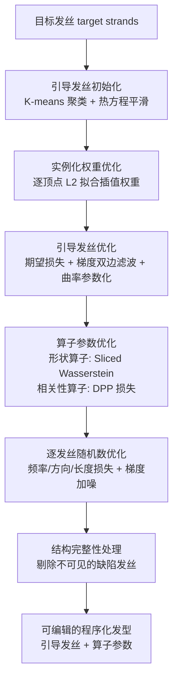

## 一句话总结

这篇论文提出首个"逆向发型梳理"（inverse hair grooming）管线：把图像重建得到的、成千上万根杂乱无章的 3D 发丝，转换成艺术家熟悉的程序化发型——即一小组引导发丝（guide strands）加上一串可编辑的梳理算子（grooming operators），从而让重建头发变得可编辑、可仿真，并且内部不可见区域也具备合理结构。

## 研究背景

近年的头发重建方法（如 Neural Haircut、MonoHair、Gaussian Haircut）已经能从视频甚至单张图像逐根恢复 3D 发丝几何，广泛服务于影视特效、游戏和 VR。但这些方法输出的是几万到几十万根彼此独立的发丝，存在三个痛点：

- 逐根发丝难以直观编辑，也不便于仿真，限制了下游使用。
- 艺术家几乎从不逐根设计头发。业界通行做法是先构造一小组引导发丝，通过实例化（instancing）插值出稠密发丝，再叠加程序化梳理算子（例如一个"卷曲"算子把头发变卷）来达到目标发型。这套引导发丝 + 算子的结构也是仿真艺术控制的关键。
- 图像重建往往依赖数据驱动先验去补全从任何视角都看不到的内部头发，对卷发等复杂发型，补出的内部结构常常质量很差（过短、过直）。

因此作者要解决的问题是:给定一组杂乱发丝（target）和一组已知类型的梳理算子，反推出引导发丝的控制顶点与算子参数。这本质是一个逆向程序化建模问题，难点有三:一是引导发丝和算子参数需在互不已知的前提下联合优化，且两者存在歧义（卷发既可由卷的引导发丝表示，也可由卷曲算子表示）;二是梳理管线会给每根发丝加入随机扰动，导致程序化发型与目标发丝不可能逐根精确对应，简单的逐顶点 $L_2$ 损失并不适用;三是方法必须对不完美的目标几何鲁棒。

## 方法

### 整体管线

作者把程序化发型写成一个组合式生成过程:先由引导发丝实例化出稠密发丝，再依次经过梳理算子变形。

$$x = P_{\theta}(\text{instance}(g))$$

其中 $g$ 是引导发丝，$\text{instance}(\cdot)$ 是实例化插值，$P_{\theta}$ 是带参数 $\theta$ 的算子链 $P^{(z)}_{\theta_z} \circ \cdots \circ P^{(1)}_{\theta_1}$。重建任务被表述为优化问题:

$$\arg\min_{g,\theta} \; \mathcal{L}(x(g,\theta), \hat{x})$$

其中 $\hat{x}$ 为目标发丝，核心挑战正是设计合适的损失 $\mathcal{L}$ 并高效优化它。论文假设算子类型已知，只优化其参数，把算子拓扑的自动推断留给未来工作。

### 梳理管线与算子

引导发丝数量 $n_g$ 取 500 到 3000（视复杂度而定），远小于目标发丝数（可达 $10^5$）。稠密发丝由邻近引导发丝按根部 UV 距离加权插值生成:

$$w(x,g) = \exp\!\left(-\|T(x)-T(g)\|^2 / \sigma_{\text{instance}}^2\right)$$

其中 $T:\mathbb{R}^3 \to [0,1]^2$ 是发根到头皮纹理坐标的 UV 映射。

算子分两类。作者设计了六种基础算子:base（基底）、scale（随机缩放各发丝长度）、clump（把发丝向算子引导发丝聚拢成一簇，用 $\exp(-ax)$ 型剖面控制）、bend（绕垂直于根方向的随机轴弯曲，角度沿发丝线性增长）、curl（绕算子引导发丝卷曲，含卷曲半径、频率、随机频率、起始位置）、frizz（用 Perlin 噪声加毛躁）。值得注意的是,clump/bend/curl 使用的是一组单独的"算子引导发丝" $g_{\text{op}} \subseteq g$（由 K-medoids 从引导发丝中抽取），其数量按发型特征（如卷的数量）选取，与控制整体分辨率的引导发丝数量解耦。每个算子还带有随机参数，例如卷曲频率为 $\theta + \theta_{\text{rand}} u$，$u$ 为逐发丝随机数，用来模拟真实头发的个体差异。

### 程序化发型的概率视角

关键洞见:程序化发型参数量远少于目标发丝，无法逐根精确复现,而是给定随机数 $u$ 后从一个发型分布中采样出一个实现。作者把生成写成逐发丝的采样形式:

$$x_i \sim P_{\theta}(g, r_i)$$

$r_i = x_{i,1}$ 是发根位置。由此,目标发丝也被看作某分布 $P_{\hat\theta}$ 的采样，损失设计应比较分布而非逐根发丝。

### 引导发丝的初始化与优化

初始化时对全部目标发丝做 K-means 聚类得到 $n_g$ 个簇心作为稀疏发丝，再通过在发丝上求解热方程做平滑（离散拉普拉斯 $L$，迭代求解 $(I+\lambda_{\text{smooth}} L)x^{(t+1)} = x^{(t)}$），并固定根部前几个顶点和尾端顶点，防止头顶过度扁平和长度收缩。

引导发丝的核心损失基于"引导发丝近似于分布均值"的假设，用期望之差:

$$\mathcal{L}_g = \frac{1}{n}\sum_{i=1}^{n}\left\| \mathbb{E}_{u_i}[P_{\theta}(g,r_i)] - \mathbb{E}_{\hat{u}_i}[P_{\hat\theta}(\hat{g},\hat{r}_i)] \right\|^2$$

对多数算子（除 clump 外），期望有闭式近似（如 bend 算子的期望即恒等操作）。由于目标只是单一实现、无法真正取期望，直接用单样本梯度会把随机扰动"烤"进引导发丝。作者利用引导发丝在头皮上空间平滑的先验，对不同引导发丝的梯度施加一个滤波算子 $\mathcal{D}$:

$$\frac{\partial \mathcal{L}_g}{\partial g} \approx \frac{2}{n}\,\mathcal{D}\!\left(\sum_{i=1}^{n}(\bar{x}_i - \hat{x}_i)\frac{\partial}{\partial g}\bar{x}_i\right)$$

具体用网格双边梯度滤波（Chang et al. 2024），并采用 Crane 等人的曲率参数化（优化根角、段长、曲率而非直接优化顶点位置），最小化弯曲能 $\tfrac{1}{2}\int \kappa^2 \, dl$，得到更平滑、更鲁棒的发丝演化。

### 算子参数优化

算子全局改变发型风格，因此可用全部发丝同时估计参数。作者据此把算子分两类分别优化:

形状算子（bend、curl、frizz）改变每根发丝的形状，用 Sliced Wasserstein 距离（基于最优传输）匹配两组发丝分布:

$$\mathrm{SW}(f,\hat{f}) = \frac{1}{s}\sum_{k=1}^{s}\left\| \mathrm{sort}(\{\langle v_k, f_i\rangle\}) - \mathrm{sort}(\{\langle v_k, \hat{f}_i\rangle\}) \right\|^2$$

它把发丝特征投影到随机方向 $v_k$ 上再排序比较，隐式建立发丝对应关系。总损失结合频率损失与段损失:

$$\mathcal{L}_{\theta} = \mathrm{SW}(\vert \mathcal{F}\{e_i\}\vert , \vert \mathcal{F}\{\hat{e}_i\}\vert ) + \lambda_e\,\mathrm{SW}(e_i, \hat{e}_i)$$

其中 $e_i$ 是发丝段向量，$\mathcal{F}$ 为一维傅里叶变换，前项捕捉卷曲、毛躁等周期形状，后项衡量整体形状。

相关性算子（scale、clump）改变发丝间的相关性，用行列式点过程（DPP）刻画点的聚集程度:

$$\mathrm{DPPL}_{\psi}(x,\hat{x}) = \left(\log(\det[\psi(x_a,x_b)]) - \log(\det[\psi(\hat{x}_a,\hat{x}_b)])\right)^2$$

scale 用发丝长度差定义相似度 $\psi_{\text{scale}}$，clump 用发丝顶点间从根到尖递减的相对距离定义 $\psi_{\text{clump}}$。由于精确计算核矩阵是 $O(n^2)$，作者随机取一根发丝并选取其 UV 空间最近的一批发丝组成局部子集来近似。

### 逐发丝随机数优化与结构完整性

为补全前面阶段忽略的局部特征（如局部发丝朝向），作者进一步优化逐发丝随机数 $u_i$，用频率、方向、长度三项组合损失:

$$\mathcal{L}_{\theta_{\text{rand}}} = \frac{1}{n}\sum_i \left\|\vert \mathcal{F}\{d_i\}\vert  - \vert \mathcal{F}\{\hat{d}_i\}\vert \right\|^2 + \frac{\lambda_{d_{\text{rand}}}}{n}\sum_i (1 - \langle\langle d_i,\hat{d}_i\rangle\rangle) + \frac{\lambda_{l_{\text{rand}}}}{n}\sum_i (l_i - \hat{l}_i)^2$$

由于算子高度非线性、易陷入局部极小，作者在梯度中加入自适应噪声帮助跳出局部极小，噪声尺度按平均梯度幅值缩放并从 1.5 线性衰减到 0.5。

针对重建目标内部结构差（不可见区域的发丝常过短过直、会把 curl 半径/频率带偏）的问题，作者把"从任何相机视角都不可见"的缺陷发丝从优化中剔除（$x_{\text{opt}} = x \setminus x_{B_{\text{flawed}}}$）。得益于实例化和梯度滤波,即使某根目标发丝不参与优化,对应的程序化发丝仍能由邻近发丝的梯度和引导发丝的平滑约束正确生成——这正是程序化结构相较原始重建的优势:同一簇卷发被保证都是卷的。

## 实验结果

方法用 PyTorch 实现，借助 Warp 做发丝到头皮网格的距离/最近点查询，用 Faiss 与 Scikit-Learn 做聚类和近邻查询,运行在 i9-14900K + RTX 4090 的桌面机上。共在 14 个发型上验证（7 个合成 + 7 个真实），依据 Meishvili 等人的发型分类学挑选，覆盖了 Hair Type、Direction、Layering 等标签的全部变体。

优化超参:实例化权重优化 2000 次迭代;引导发丝优化 3000 次;算子优化在形状算子、scale、clump 三类损失间交替，每次 200 迭代、各累计 3000、算子阶段总计最多 9000 迭代;随机数阶段 3000 迭代。

合成发型评测（7 例）:每个发型由本管线在 Blender 中人工设计引导发丝生成，仅给定目标发丝和算子类型，方法需同时反推引导发丝与算子参数。由于不假设引导发丝数量已知,允许引导发丝形状和参数值略有差异。结果显示方法通常能重建出准确的引导发丝且参数误差很低;当算子对发丝的变形非常剧烈（如很大的 bend 角度）导致随机扰动过强时，重建精度会下降。

真实发型评测（7 例）:目标发丝分别来自 Gaussian Haircut 与 MonoHair,数据取自 monocular 数据集、MonoHair 数据集及一个自定义个体。结果在 Cycles 中渲染。其中 MonoHair 生成的一例（波浪发、齐下巴、166280 根发丝）因目标结构完整性差（内部发丝不自然）而尤其难优化。从 Table 1 的样例细节看,真实例的发丝数在 30000 到 166280 之间,引导发丝数 500 到 1000、算子引导 125 到 1000,单个发型优化耗时约 4 到 32 分钟;合成例耗时约 1 到 30 分钟（最耗时的是齐短/渐变的直发,59821 根发丝、30 分钟）。

消融实验表明:用 $L_2$ 损失替代算子损失会无法恢复正确卷曲度;去掉随机数优化会得到正确算子参数但局部朝向错误;完全不用 curl 算子只优化引导发丝和实例化虽能得到卷发外观但局部朝向错、且无法编辑卷曲度;初始化不用聚类会过度平滑;去掉梯度滤波或曲率参数化会把随机扰动烤进引导发丝;完全不做引导发丝优化会出现引导发丝穿透头部等问题。

编辑与仿真:通过修改引导发丝和调整少量算子参数（增加引导发丝长度、加 bend、去 curl、加 frizz、去 clump 和 frizz 等）可得到多种发型。由于内部头发结构合理，结果可直接用于仿真——作者不用引导发丝，而是把烤入全部算子效果（含 curl）的 1 万根发丝作为仿真"引导",绑定到稠密发丝,用基于 XPBD 的自研仿真器驱动。

## 亮点与局限

亮点:

- 首个把杂乱重建发丝逆向转换为艺术家风格程序化发型的工作，直接对接 Blender/Houdini 式工作流，产出物可编辑、可仿真。
- 概率视角是全文精髓:把发型看作分布采样，从而放弃逐根 $L_2$ 而改用期望损失、Sliced Wasserstein、DPP 等分布级损失，优雅处理了随机扰动带来的对应歧义。
- 把算子按"改变发丝形状"与"改变发丝相关性"分类，分别匹配 SW 距离和 DPP，思路清晰且各有物理含义。
- 通过剔除不可见缺陷发丝 + 程序化结构约束，天然修复了重建方法内部头发质量差的顽疾,保证同簇卷发一致卷曲。
- 曲率参数化 + 梯度双边滤波避免把扰动烤进引导发丝，是保证引导发丝平滑可编辑的实用技巧。

局限:

- 不追求逐根精确，可能丢失局部特征，真实头发越不规则、越难用程序化表达时越明显。
- 算子集合、算子链的连接拓扑以及引导发丝数量都需人工给定；自动推断算子拓扑与合理初值仍是待解问题。
- 尚不支持脏辫、编发等需要专门算子的发型（分类学中的 Strand Styling 与 Strand Thickness 标签被排除）。
- 相较 Blender/Houdini 生产系统更复杂的算子和更灵活的图连接，本管线只实现了简化的算子链。

## 延伸思考

这项工作把"逆向程序化建模"从 CAD、材质、纹理扩展到了头发这个高维、强随机、部分不可见的困难对象，其方法论对其它程序化资产（毛发、草地、羽毛乃至衣物褶皱）的逆向恢复有借鉴意义:当目标只是分布的一个随机实现时,与其死磕逐元素对齐，不如退一步在分布层面用最优传输/点过程这类工具做匹配。

概率视角还揭示了一个更普遍的张力:可编辑性（少参数、结构化）与保真度（逐根还原）天然冲突,本文明确选择前者并通过随机数优化在事后补回部分局部细节，这种"先抓分布、再补局部"的两阶段策略值得在其它逆问题中复用。

未来若能把算子拓扑和引导发丝数量也纳入自动推断（例如结合可微程序综合或数据驱动先验），并引入生产级算子图，这套管线有望成为头发重建到可编辑资产之间的标准桥梁。此外，方法目前依赖已知相机做可见性剔除，如何在缺乏相机信息时判定并修复缺陷内部发丝，也是提升鲁棒性的实际方向。
