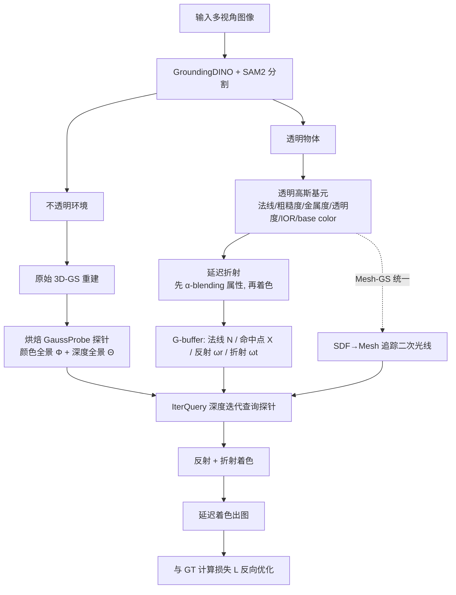

## 一句话总结

TransparentGS 用带材质属性的"透明高斯基元 + 延迟折射"表示透明物体，用"高斯光场探针（GaussProbe）+ 深度迭代查询（IterQuery）"统一编码环境光与近场间接光，首次在 1 小时内完成透明物体的逆向渲染并支持实时新视角合成与二次光线效果。

## 研究背景

从多视角 2D 图像重建 3D 场景并合成新视角，是图形学与视觉的长期任务。NeRF 及其变体凭借体渲染实现了照片级质量，3D-GS（3D Gaussian Splatting）则以显式高斯基元的表示带来实时渲染能力。然而重建"透明物体"始终困难：光在穿过介质时发生反射与折射的复杂交织，使物体外观随视角剧烈变化，NeRF 里的方向编码 MLP 与 3D-GS 里的球谐函数（SH）都难以准确建模这种高频的镜面反射与折射，要么过拟合、在新视角退化，要么结果严重模糊。

现有方案各有短板：
- 基于隐式神经表示的方法（Eikonal、NU-NeRF、Gao et al. 等）目前重建透明物体效果最好，但训练动辄需要 7～10 小时以上，且无法实时渲染。Eikonal 只学 IoR 场处理弯曲光路，不做反射/折射分离，难以重渲染；NU-NeRF 用网络预测折射光，缺乏折射细节。
- 基于 3D-GS 的方法（GaussianShader、Ye et al. 等）本为反射场景设计，难以直接套用到透明物体；且 3D-GS 基于光栅化，被限制在理想针孔相机，缺乏对折射、层间反射等二次光线效果的支持。当透明物体周围还有近场物体时，问题更严重。

TransparentGS 的目标就是在 3D-GS 框架上，兼顾环境光与近场间接光，同时支持折射与层间反射，实现快速逆向渲染。文中给出的方法对比表显示，只有本方法同时做到"训练 < 1 小时、实时渲染、支持环境光/近场间接光/高频折射细节/反射-折射解耦/彩色折射/重渲染"这全部能力。

## 方法

整体流水线分为两大部分：一是透明物体的表示（透明高斯基元 + 延迟折射），二是入射光表示（GaussProbe + IterQuery）。场景先用 GroundingDINO 引导的 SAM2 分割成透明物体与不透明环境两部分：透明物体用透明高斯基元重建，不透明环境用原始 3D-GS 重建并烘焙成围绕物体的 GaussProbe。

### 关键设计一：透明高斯基元与延迟折射

在原始 3D-GS 的形状属性（位置 $\mu$、协方差 $\Sigma$、不透明度 $o$）之外，额外编码材质属性：法线 $n$、粗糙度 $\rho$、金属度 $m$、透明度 $t$、折射率 $\eta$（IOR）、base color $b$。其中透明度 $t$ 用来在不透明与透明材质之间插值——作者强调仅靠降低不透明度 $o$ 无法表示透明表面（会使表面消失，从而无法计算反射折射），因此单独引入 $t$。

表面用两个分离的 BSDF 显式表示反射与折射：

$$f = (1-t)f_r + t f_t$$

其中 $f_r$ 为 BRDF、$f_t$ 为 BTDF。不透明材质（$t=0$）用 Cook-Torrance 模型；金属或透明物体的反射分量（$\rho=0$）当作完美镜面反射：

$$f_r = F\frac{\delta(\omega-\omega_r)}{\vert \omega_{in}\cdot n\vert },\quad \omega_r = 2(\omega_{in}\cdot n)n - \omega_{in}$$

透射分量用完美镜面折射，$\omega_t$ 由斯涅尔定律得到，$F$ 用 Schlick 近似的菲涅尔项：

$$f_t = (1-F)\frac{\delta(\omega-\omega_t)}{\vert \omega_{in}\cdot n\vert }$$

延迟折射（Deferred Refraction）是核心 trick。着色策略分"前向（先着色再 α-blending）"与"延迟（先 α-blending 再着色）"。由于透射色

$$L_t = (1-F)L_{in}(x,\omega_t)$$

对法线 $n$ 是非线性的，而 α-blending 是线性操作，操作顺序对折射结果影响很大。前向折射会对多个高斯的着色结果做平均，糊掉高频细节；延迟折射先聚合法线等属性、只用单条折射光线采样光照，更能捕捉镜面折射细节。聚合的 alpha-weighted 法线为：

$$N = \sum_{i=1}^{N} T_i\alpha_i n_i$$

对折射还需聚合光线命中点。直接用高斯中心 $\mu$ 会忽略各向异性，作者沿主光线 $o_{cam}+\tau v$ 解析地求每个高斯响应函数 $G(\tau)$ 的最大值位置并聚合：

$$X = o_{cam} + v\sum_{i=1}^{N} T_i\alpha_i \arg\max_\tau G_i(\tau),\quad \arg\max_\tau G_i(\tau) = \frac{(\mu_i - o_{cam})^\top \Sigma^{-1} v}{v^\top \Sigma^{-1} v}$$

对彩色透明物体，只需在透射色上乘一个吸收项（Beer-Lambert），并用 alpha-weighted base color 近似透射率，从而把折射项与物体固有颜色解耦：

$$L_t = (1-F)L_{in}(x,\omega_t)e^{-\sigma(\lambda)d}$$

### 关键设计二：高斯光场探针 GaussProbe

用只有两个自由度的环境贴图表示近场间接光会造成严重视差。作者提出 GaussProbe：重建好不透明环境后，将场景体素化，在透明物体包围盒周围的体素里放置一组稀疏探针；每个探针按最优投影（把高斯投到单位球切平面而非成像平面，用修正后的雅可比矩阵 J）渲染出一张全景图，α-blending 后在每个探针位置存下 360° 全景颜色图 $\Phi$ 与深度图 $\Theta$，之后可按方向 $d_i$ 查询颜色 $c_i$ 与深度 $t_i$：

$$c_i, t_i = \Phi(p_i, d_i),\ \Theta(p_i, d_i)$$

探针可基于原始 3DGS 训练结果直接烘焙、几分钟内完成，无需像 3DGRT 那样构建 BVH 或维护排序缓冲。

### 关键设计三：深度迭代探针查询 IterQuery

若沿同一方向 $d_i=d$ 查询 K 个探针再平均，会因探针间视差导致过度模糊。IterQuery 用深度信息迭代修正每个探针的查询方向。先初始化 $d_i:=d$，查询深度 $t_i=\Theta(p_i,d_i)$ 得到交点，再把各探针交点投影到查询光线上做三线性插值：

$$\hat{t} = \sum_{i=1}^{K} w_i\big((p_i + t_i d_i - o)\cdot d\big)$$

然后更新方向：

$$d_i := \frac{o + \hat{t}d - p_i}{\|o + \hat{t}d - p_i\|}$$

反复迭代直到 $\hat{t}$ 收敛，此时查询光线恰与场景相交；收敛后把 $\Theta$ 换成 $\Phi$ 即得最终颜色。作者对 $K=1$ 给出了简化的形式化收敛证明。算法时间复杂度 $O(TKQ)$（T 迭代数、K 探针数、Q 查询光线数），实验中只需几次迭代即可显著改善。理论上 K 越大收敛越快（$K\to\infty$ 时首次迭代即得最优解）。

### 关键设计四：多阶段重建与 Mesh-GS 统一

采用多阶段策略：第一阶段重建环境并烘焙 GaussProbe；第二阶段用透明高斯基元在物理延迟渲染管线里重建几何与材质。为处理二次光线（物理折射至少两次弹射，而光栅化的 3D-GS 无法处理），作者统一 Mesh 与 GS：GS→Mesh 用透明高斯基元的命中点图 X 引导 SDF 主光线采样、法线图 N 正则化梯度，经 marching cube 提取显式网格；Mesh→GS 用该网格作代理高效追踪二次光线，供 IterQuery 查询。

损失函数包含法线正则、mask 项与 D-SSIM 项：

$$L = (1-\lambda_1)L_1 + \lambda_1 L_{\text{D-SSIM}} + \lambda_2 L_{\text{normal}} + \lambda_3 L_{\text{mask}}$$

法线正则约束渲染法线 N 与渲染深度梯度 $\hat{N}_D$ 一致：$L_{\text{normal}} = 1 - N\cdot\hat{N}_D$。实验取 $\lambda_1=0.2,\lambda_2=0.2,\lambda_3=1$，IterQuery 迭代 5 次，探针数取 8 或 64。

## 实验结果

数据集包括合成数据（Blender 渲染的 Kitty、Dog、Cat，带 GT 图）、Bemana et al. 的 Glass 场景，以及作者自采的 6 个真实场景（HalfBall、Apple、Dolphin、Penguin、Mouse、Bird，每场景手机拍摄 80～200 视角，且周围放置几何/纹理复杂的近场物体）。基线为 GShader、Eikonal、NU-NeRF。指标用 PSNR、SSIM、LPIPS，法线用 MAE°。

无色透明物体真实场景新视角合成（部分数字）：

| 场景 | 指标 | Eikonal | GShader | NU-NeRF | Ours |
|------|------|---------|---------|---------|------|
| Glass | PSNR / SSIM / LPIPS | 27.15 / 0.941 / 0.057 | 26.52 / 0.951 / 0.052 | 26.78 / 0.942 / 0.071 | 27.12 / 0.952 / 0.044 |
| HalfBall | PSNR / SSIM / LPIPS | 27.43 / 0.890 / 0.144 | 27.29 / 0.953 / 0.096 | 27.48 / 0.946 / 0.149 | 28.07 / 0.954 / 0.084 |
| Apple | PSNR / SSIM / LPIPS | 20.47 / 0.951 / 0.067 | 20.97 / 0.955 / 0.068 | 22.25 / 0.963 / 0.057 | 23.05 / 0.965 / 0.047 |

彩色透明物体真实场景（平均）：Ours 21.55 / 0.797 / 0.172，GShader 21.24 / 0.792 / 0.200，NU-NeRF 21.46 / 0.787 / 0.308。本方法 LPIPS 明显更低，得益于对折射与固有色的解耦。

合成数据集（同时含逆向渲染分解质量），本方法全面领先：

| 方法 | 新视角 PSNR / SSIM / LPIPS | 法线 MAE°↓ | 反射 PSNR↑ | 折射 PSNR↑ | Base Color PSNR↑ |
|------|------|------|------|------|------|
| GShader | 24.05 / 0.922 / 0.069 | 26.51 | 12.44 | N/A | 13.19 |
| NU-NeRF | 22.52 / 0.759 / 0.266 | 16.02 | 13.65 | 19.90 | 17.08 |
| Ours | 25.66 / 0.935 / 0.064 | 5.53 | 17.60 | 22.87 | 21.51 |

法线误差从 16°～26° 降到 5.53°，反射/折射/base color 的 PSNR 都大幅领先（GShader 因 SH 过拟合视角而无法重建正确法线、且无折射能力）。

性能：Eikonal 需 22–24 小时、NU-NeRF 需 8–9 小时，本方法训练与 GShader 相当（约 1 小时），分割与烘焙探针仅需几分钟。800×800 图像下，单探针 1 次迭代耗时 0.002 秒，8 探针 5 次迭代 0.005 秒。整体帧率 31–51 FPS，远超 Eikonal（0.03 FPS）与 NU-NeRF（0.016 FPS）。

消融（Kitty 场景）：延迟着色 + GaussProbe 全开时 PSNR 28.41 / SSIM 0.970 / LPIPS 0.036，均优于任一组件缺失（两者全关 27.05 / 0.958 / 0.044）。前向着色会糊掉高频折射反射；无探针时近场折射颜色偏离 GT。IterQuery 消融显示：无它时全景与折射图因视差过糊；$K=1$ 对探针位置极敏感、难收敛，$K=8,64$ 随迭代稳步改善，$K=64$ 收敛最快。

应用：把重建的透明 Mouse 放进 3D-GS 重建的 DrJohnson 场景做重光照与材质编辑；组合三角网格、传统 3D-GS 与透明高斯基元的多物体场景实现二次光线效果；还支持鱼眼、全景等非针孔相机渲染。

## 亮点与局限

亮点：
- 首次在 1 小时内完成带二次光线效果的透明物体逆向渲染，且支持实时新视角合成，比 NeRF 类方法快约三个数量级（帧率 31–51 vs 0.016–0.03）。
- 延迟折射策略巧妙地把 α-blending 的线性与折射的非线性解耦，用单条折射光线采样保住高频细节。
- GaussProbe 无需 BVH/排序缓冲、可直接从原始 3DGS 烘焙，比 3DGRT 更轻量；IterQuery 用深度迭代有效消除探针视差，并给出收敛性证明。
- 通过 Beer-Lambert 吸收项 + alpha-weighted base color，能把折射光与物体固有颜色解耦，这是以往方法难以做到的。

局限：
- 光路受限：假设光路恰好两次折射、至多一次全内反射；更多弹射会引入歧义与奇异，空心或强自遮挡的复杂几何仍难重建。
- 高度非均质（异质）透明物体会给材质估计带来歧义，作者建议未来用生成模型解决。
- 依赖环境完整性：不可见环境部分会影响重建，最好完整捕获环境。
- 违反流形约束时（深度全景出现明显不连续），并非所有探针都能收敛到首个交点，导致错误结果（也解释了 $K=1$ 的失败），需增加探针数或更优放置缓解。
- 未处理焦散（caustics）——只关注环境对物体外观的影响，不建模物体对周围的影响；也未采用 3DGRT（因其暂不支持逆向渲染、且需微调）。

## 延伸思考

TransparentGS 最值得借鉴的是"用探针缓存把不可微/不相干的二次光线查询变成可查表的可微操作"这一思路：把昂贵的光线追踪拆成"离线烘焙全景 + 在线深度迭代查询"，既保留了 3D-GS 的实时与显式优势，又补上了它对折射/层间反射的短板。IterQuery 本质上是在深度流形上做定点迭代找光线-场景交点，思想接近屏幕空间反射（SSR）里的 ray marching，但用多探针三线性插值缓解了单视角深度的视差与遮挡问题——这类"多缓存 + 迭代求交"范式或许也能迁移到实时全局光照、镜面反射场景。

同时，Mesh-GS 双向统一（GS 引导 SDF 采样、Mesh 作二次光线代理）体现了"显式网格擅长追踪、GS 擅长快速重建"的互补，值得在需要二次光线的其它 GS 逆向渲染任务里复用。局限中提到的"两次折射假设"与"焦散缺失"也指明了后续方向：把可微路径追踪或生成先验引入 GaussProbe 框架，有望突破简单光路与均质材质的限制。
