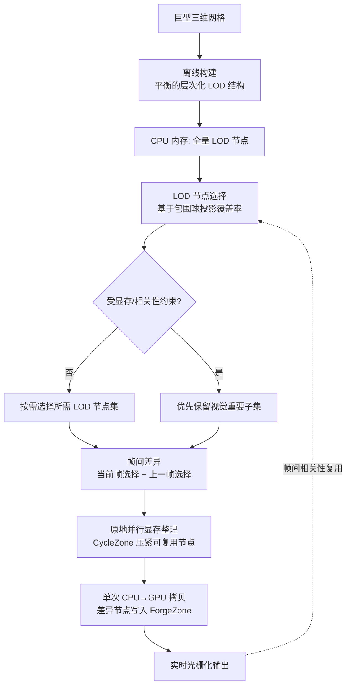

## 一句话总结

本文提出 UltraMeshRenderer，一套面向 GPU 显存不足场景（out-of-core）的巨型三维网格实时渲染方法：用"平衡的层次化 LOD 网格结构"让 CPU 与 GPU 的数据访问粒度对齐，用"带帧间相关性的 LOD 节点选择"只搬运帧间差异数据，再用"原地并行 GPU 显存整理（in-place defragmentation）"在运行时把显存压紧，从而在数十亿三角形量级的模型上维持实时性能与视觉保真。

> 说明：本篇笔记基于作者主页公开的会议海报（poster）整理。海报覆盖了动机、挑战、三项核心贡献与评估设置，但未包含完整正文的量化表格数字，因此实验结果一节以定性描述为主，未给出可核对的具体数值。

## 研究背景

- 领域现状：现代 GPU 在渲染海量三维模型时经常撞上显存容量上限，实时性能难以保证。即便是较先进的 out-of-core 渲染框架，一旦数据规模超过可用显存，CPU→GPU 的数据传输依然是主要瓶颈。渲染数十亿级三角形与顶点，需要新的策略在降低数据管理开销的同时保持画质。
- 核心痛点（三大挑战）：
  - CPU 与 GPU 之间的容量落差：能放进 CPU 内存的大数据集，往往塞不进可用的 GPU 显存。
  - 内存墙——CPU↔GPU 通信带宽受限：频繁的 CPU→GPU 传输受限于带宽且延迟高。
  - GPU 渲染能力有限：把几何数据塞满显存，并不等于这些几何都能在实时预算内被光栅化成像素。
- 本文思路：与其被动地"数据不够就搬"，不如从三个层面协同优化——数据结构层让 CPU/GPU 访问粒度一致、内存空间利用率更高；调度层利用连续帧之间画面变化不大的帧间相关性，只传输"这一帧相比上一帧新增/变化"的那部分节点；显存维护层在运行时把碎片就地整理干净，避免额外的合并空间开销。

## 方法

### 整体框架

### 关键设计一：平衡的层次化 LOD 网格结构

结构构建分两步走：

- 自顶向下的二分（bipartitioning）：把网格递归切分成一系列平衡的子网格。
- 自底向上的合并（merging）：合并过程中对兄弟节点做简化，每一层把顶点数减半以支撑更粗的 LOD。

这样得到的结构具有两个关键性质：节点度恒为 2（一致的二叉结构），以及各层之间节点大小近乎相等。均匀的深度与近似相等的节点尺寸，让 CPU 侧与 GPU 侧的数据访问单元对齐，从而提升显存空间利用率、简化传输与整理的粒度管理。

### 关键设计二：带帧间相关性的 LOD 节点选择

- 选择依据：把每个节点的包围球投影到相机近球（near sphere）的切平面上，依据其相对近平面的覆盖率（coverage ratio）来选择期望的 LOD 层级。直观上，投影覆盖越大、对画面贡献越重要，就选越精细的 LOD。
- 约束下的取舍：当"当前帧所需节点"超出显存约束或相关性约束设定的上限时，算法优先保留视觉上更重要的子集，而非无差别加载。
- 帧间差异（frame-difference）：用"当前帧选择集合减去上一帧选择集合"得到帧间差异节点，只把这部分从 CPU 取到 GPU。这样在高相关性场景（相机移动缓慢）下几乎无需搬运，在低相关性场景下也只搬必要的差量，兼顾平滑性能与视觉保真。

覆盖率驱动的 LOD 选择可抽象为：期望层级由投影覆盖率相对某阈值的关系决定

$$
\text{LOD}(n) = f\!\left( \frac{A_{\text{proj}}(n)}{A_{\text{near}}} \right)
$$

其中 $$A_{\text{proj}}(n)$$ 为节点 $$n$$ 包围球在近平面切平面上的投影面积，$$A_{\text{near}}$$ 为近平面参考面积。

### 关键设计三：原地并行 GPU 显存整理（In-Place Defragmentation）

GPU 上的节点更新发生在一个固定大小的显存扇区（sector）内，通过复用"当前帧已不再需要的节点"腾出的空间来完成：

- 算法先把所有可复用节点压紧（compact）成一段连续区域，称为 CycleZone。
- 腾出的连续尾部区域即 ForgeZone，帧间差异节点通过一次性的 CPU→GPU 拷贝（single memory copy）整体写入 ForgeZone。

关键在于"原地（in-place）"：整个整理与合并过程不需要额外的辅助空间来做搬移，因而在保持显存紧凑的同时避免了 out-of-place 方案所需的临时缓冲，并且这一压紧过程是并行执行的。

## 实验结果

海报中报告了以下评估设置与对比对象（具体数值未在可获取的公开副本中给出，此处如实转述定性结论）：

- 规模验证：方法在约 24 亿（2.4 billion）三角形、15 亿（1.5 billion）顶点量级的巨型模型上进行渲染演示。
- 场景：包含 CycleZone、ForgeZone 相关的显存布局演示，以及不同相机运动/相关性条件下的性能评估。
- 消融/对比方案（视觉质量与性能评估）：
  - 本文方法（Our Approach）：帧间相关性 + 原地整理（in-place defragmentation）。
  - FTFC-OD：帧间相关性 + 异地整理（out-of-place defragmentation）。
  - FTFC-DM：帧间相关性 + 动态显存管理（dynamic memory management）。
  - NFTFC：不使用帧间相关性、纯流式传输数据（streaming without frame-to-frame coherence）。

对比设计的逻辑是逐项拆解贡献：NFTFC 用来说明去掉帧间相关性后的传输代价，FTFC-DM/FTFC-OD 用来对照不同显存维护策略，从而凸显"帧间相关性 + 原地整理"组合在性能与视觉保真上的优势。

## 亮点与局限

亮点：
- 三层协同：把数据结构（平衡层次 LOD）、调度（帧间差异传输）、显存维护（原地整理）串成一套自洽方案，直击 out-of-core 渲染的容量落差、内存墙、渲染能力三大瓶颈。
- 原地整理的工程价值：不需要辅助空间即可压紧显存，并以单次 CPU→GPU 拷贝完成差量写入，减少了传输次数与额外缓冲开销。
- 结构规整带来的可管理性：节点度恒为 2、各层节点近等大小，使 CPU/GPU 访问粒度对齐，利于并行化与内存利用。

局限（部分为基于海报的推断）：
- 依赖帧间相关性：在相机快速运动、场景剧烈变化等低相关性场景下，帧间差异会显著增大，传输收益下降，实际增益取决于运动模式。
- 覆盖率驱动的 LOD 选择在"重要性判定"上较为几何化，可能未充分建模材质/光照等感知因素。
- 离线构建成本：自顶向下二分 + 自底向上简化的层次结构需要预处理，海报未展开构建时间与存储开销。
- 本笔记未能获取完整正文的量化表格，具体加速比、帧率、显存占用等数字有待正文核对。

## 延伸思考

- 与近年的 Nanite 式虚拟几何（cluster-based LOD + 流式）相比，本文强调"帧间差异 + 原地显存整理"的组合，二者在集群划分粒度、显存回收策略上的取舍值得对照分析。
- 覆盖率驱动的 LOD 选择可与视线/注视点（foveated）渲染结合，在 XR 场景中进一步压缩需要驻留 GPU 的节点集合。
- 原地并行整理的思想不局限于网格几何，对纹理、体数据、甚至点云/高斯泼溅等以"块"为单位驻留显存的表征，也可能迁移出类似的 CycleZone/ForgeZone 布局。
- 帧间差异传输本质上是一种时间维度的增量更新，若与预测式预取（根据相机轨迹预测下一帧所需节点）结合，或可进一步隐藏传输延迟。
