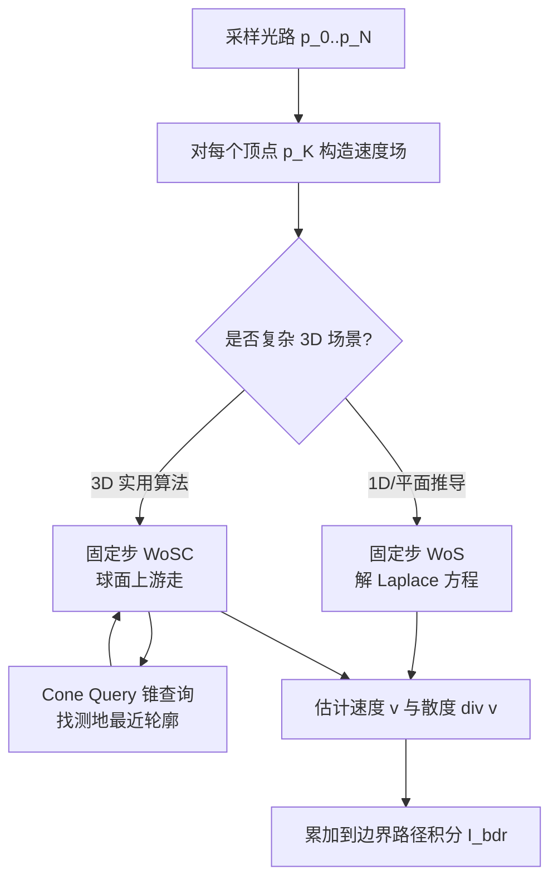

## 一句话总结

把求解 PDE 的蒙特卡洛方法（walk-on-spheres）引入可微渲染，用"固定步数游走 + 球冠上的最近轮廓查询"构造出连续且无偏的速度场，从而更鲁棒、更高效地计算微分可见性的翘曲面积重参数化。

## 研究背景

基于物理的可微渲染需要对路径积分关于场景参数（如物体形状）求导。由于遮挡会在可见性函数里造成跳跃间断，直接把求导算子塞进渲染积分会得到错误结果，这就是"微分可见性"问题。现有的正确处理方式分两类：

- 显式采样间断边界：需要引导数据结构与预计算，在复杂 3D 场景里检测间断本身就很难。
- 几何感知的重参数化：翘曲面积重参数化（Warped-Area Reparameterization, WAR）是这一类的最新代表，它用散度定理把演化间断边界的贡献转化为定义在内部区域上的面积积分，间断的运动被一个满足连续性与边界条件的内部速度场所捕获。

WAR 的核心难题就是构造这个速度场。此前工作用的是"加权平均插值"方案，存在三个痛点：估计器有偏（先分别估计分子分母再相除，$E[1/f]\neq 1/E[f]$，去偏又昂贵且数值不稳）、权重函数在边界附近无界导致鲁棒性差、以及速度场散度支撑集狭窄集中在边界附近导致采样效率低。

本文的出发点是：速度场满足的连续性与边界一致性约束本质上是一个边值问题，可以建模成带 Dirichlet 边界条件的 Laplace 方程，然后用 WoS 这类"按需在任意点求解"的蒙特卡洛 PDE 求解器来解，而无需离散化整个区域。

## 方法

速度场 $\boldsymbol{v}$ 定义在对着色点可见的表面区域 $\mathcal{B}_{wa}$ 上，取值在 $\boldsymbol{p}_K$ 的切平面里，需满足内部连续、在边界上等于给定的边界速度 $\boldsymbol{v}_\partial$：

$$\Delta \boldsymbol{v}(\boldsymbol{p}) = 0 \ \text{on}\ \mathcal{B}_{wa}, \qquad \boldsymbol{v}(\boldsymbol{p}) = \boldsymbol{v}_\partial(\boldsymbol{p})\ \text{on}\ \partial\mathcal{B}_{wa}.$$

边界包含两类曲线：由遮挡产生的可见性边界（速度由物质形式重参数化唯一确定）、以及表面拓扑边界（视为静止，速度为零）。

关键设计一：从随机步到固定步的 WoS。原始 WoS 在游走进入边界附近的 $\varepsilon$ 壳层才停止，步数随机，在复杂边界下可能很长，且并行负载不均衡。本文改为固定 $M$ 步后终止，并从边界最近点抓取值。由于重参数化只需要连续速度场，并不需要 Laplace 方程解那样 $C^\infty$ 的调和函数，因此固定步是合理的。构造方式用体积版均值性质递归定义：

$$\boldsymbol{v}^{(0)}(\boldsymbol{p}) = \boldsymbol{v}_\partial(\mathrm{cp}(\boldsymbol{p})), \qquad \boldsymbol{v}^{(M)}(\boldsymbol{p}) = \frac{1}{\vert B_{\boldsymbol{p}}\vert }\int_{B_{\boldsymbol{p}}} \boldsymbol{v}^{(M-1)}(\boldsymbol{y})\, d\boldsymbol{y}.$$

论文证明 $\boldsymbol{v}^{(1)}\in C^0$，且每多积分一次平滑度提升一阶，故 $\boldsymbol{v}^{(M)}\in C^{M-1}\subseteq C^0$ 对任意 $M\ge 1$ 都是合法速度场；$M\to\infty$ 时退化为调和函数。注意采样要在圆盘内部而非圆周上，否则会破坏连续性。

关键设计二：固定步速度场散度的无偏导数估计。因为 $\boldsymbol{v}^{(M)}$ 不再调和，原 WoS 的梯度估计器失效。本文对递归式两边求导并用乘积法则，第一项处理归一化因子导数，第二项用 Reynolds 输运定理把积分域（圆）随中心扰动的变化写成边界积分，得到：

$$\partial_{\boldsymbol{d}}\boldsymbol{v}^{(M)}(\boldsymbol{p}) = -\frac{2}{D}\partial_{\boldsymbol{d}}D(\boldsymbol{p})\cdot \boldsymbol{v}^{(M)}(\boldsymbol{p}) + \frac{1}{\pi D^2}\int_{\partial B_{\boldsymbol{p}}} \boldsymbol{v}^{(M-1)}(\boldsymbol{z})\,\big(\boldsymbol{d}\cdot(\boldsymbol{g}_D + \boldsymbol{n}_\partial(\boldsymbol{z}))\big)\, d\boldsymbol{z},$$

其中边界运动向量分解为"随中心平移"和"随距离场变化缩放圆"两个分量。

关键设计三：球冠游走（WoSC）与锥查询，解决可扩展性。平面 WoS 里的最近点查询 $\mathrm{cp}(\cdot)$ 需要对每个着色点显式计算可见性边界，等于把每个点当相机把所有三角形"光栅化"，线性时间不可行。本文观察到：把 $\boldsymbol{p}_K$ 和边界曲线投影到以着色点 $\boldsymbol{o}:=\boldsymbol{p}_{K+1}$ 为球心的单位球上后，测地最近点查询等价于最大化点积：

$$\mathrm{cp}_{S^2}(\boldsymbol{q};\boldsymbol{o}) = \arg\max_{\boldsymbol{x}\in E}\Big(\boldsymbol{q}\cdot \frac{\boldsymbol{x}-\boldsymbol{o}}{\lVert \boldsymbol{x}-\boldsymbol{o}\rVert}\Big).$$

其几何含义是：以 $\boldsymbol{o}$ 为顶点、$\boldsymbol{q}$ 为中心方向的锥，找到刚好与场景物体相切的最小半角。据此设计了一个基于空间层次结构（BVH）遍历的锥查询算法，取亚线性时间。由此把 WoS 从平面推广到球面：随机游走在球冠（锥与单位球的交）之间跳转，球冠面积为

$$\vert C_{\boldsymbol{q}}\vert  = 2\pi(1-\cos A(\boldsymbol{q})),$$

$A(\boldsymbol{q})$ 是测地最近距离（半角）。球面速度场 $\boldsymbol{u}^{(M)}$ 与平面版几乎同构，同样满足连续性与边界一致性，并能诱导出平面上的合法速度场 $\boldsymbol{v}(\boldsymbol{p}):=\boldsymbol{u}^{(M)}(\boldsymbol{q})$。球面上的方向导数把平面里的平移换成球面上的旋转（用叉乘项表示角速度），加上球冠尺寸变化项。实现上复用了 fcpw 库构造的软件 BVH，用 Slang 在 GPU 上跑，并用背面剔除等启发式加速遍历。

## 实验结果

实现基于 Falcor 渲染系统与 Slang 着色语言，所有实验在单张 NVIDIA RTX 4090 上运行。基线为 WAS（Bangaru 等 2020）与路径空间的 PSDR-WAS（Xu 等 2023），二者均用 8 个辅助样本计算速度，所有方法用相同的主样本数做等样本比较。

阴影导数主实验（Voronoi-bunny 模型，168k 三角形，面光源，关于 bunny 的 $y$ 方向平移求导）中，各方法相对有限差分参考的平均 L1（MAE）为：本方法高采样 0.002、本方法 0.032、WAS 0.053、PSDR-WAS 0.069，本方法在等样本下误差最低。

WoSC 步数 $M$ 的等时消融（同一 Voronoi-bunny 场景）：$M=1$ 用 1000 主样本、平均 L1 误差 0.017；$M=2$ 用 480 样本、误差 0.028；$M=4$ 用 310 样本、误差 0.041。锥查询数量与运行时间随 $M$ 线性增长，实践中不超过一步就够用，多步收益不明显。

锥查询性能：在 Stanford dragon 模型（100k 三角形）上，100 万次锥查询约 30 毫秒，比 100 万次光线求交慢约 10 倍；主实验场景的 BVH 构造约 100 毫秒、100 万次锥查询约 20 毫秒。

与显式边界采样（投影采样，Zhang 等 2023）对比：在 Voronoi-bunny 与"透过镜子看阴影"两个场景中，本方法都与有限差分参考高度吻合；投影采样在细长几何（"草叶"难例）上出现明显伪影，在镜面连接场景下因无法构造引导结构而失败。逆渲染实验中，仅依据阴影优化遮挡物形状（50 个未知量），从圆盘收敛到目标花朵形状，而基线因梯度估计不准无法收敛到最优解。

## 亮点与局限

亮点：

- 首次把蒙特卡洛 PDE 求解器（WoS）与可微渲染的翘曲面积重参数化连接起来，将速度场构造转化为 Laplace 边值问题，得到无偏、鲁棒且易采样的速度场。
- 两处对 WoS 的非平凡推广：随机步到固定步、平面（球）到球面（球冠），并为固定步给出了原理性的方向导数估计。
- 锥查询把测地最近轮廓查询做成亚线性时间，使方法可扩展到十万级三角形的复杂场景。
- 在偏差与方差上都优于此前 WAR 方法，在细长几何、镜面等困难光传输配置下仍然鲁棒。

局限：

- 锥查询目前依赖软件 BVH（无法直接复用硬件加速的 RTX 光追 BVH），比光线求交慢约一个数量级，是主要性能瓶颈，GPU 上的 BVH 构造与遍历尚未充分优化。
- 步数、初始锥半角等超参数在速度与平滑度之间存在权衡，最优取值尚待研究；实践中多步收益有限，也侧面说明当前查询成本偏高。
- 本文只聚焦三角网格的微分，向 SDF 等其他几何表示的推广仅停留在"可能可行"的讨论。

## 延伸思考

这项工作最有意思的地方，是把"求 PDE 的方法"和"求可见性导数的方法"在数学结构上对齐：速度场的连续性约束天然是一个调和/边值问题，而 WoS 恰好能在任意点按需求解。固定步的洞察也很务实——既然重参数化只要 $C^0$ 连续，就没必要花代价求到 $C^\infty$ 的调和解，$M=1$ 往往就够，这直接把成本压了下来。

真正的落地关键其实是那个锥查询：把欧氏空间的最近点查询搬到单位球上变成测地最近轮廓查询，复用了 walk-on-stars 里最近轮廓查询的思路，但换成了角度度量。后续若能把锥查询映射到硬件光追单元、或借鉴流形版 WoS（PWoS）的思路，方法的实用性还能再上一个台阶。对更广泛的几何表示（SDF、点云、神经隐式）而言，这套"边值问题 + 按需蒙特卡洛求解"的框架也提供了一个值得探索的统一视角。
