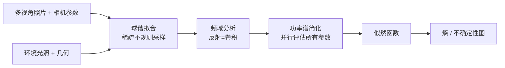

## 一句话总结

本文提出用"熵"来量化多视角被动采集下 SVBRDF 恢复的不确定性，并借助频域（球谐功率谱）分析把原本极其昂贵的熵计算加速到毫秒级，进而用这张不确定性图去指导拍摄、跨表面共享信息以及扩散模型补全。

## 研究背景

- 领域现状：材质外观通常建模为依赖入射方向、出射方向和表面位置的六维函数。要精确重建它需要大量样本，并且最好能同时控制光照与相机位置，这类采集依赖光台等昂贵复杂的硬件，现场采集尤其困难。更方便的做法是在不控制光照的情况下，从多个视角被动拍摄物体。
- 核心痛点：被动采集下光照与视角都不受控，观测未必包含足以重建外观所需的信息。在这种情况下很难区分"哑光"和"高光"材质，弯曲表面上还会因遮挡、阴影和视角缺失产生歧义。现有的不确定性估计方法要么基于 Hessian 逆的拉普拉斯近似（局部、且需先跑一遍优化），要么用随机粒子采样在全参数空间采样（覆盖全面但每次要几分钟到二十分钟），都不够实用。
- 本文 idea：与其在"减少采样点数量"上做文章，不如加速"每一组参数组合的概率计算"。作者把反射函数视为 BRDF 对入射光的卷积，转到球谐频域中评估，并进一步只用球谐系数的功率谱来比较，使得所有参数组合可以并行评估，从而把整物体的熵图压缩到约一毫秒完成。

## 方法

整体框架：方法从"想要的输出——熵"倒推到"实用高效的实现"。输入是多视角照片及其相机内外参、物体几何、以及作为环境贴图的 HDR 光照；输出是表面上的一张不确定性（熵）图。管线是：对入射与出射辐亮度拟合球谐系数 → 在功率谱中用候选 BRDF 滤波器预测出射辐亮度 → 比较观测与预测的功率谱得到似然，进而算熵。

关键设计分为四点：

1. 用熵度量不确定性。熵衡量概率分布的"分散程度"：阴天下平面到底是高光还是哑光同样可能，分布均匀、熵高；而在有明确高光的场景中分布集中在高光材质附近、熵低。作者要的是每个表面点上，给定观测出射辐亮度 $$B$$ 和入射辐亮度 $$L$$，材质参数 $$\psi$$ 的后验分布的熵。通过贝叶斯法则从 $$p(\psi\vert B,L) \propto p(B\vert \psi,L)p(\psi)$$ 得到似然，并假设渲染误差服从方差 $$\sigma^2$$ 的高斯分布来建模 $$p(B\vert \psi,L)$$。归一化后再除以 $$\log(n)$$ 使最大熵为 1 便于解读。一个重要观察是这些似然分布并不服从高斯，说明拉普拉斯近似式的局部高斯假设不成立，必须采样整个参数空间。

2. 把反射看作卷积。直接为所有参数、所有视角评估渲染函数代价极高（例如每参数 16 档、$$n=4096$$、60 个视角，用 Mitsuba 要 45 分钟以上）。作者沿用信号处理式的逆渲染框架，把各向同性微表面 BRDF 加朗伯项的出射辐亮度近似为 $$B(p,\omega_o) \approx K_d E(p) + K_s F(\theta_o)[S_\alpha * L(p)]_{\omega_o}$$，其中 $$S_\alpha$$ 是由法线分布宽度 $$\alpha$$ 参数化的滤波器，$$*$$ 表示球面卷积。他们还把阴影与遮蔽项纳入卷积视角以提升高粗糙度材质的精度。

3. 频域功率谱简化。把误差函数直接放到频域评估，出射辐亮度只需变换一次，避免为每组参数反复做逆变换。省略 Fresnel、阴影、遮蔽项后可把 Equation 全写进频域：$$B^{\psi}_{\ell m} = K_s e^{-(\alpha\ell)^2} L_{\ell m}$$（对 $$\ell>0$$）。由此得到两个洞见：$$\ell=0$$ 单独无法分离 $$K_d$$ 与 $$K_s$$，而 $$\alpha$$ 对 $$\ell=0$$ 无影响——因此不确定性评估可以归约到镜面参数 $$K_s$$ 与 $$\alpha$$ 两个量。再引入功率谱 $$S_L(\ell) = \sum_m L_{\ell m}^2$$（对坐标系旋转不变，因而对法线的轻微扰动鲁棒），误差写成 $$d = \sum_{\ell=1}^{\ell^*}(S_B(\ell) - K_s^2 e^{-2(\alpha\ell)^2} S_L(\ell))^2$$，把求和项数从 $$(\ell^*+1)^2-1$$ 降到 $$\ell^*$$，从而可对海量参数组合与表面位置并行求解，近乎瞬时。

4. 稀疏不规则样本的球谐拟合。多视角采集得到的出射辐亮度样本在上半球上稀疏且不规则，朴素最小二乘拟合不足以在频域恢复 BRDF 参数。作者在最小二乘中加入对球谐系数的加权 $$L_2$$ 正则 $$(Y^\top Y + \lambda W)c = Y^\top f$$，权重取 $$e^\ell$$ 对高阶球谐加重正则（呼应自然图像功率谱指数衰减的观察），倾向用低频信息填补未知区域；样本再按仰角以 $$\vert \cos\theta\vert $$ 加权，因为掠射角观测更易带测量误差。入射信号带限到约 $$v^{1/2}$$（$$v$$ 为视角数）以避免混叠。

## 实验结果

在 Stanford ORB 真实基准上做重光照评测（各方法均可访问真值光照与几何），主实验对比如下：

| 方法 | PSNR-H↑ | PSNR-L↑ | SSIM↑ | LPIPS↓ | 时间 |
|------|---------|---------|-------|--------|------|
| NVDiffRec | 24.319 | 31.492 | 0.969 | 0.036 | 142.14s |
| Mitsuba（路径追踪） | 26.601 | 34.195 | 0.977 | 0.032 | 52.49s |
| SH 模型（本文） | 26.525 | 33.796 | 0.977 | 0.029 | 5.07s |
| SH 模型-功率谱（本文） | 24.494 | 31.215 | 0.971 | 0.035 | 1.78s |
| SH 模型初始化 + Mitsuba（1 轮） | 26.918 | 34.386 | 0.978 | 0.031 | 16.07s |

可以看到本文的 SH 模型在质量上与 Mitsuba 相当，但只需约 1/10 的时间；忽略 Fresnel/阴影/遮蔽的功率谱变体仍与 NVDiffRec 相当，相对 Mitsuba 有约 30 倍加速；用 SH 模型结果初始化 Mitsuba 再优化一轮，能以更短总时间取得最好指标。

其余实验用文字概述：

- 熵近似质量：以 Mitsuba 计算的熵为"近似真值"，本文频域功率谱方法与之的皮尔逊相关系数为 $$\rho=0.88$$，角域变体为 $$\rho=0.94$$；而功率谱方法相对角域快约 3320 倍、相对 Mitsuba 快约 700000 倍，把熵计算从 Mitsuba 的约 5 分 50 秒降到约 0.0005 秒。
- 熵与误差：熵与重建误差呈正相关（合成基准上平均约 0.22），高熵区能覆盖几乎所有高误差区域且仍保持稀疏，可作为先验性的误差指示。
- 应用效果：最佳视角选择相比最远点采样，达到 +1 PSNR 增益所需视角数减少约 60%（配对 t 检验 $$p=1\times10^{-8}$$）；基于不确定性的全局信息共享给 SH 模型带来约 +1.5 dB、给 Mitsuba 带来约 +0.5 dB 的 PSNR 提升。

## 亮点与局限

- 亮点：
  - 把"整参数空间采样"这一昂贵操作转到球谐功率谱中并行评估，实现数个数量级的加速，让熵作为不确定性度量首次变得实用（毫秒级出整物体不确定性图）。
  - 频域视角自然导出"不确定性只由镜面参数 $$K_s$$ 与 $$\alpha$$ 决定"这一简化，思路清晰。
  - 不确定性图落到三个真实应用：拍摄引导、跨表面信息共享、扩散模型补全，且信息共享相比传统平滑正则不会模糊本应保留的区域。
- 局限：
  - 为进频域做了多处近似（省略 Fresnel、阴影、遮蔽等），粗糙度恢复对 SH 模型偏难，作者自评在这一压力测试上"可接受"而非最优。
  - 依赖已知且相对高质量的 HDR 环境光照与几何；对未知光照的情形尚需在假想光照上计算熵，属未来工作。
  - 目前对 LDR 图像不友好：LDR 信号被截断会引入原信号中不存在的频率，干扰频域分析。

## 延伸思考

这项工作把 Ramamoorthi 与 Hanrahan 的频域光传输分析从"判断 BRDF 恢复是否良态"推进到"给出连续、精细且无需材质先验的不确定性"，与 NeRF 领域的不确定性量化（如基于拉普拉斯近似清除杂散几何的工作）形成有趣对照——前者在参数空间做全局采样，后者做局部近似。它的功率谱加速思路也提示：很多逆渲染中"逐参数逐视角重渲染"的评估，也许都能借频域一次性变换 + 并行比较来大幅提速。值得追问的方向包括：如何把该框架扩展到未知光照与 LDR 采集、如何把不确定性直接写进优化目标而非事后指导，以及把镜面归约到两参数的假设在更复杂材质（各向异性、层状材质）下是否仍成立。
