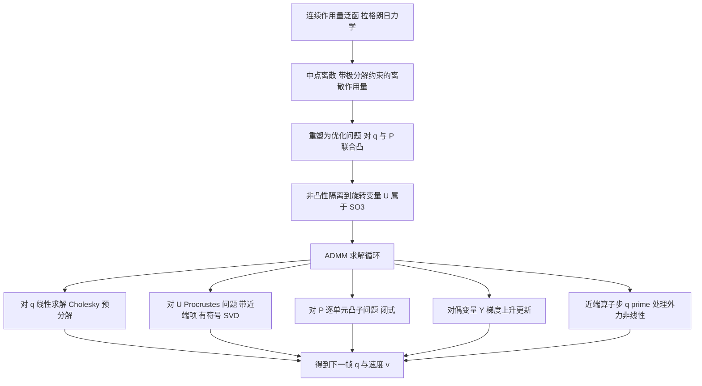

## 一句话总结

本文把一大类各向同性弹性能量下的变分时间积分改写为一个"隐藏凸结构"的优化问题——除形变梯度的旋转分量外对所有变量联合凸，并用交替方向乘子法（ADMM）配合一个近端算子步来求解，从而在不依赖牛顿法等非线性求根器的前提下获得有收敛保证、逐单元无翻转、且忠实守恒动量、近似守恒能量的弹性动力学积分器。

## 研究背景

- 领域现状：可变形固体的动力学仿真以时间积分方案为基石。各向同性形变能量最常用的积分器多依赖非线性求根，尤以牛顿法为主；同时变分积分器（源自拉格朗日力学与离散哈密顿原理）因能守恒动量、近似守恒能量而备受青睐。
- 核心痛点：显式积分器（前向欧拉、龙格库塔）为稳定性需极小步长，且能量会发散；隐式积分器（隐式欧拉、BDF2）无条件稳定却引入数值阻尼、随时间耗散能量。变分积分器虽有优良守恒性，但其动量守恒依赖可靠的求根过程，而牛顿法计算昂贵、对病态海森矩阵和初值敏感、缺乏收敛性分析——这些困难恰恰削弱了变分积分器的实用性。
- 本文 idea：作者注意到各向同性形变能量在雅可比矩阵的对称正定分量 $$P$$ 上通常是凸的（Stein 等人在静态几何处理中称之为"隐藏凸性"）。本文证明这种凸性也能在动力学的辛积分器中被挖掘出来：把变分积分重塑成一个特定的优化形式后，问题在顶点位置 $$q$$ 与主拉伸 $$P$$ 上联合凸，非凸性被完全隔离到紧致空间 $$SO(3)$$ 中的旋转变量 $$U$$ 上，从而可以用凸优化的成熟工具求解。

## 方法

### 整体框架

方法把每个时间步的推进表述为一个带约束的作用量泛函优化问题。基于连续拉格朗日力学，可变形体的运动是作用量泛函 $$S[q]=\int_0^1[K(\dot q(t))-E(Dq(t))]\,dt$$ 的临界点，其一阶变分给出牛顿第二定律 $$M\ddot q(t)=-\nabla_q E(Dq(t))$$。本文用中点离散写出带极分解约束的离散作用量，再借助隐藏凸性把它转成对 $$q$$ 与 $$P$$ 联合凸的最小化问题，最后用 ADMM 把这个问题拆成一系列可闭式或线性求解的子问题循环迭代。

### 关键设计一：作用量泛函中的隐藏凸性

对每个四面体的雅可比做极分解 $$J_i=U_iP_i$$，其中 $$U_i\in SO(3)$$ 是旋转、$$P_i\in S^3_+$$ 是对称半正定矩阵。各向同性势能可整体写成对 $$P_i$$ 的函数 $$E(Dq)=\sum_i w_i f(P_i)$$，而许多常用的畸变能量 $$f$$ 在半正定锥 $$S^3_+$$ 上是凸的。本文用中点离散定义带约束的离散作用量 $$S_d=\sum_k h\,[K(v^{k+1})-E(P^{k+1})]$$，约束为 $$D_iq^{k+1}_{\text{mid}}-U^{k+1}_iP^{k+1}_i=0$$。定理指出，其临界点等价于最小化 $$K\!\left(\tfrac{q-z^k}{h}\right)+E(P)$$（受同一极分解约束），该问题对 $$q$$ 与 $$P$$ 联合凸，非凸性全部落在有界的 $$U$$ 上。命题进一步给出：该积分器二阶精度、辛，且当离散拉格朗日具备平移（或旋转）对称性时精确守恒线动量（或角动量）。

### 关键设计二：ADMM 求解与各子问题

针对增广拉格朗日 $$\Lambda$$，ADMM 循环执行五步：对 $$q$$ 求极小归结为线性系统 $$Aq=B$$，其中 $$A=\tfrac{1}{h^2}M+\sum_i\tfrac{\rho_i}{4}D_i^\top D_i$$ 为对称正定，可在开始时用 Cholesky 预分解、后续无需重构（只要不重缩放 $$\rho_i$$）；对 $$U$$ 求极小是逐单元解耦的 Procrustes 问题，加入近端项后由带符号 SVD 闭式给出；对 $$P$$ 求极小是逐四面体的凸问题 $$\arg\min_{P_i\succeq0} w_i f(P_i)+\tfrac{\rho_i}{2}\lVert J_i-U_iP_i+\rho_i^{-1}Y_i\rVert_F^2$$，凸性保证唯一极小且通常有闭式解；对偶变量按 $$Y_i=Y_i^{(j)}+\rho_i(D_iq_{\text{mid}}-U_iP_i)$$ 闭式更新；可选地重缩放对偶参数。

### 关键设计三：近端算子步处理外力

保守力（如重力、与地面碰撞的罚势）可作为势能项 $$g(q_{\text{mid}})$$ 直接加入拉格朗日；非保守力（如固定点约束）也能通过在作用量泛函中加入相应项来纳入。若势能项 $$g$$ 带来非线性（如碰撞力），直接并入 $$q$$ 更新会要求迭代求解。作者改用一个优化技巧：引入新变量 $$q'$$ 与约束 $$q=q'$$，把非线性函数的输入换成 $$q'$$，再对 $$q'$$ 求解一个近端算子步 $$\arg\min_{q'} g(q'_{\text{mid}})+\tfrac{\mu}{2}\lVert q-q'\rVert_F^2+\text{Tr}(W^\top(q-q'))$$。该步通常有闭式解、代价低，且不改变能量/动量的守恒性质。

### 关键设计四：收敛性分析与可用能量

借助隐藏凸性，作者在温和条件（A1–A3）下证明算法全局收敛：关键是"充分下降"性质，即增广拉格朗日 $$\Lambda$$ 在迭代间的差 $$\Lambda^{(j+1)}-\Lambda^{(j)}$$ 有界；命题给出 $$A$$ 有正特征值且各对偶罚参数足够大即为充分下降的充分条件（$$A$$ 在本文中恒为对称正定，天然满足第一条件）。方法适配四类畸变能量：as-rigid-as-possible（$$f(P)=\tfrac{\kappa}{2}\lVert P-I\rVert_F^2$$）、对称 Dirichlet（$$f(P)=\tfrac{\kappa}{2}(\lVert P\rVert_F^2+\lVert P^{-1}\rVert_F^2)$$）、对称梯度（$$f(P)=\tfrac{\kappa}{2}\lVert P\rVert^2-\kappa\log\det(P)$$）与 Neo-Hookean（$$f(P)=\tfrac{\kappa}{2}(\lVert P\rVert_F^2-3)-\kappa\log\det(P)+\tfrac{\lambda}{2}(\log\det(P))^2$$）。其中 Neo-Hookean 严格来说仅在 $$\lambda=0$$ 时满足凸性假设，但只需修改 $$P$$ 子问题的近端算子即可纳入算法，经验上对较大的 $$\lambda$$ 亦收敛。

## 实验结果

论文以能量/动量守恒曲线与逐步运行时间为主要评估手段（未提供大型定量对比表）。守恒性方面：在弹性球撞地、旋转弹性杆、水母等算例中，本方法忠实守恒线动量与角动量，并长期保持总能量近似恒定；相较之下，Chao 等人（2010）的变分积分器（用牛顿法与 ARAP 实现）在数百步后失稳乃至发散，XPBD 引入数值耗散，IPC（无论后向欧拉还是 Newmark）出现明显阻尼或虚假能量尖峰。作者据此指出，过去变分求解器的不稳定往往源于迭代求根本身的数值困难，而非积分格式。下表汇总正文中明确给出的逐步平均运行时间（单位秒，数字忠于原文）：

| 算例 | 能量与参数 | 逐步平均运行时间 |
| --- | --- | --- |
| 稳定性对比（图十一） | 本方法 vs Chao 等人 2010 | 本方法 $$0.6\,\text{s}$$；Chao 等 $$1\,\text{s}$$ |
| 犰狳手臂拉伸至静息长 $$3\times$$（图十四，$$\kappa=35.0,\ \lambda=4\kappa$$） | ARAP / SymG / NeoH | $$5.5\,\text{s}$$ / $$4.7\,\text{s}$$ / $$1.3\,\text{s}$$ |
| 猫尾摆动（图十五，$$\kappa=35.0,\ \lambda=4\kappa$$） | SymG / NeoH | $$4.56\,\text{s}$$ / $$7.64\,\text{s}$$ |
| 棉花糖碰撞（图十六） | SymG / NeoH | $$7.1\,\text{s}$$ / $$2.8\,\text{s}$$ |

此外，实验验证了每次 ADMM 迭代的计算代价随网格单元数近似线性增长；收敛所需迭代数（从个位数到上千不等）主要取决于模型几何复杂度与形变幅度，而对网格细分程度依赖较小。应用上，方法可在同一套流程下切换 ARAP、对称 Dirichlet、对称梯度、Neo-Hookean 等势能，并对从柔软到刚硬的大范围刚度（如梁弯曲实验中 $$\kappa=35.0,\ 350.0,\ 1400.0$$）保持稳定；对含重力、地面碰撞、固定点约束的场景，只要把"碰撞能量"计入总能量，仍能维持近似能量守恒。

## 亮点与局限

亮点：

- 首次把静态几何处理中的"隐藏凸性"迁移到动力学辛积分器，证明变分时间积分的非凸性可被完全隔离到紧致的旋转变量 $$SO(3)$$ 上，问题对位置与主拉伸联合凸。
- 由此摆脱牛顿法等非线性求根器，得到带严格收敛性分析、逐单元无翻转（借半正定约束）、并忠实守恒动量、近似守恒能量的积分器。
- ADMM 各子问题多为闭式或线性求解，全局 $$q$$ 更新可 Cholesky 预分解、局部更新可 CPU 并行，代价随单元数近似线性增长；同一算法可无缝适配多种畸变能量与大范围刚度，稳定性优于既有变分积分器、XPBD 与 IPC。

局限：

- 不处理自碰撞：非常柔软的网格在仿真中可能发生自碰撞，此时自碰撞区域的运动看起来不真实（虽然方法本身仍保持稳定）。
- Neo-Hookean 能量在 $$\lambda\neq0$$ 时不严格满足收敛理论的凸性假设，只能靠修改近端算子并依赖经验收敛。
- 收敛所需迭代数随几何复杂度与形变幅度增大而显著上升（可达数千次），代码尚未针对速度充分优化；相较 IPC 在复杂接触场景的鲁棒性仍有差距（IPC 虽能稳健处理自碰撞，却会破坏积分器的辛性、丢失守恒律）。

## 延伸思考

- 本文核心方法论——把非线性非凸的时间演化问题重塑成"凸性可被暴露、非凸性被隔离到低维紧致空间"的形式——具有超出弹性动力学的普适价值，作者也明确呼吁进一步研究从时变非凸问题中抽取凸性的通用手段。
- 用 ADMM 的局部-全局拆分替代牛顿法，把守恒性优良但求解困难的变分积分器变得实用，提示"好的物理格式 + 好的凸优化求解器"是提升仿真稳定性的有效组合，可能启发接触、流体等其他物理域重新审视基于哈密顿原理的求解器。
- 未来把该框架扩展到自碰撞与更广的接触力学，同时保持辛性与守恒律，是让这类变分积分器真正落地于复杂动画场景的关键方向。
