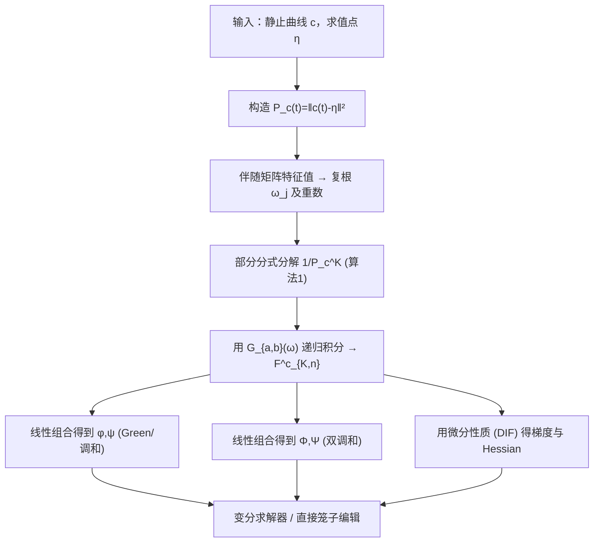

## 一句话总结

本文给出了针对"输入静止笼子本身就是多项式曲线"这一最一般情形的 Green（调和）与双调和坐标的闭式表达，并额外推出坐标的一阶、二阶导数，使得基于笼子的快速解码能力首次能与变分求解器结合，支撑丰富的弹性形变。

## 研究背景

广义重心坐标（generalized barycentric coordinates）是二维/三维笼子形变的基础工具：把笼子内任意点表达为笼子顶点位移的加权和，编码一次即可对整幅图像快速解码形变。它已被 Krita、Blender 等软件采用。

但绝大多数已有研究都假设静止笼子是直边多边形，映射到的也是直边多边形。这带来两个痛点：形变时靠近笼边的区域只能线性变化，暴露出笼子的离散结构；绑定时直边必须迂回地贴合弯曲边界，往往需要大量线段才能逼近曲线轮廓。

围绕曲线笼子已有一系列进展。Michel 和 Thiery（2023）把 Lipman 等人的 Green 坐标推广到形变笼边可以是多项式（如贝塞尔）曲线，但推导仍假设静止笼边是直的。Lin 和 Chen（2024）用 Cauchy 公式重新得到这些坐标并给出梯度与 Hessian，从而支持变分形变，但绑定时笼子仍受限于直段，处理曲线输入需要一个"拉直"步骤，而拉直并非总能实现。Liu 等人（2024，未发表预印本）用残数计算给出了对任意非自交多项式静止笼子的 Green 坐标，但推导与求值都不平凡，需要针对不同根重数分情况处理。

本文"补全全景图"，做出三项贡献：为输入/形变都是多项式的笼子引入 Green 与双调和坐标；推导它们的梯度与 Hessian；基于 Green、调和、双调和三种多项式子空间给出若干变分方法。

## 方法

### 核心洞见：单一参数化泛函

作者最关键的观察是：所有坐标（Green、调和、双调和）及其梯度、Hessian，无论对静止笼子还是形变笼子，都能从同一个参数化积分导出。记 $c_\eta(t) = c(t) - \eta$（把曲线放到以求值点 $\eta$ 为原点的坐标系），并令 $P_c(t) := \|c_\eta(t)\|^2$ 是 $2N_c$ 次多项式，定义泛函

$$F_K^c[p] := \int_{t=0}^{1} \frac{p(t)\, dt}{P_c(t)^K} = \int_{t=0}^{1} \frac{p(t)\, dt}{\|c(t) - \eta\|^{2K}}$$

它对多项式 $p$ 是线性的：

$$F_K^c\left[\sum_i p_i X^i\right] = \sum_i p_i\, F_K^c\left[X^i\right]$$

这条线性性质把"计算全部笼子坐标"的复杂度转移到"计算 $F_K^c[X^i]$"这一件事上。求导则依赖如下微分性质：

$$\nabla_\eta^T F_K^c[p] = F_K^c\left[\nabla_\eta^T p\right] + 2K\, F_{K+1}^c\left[p\, c_\eta^T\right]$$

有了它，调和坐标 $\phi,\psi$ 与双调和坐标 $\Phi,\Psi$ 及其各阶导数都能写成 $\{F_K^c[X^i]\}$ 的线性组合。例如 Dirichlet 项的 Green 坐标可重写为

$$\phi_k^c(\eta) = \frac{1}{2\pi} F_1^c\left[X^k\, c_\eta \cdot c'^{\perp}\right]$$

Neumann 项经分部积分得到

$$\psi_k^c(\eta) = \frac{1}{2\pi}\left[-\log(\|c_\eta(1)\|) + F_1^c\left[X^k\, c_\eta \cdot c'\right]\right]$$

双调和坐标 $\Phi_k^c,\Psi_k^c$ 分别对应第三阶、第四阶边界条件的扩散，同样通过分部积分化为 $F_1^c$ 的组合，与调和坐标互补，共同张成丰富的双调和函数空间。Green 坐标是这套双调和坐标的特例（令三、四阶系数为零即可）。

### $F_K^c$ 的求值框架

计算归结为 $F_{K,n}^c := F_K^c[X^n] = \int_0^1 t^n / P_c(t)^K\, dt$。做法是先把 $P_c(t)$ 因式分解：

$$P_c = A \prod_j \left(X - \omega_j\right)^{m_j}$$

其中复根 $\omega_j$ 通过其伴随矩阵（companion matrix）的特征值求得（用 Eigen 库）。再对 $1/P_c(t)^K$ 做部分分式分解，化成单根项之和，最终

$$F_{K,n}^c = \frac{1}{A^K}\sum_i \alpha_i\, G_{n,-n_i}(\omega_{j_i})$$

其中 $G_{a,b}(\omega) := \int_0^1 t^a (t-\omega)^b\, dt$ 可递归求值：$b=-1$ 时归结为 Michel 和 Thiery 的对数型闭式结果，$a=0$ 时是 $(t-\omega)^b$ 的直接积分，其余情形用分部积分递推。部分分式分解用一套"因式化多项式"的抽象（列表的列表）来迭代计算导数（算法 1、2）。

### 数值稳定性

当伴随矩阵的特征值相距小于 $\epsilon = 10^{-5}$ 时，把它们合并为一个重数相加的根，避免部分分式求值触及数值极限。此外，计算 $\phi$ 调和坐标 Hessian 所需的 $F_{3,n}^c$ 在阶数 $n>1$ 时有时需要多精度（256 位，mpfr++）浮点才能稳健求值；由于 Hessian 只在变分方法中沿边界稀疏采样的少数点上计算，这一开销可接受。实际中最常见情形是 $P_c$ 全为单重根（因为一维曲线嵌在二维平面中，一般不存在 $c(t)=\eta$），此时部分分式只产生平凡项，$G$ 无需递归，计算相当简单。

### 变分形变

所有变分方法都最小化形如 $E(\bar C) = \tfrac{1}{2}\|A\bar C - B\|^2$ 的能量，其中 $\bar C$ 是所有形变曲线控制点。由于笼子被当作"曲线汤"（互不相连的独立曲线），需要显式强制相邻曲线端点重合的连续性约束 $\sum_k \bar c_k = \bar c_0^{\text{next}}$，写成 $\Lambda \bar C = 0$，通过拉格朗日乘子求解带约束线性系统。

作者展示了三类应用：变分 Green 形变（最小化 Hessian 范数的 as-affine-as-possible 能量），无需拉直步骤即可直接编辑曲线笼子；as-rigid-as-possible / as-similar-as-possible 形变（用局部/全局迭代求解器，局部步投影到最近旋转/相似矩阵）；以及边界对齐形变（boundary-aligned），把 Jacobian 约束为 $J = U\Sigma B_n^T$ 的奇异值分解结构，使拉伸方向沿法向/切向对齐，从而复现 Weber 等人的"保厚度"效果，但只需用户指定位置约束而非手工搭建形变笼子。

## 实验结果

时间在 Intel i7-10850H（2.70GHz，8 核）、32GB 内存的笔记本上测得，均对数千个求值点取平均。

单点单曲线求根耗时随静止曲线次数 $N_c$ 增长：次数 1/2/3/4/5/6 分别为 2.5 / 7.6 / 17.4 / 30.2 / 57.2 / 91 微秒。

Green（调和）坐标计算 $T_{\text{coord}}$（及加上梯度 $T_{\text{grad}}$）随静止次数 $N_c$ 与形变次数 $\bar N_c$ 变化：在 $N_c=\bar N_c=1$ 时约 8/15 微秒，在 $N_c=6,\bar N_c=6$ 时约 202/555 微秒。双调和坐标（是调和坐标的超集）大约需要不到调和情形两倍的时间：$N_c=\bar N_c=1$ 时约 14/35 微秒，$N_c=6,\bar N_c=6$ 时约 349/793 微秒。

Green 坐标 Hessian 的计算凸显了多精度的代价：以双精度对比 256 位计算 $F_3^c$，$N_c=1$ 时约 0.03ms 对 1.1ms，$N_c=6$ 时约 2.1ms 对 420ms 起。多精度是主要瓶颈，但因只对极少数点计算故可接受。

三个规律清晰：求根与其余计算大致相当；双调和坐标约为调和坐标的两倍耗时；静止曲线次数 $N_c$ 对耗时的影响强于形变曲线次数 $\bar N_c$。

与数值积分基线的对比表明，即使把每条曲线离散成 200 步（比直接求闭式还贵），数值积分仍残留难以预测的不稳定性，且达不到闭式表达的质量；100 步为等时对比。

在形变质量上，仅用直段（$N=1$）的子空间不够丰富，位置约束难以在不牺牲质量的前提下满足（此时双调和优于调和，调和会把头部压扁）；提高形变曲线次数能快速改善质量。曲线静止笼子相比直笼子能得到明显更平滑的形变，笼子几何结构对结果影响很大。在边界对齐实验中，双调和形变能在满足位置约束的同时提供更直观的边界对齐效果，原因不仅是自由度更多，更在于双调和能同时拟合 Dirichlet 与 Neumann 混合边界条件，而调和函数在数学上仅由 Dirichlet 条件唯一确定。

作者还给出一个"autocage"半自动流程：把图像转二值掩膜、形态学膨胀 $n_d$ 像素（约 2000×2000 图像取 20–50）、追踪外轮廓、用 Schneider（1990）算法的变体拟合分段三次贝塞尔样条（容差取 $0.3$–$0.8\,n_d$ 以得到稀疏平滑笼子），能生成控制点数量适中、可交互操控的曲线笼子。

## 亮点与局限

亮点：

- 用单一参数化泛函 $F_K^c$ 统一导出全部坐标及其一二阶导数，数学结构优雅，避免了按根重数分情况的繁琐处理。
- 首次支持"静止笼子即任意非自交多项式曲线"的完整设定，无需拉直步骤，因而能处理拉直会退化或产生自交的输入（如仅两条曲线构成的笼子）。
- 提供闭式导数，使得快速解码的笼子形变可以嵌入变分求解器，支持 Green、调和、双调和三种子空间与 ARAP/ASAP/边界对齐等多种能量。

局限：

- 仍需艺术家提供静止笼子；autocage 是缓解，但不保证结果无自交、也不保证内部拓扑。
- 对高次参数（大 $K$、大 $n$）需要多精度浮点，计算显著变慢，实践中限制了很高次曲线（5 次以上）的使用。
- 当前对每个点都从头做伴随矩阵分解求根，未利用相邻像素间根的平滑性；也尚未 GPU 化。
- 无法简单推广到 Mean-Value 坐标，因为其核是 $1/P_c(t)^{3/2}$ 的奇数次核，破坏了可做有理分式分解的前提。

## 延伸思考

这项工作把"闭式坐标"与"变分优化"两条本来分离的技术路线接到了一起：闭式导数让笼子形变第一次能像网格上的 ARAP 那样被能量驱动，同时保留笼子编码/解码的效率。它启发的方向包括：利用 $\eta$ 平滑变化时根的连续结构做多分辨率的 warm-start 求根，为 GPU 实现铺路（但需为算法 2 的有理分式迭代做保守内存预估，因 GPU 不允许动态分配）；把闭式框架推广到 $k$-调和（$k>2$）函数，可能在计算机图形学之外找到应用；以及围绕贝塞尔轮廓优化与矢量图逼近，探索能同时控制局部细节层级、曲线次数范围、到目标图形距离和参数化规整度的笼子生成方法。对于向量图形编辑与二维角色形变而言，"用少量位置/朝向约束驱动平滑曲线笼子"是一个很实用的交互范式。
