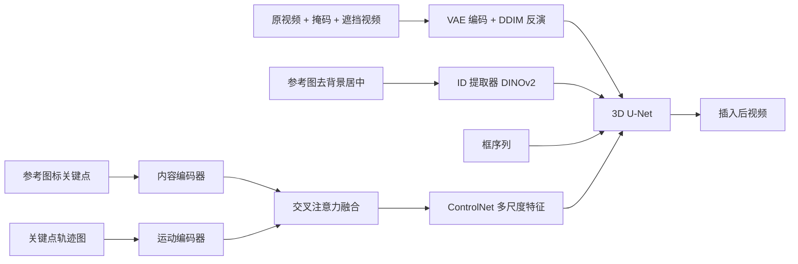

## 一句话总结

VideoAnydoor 提出了一个端到端、零样本的视频物体插入框架，用 ID 提取器保住参考物体的身份、用框序列控制粗粒度运动，再用一个"像素扭曲器（pixel warper）"根据关键点轨迹把外观细节精确搬运到目标区域，从而同时实现高保真细节保留与精细运动控制。

## 研究背景

- 领域现状：扩散模型推动了文本到视频生成与编辑的快速发展，已有一些工作能基于姿态、风格或文本描述来编辑视频、替换特定物体。
- 核心痛点：把一个给定的参考物体"插入"到视频里仍然很难，难点在于要同时做到两件事——准确保留参考物体的外观身份，以及连贯精确地建模其运动。已有方法（如 AnyV2V、ReVideo）多采用两阶段方案：先用图像合成模型改第一帧，再把改动传播到后续帧。这种做法一旦首帧插入不理想就会连累全局，而且后续帧没有再注入 ID 信息，物体身份和运动往往在靠后的帧里崩坏。
- 本文 idea：不走两阶段，而是构建一个端到端框架，在整段视频里持续注入身份并精确控制运动。核心是用 DINOv2 提取紧凑的 ID token 做粗粒度身份/运动引导，再引入像素扭曲器，把带关键点的参考图与关键点轨迹作为细粒度条件联合建模外观与运动。

## 方法

整体框架：以一个 2D 图像 inpainting 扩散模型为基座，插入运动层升级成 3D U-Net 以获得时间一致性。输入端把原视频、物体掩码、被遮挡视频编码到隐空间后拼成 9 通道张量喂给 3D U-Net；同时把去背景、居中对齐的参考图送入 ID 提取器得到 ID token，连同边界框序列一起作为粗粒度的身份与运动引导；像素扭曲器则负责细粒度的外观细节与轨迹运动，其输出通过一个 ControlNet 注入 U-Net 的各层。整个模型用加权损失、并混合真实视频与"图像模拟视频"来训练。

关键设计：

1. **像素扭曲器（Pixel Warper）**：这是方法的核心。它接收一对输入——标注了任意关键点的参考图 $$c_{ref-key}$$ 与对应的关键点轨迹图 $$c_{mot}$$，分别经内容编码器 $$E_c$$ 和运动编码器 $$E_m$$ 编码后送入两个交叉注意力模块做语义感知融合，融合特征作为 ControlNet 的输入，抽取多尺度中间特征并逐层加回扩散模型。这样做的动机是：若只训练一个普通控制模块注入运动（缺乏与参考物体的显式语义对应），物体容易以错误姿态被插入、导致前景严重畸变。带关键点的参考图为运动信号提供了语义锚点，从而让外观细节能沿轨迹被正确"扭曲"到目标位置。特征注入形式化为 $$y_c = F(z_t, t, c_{ref}; \Theta) + Z(F(z_t + Z(f_c), t, c_{ref}; \Theta_c))$$，其中 $$Z$$ 为 zero-conv。

2. **训练轨迹采样与过滤**：先用 X-Pose 在首帧初始化关键点（检测失败则用网格稀疏采样），再对稠密点做非极大值抑制（NMS）去冗余，然后对每个点做运动跟踪、保留运动幅度最大的 N 个点作为轨迹信号，不同轨迹用不同颜色区分。实验显示"选运动大的点"比随机点或全网格点带来明显增益。

3. **加权损失**：只在轨迹周围区域做重加权，对运动幅度大的轨迹施加更大权重以获得更精确的运动控制。损失写作 $$L = \sum_{i=1}^{N}\left(\left(\lambda R_i A^i_{trj} + (1 - A^i_{trj})/N\right)\cdot \lVert \delta - \delta^* \rVert_2^2\right)$$，其中 $$R_i$$ 是第 i 条轨迹覆盖比例，$$A^i_{trj}$$ 是其 8 倍下采样区域，$$\lambda$$ 为平衡权重。

4. **图像-视频混合训练**：高质量视频稀缺，作者把高质量图像"增广成视频"——通过等间隔平移或渐进裁剪生成图像序列，再用双线性插值提升平滑度，与真实视频联合训练；并借鉴自适应时间步采样，让不同模态的数据在去噪训练的不同阶段各司其职，避免图像损伤时间模块的学习。训练数据构造上，从同一段视频里取"距离最远"的帧当作最不相似的目标物体，去背景裁剪后作为参考，用扩展（而非紧贴）的框序列生成场景视频，未遮挡部分作为训练真值。

## 实验结果

基座为带运动模块的 Stable Diffusion XL，512×512 分辨率，16 卡 A100 训练 12 万步，每样本仅用 8 个关键点。评测基准为从 Pexel 收集的约 200 段、十类视频，指标涵盖身份保留（CLIP-Score、DINO-Score）、未编辑区重建质量（PSNR）以及基于 Cotracker 的跟踪指标（AJ、$$\delta^{vis}_{avg}$$、OA）。主实验为与相关方法的定量对比：

| 方法 | PSNR↑ | CLIP-Score↑ | DINO-Score↑ | AJ↑ | δvis_avg↑ | OA↑ |
|------|-------|-------------|-------------|-----|-----------|-----|
| ConsistI2V | 25.1 | 64.7 | 40.6 | 49.3 | 51.1 | 57.2 |
| I2VAdapter | 24.3 | 67.1 | 42.2 | 51.2 | 53.7 | 59.9 |
| AnyV2V | 30.1 | 70.2 | 47.2 | 54.1 | 55.8 | 61.1 |
| ReVideo | 33.5 | 74.2 | 51.7 | 79.2 | 81.4 | 83.2 |
| VideoAnydoor（本文） | 38.0 | 81.4 | 59.1 | 88.3 | 91.5 | 92.5 |

VideoAnydoor 在全部六项指标上均领先。缺乏显式运动控制的 AnyV2V、I2VAdapter、ConsistI2V 常生成静止或畸变的运动；ReVideo 因运动信号缺乏语义信息、且依赖首帧，在大运动场景下会丢失编辑内容、姿态控制欠佳。用户研究（15~20 名标注者，1~4 分）中本文在质量、保真度、流畅度、多样性四项均约 3.7 分，远高于对比方法（ReVideo 约 2.2~2.65）。消融实验证实：去掉像素扭曲器会因姿态错误导致运动一致性明显下降；只用静态图像或只用真实视频、冻结 DINOv2、去掉加权损失都会带来退化；加权损失优于框损失。此外方法无需针对性微调即可支持视频虚拟试穿、说话人头生成、多区域编辑等下游应用。

## 亮点与局限

- 亮点：
  - 首个端到端、零样本、同时支持运动与内容编辑的视频物体插入框架，避免了两阶段方案首帧误差累积、后续帧身份/运动崩坏的问题。
  - 像素扭曲器把"带关键点的参考图 + 关键点轨迹"作为细粒度条件，给运动信号加上语义锚点，兼顾了外观细节保真与精确运动控制。
  - 用图像增广成视频的混合训练策略务实地缓解了高质量视频数据稀缺问题，并靠自适应时间步采样避免图像损害时间建模。
  - 无需任务特定微调即可泛化到虚拟试穿、换脸、多区域编辑等多种应用。

- 局限：
  - 对复杂 logo 的处理仍不理想，作者认为需靠收集相关数据或更强的骨干网络来改善。
  - 依赖 X-Pose / Cotracker 等外部关键点与跟踪工具，其失败情形（如需退回网格采样）可能影响控制质量。
  - 自建约 200 段视频基准规模有限，且用户研究评分主观性较强。

## 延伸思考

- 该方法本质上是"区域到区域"的通用映射思路，把关键点轨迹当作可交互的细粒度控制信号，这与图像级 AnyDoor 一脉相承，也和基于点/轨迹的可控生成（如运动刷、拖拽式编辑）方向高度相关，值得思考能否与更强的视频扩散骨干（如 DiT 类文本到视频模型）结合。
- 像素扭曲器依赖显式关键点与轨迹，能否用隐式对应或自监督光流替代人工/检测器采样，从而减少对 X-Pose 等外部工具的依赖，是一个可追问的方向。
- "把静态图像增广成视频"是一种低成本的数据扩充范式，其自适应时间步采样的思想或可迁移到其他视频生成/编辑任务中缓解数据稀缺。
