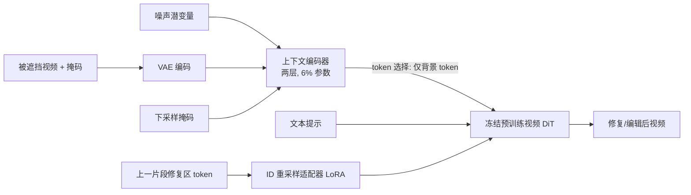

## 一句话总结

VideoPainter 提出一种双分支视频修复框架，用一个仅占主干 6% 参数的轻量上下文编码器，把背景信息即插即用地注入任意预训练视频扩散 Transformer，并配合修复区域 ID 重采样技术，实现任意长度视频的高质量修复与编辑。

## 研究背景

- 领域现状：视频修复（video inpainting）用于修补被遮挡或损坏的视频内容，是影视制作、试穿、视频编辑等应用的基础。近年扩散 Transformer（DiT）在视频生成上表现突出，催生了生成式视频修复的探索。
- 核心痛点：现有方法分两类，都存在明显短板。非生成式方法依赖像素传播（光流、注意力检索相似纹理），只能补部分遮挡，无法生成被完全遮挡的物体；生成式方法把单分支图像修复架构加时序注意力搬到视频上，难以在同一个模型里同时兼顾背景保持与前景生成，时序一致性也不如原生视频 DiT。两类方法都忽视了长视频修复，难以在长视频中维持物体身份（ID）一致。
- 本文 idea：把视频修复解耦为"背景保持"和"前景生成"两件事，采用双分支 DiT 架构——用一个专门的上下文编码器提取被遮挡视频的背景特征，同时利用预训练 DiT 的生成能力，在背景与文本提示的共同条件下生成语义连贯的前景内容。这一思路类似图像修复里的 BrushNet 与 ControlNet，但要迁移到视频 DiT 需解决三个难题：全量复制 DiT 主干作控制分支代价过高；DiT 的全局注意力使遮挡区 token 天然含背景信息，难以区分遮挡与非遮挡区；ControlNet 缺乏跨层特征注入，无法提供修复所需的稠密背景控制。

## 方法

### 整体框架

VideoPainter 冻结一个预训练视频 DiT 作为生成主干（前景生成），旁挂一个轻量上下文编码器作为控制分支（背景保持）。上下文编码器接收"噪声潜变量 + 经 VAE 编码的被遮挡视频潜变量 + 下采样后的掩码"的拼接输入，提取背景上下文特征，再以分组、token 选择的方式回注到冻结的主干中。针对长视频，额外引入基于 LoRA 的 ID 重采样适配器，通过跨片段拼接修复区域 token 维持身份一致。

### 关键设计

1. **轻量上下文编码器（是什么/为什么/怎么做）**：只克隆预训练 DiT 的前两层作为控制分支，仅占主干约 6% 参数。之所以能这么轻，是因为主干本身具备强生成先验，控制分支只需提取上下文线索来引导背景保持与前景生成，无需像 BrushNet/ControlNet 那样复制半个或整个主干。克隆自预训练权重也给背景特征提取提供了良好先验。

2. **分组式特征注入**：两层编码器分别负责主干的前半部分和后半部分——第一层特征加回主干前半层，第二层特征加回后半层，通过零初始化线性层（zero linear）注入，实现稠密而高效的跨层背景控制。注入公式为 $$\epsilon_\theta(z_t,t,C)_i = \epsilon_\theta(z_t,t,C)_i + \mathcal{Z}\big(\epsilon_\theta^{VideoPainter}[z_t, z_0^{masked}, m_{resized}], t\big)_{i//\frac{n}{2}}$$ 。

3. **token 选择性融合（w/o Select 消融验证其必要性）**：由于 DiT 全局注意力让遮挡区 token 也混入了背景信息，直接全量注入会造成前景/背景 token 混淆。方法在注入前做一步预筛选，只把纯背景 token 加回主干，遮挡区 token 被排除，避免主干生成时的信息歧义。

4. **修复区域 ID 重采样（面向任意长度）**：长视频分片段生成时靠重叠区加权平均做平滑过渡，并用上一片段最后一帧作为当前片段重叠区首帧保证外观连续。为维持身份一致，训练时冻结 DiT 与编码器、只训练插入的 ID 重采样适配器（LoRA），把当前遮挡区含目标 ID 的 token 拼接到注意力的 KV 向量上；推理时改为把上一片段修复区 token 拼进当前 KV，即 $$\text{Attention}(Q_i^v, [K_i^v, K_i^{id}], [V_i^v, V_i^{id}])$$ ，让模型持续采样到目标 ID 信息。

5. **即插即用控制**：框架兼容 T2V 与 I2V 两类 DiT 主干，也能挂社区风格化 LoRA。用 I2V 主干时只需多一步——先用任意图像修复模型按遮挡区文本描述生成首帧，该帧同时作为图像条件与首个遮挡帧。

此外，作者构建了可扩展的数据管线（识别→检测→分割→过滤→切分→筛选→打标），依托 Recognize Anything、Grounding DINO、SAM2、CogVLM2、GPT-4o 等模型，产出目前最大的视频修复数据集 VPData（超 39 万片段、866.7 小时，带分割掩码与稠密视频/遮挡区描述）及评测基准 VPBench。

## 实验结果

主实验为 VPBench 标准长度（VPBench-S）分割掩码下的视频修复对比，覆盖遮挡区保持、文本对齐、视频质量三方面共 8 个指标。VideoPainter 在几乎所有指标上取得最优，验证了双分支解耦的有效性。

| 方法 | PSNR↑ | SSIM↑ | LPIPS×10²↓ | CLIP Sim↑ | CLIP Sim (M)↑ | FVID↓ |
|------|-------|-------|------------|-----------|---------------|-------|
| ProPainter（非生成） | 20.97 | 0.87 | 9.89 | 7.31 | 17.18 | 0.44 |
| COCOCO（生成） | 19.27 | 0.67 | 14.80 | 7.95 | 20.03 | 0.69 |
| Cog-Inp（本文强基线） | 22.15 | 0.82 | 9.56 | 8.41 | 21.27 | 0.18 |
| 本文 | 23.32 | 0.89 | 6.85 | 8.66 | 21.49 | 0.15 |

其余实验用文字补充：在长视频子集 VPBench-L 与随机掩码基准 Davis 上，VideoPainter 同样全面领先（如 VPBench-L 上 PSNR 22.19、FVID 0.17）。视频编辑任务对比 UniEdit、DiTCtrl、ReVideo，本文在标准与长视频上均大幅胜出（标准 PSNR 22.63 对 ReVideo 的 15.52），甚至超过端到端的 ReVideo。用户研究中，30 名参与者的偏好比例显示 VideoPainter 在背景保持、文本对齐、视频质量三项上均以 74%~87% 的比例被选为最佳。消融实验证实：双分支显著优于单分支；两层编码器是性能与效率的平衡点；token 选择性融合和 ID 重采样对质量与长视频一致性均有明确贡献。

## 亮点与局限

- 亮点：
  - 首个支持即插即用背景控制的双分支视频修复框架，上下文编码器仅 6% 参数即可挂到任意预训练视频 DiT（T2V/I2V 皆可），也能配合社区 LoRA。
  - 修复区域 ID 重采样让任意长度（超过一分钟）视频保持身份一致，弥补了以往方法对长视频的忽视。
  - 贡献了目前规模最大、带分割掩码与稠密文本描述的视频修复数据集 VPData 与基准 VPBench，且训练高效（编码器 8 万步、适配器仅 2 千步）。
  - 8 个指标上全面达到 SOTA，并自然延伸到视频编辑应用。

- 局限：
  - 生成质量受限于所选基座模型，面对复杂物理与运动建模时可能力不从心。
  - 当掩码质量低或视频文本描述不对齐时，表现会明显下降。

## 延伸思考

- 双分支"背景保持 vs 前景生成"的解耦，本质是把图像编辑里 ControlNet/BrushNet 的思路针对视频 DiT 的全局注意力特性做了适配（token 选择性注入正是为解决 DiT 遮挡区 token 含背景信息这一问题而生），这一范式或可推广到深度、边缘、姿态等其他稠密控制条件的视频生成任务。
- ID 重采样以 KV 拼接维持跨片段一致性，思路与长上下文注意力、KV cache 复用相通；若把参考 token 从"上一片段"扩展为可检索的记忆库，或能在更长、更复杂的运动下进一步稳定身份。
- 方法性能与基座强绑定，随着更强视频 DiT 出现，这种"冻结主干 + 轻量控制分支"的即插即用策略有望零成本受益，是较有工程价值的一条技术路线。
- 数据管线全自动依赖多个视觉/语言大模型，掩码与描述质量直接决定上限，如何评估与清洗自动标注误差、以及低质掩码下的鲁棒性，是值得追问的方向。
