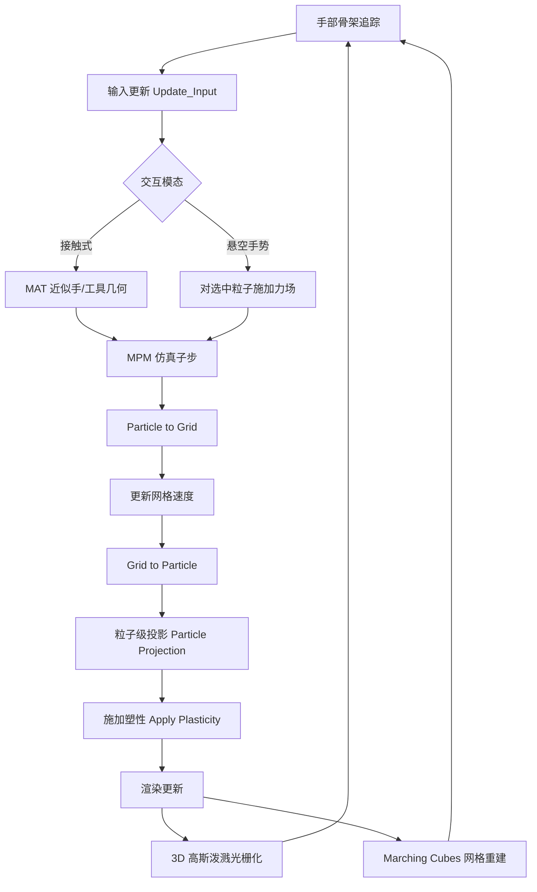

## 一句话总结

VR-Doh 是一个开源的 VR 徒手 3D 建模系统，用定制化的物质点法（MPM）实时模拟手部引起的大变形，并结合增强版 3D 高斯泼溅渲染，让用户像捏黏土一样直接用双手创作和编辑可仿真的弹塑性物体。

## 研究背景

数字内容需求的增长对 3D 内容创作提出了易用性、可扩展性、效率与质量四方面的挑战。传统 3D 建模工具门槛高，需要专业技巧、真实世界观察能力和反复精修，把新手挡在门外。VR 中的 3D 建模因沉浸感与深度感受欢迎，但 Shapelab、Gravity Sketch 等商业工具仍停留在"画曲线成面"的程序化几何范式，依然依赖较强的技能。

与之相对，物理感知的形状建模提供了一种更贴合人类直觉的新范式：把物体当作可变形固体，通过接触力或用户设定的边界条件来重塑它。在 VR 里用手作为输入模态尤为契合——它模拟了人们操作真实物体（如黏土）的方式，让用户借助现实经验降低学习成本。

VR-Doh 要解决两个核心难题：一是让直接手部操作能产生物理上真实的材料变形；二是在复杂物理计算下仍维持实时响应性能，避免 VR 中因视觉与实际运动不匹配导致的晕动症。系统建立在 PhysGaussian 之上，后者把移动最小二乘 MPM 与 3D 高斯泼溅结合起来做弹塑性仿真与真实感渲染，但直接套用无法满足实时性、易用性与动态更新的要求。

## 方法

系统以 Unity 为前端、Taichi 为仿真编译引擎，围绕"手部交互 — MPM 仿真 — 渲染"三个环节构成主循环。

关键设计分四部分。

**手部交互。** 接触式建模用中轴变换（MAT）近似手和工具的几何：一只手被离散为 76 个中轴锥（medial cone）和 28 个中轴板（medial slab），借助 Medial IPC 计算 MPM 网格节点与中轴基元之间的距离，并用基元包围盒构建空间哈希以加速碰撞检测。工具（平板、杆、剪刀）附着到手部关节上随手运动，追踪数据用过去 0.2 秒的移动平均核平滑以提升稳定性。悬空手势建模则用捏合手势（拇指尖触中指尖）对选中的 MPM 粒子施加力场做拉伸、扭转，绿色高亮可视化选区与力场。系统还支持抓取包围盒移动/缩放、加载基本体、挤出工具生成新材料，以及合并、复制、重置、删除等常规操作。

**仿真优化。** 为在有限网格分辨率下避免粒子穿透被动物体（手、工具），引入独立于网格分辨率的粒子级碰撞处理：对更新后仍在物体内部的粒子做投影并修正速度

$$x_p = x_p + p_p, \quad v_p = v_{boundary}$$

其中 $p_p$ 是从粒子位置到边界最近点的连接向量，$v_{boundary}$ 是该最近点的速度。此外提出局部化仿真：由于实时仿真在典型硬件上约支持 10 万粒子，而大型高斯泼溅场景常超过 50 万粒子，系统把仿真限制在以用户双手为中心的立方区域内，区域外粒子保持静止，大幅降低计算量。

**渲染增强。** 提出统一高斯体积正则化，在训练阶段惩罚高斯体积差异，避免大变形暴露内部时出现模糊伪影：

$$L_{vol\_ratio} = \max\left(\frac{\text{mean}(V_{top,\alpha})}{\text{mean}(V_{bottom,\alpha})}, r\right) - r$$

实践中取 $r = 2$、$\alpha = 30\%$ 效果良好。同时解耦外观与物理表示：用较少的 MPM 粒子通过网格驱动大量高斯核，在保持渲染精度的同时显著提升仿真效率。对从零创建的模型，则在独立网格上把粒子质量转为密度场，用 Marching Cubes 提取等值面并做拉普拉斯平滑，通过为粒子赋"类别"属性分别重建各物体网格，避免不同物体粘连。

## 实验结果

实验默认设置：仿真网格分辨率 $64^3$，每格初始 8 个粒子，每帧 5 个仿真子步，neo-Hookean 弹性模型（杨氏模量 $E = 10^6$ Pa，泊松比 $\nu = 0.3$）配 von Mises 塑性模型（屈服应力 $\sigma_y = 10^5$ Pa），渲染密度场采样 $128^3$。硬件为 16 核 4.3GHz AMD Ryzen 9 9950X + Nvidia RTX 4090，配 Meta Quest 3 头显。

**实时性能。** 在双手挤压球体的场景下，即使把网格分辨率提到 $100^3$、每帧 30 子步、每格 12 粒子，系统仍能维持交互级帧率。

**空间收敛性。** 在压孔并双侧挤压球体的实验中，网格分辨率超过 $48^3$ 后变形结果趋于收敛，说明无需过高分辨率即可获得一致准确的结果。

**局部化仿真。** 在大型高斯泼溅场景中开启局部化仿真带来平均 3.3× 的帧率提升：

| 场景 | 泼溅点数 | 无局部化 FPS | 有局部化 FPS |
| --- | --- | --- | --- |
| Garden | 660K | 12.2 | 39.8 |
| Bicycle | 480K | 13.1 | 43.5 |
| Room | 382K | 13.6 | 44.5 |

**解耦外观与物理表示。** 在重力下坐立的狼模型上，随 MPM 粒子相对高斯核采样比下降，帧率显著提升而视觉保真度基本保持：采样比/FPS 为 1.0/56.4、0.8/69.0、0.5/89.2、0.3/101.2。把 MPM 粒子降到高斯核约 30% 时，FPS 接近翻倍。

**用户研究 US1（可用性）。** 6 名有 3-5 年经验者（P1-P6）与 6 名无经验者（P7-P12）完成"编辑现有模型"和"从零创建模型"两项任务，填写 USE 与 SSQ 问卷。系统评分：有用性 5.6/7、易用性 5.5/7、易学性 6.0/7、总体满意度 5.9/7，且未出现不适与恶心。用户高度评价其低学习曲线、真实变形与实时渲染，主要问题集中在手部追踪抖动和缺少撤销功能。

**用户研究 US2（对比 Blender）。** 6 名参与者在视频教程指导下用 VR-Doh 和 Blender 4.3 分别制作瑞士卷和甜甜圈。VR-Doh 平均耗时更短：瑞士卷 5.6 vs 9.4 分钟，甜甜圈 5.2 vs 11.8 分钟。用户总结 VR-Doh 四大优势：灵活选区、真实变形、无需绑骨的姿态编辑、基于物理的切割；主要劣势是精度低于 Blender（受实时粒子数限制）且缺乏触觉反馈易过度调整。两者呈互补关系——VR-Doh 擅长整体塑形，Blender 擅长精细局部操作。

## 亮点与局限

亮点方面，VR-Doh 首次把弹塑性物理仿真与 VR 徒手交互深度结合，形成一种新的物理感知建模范式，显著降低 3D 建模门槛。三项协同优化（粒子级碰撞处理、局部化仿真、外观与物理表示解耦）是其实时性的关键工程贡献，让大规模高斯泼溅场景也能被徒手实时编辑。系统同时支持从零创建（网格）与真实感场景编辑（高斯泼溅），输出可直接用于仿真的资产，并已开源。

局限方面，系统对全局拉伸、弯曲等大尺度变形效果好，但受计算预算限制，雕刻锐利折痕、精细表面细节等精修任务仍困难；消费级头显的视觉手部追踪存在位置抖动，影响精细操作；缺乏触觉反馈使力度估计困难，尤其在视觉遮挡区域易产生意外形变。

## 延伸思考

论文提出的解耦思路——用少量物理代理驱动大量外观基元——是一种通用的实时物理渲染折中策略，值得推广到其他基于粒子或点的可编辑表示中。未来方向上，作者指出触觉手套既能通过额外传感模态提升追踪稳定性，又能在精细任务中提供力反馈，是弥补精度短板的关键；此外，为增量变形状态设计专门的压缩方案以实现低内存开销的撤销/重做，将显著提升迭代式高精度编辑的实用性。更广义地看，如何把物理仿真的"整体塑形直觉"与传统工具的"点线面精确控制"融合成统一工作流，仍是 VR 创作工具走向专业生产力的核心命题。
