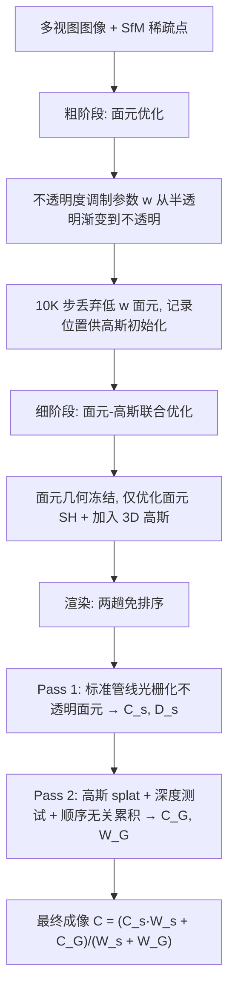

## 一句话总结

本文提出 Gaussian-enhanced Surfels（GES）这一双尺度辐射场表达：用一组带视相关颜色的 2D 不透明面元（surfel）刻画场景的粗尺度几何与外观，再用少量环绕面元的 3D 高斯补充细尺度细节；两趟、完全免排序的渲染既跑出超快帧率（1080p 平均 675 fps），又天然消除了 3DGS 视角变化时的"popping"闪烁伪影，同时质量与 SOTA 相当。

## 研究背景

- 领域现状：从光场到 NeRF 再到 3D Gaussian Splatting（3DGS），自由视角合成不断进步。3DGS 用稀疏分布、带视相关颜色的 3D 高斯构建体积辐射场，靠可微光栅化与 $$\alpha$$-blending 达到 SOTA 画质与实时帧率，成为主流方案。
- 核心痛点：$$\alpha$$-blending 需要对高斯按深度排序，逐像素精确排序代价极高。3DGS 用"整幅图一次性、基于 tile 的高斯中心深度预排序"来近似逐像素排序，虽然保住了速度，却会在视角变化时产生斑块状颜色忽隐忽现的 popping 伪影；排序本身也仍是速度瓶颈。已有的分层排序（StopThePop）、混合透明度、免排序加权和（SortFreeGS）等方案，要么不能保证逐像素次序正确，要么会导致被遮挡物体的颜色泄漏。
- 本文 idea：作者观察到"面元辐射场"能捕捉场景的大部分外观，而高斯辐射场只需补充面元表达不好的细节。于是用 2D 不透明面元先光栅化出颜色图与深度图，再让 3D 高斯以深度测试 + 免排序的方式在每个像素上累积颜色。既绕过了高斯排序瓶颈，又因为不透明面元提供了显式几何遮挡，从根本上避免 popping 与颜色泄漏。

## 方法

### 整体框架

GES 由两部分基元构成：一组 2D 不透明面元 $$\mathcal{S} = \{\mathbf{p}_i, \mathbf{r}_i, \mathbf{s}_i, \mathbf{SH}_i\}_{i=1}^N$$（位置、旋转四元数、各向异性缩放、球谐系数），以及少量环绕它们的 3D 高斯 $$\mathcal{G} = \{\mathbf{p}_i, \sigma_i, \mathbf{r}_i, \mathbf{s}_i, \mathbf{SH}_i\}_{i=1}^M$$（多了最大不透明度 $$\sigma_i$$）。渲染分两趟且完全免排序：第一趟用标准图形管线光栅化不透明面元，靠 z-buffer 深度测试得到颜色图 $$C_s$$ 与深度图 $$D_s$$；第二趟把 3D 高斯 splat 到屏幕，用面元深度图做深度测试，对每个像素以顺序无关的方式累积高斯颜色与权重，最后线性组合得到成像。

### 关键设计

免排序的双基元渲染：面元颜色取从面元中心指向相机方向的球谐颜色 $$\mathbf{c}_i = Y(\lVert \mathbf{o} - \mathbf{p}_i \rVert, \mathbf{SH}_i)$$，整片面元同色。第二趟对每个像素 $$\hat{\mathbf{x}}$$ 累积高斯颜色与权重：

$$C_G(\hat{\mathbf{x}}) = \sum_{i=1}^{K} \mathbb{1}(d_i < d_s(\hat{\mathbf{x}}) + \epsilon)\, \mathbf{c}_i \alpha_i(\hat{\mathbf{x}})$$

$$W_G(\hat{\mathbf{x}}) = \sum_{i=1}^{K} \mathbb{1}(d_i < d_s(\hat{\mathbf{x}}) + \epsilon)\, \alpha_i(\hat{\mathbf{x}})$$

其中 $$d_i$$ 是高斯中心深度，$$d_s$$ 来自面元深度图，指示函数把被面元几何遮挡（深度测试不过）的高斯剔除，$$\epsilon$$ 是防止贴近表面的高斯被误截断的小正量。最终成像为

$$C = \frac{C_s W_s + C_G}{W_s + W_G}$$

固定 $$W_s = 1$$。由于高斯颜色是累积并按权重归一化，无需任何深度排序，既免除排序瓶颈获得超快帧率，又保证视角一致、避免 popping。

不透明度调制参数解决面元不可微问题：直接从图像颜色损失优化不透明面元很难，因为面元几何到像素颜色的前向过程不可微——面元整片同色，几何微小变化要么不改颜色要么突变。作者引入调制参数 $$w_i \in [0, 255]$$，令面元上一点的不透明度为 $$\alpha_i(x,y) = \min(1, w_i G(x,y))$$，其中 $$G(x,y) = \exp(-\frac{x^2+y^2}{2})$$。$$w_i < 1$$ 时面元就是一个 2D 高斯（半透明），$$w_i$$ 增大则从中心向外逐渐变不透明，$$w_i = 255$$ 时在 $$G(x,y) > 1/255$$ 的圆盘（半径约 3.3）内不透明度恒为 1。优化从 $$w_i = 0.1$$ 起步，早期大片半透明区提供有效梯度优化位置与形状，后期逐步增大 $$w_i$$、半透明外环收缩，几何稳定直到面元完全不透明。这套设计保证优化末期的渲染结果与优化后基于 z-buffer 的不透明面元渲染一致。

粗到细两阶段优化：粗阶段用 SfM 稀疏点初始化面元，用 L1 + D-SSIM 损失优化，前 10K 步做致密化与剪枝；在 10K、18K、19K、20K 步按计划把 $$w_i$$ 抬到 30、60、90、255 并冻结面元几何。还设计了基于"覆盖分数"（某面元作为最前面元覆盖的最大像素数）的剪枝，去掉细小或不可见面元（真实场景阈值 16、合成场景 4），能剪掉 80% 以上面元。细阶段冻结面元几何，加入 3D 高斯并与面元 SH 联合优化：高斯用 10K 步丢弃的低 $$w$$ 面元位置初始化，每 1000 步按归一化误差图采样像素、结合面元深度图反投影出点云作为新高斯位置，并用类似 RadSplat 的贡献分数剪掉低贡献高斯。深度偏移按几何粒度自适应设为 $$\epsilon_i = \frac{5}{D}\sum_{j=1}^{D} s_{i,j}$$，兼顾抑制泄漏与减少误截断。

四个扩展：基础 GES（即 3D-GES）可方便地融合近期 3DGS 改进。Mip-GES 结合面元 4×MSAA 与 MipSplat 的世界空间/屏幕空间滤波实现抗锯齿；Speedy-GES 用 SpeedySplat 的 Hessian 剪枝分数进一步剪高斯，带来约 1.6× 加速；Compact-GES 用 C3DGS 的哈希网格查颜色 + 残差矢量量化压缩缩放旋转，存储压缩超 20 倍；2D-GES 用 2D 高斯替换 3D 高斯并加几何正则，平滑面元交界处不连续的法线、改善几何重建。

## 实验结果

实验在 i7-13700KF + 32GB 内存 + RTX 4090 上完成，数据集沿用 3DGS 设置：NeRF Synthetic（8 合成场景）、Mip-NeRF360（9 真实场景）、Deep Blending（2 场景）、Tanks & Temples（2 场景），并用 DTU（15 场景）评估 2D-GES 的几何重建。

画质（数据集平均，忠于原文 Table 1，Mip-NeRF360 / Deep Blending / Tanks & Temples 的 PSNR）：

| 方法 | Mip-NeRF360 PSNR↑ | Deep Blending PSNR↑ | Tanks & Temples PSNR↑ |
| --- | --- | --- | --- |
| 3DGS | 27.43 | 29.41 | 23.62 |
| SortFreeGS | 27.19 | 29.63 | 23.61 |
| StopThePop | 27.44 | 29.69 | 23.43 |
| SpeedySplat | 26.92 | 29.32 | 23.39 |
| 3D-GES | 27.38 | 30.00 | 23.95 |
| Mip-GES | 27.42 | 30.06 | 23.97 |
| Speedy-GES | 27.07 | 30.03 | 23.73 |

3D-GES 与 Mip-GES 画质与 SOTA 相当甚至在 Deep Blending、Tanks & Temples 上更优；相比 SpeedySplat 靠丢弃大量高斯换速度导致 LPIPS 变差，Speedy-GES 因省去排序时间能保留更多高斯，画质更好且速度相当。

速度、存储与训练时间（数据集平均，Table 3）：

| 方法 | FPS 1080p | FPS 2160p | 存储/MB | 训练/分钟 |
| --- | --- | --- | --- | --- |
| 3DGS | 185 | 62 | 734 | 28 |
| SortFreeGS* | 321 | 168 | 506 | 42 |
| StopThePop | 167 | 55 | 830 | 40 |
| SpeedySplat | 1140 | 369 | 78 | 14 |
| C3DGS | 139 | 47 | 49 | 36 |
| 2DGS | 90 | 24 | 504 | 26 |
| 3D-GES | 675 | 233 | 366 | 43 |
| 2D-GES | 718 | 247 | 343 | 52 |
| Mip-GES | 640 | 213 | 394 | 49 |
| Speedy-GES | 1135 | 348 | 185 | 36 |
| Compact-GES | 300 | 128 | 47 | 39 |

3D-GES 在 1080p 达 675 fps，约为 MipSplat 的 5.2×、StopThePop 的 4.0×、3DGS 的 3.6×、SortFreeGS 的 2.1×、AdrGS 的 1.3×（这些方法画质相当）；存储不到 3DGS 的一半，Compact-GES 更以 47MB 低于 C3DGS 的 49MB 且画质相当。

视角一致性（Mip-NeRF360，Table 2，越低越好）：3D-GES 与 2D-GES 的短期 $$\text{FLIP}_1$$ 均为 0.032，优于 3DGS 的 0.041、SpeedySplat 的 0.043、StopThePop 的 0.037、SortFreeGS 的 0.034；免排序渲染有效消除 popping。2D-GES 用 2D 面元 + 2D 高斯达到完全视角一致，3D-GES 因 3D 高斯的视相关交面仍有轻微不一致但实测未见明显伪影。

几何重建（DTU，Chamfer Distance，Table 4 均值）：2DGS 为 0.80、2D-GES 为 0.79、3D-GES 为 0.85、3DGS 为 1.97；2D-GES 与 2DGS 相当，且不透明面元跨视角几何一致，在光泽表面重建上优于 2DGS（后者有孔洞伪影）。

消融（Mip-NeRF360）：两阶段优化 PSNR 27.38 vs 单阶段 27.04，验证两阶段必要性——单阶段会偏向用高斯拟合、面元覆盖不足导致新视角颜色泄漏；只用面元 PSNR 仅 24.22、只用高斯 26.02，均显著劣化；不调整排序次序、$$\epsilon=0$$、$$\epsilon=0.1$$ 均有质量损失；用视无关 RGB 替换面元 SH 质量几乎不降且略提速省存储。

## 亮点与局限

亮点：

- 首个将面元辐射场与高斯辐射场结合的双尺度表达：不透明面元管粗尺度几何/外观、少量 3D 高斯补细节，思路清晰且与"面元捕捉大部分外观"的观察高度契合。
- 完全免排序的两趟渲染既绕开高斯排序瓶颈拿到超快帧率，又靠显式面元几何提供正确遮挡，从根本上同时解决 popping 与颜色泄漏两大顽疾。
- 不透明度调制参数把不可微的不透明面元优化转化为可微的、从半透明渐变到不透明的过程，是让面元能从图像损失端到端优化的关键巧思。
- 纯基于可编程图形管线、不依赖 compute shader，易于集成到现有渲染引擎与移动设备；且提供了抗锯齿、加速、压缩、几何重建四个即插即用扩展。

局限：

- 训练时间约为 3DGS 的 1.3 到 1.6 倍，主要花在面元优化上。
- 不透明面元难以像 3DGS 用大量低不透明度高斯那样模拟镜面反射，光泽表面画质会下降；作者建议用光线追踪或环境贴图缓解。
- 与 3DGS 一样对初始化敏感，用随机点替代 SfM 点时真实场景质量下降；可考虑引入 3DGS-MCMC 的确定性状态转移改善。

## 延伸思考

这项工作最有启发的一点是：与其在"如何更快更准地排序高斯"上继续打补丁，不如换表达——用显式、不透明的面元先把几何和遮挡关系确定下来，让后续的外观补充变成一个顺序无关的累加问题。排序之所以是 3DGS 的瓶颈与 popping 之源，本质是半透明体积基元缺乏明确的遮挡边界；GES 用面元把"表面"这个先验重新请回渲染管线，既降复杂度又提一致性，这与传统图形学"先定几何、再算着色"的分工不谋而合，是神经渲染向经典管线的一次有价值的回归。作者指出的大规模城市场景方向也颇具潜力：面元天然适合 LOD 与遮挡剔除，且显式几何可直接用于阴影投射与物理碰撞，这些正是纯体积高斯表达难以廉价支持的能力。如何在保持免排序优势的同时补上镜面反射与初始化鲁棒性，将决定这类混合表达能否在更广的生产场景中替代主流 3DGS。
