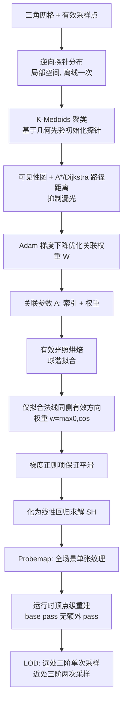

## 一句话总结

面向低端平台的静态全局光照方案：用球谐拟合把有效方向的光照信息烘焙进"顶点—探针"关联，配合在局部空间做的逆向探针分布，用主流工业方法约 5% 的显存实现可用画质并对前向渲染友好。

## 研究背景

全局光照（GI）同时模拟直接与间接光照，能让虚拟场景更真实。在多数游戏里静态物体占据场景主体，因此静态 GI 常靠预计算与烘焙来降低运行时开销。但许多现有方法为了画质，依赖大量纹理存储与逐像素纹理采样，带来沉重的显存与性能负担，在手机等低端平台上难以承受。

现有做法各有短板：

- 基于探针（Probe）的方法通常要在场景中存储大量球谐并在渲染时做逐像素插值，存储与运行时压力大。
- Epic 的 Indirect Light Caching 只在物体表面分布探针、逐分量插值，可用于移动端，但对结构复杂物体质量下降明显。
- 工业界广泛采用的 Directional Lightmap 把信息简化为光强与主导光方向，但低端平台精度受限、压缩伪影明显，且 UV 映射产生的缝隙浪费显存。

作者的目标是设计一个可微的光照重建与烘焙管线，既能在片元着色器里大幅减少采样、不增加额外渲染 pass（适配前向渲染与移动芯片的 TBDR），又能用极低显存保持视觉保真，并让同一网格的多个实例共享一致的高质量光照。

## 方法

WishGI 由三部分组成：高性能光照重建、有效光照烘焙、逆向探针分布。核心思想是把探针只当作"传递光照的球谐基"而非空间实体，直接建立顶点与探针之间的索引/权重关联。

关键设计：

**顶点级光照重建。** 把多组球谐（探针）视为高维基函数，顶点处的球谐值是探针的线性组合：

$$SH_{v_i} = W_j SH_j + W_k SH_k + \dots + W_n SH_n$$

表面上任意点 p 的球谐值再用其所在三角形三个顶点的重心坐标插值，重建光照为：

$$\hat{f}(A;p) = \frac{1}{\pi}\sum_{l=0}^{\infty}\sum_{m=-l}^{l}\left(b_{p,a}SH_{v_a}+b_{p,b}SH_{v_b}+b_{p,c}SH_{v_c}\right)^m_l\, T(Y^m_l(d))$$

其中 $Y^m_l(d)$ 是球谐基函数，$T$ 是与圆对称函数的卷积。计算量极小、以顶点为核心，可直接在 base pass 完成，无需额外渲染 pass。

**系数编码与存储。** 利用人眼对最亮通道更敏感的特点，用一个字节存三通道系数绝对值的最大值作为乘子，其余系数据此归一化统一控精度。一阶二阶系数用十二个 10-bit 存，三阶系数用十五个 8-bit 存；解码只需一次乘法。这支持 LOD——远处物体用二阶球谐单次采样，近处用三阶两次采样。全场景探针数据可无缝存进单张 probemap，消除 UV 缝隙与多纹理需求，减少 draw call。

**有效光照烘焙。** 由于只关心静态物体表面光照，不必烘焙完整环境光，只沿有效采样点表面的有效方向拟合，并优先保证法线方向精度。方向权重定义为 $w(d)=\max(0,\cos(d,n))$，光照损失为：

$$E_{light} = \int_S \int_\Omega w(d)\left(\hat{f}(A;p,d)-f(p,d)\right)^2 dd\, dp$$

考虑到 GI 通常低频平滑，引入沿法线方向的梯度正则项保证视觉平滑：

$$E_{reg} = \sum_{v\in S}\|\nabla \hat{f}(A;v,n)\|^2$$

最终目标 $\min_{SH} (E_{light}+\lambda E_{reg})$ 对 SH 可微，令 $\partial E_{loss}/\partial SH = 0$ 后化为经典线性回归问题直接求解。这与传统全方向均匀采样的球谐投影不同，最大化利用了有效光照信息，让无关方向的数据不影响法线半球内的精度。

**逆向探针分布。** 把探针分布视为局部空间中对关联 A 的优化问题，模型导入后离线执行一次。先用 K-Medoids 聚类在网格表面放置探针作为几何先验；用可见性构图，可见点用欧氏距离、不可见点用 A*/Dijkstra 路径寻路增大遮挡点距离，从而平滑过渡并抑制漏光。每个采样点关联最近的 n 个探针，权重按距离倒数归一化，再用重心坐标转移到顶点。随后构造复杂光照标准场景，通过旋转网格模拟多种光照情形，对权重矩阵 W 做梯度下降优化，进一步减轻漏光与球谐振铃伪影。因为在局部空间完成，关联可离线嵌入网格，同一网格所有实例共享。

## 实验结果

实现基于 Unreal Engine 4.27，对比对象为共享同源数据的 Directional Lightmap 与 Volumetric Lightmap（VLM）。评估用作者定义的多方向 RMSE（mRMSE），直接比较重建值与数值真值而非最终渲染图。

单网格 mRMSE 定量结果（Ours 分别为 20、30 个探针；Lightmap 为 6x6 ASTC 压缩、分辨率 64/128/256；括号内为显存）：8 个模型的平均 mRMSE，Lightmap 三档为 0.048 / 0.041 / 0.037（2.67 / 10.68 / 42.72 KB），VLM 两档为 0.046（3.5KB）/ 0.038（12KB），而本方法为 0.033（0.63KB）/ 0.031（0.94KB）。即用远低于对手的显存取得更低误差。例如 Befreiung 从 Lightmap 的 0.045 降到 0.027/0.025，Angle 从 0.041 降到 0.021/0.020。

运行时性能（三星 Galaxy S21，骁龙 888 + Adreno 660，Sun Temple 场景）：本方法把片元着色器纹理采样从 VLM 的 12.20 次/片元、Lightmap 的 5.14 次降到 3.08 次；片元着色占比从 VLM 98.09% 降到 LOD0 的 93.66%；base pass 时间 Lightmap 5.12ms、VLM 6.83ms，本方法 LOD1 为 4.95ms、LOD0 为 5.66ms。

移动端帧率（2km×2km 大地图，四款设备均值）：Lightmap 平均 35.26 FPS，本方法 36.65 FPS，整体与顶级性能的 Lightmap 相当，在 Galaxy S9+ 上明显更高（22.13 对 15.03）。

烘焙时间（i9-10980XE + RTX 3090 + 128GB）与 Lightmap 相近，如 Sun Temple 为 21 分钟对 16 分钟，Large Scene 为 107 分钟对 80 分钟；每个网格的探针分布通常 2 分钟内、且属一次性离线任务。消融实验证实：去掉梯度正则数值误差更低但产生明显不平滑伪影；几何先验能把优化从 5000 epoch 缩短到 400 epoch 且有效减少漏光。TOD 昼夜循环用 8 张 probemap 插值仅需 4MB 显存，而传统 lightmap 单一时刻同等质量就需 18MB。

## 亮点与局限

亮点：

- 无需 UV 映射，直接依赖几何顶点，关联数据复用顶点 UV2 的内存，几乎零额外存储；实测 256 个探针足以表达最复杂物体，多数物体不足 30 个。
- 全场景探针存进单张 probemap，无缝无缝隙，支持大规模实例化绘制、降低 draw call，且天然兼容前向渲染与移动 TBDR。
- 探针分布在局部空间离线完成，同一网格所有实例共享一致质量，无需每次烘焙前重新探索场景探针布局。
- TOD 昼夜循环只需在 probemap 间插值，显存占用极小。

局限：

- 网格越密、探针越多质量越好，因此对极简单网格反而不占优，作者建议此类模型继续用传统方法（这类占比不足场景 5%）。
- 各 LOD 级别独立做探针分布，可能出现 LOD 切换时的 popping。
- 受球谐与顶点—探针结构限制，难以表达锐利阴影等高频细节；尝试过轻量神经网络但难以平衡性能与质量。
- 主要面向静态物体，动态物体需另用如 ILC 的更简方案，扩展方向是从周围环境插值 SH。

## 延伸思考

WishGI 的取舍很清楚：它不追求 PC 端的高频真实感，而是把"低端平台上够用的 GI"做到极致省显存、省片元采样。它把探针从空间实体退化成纯粹的球谐基，用顶点—探针关联替代逐像素纹理查表，这一视角切换是省下片元开销的关键，也是它能塞进前向渲染 base pass 的原因。

把探针分布重构成局部空间的可微优化问题、并用几何先验（聚类 + 可见性路径距离）初始化，是很务实的工程选择——既避免了全场景优化的漫长构建时间，又让网格复用自然获得一致光照。这种"离线一次、随网格走"的思路对资产复用密集的游戏管线尤为友好。

值得进一步想的是：高频细节缺失和 LOD popping 都指向同一个根源——低阶球谐 + 顶点插值的表达上限。作者提到的轻量神经网络补偿、以及从 LOD0 简化探针分布，都是可能的后续；如何在不破坏"无额外 pass、极低显存"这两条底线的前提下补回高频信息，会是该路线最有价值的开放问题。
