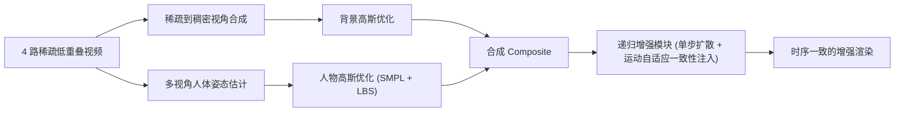

## 一句话总结

StudioRecon 用"背景和人分开重建"的思路，仅凭 4 路稀疏、低重叠的相机就能重建出高保真的 4D 人物场景：背景靠视频扩散模型合成上百个新视角来补足监督，人物靠 SMPL 参数化模型约束几何，最后用单步扩散做递归增强来消除拼合后的残留瑕疵。

## 研究背景

- 领域现状：专业的体积捕捉（volumetric capture）能拍出高保真的动态人物，但要几十到上百台相机、严格标定的环境。近年 4D 高斯泼溅把动态场景重建做得又快又好，但基本都假设相机稠密、视野大幅重叠。
- 核心痛点：现实场景（体育馆、家庭、医疗场所）里往往只有寥寥几台未标定、低重叠的相机——相邻相机看到的区域几乎不重叠（如相隔 90 度），还常有多人交互与遮挡。作者称之为 in-the-wild studio capture。已有的稀疏视角方法（如 MonoFusion）在这种设定下仍会在欠观测区域留下明显瑕疵，因为人物和背景的误差在共享表示里互相纠缠；而相机可控的视频扩散模型直接合成新视角，对静态场景不错，但对运动的人几何一致性差。
- 本文 idea：背景和人应该用不同的先验。背景需要在观测之外"编造"出合理内容——这是视频扩散模型的强项；人物需要强几何约束——这是 SMPL 这类参数化人体模型的强项。于是把两者解耦分别重建，再用扩散增强把它们和谐地拼回一起。

## 方法

整体框架：StudioRecon 是一条四阶段流水线。先用相机可控的视频扩散把 4 路稀疏输入"扩"成上百个稠密新视角，为背景高斯提供密集监督；再做多视角人体姿态估计，为人物重建打好几何底子；然后解耦地分别优化背景高斯（用合成视角）和人物高斯（用原始视频 + SMPL 约束）；最后用一个递归增强模块，把分开渲染的背景和人物合成图做单步扩散精修，并注入时序一致性。

关键设计分为四块：

1. **稀疏到稠密视角合成**（补足背景监督）。相机是静止的，所以对第一帧用前馈式 3D 重建模型拿到稠密点云、深度和相机位姿，后续帧用单目深度模型对齐到首帧尺度。用分割模型抠掉人得到干净的背景点云。再用球面线性插值在 4 个输入视点之间插出 $$L$$ 个新相机位姿，喂给相机可控视频扩散模型合成对应新视角图像——这就把只有 4 个视角的稀疏观测扩成了上百个，解决背景欠采样。

2. **几何驱动的多视角人体姿态估计**（约束人物几何）。这是本文人物重建鲁棒的关键。因为低重叠下外观匹配不可靠，作者改用几何线索做跨视角身份关联：把每个视角检出的人用深度反投影到 3D，用空间位置和 SMPL 姿态相似度的加权组合定义匹配亲和度

   $$A(a,b) = w_p \cdot \exp\left(-\lVert \boldsymbol{p}_a - \boldsymbol{p}_b \rVert / \sigma_p\right) + w_\theta \cdot \exp\left(-\lVert \boldsymbol{\theta}_a - \boldsymbol{\theta}_b \rVert / \sigma_\theta\right)$$

   其中空间权重取 0.9、姿态权重取 0.1，再用匈牙利算法做跨视角对应。关联好之后，用带 Huber 损失的鲁棒三角化把各视角 2D 关键点解算成 3D 关节/顶点，再做 3D-to-3D 的 SMPL 拟合（避开 2D 投影拟合固有的深度歧义）。

3. **解耦高斯重建**。背景只需一个时刻但要稠密视角，人物需要时序监督但可被 SMPL 约束——两者优化策略不同，故分开做。背景高斯在合成视角上优化，用人体 mask 把人的区域屏蔽掉，靠近原始相机的视角给更高损失权重（那里才是真值监督）；优化中途还会从带高度变化的新视点渲染、经增强模块精修后作为额外监督，补齐地板/天花板等欠采样区域。人物高斯在 SMPL 网格表面初始化一套 canonical 高斯，用线性混合蒙皮（LBS）变形到各帧姿态，并用一个时序 MLP 预测每个高斯的颜色/不透明度残差来捕捉细节变化。

4. **递归增强模块 + 运动自适应一致性注入**。分开渲染再合成会有 floater、欠观测区域模糊、人景光照不协调等残留瑕疵。作者用一个为高斯精修设计的单步扩散模型（输入=渲染合成图，参考=邻近原始帧）来消除。但逐帧独立处理会闪烁，于是提出运动自适应一致性注入：用 RAFT 算反向光流把前几帧的增强输出 warp 到当前帧，按每像素置信度做指数滑动平均后再融合进当前输入

   $$\tilde{I}_t = (1 - w_{total}) \cdot \hat{I}_t + w_{total} \cdot \sum_{i=0}^{K-1} \bar{w}_i \cdot c_i \cdot \text{warp}(O_{t-1-i}, F_{t \to t-1-i})$$

   静态区域 warp 对得准（置信度 $$c_i \approx 1$$）就充分注入以保持时序一致，运动区域 warp 失败（$$c_i \approx 0$$）就几乎不注入以避免鬼影。因为单步模型把输入当作某个扩散时刻的含噪样本，注入前帧信息等价于注入了共享的噪声先验。

## 实验结果

在 360 度覆盖（EgoHumans、Harmony4D）和 180 度覆盖（Mobile Stage、SelfCap）两类共 8 个场景上评测，均只用 4 路间隔约 90 度的训练相机，在约 45 度的中间视角上测试。下面是 360 度场景上与主要基线的对比（各场景平均感受，取代表性场景）：

| 方法 | Legoassemble PSNR↑ | Sword PSNR↑ | Karate LPIPS↓ | Grappling LPIPS↓ |
|------|------|------|------|------|
| Dyn-3DGS | 15.32 | 16.75 | 0.510 | 0.508 |
| MonoFusion | 16.12 | 17.01 | 0.598 | 0.514 |
| STG | 15.88 | 16.44 | 0.485 | 0.399 |
| Ours | 18.58 | 20.14 | 0.160 | 0.204 |

StudioRecon 在所有场景、所有指标上都稳定领先，LPIPS 提升尤为显著（感知质量更好），相机相距越远、场景观测越差时优势越大。180 度场景同样如此，例如 Mobile Stage 的 Dance 上 PSNR 从基线约 16.6 提到 21.74。

消融结论：稠密视角合成带来最大增益（+2.4 PSNR、LPIPS 降 36%）；单步扩散增强进一步降 LPIPS 27%（PSNR/SSIM 略降是因为生成细节与真值非像素对齐）；跨视角关联用"空间+姿态"混合策略达 97.8% 准确率、零误报，优于只用空间（93.3%）或只用姿态（81.4%）；运动自适应一致性注入把 warp 误差降 23%，明显改善帧间一致性。seen/unseen 分析显示 seen 区域 PSNR 比 unseen 高 2.3 dB，说明生成先验在提升感知质量的同时没有破坏观测区域的几何保真度。对分割、SMPL、关键点噪声的敏感性测试中，性能下降都在 0.2 dB 以内，鲁棒性良好。

## 亮点与局限

- 亮点：
  - "背景用扩散先验、人物用参数化模型先验"的解耦思路切中低重叠场景的核心矛盾，避免了联合方法里人景误差纠缠的问题。
  - 用相机几何（空间+姿态亲和度）而非外观来做跨视角身份关联，恰好适配低重叠、外观差异大的设定。
  - 运动自适应一致性注入用光流置信度分区处理静态/运动区域，在时序一致性和逐帧清晰度之间取得了合理权衡。
  - 解耦表示天然支持新相机轨迹渲染和人物替换等应用。
- 局限：
  - 脸、手等高频细节在稀疏视角下仍难以恢复。
  - 基于 SMPL 的流水线不处理篮球、道具等动态物体，导致它们在渲染中消失。
  - 首帧烘焙进静态背景的阴影不会跟随后续帧的人物运动。

## 延伸思考

这篇把"生成先验补全欠观测"和"参数化模型约束几何"两条路线在同一流水线里各司其职，是应对稀疏/低重叠捕捉的一个有代表性的工程范式。它对视频扩散、单目深度、前馈重建、SMPL 估计、分割、光流等多个预训练模型的依赖也很重，敏感性实验虽显示鲁棒，但整体质量本质上被这些上游模型的天花板所限。作者自己指出的三个局限（细节、动态物体、动态阴影）指向一个共同方向：如何把"手持物体/交互物体"和"随人运动的光影"也纳入解耦重建的框架——把静态背景与动态前景的二分，进一步细化为背景、人、物、光影的多路解耦，可能是这条路线下一步值得追问的点。
