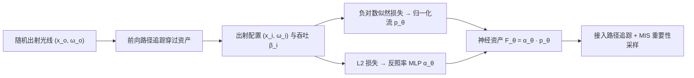

## 一句话总结

把一个 3D 资产内部的完整 8D 光传输（含次表面散射、光泽互反射、纤维散射等复杂效应）用归一化流预烘焙成可跨渲染器复用的神经资产，并用"分布学习"而非回归来训练，从而在近场光照下也能准确重建、并显著降低渲染方差与耗时。

## 研究背景

- 领域现状：高保真 3D 资产常带有很难渲染的全局光照效应（折射边界内的多次散射、光泽互反射、毛发/织物的细尺度纤维散射等），这些效应路径长、蒙特卡洛模拟昂贵，而且不同渲染器里实现难以一致对齐。近年出现一条思路——把资产内部的光传输预先烘焙进一个可重光照的神经网络，从而更高效地渲染、也更容易在渲染器间迁移。
- 核心痛点：现有的预烘焙方法（Mullia 等、Tg 等）都把光传输压成 6D 函数 $$F'(x_o, \boldsymbol{\omega}_o, \boldsymbol{\omega}_i)$$，其本质假设是远场光照（入射光只依赖方向、不依赖入射位置）。这在近场光照下会失真：忽略入射位置 $$x_i$$ 会高估阴影区域的入射辐射、丢失遮挡效应。真正完整的光传输是 8D 函数 $$F(x_o, \boldsymbol{\omega}_o, x_i, \boldsymbol{\omega}_i)$$，但它既难压缩，其查询又极难低方差估计——尤其是高度镜面的边界、纤维、前向散射相函数这些"最有意思"的场景，直接用回归损失几乎训不动。
- 本文 idea：不去直接回归难以估计的 $$F$$，而是把它拆成一个条件分布 $$p(x_i, \boldsymbol{\omega}_i \mid x_o, \boldsymbol{\omega}_o)$$ 和一个归一化因子（方向相关反照率）$$\boldsymbol{\alpha}(x_o, \boldsymbol{\omega}_o)$$，用归一化流学分布、用 MLP 学反照率。关键洞察是：采样 $$F$$ 就等于对资产做一次不带 next-event estimation 的普通前向路径追踪，非常廉价，因此可以用"前向路径样本"来做分布学习，梯度是对 $$F$$ 的简单积分、天然被路径采样重要性采样，方差远低于回归。

## 方法

整体框架：给定一个由表面/体积/纤维等构成、被 2D 边界包裹的非发光资产，模型把它内部的完整光传输 $$F$$ 分解为 $$F_\theta = \boldsymbol{\alpha}_\theta \, p_\theta$$。训练时向资产随机投射出射方向的光线，让它在资产内经历表面散射、介质散射、null 散射与俄罗斯轮盘赌直到离开资产；用出射光线的配置 $$(x_i, \boldsymbol{\omega}_i)$$ 与吞吐 $$\boldsymbol{\beta}_i$$ 计算负对数似然损失（训练分布 $$p_\theta$$）和 L2 反照率损失（训练 $$\boldsymbol{\alpha}_\theta$$）。推理时把这个神经资产接入标准路径追踪管线，用其分布做重要性采样。

关键设计：

1. 分布学习的训练目标。分布 $$p_\theta$$ 通过最小化负对数似然来学，且可改写成"以 $$-\log p_\theta$$ 作为入射光去渲染资产"的形式，于是能用和路径追踪一样的无偏估计器来估计：$$L_p(\theta \mid x_o, \boldsymbol{\omega}_o) = \mathbb{E}_n[-\boldsymbol{\beta}_i \log p_\theta(x_i, \boldsymbol{\omega}_i \mid x_o, \boldsymbol{\omega}_o)]$$。反照率则是"在单位常数光照下渲染资产"，即吞吐的平均 $$\boldsymbol{\alpha}_\theta = \mathbb{E}_n[\boldsymbol{\beta}_i]$$，用 L2 拟合。相比回归需要几千 spp 才能估出 $$F'$$（1 spp 直接失败），本方法每条出射光线只要 1 个样本就能收敛，这是能在 8D 高维下训得动的根本原因。

2. 入射变量的欧氏参数化。$$x_i$$ 定义在资产边界、$$\boldsymbol{\omega}_i$$ 在球面上，都不适合标准欧氏归一化流。作者沿 $$\boldsymbol{\omega}_i$$ 把 $$x_i$$ 映射到资产轴对齐包围盒上的交点 $$u_i$$（并带上相应的雅可比修正），再把 $$u_i$$ 和 $$\boldsymbol{\omega}_i$$ 编码到局部空间的柱坐标（避免球坐标在极点的奇异性）。这个映射在"入射光来自资产凸包外"的假设下是一一对应的。

3. 向量值自回归归一化流。分布按 $$p_\theta(s \mid x_o, \boldsymbol{\omega}_o) = \prod_{j=1}^{4} p_\theta(s_j \mid s_{k \lt j}, x_o, \boldsymbol{\omega}_o)$$ 自回归构造，每个条件因子由一个 MLP 预测的有理二次样条（rqs）实现，可同时用于 pdf 评估与采样。与只输出标量密度的常规流不同，这里的流是 RGB 向量值的，每个样条参数对三个颜色通道各编码一条样条。自回归结构还带来 $$p_\theta(u_i, \boldsymbol{\omega}_i \mid \cdot) = p_\theta(u_i \mid \cdot)\,p_\theta(\boldsymbol{\omega}_i \mid u_i, \cdot)$$ 的分解，便于推理时做多重重要性采样（MIS）。

4. 直接散射分离。半透明物体的边界往往有很尖锐（接近 delta）的直接散射，与内部平滑的体散射行为差异极大，单网络难以同时拟合。作者把（余弦加权的）直接 BSDF 项 $$f$$ 保留为解析计算，网络只学间接传输 $$F - V f$$（$$V$$ 为自遮挡），实现上只需对"一次散射即离开资产"的路径样本置 $$\boldsymbol{\beta}_i = 0$$。推理时解析地评估 $$Vf$$（通常很便宜），显著提升与参考的匹配精度。

网络与训练细节：分布网络含 4 个 MLP（各 4 隐藏层、128 特征、ReLU），每 RGB 通道 32 个样条结点；反照率 MLP 为 2 隐藏层。$$x_o$$ 用 triplane 特征网格编码、$$\boldsymbol{\omega}_o$$ 用 cubemap 网格编码。训练数据在线路径采样生成（1 spp）存入约 15GB 的缓冲区、耗尽即重新生成，用 Adam 训练 240K 步。实现基于 PyTorch + Mitsuba 3，pdf 采样/评估用自定义 CUDA 核。

## 实验结果

在 10 个资产（Candle、Milk、Cat、Seal、Dragon、Bunny、CurlHair、Hair、Fabric、Teaset）上，与标准路径追踪（PT）和远场基线（Far-field）对比重建精度、方差与速度。下表为近场光照下的重建误差（$$100\times$$MSE，越低越好），本方法在全部资产上都优于远场基线：

| 资产 | Far-field | Ours |
|------|-----------|------|
| Candle | 5.760 | 2.855 |
| Milk | 0.430 | 0.156 |
| Cat | 0.162 | 0.009 |
| Seal | 0.065 | 0.057 |
| Dragon | 0.505 | 0.182 |
| Teaset | 0.707 | 0.075 |

其余结论用文字概述：远场基线因预积分掉 $$x_i$$，方差最低、推理约快 2 倍，但光传输有偏、在近场下丢遮挡、无法重现强视角相关效应（如茶具/镜中猫的互反射）。相比 PT，本方法在带体积内部、无法靠 emitter sampling 降方差的资产上方差降低明显，等时渲染约快 2–20 倍（体积资产）、1.4–4 倍（细尺度表面散射如 CurlHair/Hair/Fabric）；简单资产（Teaset）三种方法都很快、优势不大。训练上，本方法数据生成快得多（1 spp 在线 vs 远场几千 spp），综合训练在体积资产上快约 3 倍、表面资产约 1.1 倍。消融显示：缩小网络会更快但误差更高；去掉直接散射分离会掉质量；包围几何越紧（凸包 < 包围盒 < 包围球）方差越低，但作者为实现简单选用包围盒。方法还可扩展到无实体边界的纯体积资产（如 Cloud）。

## 亮点与局限

- 亮点：
  - 把难以直接回归的完整 8D 光传输，转化为"用前向路径样本做分布学习"的问题，梯度天然被重要性采样、单样本即可训练，优雅地绕开了高维强峰值光照下的方差难题。
  - 学到的表示可被重要性采样，且采样分布按构造精确正比于光传输，能自然融入标准路径追踪管线并做 MIS。
  - 真正建模近场光照，正确重现远场方法丢失的遮挡与视角相关效应；且对长散射路径的高反照率资产带来实打实的方差/时间收益。

- 局限：
  - 每个资产在孤立状态下预烘焙，内部散射被凸包界定；插入新场景时若有其他物体侵入其凸包（如遮挡板伸进内部）就会失真，需要靠凸分解逐块烘焙来缓解。
  - 目前未对 $$x_i$$ 做 MIS，在点光等小发光体下方差会偏高。
  - 归一化流评估比 MLP 慢（远场足够准时 MLP 仍更划算），且其对平滑分布的归纳偏置使其难以重现高频现象，如复杂形状间的镜面互反射、焦散与闪光。

## 延伸思考

这项工作把"神经预烘焙资产"从远场推进到近场，思路上和把渲染方程某一项交给分布学习/路径引导的谱系一脉相承，只是把学习目标换成了整个资产的 8D 传输算子。分布学习替代回归的核心价值在于"采样容易、直接评估难"这一类问题——凡是能被前向蒙特卡洛无偏采样、但逐点评估方差爆炸的量，都可能套用同样的负对数似然 + 反照率分解框架。值得追问的方向包括：如何对 $$x_i$$ 也引入 MIS 以支持点光/小光源；如何缓解归一化流对高频（镜面互反射、焦散）的能力欠缺，也许结合子流形采样或显式镜面项分离；以及凸包假设的松弛——若能支持资产间的相互侵入与嵌套，这类神经资产才能更自由地组合进复杂场景，向作者展望的实时全局光照落地。
