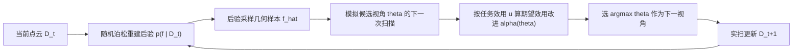

## 一句话总结

把"下一步该从哪个视角扫描物体"这个问题，用贝叶斯决策理论重新表述，让相机选择直接服务于下游任务（分类、分割、物理仿真），只在"对任务真正重要"的区域降低不确定性，而不是像传统方法那样均匀地把整个物体扫清楚。

## 研究背景

- 领域现状：从点云做表面重建、以及在序列扫描中挑选"下一最佳视角"（Next-Best-View, NBV）是图形学与视觉里的经典问题。已有方法从早期基于体素的信息增益启发式，发展到近期基于神经辐射场的视角选择。近来随机泊松表面重建（stochastic Poisson surface reconstruction）与不确定几何建模的进展，让"用高斯过程刻画点云里的不确定性"变得可行且高效。
- 核心痛点：现有 NBV 方法几乎都是"任务无关"的——它们追求整体覆盖或全局均匀地降低几何不确定性。但实际应用往往不需要把物体完整重建出来，而只想确定某个具体事实（比如识别类别、分割出各部件、算一个物理量）。均匀降不确定性会把宝贵的扫描次数浪费在与任务无关的区域上。
- 本文 idea：把 NBV 选择套进贝叶斯决策理论的框架。先对隐式表面放一个先验分布，用随机表面重建得到后验分布，再用后验去推理"下一次扫描对任务收益的期望"。通过为不同任务设计不同的效用函数，让扫描只聚焦在对任务有区分度的位置。作者把这套思路类比于贝叶斯优化里的"期望改进"（Expected Improvement），并推广成"期望效用改进"。

## 方法

整体框架：给定当前已扫到的点云 $$\mathcal{D}_t$$，用随机泊松表面重建得到隐式表面的后验 $$p(f \mid \mathcal{D}_t)$$；对每个候选相机视角 $$\theta$$，从后验采样若干个可能的几何 $$\hat{f}$$，模拟"若从 $$\theta$$ 再扫一次会得到什么点云"，据此估计任务效用的期望增益；取增益最大的视角作为下一视角，实扫后更新数据，循环进行。

关键设计分为三点：

1. 期望效用改进采集函数。核心是把贝叶斯优化里的期望改进推广到扫描场景。定义效用函数 $$u: \mathcal{D} \to \mathbb{R}$$ 描述一份部分扫描对当前任务有多有用，采集函数写作

$$\alpha^{(u)}_{f \mid \mathcal{D}_t}(\theta) = \mathbb{E}\left[\max\left(0,\; u(\mathcal{D}_t \cup \mathrm{scan}(\theta; f \mid \mathcal{D}_t)) - u(\mathcal{D}_t)\right)\right]$$

由于 $$f$$ 未知无法直接算真实效用，就用后验分布模拟"可能发生的观测"，对采样的表面求期望收益。这个期望一般没有闭式解，用蒙特卡洛采样近似（依赖能生成后验函数样本的随机模型，几何随机泊松重建通过 pathwise conditioning 天然支持）。

2. 模型无关 + 两种视角优化策略。框架不绑死具体重建模型，任何能给出后验随机样本的贝叶斯表面重建方法都能接入；本文以能"一次求解"得到后验的几何随机泊松重建为主要构件。优化采集函数有两条路：一是离散候选搜索，在包围球上用 Fibonacci 格点撒 120 个候选相机，从中选最优（简单、任务无关地生成候选池，作者推荐作为默认）；二是多起点梯度优化，用自动微分在完整位姿空间里优化，支持 2-DOF（约束在包围球看向原点）和 6-DOF（6D 连续旋转表示 + 平移）两种参数化。

3. 三类任务专属的效用/采集函数。这是"任务特定"的落脚点：
   - 分类：既可用分类器 softmax 输出的负香农熵作为效用（期望熵减 $$\alpha^{(E)}$$），也可用当前与未来预测分布之间的期望交叉熵 $$\alpha^{(CE)}$$，后者直接鼓励"能改变当前预测"的视角，避免分类器过早陷入过度自信的错误状态。
   - 分割/部件发现：用 tanh 饱和的软计数效用 $$u_S(\mathcal{D}) = \sum_c \tanh\!\left(\frac{1}{N_{\text{target}}}\sum_i p_{ic}\right)$$，某部件被"发现"充分后收益饱和，从而把注意力推向尚未发现的语义区域。
   - 物理仿真（热扩散）：以隐式欧拉离散热方程，效用取"仿真最低温度的相反数" $$u_H(\mathcal{D}) = -\min(\boldsymbol{u}(T))$$，引导相机去扫那些作为散热汇、或与热源热隔离的关键结构（如桌子底面、椅子连接处）。
   - 此外还给出基于单向 Chamfer 距离的覆盖式采集函数，说明传统任务无关的重建目标也能纳入同一框架。

## 实验结果

在分类、分割、热扩散三类下游任务上与三个基线对比：最远点采样（FPS）、不确定性降低（UR，用同样的随机模型但选几何不确定性最大的视角）、随机搜索。分割任务的主实验最能体现"任务特定"的价值——统计在不同 $$N_{\text{target}}$$ 阈值下、发现物体全部部件所需的平均相机数（越少越好，80 个测试形状）：

| 方法 | $$N_{\text{target}}$$=20 | =40 | =60 | =80 | =100 |
|------|------|------|------|------|------|
| Ours (Search) | 2.93 | 3.16 | 3.43 | 3.67 | 3.75 |
| Ours (Gradient-2DOF) | 2.81 | 3.04 | 3.28 | 3.59 | 3.87 |
| Ours (Gradient-6DOF) | 2.70 | 3.11 | 3.43 | 3.69 | 3.95 |
| FPS | 2.91 | 3.30 | 3.65 | 3.85 | 4.11 |
| Uncertainty | 3.25 | 3.31 | 3.54 | 3.71 | 4.13 |
| Random | 3.29 | 3.42 | 3.65 | 3.93 | 4.10 |

可以看到本文方法在各阈值下普遍用更少视角就发现全部部件，且优势随 $$N_{\text{target}}$$（对部件完整度要求）提高而扩大，说明它能主动瞄准像摩托车头灯、手袋提手这类占面积小却语义关键的部件。

分类实验用 first hit time（首次预测正确的步数）与 stable hit time（此后一直保持正确的步数）两个指标。在 ModelNet10 这种靠全局结构就能区分类别的数据上，本文方法与 FPS 等覆盖式启发式相当；但在专门构造的、必须看局部判别特征才能分类的 Synthetic Pyramid（图案印在金字塔底面）和 Truck-ModelNet10（货物随机摆在卡车货斗里）上，本文（尤其交叉熵采集）显著领先，早期步骤（如 $$t=2$$）差距明显。离散搜索与梯度优化差距不大，作者据此推荐离散搜索作默认。热扩散任务上（仅用离散搜索，因点云拉普拉斯算子不可微），本文能在更少视角内解出物体连通结构，得到更准的温度场与热极值点估计。

## 亮点与局限

- 亮点：
  - 首个把贝叶斯决策理论系统性用于"任务特定 NBV 选择"的工作，把 NBV 与贝叶斯优化的"期望改进"做了漂亮的类比与推广。
  - 框架高度模块化：效用函数可任意替换，采集函数模型无关，能覆盖分类、分割、物理仿真乃至传统覆盖式重建等多种目标。
  - 在需要局部判别特征的场景里，用更少扫描次数拿到更好的任务表现，验证了"只在重要处降不确定性"的价值。

- 局限：
  - 效用函数会与上游模型的错误产生不良交互——作者自己指出，若初始扫描给出高置信但错误的预测，基于熵的采集会过早停止探索（交叉熵可缓解），说明效用函数必须谨慎设计。
  - 依赖高斯过程 / 随机泊松重建这一类模型，后验采样与蒙特卡洛期望估计带来计算开销。
  - 主要在物体级扫描上评测，场景级、以及非相机式扫描（如 FMRI）尚属未来工作；热扩散任务受限于点云拉普拉斯不可微，只能用离散搜索。

## 延伸思考

这套"用后验分布模拟未来观测、再按任务效用打分"的思路，本质是把主动感知（active perception）与贝叶斯实验设计统一了起来，和贝叶斯优化、信息论采集函数（如 Predictive Entropy Search）、Gittins 指数等决策工具有直接血缘，未来可替换成能表达更丰富不确定性的模型类别。值得追问的方向包括：如何把框架扩展到需要扫描内部结构的场景级设置、如何设计对上游模型误差更鲁棒的效用函数，以及能否推广到点云之外的更一般几何处理任务。对做重建 / 主动视觉的读者，这里"任务驱动的不确定性量化"是一个可直接借用的建模范式。
