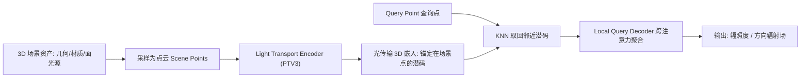

## 一句话总结

本文用一个基于 Transformer 的点云编码器，把整个 3D 场景（几何、材质、面光源）编码成"锚定在场景点上的潜码"——即可跨场景泛化的 3D 光传输嵌入，进而**不依赖任何光栅化或路径追踪的光照线索**、直接从场景配置预测全局光照，且天然视角与分辨率无关。

## 研究背景

- 领域现状：神经全局光照近年有两条路线。一条是**逐场景优化**的前向网络（把光照计算缓存复用），另一条是想做**跨场景泛化**的方法，但后者大多停留在 2D 屏幕空间——要么是神经降噪，要么是从 G-buffer 推断着色。
- 核心痛点：2D 屏幕空间方法先天缺乏三维空间理解，容易产生**视角不一致**，也无法处理屏幕外几何对全局光照的贡献；而逐场景优化的方法**不能泛化**，换场景就得重训。
- 本文 idea：把光传输搬回**世界空间的 3D 表示**上学习。作者观察到光传输算子 $$l_{out} = (I-T)^{-1} l_e = l_e + T l_e + T^2 l_e + \cdots$$ 本质是"每个位置向所有其他位置累积贡献"，这与 Transformer 的注意力机制（每个 query 对所有 key 打分并聚合）高度类比。于是用可扩展的点云 Transformer 去隐式建模这个"全场景多次弹射"的长程交互。

## 方法

整体框架分三段：先把场景采样成带属性的点云（Scene Points），用 **Light Transport Encoder**（点云 Transformer）编码成锚定在点上的潜码集合（即光传输嵌入）；渲染时对每个查询点（Query Point）用 KNN 取回邻近潜码，再经 **Local Query Decoder** 的跨注意力自适应聚合，输出所需渲染量（辐照度或方向辐射场）。整条链路端到端可微，用场景中采样点的真值渲染量监督。

关键设计：

1. **点云作为中间表示**：相比 2D 图像格式，点云可按重要性调整密度（可扩展）、与原始几何解耦（可用于扫描数据）、且比网格更好处理（无连接关系）。尤其把面光源也统一表示为点云，使方法对光源类型和数量不敏感，也能捕捉近场光照效果（而非只用环境贴图这类远场近似）。

2. **可扩展的 Light Transport Encoder**：一个场景约需 $$M \approx 20K$$ 个点，原始 Transformer 的自注意力是平方复杂度、要存 $$M \times M$$ 的注意力图，不可行。作者用 **Nearest Neighbor Embedding**（最远点采样把点数减半、再用 KNN 差向量聚合邻域）先得到稀疏而信息完整的嵌入，再交给 **PointTransformerV3** 骨干（点云序列化 + patch 注意力），把感受野高效扩展到 1024 点，兼顾长程交互与内存/延迟。

3. **Local Query Decoder 的向量跨注意力**：查询点先编码位置/法线/材质，用 KNN 取回邻近场景潜码。作者不用标准点积注意力，而用**向量跨注意力**——以减法作为关系函数，对 value 的每个通道计算独立注意力分数（而非把特征维塌缩成标量），增加特征交互多样性；并把查询点与邻居的相对距离 $$\Delta \mathbf{p}_{j\kappa} = \mathbf{p}_j - \mathbf{p}_\kappa$$ 编码后同时加进注意力和 value 矩阵。这一步的"可学习局部聚合"是恢复质量的关键（消融显示朴素 KNN 池化会掉点）。

4. **可复用编码器 + 任务专属解码器**：编码器在大规模漫反射场景上按辐照度预测预训练后，**冻结编码、只微调解码**，用很少的迭代就能切换到新任务——例如预测空间-方向入射辐射场以支持光泽材质。损失用对数空间的相对 L2。

## 实验结果

主实验是在测试集上做**漫反射全局光照的辐照度预测**，与三个代表性基线在 105 个随机测试场景上比较 MSE 和 SSIM。注意 Deep Shading 因无法泛化，是把测试场景放进训练集后的"过拟合"结果；Path Tracing 用 64 spp（对齐实时预算）作参考。

| 方法 | MSE ↓ | SSIM ↑ | 说明 |
|------|-------|--------|------|
| 本文 | 0.048 | 0.912 | 无逐场景训练，直接泛化到未见场景 |
| Path Tracing (64 spp) | 0.051 | 0.425 | 低采样噪声大，SSIM 反而低 |
| Deep Shading (过拟合) | 0.071 | 0.882 | 屏幕空间，泛化差 |
| Improved Hermosilla et al. | 0.171 | 0.775 | 点卷积难以学复杂场景 |

其余实验用文字概述：模型对**光源移动、非发光物体移动、材质编辑**都能在无逐场景重训下正确更新间接光照与阴影，且视角一致性由 3D 内部表示天然保证。光泽材质上，学习到的神经方向基比球谐（SH）更能表达高频反射——低阶 SH 过度平滑、高阶引入振铃伪影，本文重建误差更低。此外把预测的方向辐射场经 CDF 逆变换用于**路径引导初始化**，在 2 spp 等低采样下显著降噪，可为需要逐场景优化的现代路径引导方法解决"冷启动"问题。消融中，去掉 Local Query Decoder（改朴素 KNN 池化）MSE 从 0.048 升到 0.084；KNN 邻居数 k=32 是质量与开销的平衡点；每场景 2M 查询点、20k 输入场景点是较优配置。

## 亮点与局限

- 亮点：
  - 首个只用 3D 场景配置、**不依赖任何光栅化/路径追踪光照线索**就能跨场景泛化预测全局光照的方法，天然视角与分辨率无关、多视角一致。
  - 光传输与注意力机制的类比既提供直觉、又指导了架构设计，注意力热图能可视化对某着色点贡献最大的场景区域（近似对应多次弹射）。
  - 共享预训练编码器 + 可插拔任务解码器的设计，让辐照度、光泽方向辐射场、路径引导初始化多任务复用同一嵌入；整条链路可微，利于反向渲染。
  - 将发布约 1.4 万个室内场景的大规模数据集（PBRT 格式、含真值辐照度），作为学习光传输的 benchmark。

- 局限：
  - **尚未达到实时**：编码 208ms（可跨帧摊销）、512×512 解码 368ms，作者也承认还不是路径追踪的即插即用替代品。
  - 领域受限：主要在室内漫反射场景验证，光泽材质与路径引导仅为初步结果；完全分布外场景（如户外、"半开门"跨房间光照）会有域偏移。
  - 存在**颜色偏移与光泄漏**伪影（如地毯下被遮挡的黑点污染边缘潜码），需靠增大 k 或采样时排除全遮挡区域缓解；训练光照配置较固定，对新光源位置只是"泛化尚可"。

## 延伸思考

这项工作把"缓存/预计算辐射传输（PRT、辐照度缓存、辐射缓存）"的思路推进到了**跨场景泛化的神经版本**：不再逐场景存标量或拟合网络，而是学一个可迁移的世界空间嵌入。它与并行工作 Zeng et al. 形成互补——后者用全局 Transformer 作用于网格顶点、在受控 Cornell box 里做光泽出射辐射，受限于小网格；本文则面向密集点云、复杂室内场景，预测的是 3D 中的入射辐射场。值得追问的方向包括：把点锚潜码与多分辨率哈希网格结合以提速与提分辨率；用自定义 CUDA 融合注意力核 + 模型蒸馏冲实时；以及借助其可微性做反向渲染与场景重建。作者最后点出的"用 Tensor Core 部分替代 RT Core"是个有想象力但仍待验证的愿景。
