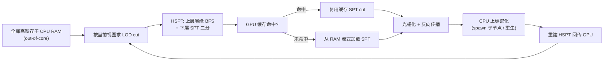

## 一句话总结

不切块（no partitioning）地在**单张消费级 GPU（≤24GB 显存）**上训练并交互渲染 150M+ 高斯的超大场景：把完整场景放在 CPU 内存里 out-of-core 存储，直接训练一个可动态演化的 LOD 层级，并用"层级 + 序列点树（SPT）"的混合结构 HSPT 做高效视点相关的按需流式加载。

## 研究背景

3D Gaussian Splatting（3DGS）用一组显式各向异性高斯表示辐射场，兼顾高画质、快收敛与实时渲染，是无界场景新视角合成（NVS）的主流方法。但把它扩展到城市级大场景时，显存是根本瓶颈：标准 3DGS 每个高斯连同优化器状态约需 800 字节，意味着每 GB 显存只能容纳约 50 万个高斯。

现有大场景方案几乎都靠**分块（chunking）**：把场景切成若干小块独立训练再合并。作者指出这种做法有三类固有缺陷：

- **视图-分块错位**：相机视野常跨越多个块，尤其在航拍 + 街景混合的多尺度采集里，块边界相对图像变得任意，从而产生 chunk bleeding（高斯越界遮挡邻块）与 chunk ghosting（训练图里的遮挡物被错误训练进不含它的块）。
- **冗余重叠**：为压制边界瑕疵，相邻块常大幅重叠训练，重复的参数与优化器状态增加显存并拖慢训练。
- **硬件需求不对称**：分块虽降低训练显存，但渲染时所有可见块必须同时驻留显存，往往超过训练配置本身的容量，抵消了分块的实际收益。

本文主张最稳的替代方案就是**根本不切块**，转而用 out-of-core 存储 + 视点相关流式加载在单卡上完成端到端的超大场景重建与渲染。

## 方法

核心思路：全部高斯属性存 CPU RAM，按当前训练视图沿 LOD 层级只把需要的高斯流式送进 GPU。为让"选取当前视图所需高斯"（即层级 cut）足够快，显存里只保留一份树结构副本，并把较大的子树替换为序列点树（SPT），构成混合结构 **HSPT**。稠密化在 CPU 上进行（新增叶节点、重生低不透明度叶节点），每次稠密化后重建 HSPT 再传回 GPU。

### 高斯层级与序列点树（SPT）

沿用 H-3DGS 的高斯层级：递归合并邻近高斯成树，非叶节点近似其孩子，叶节点是原始高斯。给定视角，一个"cut"（切割集）就是一层视点自适应的 LOD——它不含任何已选节点的父或子。H-3DGS 用相机距离作为切割条件，其中每个高斯的最小可视距离为

$$m_d(i) = \frac{T}{\max_j s^j_i}$$

$T$ 是全局 LOD 阈值。序列点树（SPT）源自点云 LOD 渲染，可平凡推广到椭球/高斯，用一个更受约束但可**完全并行**的条件：

$$c_{\text{SPT}}(i,\text{cam}) = m_d(\text{parent}(i)) > \left\lVert \boldsymbol{\mu}_{\text{root}} - \mathbf{p}_{\text{cam}} \right\rVert_2 \ge m_d(i)$$

它对整棵 SPT 共享"根到相机"的距离，只需存排序后的 $(m_d(i), m_d(\text{parent}(i)))$ 对，用二分查找定位截断下标即可选出一层 cut，内存与计算都远省于完整层级。为避免因整棵 SPT 用同一个根距离而选到过粗的高斯，定义保守下界 $M_d(i) = m_d(i) + \lVert \boldsymbol{\mu}_i - \mathbf{p}_{\text{cam}} \rVert_2$，由三角不等式保证选取正确。SPT 最适合"彼此间距小、从远处观察"的紧凑高斯簇。

### 训练中动态稠密化

难点在于 LOD 层级必须在训练中持续演化，而以往方法都把层级构建放在分块训练完成之后。作者借鉴 3DGS-MCMC 的"分裂"思想：不是分裂高斯，而是给一个高斯**spawn 两个子节点**，使层级平滑增长、瑕疵最小，从而避免 H-3DGS 在大场景上直接建层级时的不稳定。删除也改为"重生"：叶节点死亡时用其兄弟节点替换父节点，死叶及其父随后作为孩子重生到另一个待稠密化的节点上。选取待稠密化高斯沿用 H-3DGS 的**最大屏幕空间梯度**判据，比 3DGS-MCMC 的按不透明度随机选取更契合大场景的视点相关重建误差。

### 混合结构 HSPT

纯 BFS 求 cut 能保证正确切割且能提前剔除子树，但图遍历不适合 GPU 并行、规模大时极慢；H-3DGS 的并行 cut 依赖堆条件 $\forall i: m_d(i) < m_d(\text{parent}(i))$，而训练中层级被不断修改会破坏该条件，导致无效 cut 与逐渐退化的层级。

HSPT 兼取两者之长：先按体积阈值用 BFS 切割 $c_{\text{HSPT}}(i) = s^1_i \cdot s^2_i \cdot s^3_i < \text{size}$，把层级分成**上层层级**（体积大于阈值）与若干**下层子树**；每个下层子树体积被 size 上界约束，可安全转成 SPT。cut 分两步：上层 BFS 选出所需节点与 SPT 子树，再对每个选中的 SPT 按根距离二分切割。由于最小距离 $m_d$ 在优化中变化缓慢，HSPT 只在每次稠密化后重建，因而可用更精确（但更贵）的度量——椭球表面积的平方根倒数：

$$m'_d(i) = \frac{T}{\sqrt{s^1_i s^2_i + s^1_i s^3_i + s^2_i s^3_i}}$$

它更好地刻画各向异性（尤其被拉长）高斯的感知尺寸。BFS 中还对每个节点做视锥剔除（用半径 $3 \cdot \max_j s^j_i$ 的包围球），显著减少从 RAM 加载的高斯数。

### GPU 缓存与视图调度

从 RAM 加载高斯代价高。作者不缓存单个高斯，而是缓存 SPT cut 及其"根到相机"的距离 $\bar{d}_j$。渲染时算出 $d_j = \lVert \boldsymbol{\mu}_{\text{root}(j)} - \mathbf{p}_{\text{cam}} \rVert_2$，用距离比容差判断是否复用缓存：

$$D_{\min} \le \frac{d_j}{\bar{d}_j} \le D_{\max}$$

命中即免去一次 RAM→GPU 传输。缓存用 LRU 写回策略限界显存，每 1000 次迭代整体清空以防过拟合。为提高命中率，作者在所有训练视图位置上预计算 $k$ 近邻图，下一个训练视图从当前视图的 $k$ 近邻中按 $P(j \mid i) \propto \frac{1}{w_{ij} + W}$ 采样以利用空间局部性；同时每 128 次迭代注入一个随机视图以保持泛化、避免采样偏差。缓存带来的轻微 LOD 抖动反而抑制了对固定相机距离的过拟合。

## 实验结果

评测在单张 H200（141GB）上进行以便让基线跑完训练，渲染性能则在消费级 GPU（多数为 RTX 3090）上报告。数据集包括作者新采集的 Uni10k（Udine 大学校园，10k+ 张 4k 图，含航拍与街景）与扩展的 MatrixCity MC-small-city+（42.2k 图），以及 H-3DGS 与 OccluGaussian 的场景。超过 141GB 显存视为 OOM。

在最大的 MC-small-city+ 上，多个基线直接 OOM，本方法用远少的迭代数达到最佳质量：

| Method | PSNR↑ | SSIM↑ | LPIPS↓ | VRAM(render)↓ | VRAM(train)↓ | #iters↓ | #Gaussians |
|---|---|---|---|---|---|---|---|
| CityGaussian | 19.78 | 0.650 | 0.475 | 2.4GB | 4.1GB | 1.11M | 2.7M |
| HorizonGS | 12.06 | 0.521 | 0.544 | 20.6GB | 25.3GB | 2.5M | N/A |
| OctreeGS | OOM | OOM | OOM | OOM | OOM | OOM | OOM |
| H-3DGS† | OOM | OOM | OOM | OOM | OOM | OOM | OOM |
| CLM-GS | 15.68 | 0.584 | 0.523 | 18.7GB | 25.1GB | 600k | 24.2M |
| Ours | **21.59** | **0.711** | **0.396** | 16.4GB | 18.0GB | 600k | 136.7M |

在 H-3DGS 与 OccluGaussian 的场景上同样全面领先或持平：Campus（22.0k 图）PSNR 21.85（H-3DGS 仅 17.84，因合并阶段残留大 floater 遮挡了多数测试图）；Small City 24.61；室内 Canteen/Classbuilding 也优于分块类方法。在为混合航拍/街景专门设计并使用 GT 标签的 HorizonGS 主场 Uni10k 上，本方法无需额外监督即紧追 HorizonGS，并在两个 MC-city+ 场景上大幅反超。

消融显示：缓存把各场景帧率约翻倍（Campus 上把平均从 RAM 加载的高斯数减少 93%）；视锥剔除的收益随场景增大而放大（MC-small-city+ 平均剔除 2450 万高斯，降 88%）；HSPT 的 cut 时间稳定快于 BFS，且 BFS 在 MC-small-city+ 上因需全部位置/尺度驻留而超 24GB 显存，HSPT 峰值仅 21GB。60M 高斯的 SPT 元数据在显存中只占 680MB，上层层级仅 24MB。

## 亮点与局限

**亮点**：
- 首个**无需空间分块**的城市级 3DGS 框架，靠 out-of-core 存储 + 视点相关流式加载在单张消费级 GPU 上训练并交互渲染 150M+ 高斯，从根本上消除了 chunk bleeding/ghosting 等边界瑕疵。
- 提出训练中可持续演化的 LOD 稠密化（spawn 子节点 / 重生），不再依赖训练后再建层级。
- HSPT 把层级 BFS 的正确性/剪枝与 SPT 的并行高效结合，对训练中层级更新鲁棒；配合缓存与近邻视图调度显著压低 CPU-GPU 传输开销。
- 无缝训练带来更快收敛，所需迭代数远少于分治类方法。

**局限**：
- 这是性能与内存的折中：单次迭代因数据加载与层级管理开销比标准 3DGS 更慢；渲染帧率虽优于神经类与其它 out-of-core 方法，但仍不及完全驻留显存的 3DGS。
- 约每百万高斯需 1GB RAM，极大场景仍受限；改从磁盘加载可行但约 10× 变慢，需要高速二级存储。
- 当视距变化不大（如单一高度的航拍数据）时，LOD 机制反成多余开销，直接训练更划算。
- 视锥剔除在"整个场景都落在视锥内"时失效，未来可用遮挡剔除在加载前跳过整棵 SPT。

## 延伸思考

这篇工作的价值在于把大场景 3DGS 的思路从"空间分治"转向"层级化按需分页"——本质上是把经典图形学的 out-of-core / LOD 流式渲染（乃至 Nanite 式虚拟几何）迁移到可微高斯表示上，并解决了"层级必须在训练中动态维护"这一新问题。HSPT 用体积阈值把树切成"稳定上层 + 可批量并行的下层 SPT"，很像 GPU 数据结构里"粗粒度指针遍历 + 细粒度扁平数组"的经典权衡，值得在其它需要动态 LOD 的可微表示里复用。往后看，异步流式、每帧免重算 cut、以及遮挡剔除是把交互帧率推向真正实时的关键；而"每百万高斯 1GB RAM"的线性内存关系提示，若要迈向十亿级高斯，还需要更激进的压缩或分级存储层次。
