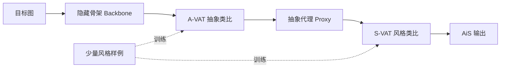

## 一句话总结

提出 Abstraction in Style (AiS)：把"结构抽象"从"视觉风格化"里显式拆出来，先用少量风格样例把目标图重新解释成一个抽象代理（proxy），再对代理做风格渲染，从而让风格迁移越过纹理与颜色、覆盖到几何与结构变形。

## 研究背景

- 领域现状：从 Gatys 的神经风格迁移到近年基于扩散模型的样例风格化（注意力调制、轻量适配器等），风格迁移在纹理、色彩、笔触层面已相当成熟。
- 核心痛点：这些方法几乎都**保留目标图的原始几何结构**。但插画与非真实感风格里，"风格"往往还包含对结构的刻意再解释——线条故意不规则、次要几何被抹平、对称被打破、比例被夸张。传统方法无法捕捉这种潜藏在参考风格里的"抽象逻辑"。
- 本文 idea：把风格化拆成两阶段——先做**结构抽象**（Structural Abstraction），再做**视觉风格化**（Visual Stylization）。抽象被当作一个可从样例学习、可迁移的显式过程，而不是和外观纠缠在一起的隐式副产品。

## 方法

整体框架：AiS 把风格化建模为串行两阶段。第一阶段把目标图重新解释为一张"抽象代理"图，它保留主体语义与拓扑但放松几何保真；第二阶段把这张代理渲染成最终风格图。两阶段共用同一个图像空间的类比机制 Visual Analogy Transfer (VAT)，形式都是 $$A \to A' :: B \to B'$$，无需显式几何监督。

关键设计：

- **隐藏骨架 (Hidden Backbone)**：一个剥离外观、退化几何但保留语义布局与拓扑的中间结构表示。构造分两步：先用分层图像矢量化把图像转成平色块的干净矢量路径，去掉纹理噪声；再对二值化形状做形态学骨架化（medial axis，迭代剥边得到两像素宽中心线），并对填充区域做形态学腐蚀。最终骨架取"骨架 + 腐蚀残留区域"的并集——单靠骨架会把粗壮部位退化成细线丢失体量，腐蚀残留补回了比例体积。

- **A-VAT（抽象阶段）**：学习 $$\text{Backbone}_r \to \text{Proxy}_r :: \text{Backbone}_t \to \text{Proxy}_t$$。参考集中每个样例的 proxy 由矢量化得到，并渲染成灰度以抹去颜色线索，逼模型从结构而非外观相关性中学抽象逻辑。训练样本由两个样例拼成一组结构类比，仅需 5 到 20 组。同一输入骨架换不同 A-VAT 会得到不同的 proxy。

- **S-VAT（风格化阶段）**：复用同一类比机制，学习 $$\text{Proxy}_r \to \text{Output}_r :: \text{Proxy}_t \to \text{Output}_t$$，把外观渲染行为迁移到目标代理上。它与抽象阶段形式一致，但作用在外观域而非结构域。

- **VAT 的具体实现**：把一次变换排成 2×2 布局图——上排是参考对 $$A \to A'$$，左下是新输入 $$B$$，右下 $$B'$$ 初始被 mask、由模型补全。底座用图像修复扩散 Transformer FLUX.1-Fill-dev，冻结主干、只微调轻量 LoRA 去内化该类比关系。A-VAT 与 S-VAT 各自训一个 LoRA，每个约 5 到 20 张 2×2 网格图（由 10 到 40 个样例组成）。因为抽象与风格用的是独立 LoRA，二者可自由组合：同一 S-VAT 配不同 A-VAT，输出外观一致但几何各异，反之亦然，实现结构与风格的解耦控制。

## 实验结果

在 10 种 Pinterest 设计风格、每风格 2 张目标图共 20 个测试样本上，用 CSD、Style FID、CLIP-I 三项风格相似度指标与主流基线对比。AiS 完整版在三项上均最优。

| 方法 | CSD ↑ | Style FID ↓ | CLIP-I ↑ |
|------|------|------|------|
| StyleID | 0.36 | 529.05 | 0.62 |
| Attention Distillation | 0.54 | 431.12 | 0.69 |
| StyleAlign | 0.22 | 511.59 | 0.61 |
| Nano Banana | 0.56 | 451.17 | 0.68 |
| AiS（完整） | 0.75 | 260.43 | 0.76 |

消融方面：去掉腐蚀区域线索会让 proxy 几何退化（如狗胸、企鹅身体结构受损）；把两阶段蒸馏成单阶段 AS-VAT（骨架直接到输出）会产生"空洞"、色彩溢出并死板贴合原几何；去掉抽象阶段（原图当 proxy）或只用矢量简化当 proxy，都无法重新解释结构、只会固守输入几何，量化上也全面落后于完整流程。用户研究中 61 名参与者在 20 个盲测样本里最偏好 AiS（50%），其次 Nano Banana（35%）、Attention Distillation（15%）；两位资深设计师认为基线"过于死板地贴合输入几何"，而解耦抽象与外观显著提升了风格保真度与可控性。

## 亮点与局限

- 亮点：
  - 概念上把"抽象"从"外观"里显式分离并当作可迁移过程，突破了风格迁移长期固守输入几何的局限。
  - 抽象与风格分别用独立 LoRA，天然支持自由重组，几何与外观可独立控制。
  - 统一的图像空间类比机制（VAT）同时支撑两阶段，纯图像空间操作，无需显式几何重建或几何监督，且每种风格仅需约 10 个样例。
- 局限：
  - 隐藏骨架缺乏语义感知，有时区分不了"被腐蚀出来的细线"与"天然就细的区域"，导致伪影。
  - 当前只是 AiS 范式的一种具体实现，形态学骨架 + 腐蚀较为朴素；面向强语义扭曲、夸张、刻意失衡的创造性抽象仍需更专门的抽象代理表示。

## 延伸思考

- 把抽象作为独立、可学习阶段的思路，本质是给"in-context / analogy"式生成加了一层结构先验，可能迁移到 3D 形状抽象、字体设计、图标生成等更依赖结构再解释的任务。
- 隐藏骨架若换成带语义感知的结构表示（如结合分割 token 或部件级先验），有望缓解"细线混淆"这类伪影，也让抽象强度更可控。
- 两个 LoRA 的解耦组合提示了一种"结构库 × 风格库"的可复用生成范式，值得追问它在更大样例规模或跨类目泛化下的稳定性。
