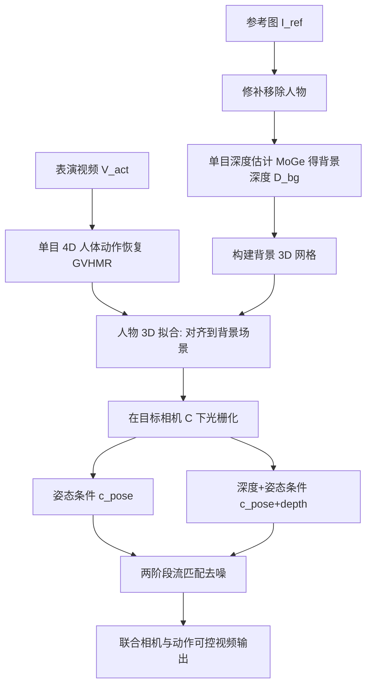

## 一句话总结

ActCam 是一个无需训练的推理期方法，让任意支持深度与人体关键点条件的图生视频扩散模型，能够在把驱动视频中人物动作迁移到新场景的同时，逐帧精确控制相机的内参与外参，从而实现"表演动作"与"运镜"的联合可控视频生成。

## 研究背景

在影视创作中，一个动人的镜头不仅取决于演员做了什么动作，也取决于相机如何运动（轨迹、视差、视角变化）。然而现有可控视频生成方法大多只能控制其中一项，同时精确控制表演动作与相机运动这一联合需求几乎无人涉足。

主流的动作控制方法依赖二维信号（如人体关键点）来条件化视频生成。这类方法在视角变化不大时有效，但在相机运动时会变得歧义：同一个二维信号可以对应多种三维动作，一旦相机旋转或平移，控制信号就不再自洽。最接近的工作 Uni3C 把运动中的三维人体表示与相机信息结合起来，实现了带运镜的人物表演视频，但它依赖一套定制架构和专门的微调。作者认为"必须为该任务训练专用模型"本身就是根本性局限：其一，微调过程昂贵且难以迁移到架构不同的新模型；其二，若一部影片里既用专用模型拍表演镜头、又用其他模型拍无需表演的镜头，会引入风格不一致，损害成片质量。

作者的核心判断是：当前这一任务的主要瓶颈在于缺少一个"相机对齐"的联合条件表示。ActCam 由此提出一个零样本框架，仅利用现成视频模型已有的稠密二维条件机制（深度与人体关键点），构造多模态、相机对齐的条件信号——包含在目标相机视角下编码表演动作的逐帧姿态图，以及在同一相机下提供粗略场景几何代理的逐帧深度图。三点贡献：提出训练无关的联合动作与相机轨迹控制方法；设计一条几何锚定的条件构造管线，通过参考人物移除、几何感知放置与深度对齐来对齐姿态与场景几何并防止静/动干扰；提出一个随去噪步数自适应调整条件信息的两阶段推理管线。

## 方法

### 整体框架

给定参考图 $$\boldsymbol{I}_{ref}$$（定义人物身份与环境外观）、表演视频 $$\boldsymbol{V}_{act}$$（提供目标动作）以及逐帧目标相机轨迹 $$\boldsymbol{C} = \{(\boldsymbol{K}_\tau, \boldsymbol{R}_\tau, \boldsymbol{t}_\tau)\}_{\tau=1}^{T}$$，ActCam 要生成一段视频 $$\boldsymbol{V}$$，使其身份与外观匹配参考图、动作匹配表演视频、每帧视角符合目标相机参数。骨干采用预训练的 VACE 模型，形式化为映射 $$f: \mathfrak{C} \to \mathcal{V}$$，把一组稠密的视频对齐信号转成视频序列。ActCam 只在推理期工作，保持骨干不变，把条件输入限定为元组 $$\boldsymbol{C} = (\boldsymbol{I}_{ref}, c_{pose+depth}, c_{pose})$$，其目标是从表演视频与目标相机联合导出几何一致的稠密条件。

### 相机对齐的条件构造

作者用深度作为几何先验：一旦在目标相机轨迹下光栅化，深度信号就把视角变化隐式转化为背景的表观运动。但直接用参考图深度会引入一个"静态人物"，与动态姿态信号冲突，导致输出中出现人物重影、冻结或违反动作/相机约束。

**参考人物移除与背景网格。** 用单目深度估计器 MoGe 从 $$\boldsymbol{I}_{ref}$$ 得深度并建三维网格；网格渲染比点云在相机运动下几何一致性更强。为消除静态人物干扰，先把参考图中的人物修补掉，得到只含背景的深度图 $$\boldsymbol{D}_{bg}$$ 及背景三维网格。

**场景迁移（scene transfer）。** 参考深度 $$\boldsymbol{D}_{ref}$$ 与背景深度 $$\boldsymbol{D}_{bg}$$ 是两次独立估计的，三维空间存在不一致，需要把人物正确注册到背景网格中。由于人物的尺度与像平面坐标由参考图强制给定，只需调整人物点的深度。利用不在掩码 $$M$$ 内的可靠对应像素，对靠近人物边界的点赋更高权重：

$$w(u, v) = \exp\left(-\mathrm{dist}(\boldsymbol{x}^{ref}_{u,v}, M)\right)$$

据此计算两套点集下人物的加权质心 $$\boldsymbol{p}_{ref}$$ 与 $$\boldsymbol{p}_{bg}$$，再假设人物相对质心的位置在一个全局深度缩放下保持不变，沿深度轴做仿射变换对齐。对任一参考深度为 $$z^{char}_{ref}$$ 的人物点，其在背景坐标系下的对齐深度为：

$$z^{char}_{bg} = \left(z^{char}_{ref} - p^{z}_{ref}\right)\frac{p^{z}_{bg}}{p^{z}_{ref}} + p^{z}_{bg}$$

该变换同时补偿尺度与平移错配，并通过重要性加权把人物与环境的邻近关系（如接触）纳入考虑。

**4D 动作恢复与人物拟合。** 用单目三维人体动作估计器 GVHMR 从 $$\boldsymbol{V}_{act}$$ 恢复逐帧关节状态 $$\boldsymbol{S}_\tau$$（SMPL 参数与根姿态）。三维状态相比二维关键点减少了深度歧义，在视角变化下更稳定。随后按 Uni3C 的做法，用 Umeyama 最小二乘在 $$\tau=0$$ 时刻估计参考图关键点与 $$\boldsymbol{S}_0$$ 之间的刚性变换，得到旋转 $$\boldsymbol{R}$$、平移 $$\hat{\boldsymbol{t}}$$ 与尺度 $$s$$，应用到整个姿态序列：

$$\hat{\boldsymbol{S}}_\tau = s \cdot \boldsymbol{R}\,\boldsymbol{S}_\tau + \hat{\boldsymbol{t}}$$

**光栅化控制信号。** 在目标相机 $$\boldsymbol{C}$$ 下把对齐后的骨架按 OpenPose 表示光栅化为姿态控制视频 $$c_{pose} = \mathcal{R}_{\boldsymbol{C}}(\hat{\boldsymbol{S}}_\tau)$$；把背景网格用 min-max 归一化灰度渲染并叠加姿态，得到联合的深度+姿态信号 $$c_{pose+depth} = \mathcal{R}_{\boldsymbol{C}}(\hat{\boldsymbol{S}}_\tau, \boldsymbol{D}_{bg})$$。

### 两阶段条件调度

单目深度往往粗糙且局部不准。只用姿态条件无法捕捉相机运动（模型会把相机运动误解为身体运动）；而全程同时用深度与姿态又会过度约束生成，导致背景僵死、深度伪影传入高频细节。作者据此设计一个随去噪时间步 $$t$$ 逐渐放松深度条件的调度，用截止阈值 $$t_{stop}$$：

$$c(t)_\tau = \begin{cases} \mathcal{R}_{\boldsymbol{C}_\tau}(\hat{\boldsymbol{S}}_\tau, \boldsymbol{D}_{bg}), & t \le t_{stop} \\ \mathcal{R}_{\boldsymbol{C}_\tau}(\hat{\boldsymbol{S}}_\tau), & t > t_{stop} \end{cases}$$

即早期高噪声步用"深度+姿态"锁定全局结构与视角变化，之后丢掉深度、仅用姿态精修高频细节；姿态信号来自三维动作恢复且已相机对齐，稳定可靠，故全程保留。

## 实验结果

骨干统一采用 VACE，各方法用相同分辨率、步数与调度器。动镜评测借鉴 Uni3C：选 4 种常见电影运镜预设，每预设在 RealisDance-Val 的 100 段参考片段上测（共 4×100）。指标包括 VBench 的主体一致性 (SC)、背景一致性 (BC)、外观保真 (AF)、成像质量 (IQ)、时序一致性 (TC)、运动平滑度 (MS)，以及衡量联合控制的 MPJPE、几何一致的 Sampson 误差 (SE)，还有 WorldScore 的三维一致性 (3D-C) 与物体控制 (OC)。在联合相机与动作控制上，ActCam 在与最接近基线 Uni3C 的对比中全面占优。

| 指标 | Uni3C | ActCam (Ours) |
| --- | --- | --- |
| VBench Average ↑ | 0.8370 | 0.8497 |
| SC ↑ | 0.9084 | 0.9212 |
| BC ↑ | 0.9380 | 0.9350 |
| AF ↑ | 0.5688 | 0.5767 |
| IQ ↑ | 0.6640 | 0.7212 |
| TC ↑ | 0.9607 | 0.9571 |
| MS ↑ | 0.9821 | 0.9872 |
| MPJPE ↓ | 0.2121 | 0.2087 |
| SE ↓ | 0.5665 | 0.4546 |
| 3D-C ↑ | 0.539 | 0.6304 |
| OC ↑ | 0.9878 | 0.9953 |

在静态相机设置下，与 9 个不含相机控制的强动作控制方法（Moore-AnimateAnyone、HumanVid、MimicMotion、Animate-X、Hyper-Motion、UniAnimate-DiT、VACE、Wan-Animate、SteadyDancer）比较 VBench，ActCam 以 Average 86.47 全面领先（例如 TC 从次优 98.78 提升到 98.88，AF 从次优 57.81 提升到 58.66，IQ 从次优 70.61 提升到 70.83），作者归因于三维条件对主体比例的正则化，缓解了二维关键点的骨骼形变与遮挡问题。17 名用户的 2AFC 主观研究中，ActCam 在相机贴合度、动作忠实度与视觉质量三项上均显著优于 Uni3C。

消融方面：深度条件步数比例 $$N_D$$ 存在权衡，取 $$N_D = 0.2N$$ 最优——过早切换会欠约束，过晚切换会把深度伪影传入高频；$$N_D=1$$（全程深度）会使背景僵死、动态物体无法跟随人物运动，$$N_D=0$$（仅姿态）则无法区分人物与相机运动。参考人物移除若缺失会因静态几何与动态条件干扰导致人物重影。场景迁移中，无对齐会产生不合理遮挡与布局撕裂，重要性加权优于均匀加权。

## 亮点与局限

亮点在于：完全零样本、推理期即可工作，可即插即用到任何支持深度与关键点条件的视频骨干，无需微调，因而能随骨干升级而受益、并与其他镜头共用同一模型保持风格一致；核心洞见"缺少相机对齐条件表示"被一条几何锚定管线优雅地填补——用背景深度网格把相机运动转化为背景表观运动，用三维人体恢复规避二维关键点的视角歧义；参考人物移除、几何感知放置、深度对齐三招协同防止静态几何与动态动作的相互干扰；两阶段调度巧妙化解了"深度约束几何"与"深度伪影污染细节"之间的矛盾。

局限在于：方法质量受制于前置模块（单目深度 MoGe、4D 人体恢复 GVHMR、分割修补）的鲁棒性，误差会传导到最终生成；深度只是粗略几何代理，对复杂遮挡与强视角变化仍可能出现布局问题；刚性变换拟合对非刚性运动只是近似；多人物场景需骨干本身支持，且对每个人物独立做场景迁移与动作拟合，扩展性受限。

## 延伸思考

这项工作最值得借鉴的是"不训练也能加控制"的思路：与其为每个新能力微调专用模型，不如深入理解骨干已有的条件接口，把新需求翻译成骨干"看得懂"的稠密信号。ActCam 把相机控制这一看似需要显式几何/Plücker 表示的任务，重新表述为"背景深度在目标相机下的光栅化"，从而复用了 VACE 本就具备的深度条件通道，这种"用现有条件表达新意图"的范式对快速迭代的生成模型生态尤其友好。

两阶段调度揭示了一个普遍现象：粗糙的几何先验在去噪早期是有益的骨架、在后期却是有害的枷锁，按噪声水平动态调整条件强度可能是许多"先验+生成"框架的通用改良方向。另一方面，整条管线由多个现成模型串联而成，其上限被最弱一环锁定，如何缓解这种多模块桥接的误差累积、或以更端到端的方式联合优化条件构造，是这类零样本组合方法共同面对的课题。
