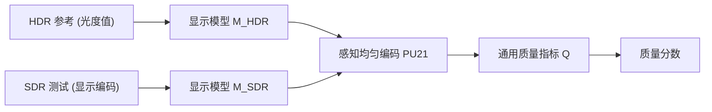

## 一句话总结

与其为色调映射（tone mapping）从头设计专门的质量指标，本文提出一套"适配"通用图像/视频质量指标的方法——先用显示模型把内容还原为绝对亮度，再用统一的感知均匀编码把 HDR 参考与 SDR 测试图映射到同一空间——就能让通用指标在色调映射质量评估上稳定超过现有专用指标。

## 研究背景

- 领域现状：色调映射把高动态范围（HDR）场景压缩到普通显示器能显示的标准动态范围（SDR），是 HDR 成像的核心环节。评估色调映射质量的黄金标准是主观实验，但成本高、无法覆盖现代算法的海量参数组合，因此人们希望用客观质量指标自动打分。
- 核心痛点：HDR 参考通常用绝对亮度（cd/m²，即 nits）线性表示，而色调映射后的 SDR 测试图是"显示编码"的（如 sRGB gamma、0–1 范围）。两者表示方式不同、亮度量级差异巨大，传统指标无法直接、准确地比较。已有的色调映射专用指标（建模对比度失真、结构保真、统计自然度等）大多只在小规模领域数据集上标定，且很少提供充分的定量证据证明其有效性，也几乎从不与通用指标比较。
- 本文 idea：不造新指标，而是修正 HDR 与 SDR 内容之间的"表示差异"。只要把参考与测试图都还原到光度域、再用同一个感知均匀传递函数编码到共享空间，现有 SDR 指标的预测精度就能大幅提升；同时对 HDR 指标 ColorVideoVDP 做一处修改，使其对绝对亮度变化敏感。整套方法无需重新标定、不引入额外参数。

## 方法

整体框架分两步：先用"显示模型"把显示编码的输入还原成绝对光度值（考虑显示器峰值亮度、对比度、EOTF、环境反光），再用感知均匀传递函数把 HDR 参考与 SDR 测试统一编码到指标可接受的共享空间，最后交给任意现成质量指标打分。指标本身被当作黑盒，所有操作都发生在"喂给指标之前"。

关键设计：

- **显示模型（display model）**：用增益-偏置-伽马（GOG）模型把显示编码值还原为光度值。对 SDR 显示，$$I = (L_{\max}-L_{\min}) \cdot P^{-1}(D) + L_{\min} + L_{\text{refl}}$$，其中 $$P^{-1}$$ 是 EOTF（如 sRGB），$$L_{\text{refl}}$$ 为环境反光；对 PQ 编码的 HDR 内容则直接 $$I = P^{-1}(D)$$。这一步是让不同拍摄/显示条件下的内容能在同一光度基准上比较。

- **统一感知均匀编码（DM + PU21）**：把还原后的参考与测试光度值都用同一个传递函数 $$P(\cdot)$$ 编码到共享的显示编码表示，再送入指标，即 $$q = Q(P(I_R), P(I_T))$$。作者比较了 Linear、$$\mu$$-law、PQ、PU21 四种编码，发现对参考与测试都用 PU21 编码效果最好。关键洞察是：必须把 SDR 与 HDR 用**同一**传递函数带到**同一**颜色空间；若只编码参考（$$q = Q(P(I_R), D_T)$$），两者用了不同 OETF，相关性明显更低。

- **ColorVideoVDP-tm（对视觉差异预测器的改造）**：原版 ColorVideoVDP 为性能起见只用参考图计算对比敏感度，因而对"曝光/绝对亮度变化"这一色调映射的关键失真不敏感。本文改为对参考和测试**分别**采样敏感度：$$C'_R(x,y) = C_R(x,y)\, S(L_R(x,y))$$、$$C'_T(x,y) = C_T(x,y)\, S(L_T(x,y))$$，其中 $$S(\cdot)$$ 是对比敏感度函数、$$L$$ 是局部背景亮度。改造后指标对亮度变化敏感、性能大幅提升，且沿用原参数、向后兼容，还能产出更好的误差可视化图。

- **新数据集与通用色调映射器**：作者构建了一个通用色调映射算子（曝光调整、色调编码、平滑截断、用双边滤波分离并分别压缩光照/反射分量、颜色重建五步），并据此收集了新的主观数据集（12 张 HDR 图 × 420 个条件，15 名被试，在 VESA DisplayHDR 1000 认证显示器上做成对比较），用于检验 Tumblin 关于"人对光照变化比对反射变化更宽容"的假设，以及色调映射指标能否用于优化参数。

## 实验结果

主实验是在 5 个色调映射质量评估数据集（LUNAM、Linköping、LIVE TM HDR、"What is HDR?"、本文数据集）上，用 5 种适配策略 × 53 个质量指标做 Spearman 秩相关评估（共 1325 个相关分数），跨数据集用 Fisher 变换求均值。下表按"适配策略/代表指标 × 跨数据集平均相关性"呈现核心对比结论（数值为定性排序，忠实反映原文趋势，原文以图形式给出）：

| 对比维度 | 结论 | 说明 |
|------|------|------|
| Linear 编码（仅编码参考） | 最差 | 低光度值被压进极窄编码区间 |
| PQ / PU21 / $$\mu$$-law（仅编码参考） | 中等 | 参考与测试用了不同 OETF |
| DM + PU21（参考+测试统一编码） | 最佳，远超其余 | 顺序为 Linear < PQ < PU21 ≈ $$\mu$$-law ≪ DM+PU21 |
| 专用色调映射指标（TMQI/FSITM/CIVDM 等） | 普遍偏弱 | 相关性多落在所有指标的后半段 |
| 表现最好的三个指标 | TOPIQ、DISTS、ColorVideoVDP-tm | 前两者是 SDR 上标定的深度特征指标 |

其余发现（文字补充）：误差型（e）与无参考（n）指标一贯表现最差；接受光度输入的指标（ColorVideoVDP-tm、ColorVideoVDP、HDR-VDP-3）在除 DM+PU21 外的策略中表现最好。光照 vs 反射的主观研究证实了 Tumblin 假设——降低反射对比会带来更大、更陡的质量下降，即人更容易忽略光照变化。指标优化研究还发现一个有趣现象：ColorVideoVDP 用于评估时表现不错，但直接拿它做参数优化时效果最差，说明"善于评估"和"优化地形好"是两回事。

## 亮点与局限

- 亮点：
  - 把指标当黑盒，所有适配都在输入端完成，任何新指标都能一键适配到色调映射评估，工程上极简且通用。
  - 无需重新标定、不加参数，ColorVideoVDP-tm 与原版共享参数、向后兼容。
  - 提供了迄今较系统的大规模评估（53 指标 × 5 数据集 × 5 策略），并给出一个可复用的评估协议与新数据集。
  - 明确指出"用同一传递函数把 HDR/SDR 带到同一空间"是提升相关性的关键，结论清晰可操作。

- 局限：
  - 方法依赖对显示参数（峰值亮度、对比度、反光）的准确假设；许多评估数据集未记录显示配置，作者只能假设默认参数，可能影响精度。
  - 主观数据集规模有限（12 张图），且部分数据集（如仅 35 段视频的 Linköping）上跨指标一致性较差。
  - 只处理了色调映射引入的亮度/对比失真类问题，对空间/时间上更复杂、内容相关的失真建模仍有限。
  - "通用指标超过专用指标"是相关性意义上的结论，不代表在所有具体失真类型上都更优。

## 延伸思考

这项工作的价值不只在色调映射本身，更在于提出了一种"用显示模型 + 感知均匀编码统一表示"来复用现有指标的范式。作者指出该思路可推广到其他会造成剧烈绝对亮度失真的场景，如增强现实显示、为省电而做的显示调光等。值得追问的是：当测试与参考的差异不只是亮度（还涉及色域映射、时域伪影、压缩失真叠加）时，单一传递函数的统一编码是否仍最优？此外，"评估好但优化地形差"的观察提示，若要把这些指标真正用作可微的色调映射优化目标，可能还需要针对优化landscape 做专门设计，而非仅追求与主观分数的相关性。
