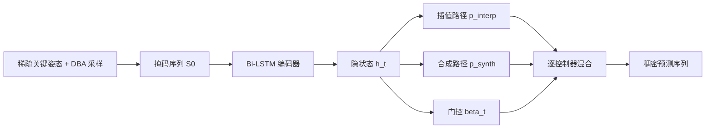

## 一句话总结

面向产线关键帧动画的补间任务，提出一个 Adaptive Interpolation-Synthesis（AIS）预测头，让网络逐帧、逐控制器地在"学习到的插值"与"直接姿态合成"之间自适应加权，配合贴合真实产线数据分布的关键姿态采样策略，在专业动画数据上达到 SOTA，并在 Autodesk Maya 中实测把补间效率提升约 3.5 倍。

## 研究背景

- 领域现状：补间（in-betweening）是 3D 动画里最费工也最考验表现力的环节，决定了运动的节奏与情绪。近年深度学习方法（RNN/LSTM、Transformer、扩散模型）在动作合成与补间上取得了不错的结果。
- 核心痛点：现有方法的设定与真实产线工作流有三处系统性错位。其一是数据性质，学术方法大多基于动捕（mocap）的逐帧稠密姿态，把运动当作高维信号逐帧回归；而关键帧动画由低参数插值曲线定义，有效维度低得多。其二是运动风格，动捕方法假设运动平滑连续，而产线动画常常刻意夸张，包含夸张的时序、保持不动的姿态（held pose）和急促的转场（snappy transition）。其三是问题形式，学术工作常把补间当成大间隔、随机缺口的 inpainting，要模型同时推断"发生了什么"和"怎么发生"；而在产线里，block 关键姿态已经确定了"发生什么"，动画师要做的是生成短的、风格一致的转场来表达"怎么发生"。
- 本文 idea：不做通用补间，而是针对产线关键帧动画的约束量身设计。核心是一个模仿动画师决策过程的 AIS 层——在"显式插值"和"直接合成"两条路径之间自适应混合；同时研究训练时的输入关键姿态采样策略，用贴近产线 block 分布的确定性调度取代随机调度。

## 方法

整体框架是一个 Bi-LSTM 编码器加上 AIS 预测头，端到端联合训练。稀疏的输入关键姿态先被掩码并补上二值 mask，Bi-LSTM 双向编码出每帧隐状态，AIS 层再逐帧把隐状态解码成最终稠密姿态。

关键设计分三点展开。

第一，姿态表示与任务定义。角色姿态由一组绑定控制器的属性构成，方法只预测连续参数（平移、旋转、缩放），离散参数（FK/IK 切换、面部选择器）直接沿用上一个输入关键姿态。旋转用 6D 表示避免万向锁并保证连续性，平移和缩放按训练集三倍标准差归一化到约 $$[-1, 1]$$。补间任务即：给定索引集合 $$I$$ 上的 $$K$$ 个稀疏输入姿态，生成 $$N$$ 帧的稠密序列 $$S = \{p_0, \dots, p_{N-1}\}$$，其中首尾帧固定为输入。对任意帧 $$t$$，定义其左右最近的输入关键姿态 $$p^{\text{prev}}_t$$ 与 $$p^{\text{next}}_t$$。

第二，AIS 层的双路径加门控。它显式建模动画师的两种做法。插值路径模仿"在两个关键姿态之间设定插值曲线"：用一个小 MLP 从隐状态预测逐维插值权重 $$\alpha_t = \sigma(\text{MLP}_\alpha(h_t))$$，再在姿态空间做逐元素插值 $$p^{\text{interp}}_t = (1-\alpha_t) \odot p^{\text{prev}}_t + \alpha_t \odot p^{\text{next}}_t$$。这里权重是学出来的而非固定函数，因此不会像 SLERP、线性插值那样天然偏向平滑，能贴合任意风格。合成路径模仿"直接在绑定上雕一个新姿态"，用另一个 MLP 从隐状态直接回归 $$p^{\text{synth}}_t = \text{MLP}_{\text{synth}}(h_t)$$，用于表达 overshoot、夸张 breakdown 等落在插值区间之外的姿态。混合门则学一个逐维系数 $$\beta_t = \sigma(\text{MLP}_\beta(h_t))$$，把两路输出线性混合成最终预测 $$p^{\text{pred}}_t = (1-\beta_t) \odot p^{\text{interp}}_t + \beta_t \odot p^{\text{synth}}_t$$。门控是逐帧、逐控制器的，等于让模型按局部运动复杂度动态调节预测的有效维度：简单段落靠稳定的插值，复杂段落切到合成。

第三，域驱动的输入关键姿态采样（DBA）与损失。产线里 block 关键姿态并非随机分布，但最终动画文件混入了补间阶段新增的关键帧、无法区分出原始 block。作者借用 Miura 等人的关键姿态提取算法，在多个频率尺度上取运动速度的局部极小值作为输入关键姿态的代理，称为 Domain-Based Algorithm（DBA）调度。由于其真实 block 只是近似，训练时再做随机增广（增删关键姿态、全局与局部时序抖动），定义三档增广强度以权衡泛化与稳定。损失是逐维 L1 重建损失，配合借鉴多任务学习的自动加权：$$L = \sum_{d=0}^{D-1} \left( \frac{1}{2\sigma_d^2} \lvert p^{\text{pred}}_{t,d} - p^{\text{gt}}_{t,d} \rvert + \log(1 + \sigma_d^2) \right)$$，其中 $$\sigma_d$$ 是可学习的逐维缩放，对数项起正则作用，防止误差量级大的控制器主导梯度。

## 实验结果

主要评测在自有的 8.5 小时专业手工动画数据上（24 fps、单角色、姿态维度 $$D=596$$），并划出三个测试集：Algorithmic（DBA 推理调度）、Random（随机掩码比 $$r=0.9$$）、Production（5 分钟带真实 block 关键姿态的产线数据）。作者提出对时序偏移鲁棒的 Shift-Tolerant L1（STL1）指标，在允许的位移窗口内取最小 L1，以贴近"动画师返工时间"；并辅以频域的 NPSS 度量风格保真。

下表为与 SOTA 基线在关键帧数据集上的主对比（STL1 越低越好），可见 AIS-BiLSTM 在三个测试集上均显著领先。

| 方法 | Algo. STL1↓ | Rand. STL1↓ | Prod. STL1↓ |
|------|-------------|-------------|-------------|
| CondMDI | 17.42 | 15.09 | 33.06 |
| Δ-Interpolator | 4.85 | 5.87 | 3.51 |
| CITL | 12.61 | 12.15 | 27.47 |
| AIS-BiLSTM（本文） | 1.53 | 3.87 | 1.77 |

其余结论用文字补充。预测头消融显示：直接合成抖动严重、偏离输入关键姿态；带固定插值的 offset 变体（SLERP/Linear6D/Previous）更稳但被插值函数偏置，容易塌成过平滑或"复制上一姿态"；去掉自适应门控的固定门、纯插值、插值加 offset 等变体也都逊于完整 AIS，验证了学习式门控和合成路径的必要性。采样调度消融显示：在 Algo. 集上用 DBA 训练最好，随机增广越多越差；但纯确定性 DBA 泛化不佳，二档增广在 Prod. 集上取得最佳平衡，优于所有随机调度。在 LaFAN1 动捕基准上，本文在 5、10 帧短间隔达到 SOTA，长间隔仍具竞争力，印证其擅长产线主流的短间隔补间。产线工作流评测中，两位职业动画师在 70.2 秒动画上对比：全手工需 289 分钟，AI 辅助仅需 83 分钟，约 3.5 倍加速、人工投入减少 71%。

## 亮点与局限

- 亮点：
  - 问题定位精准，直击学术补间与产线关键帧动画在数据、风格、问题形式上的三处错位，方法与工作流高度对齐。
  - AIS 层把"插值 vs 合成"的选择显式建模成逐维门控，既保证对输入关键姿态的保真度，又不牺牲夸张、急促风格的表现力，思路直观。
  - 用贴近返工时间的 STL1 指标和真实产线用户研究给出可信的落地收益（3.5 倍加速），而非只报学术指标。
- 局限：
  - 依赖 DBA 作为 block 关键姿态的代理，当真实产线调度与训练调度差异较大时会失效。
  - Bi-LSTM 编码器面向短间隔设计，无法在大缺口上推断缺失内容，长时程能力有限。
  - 每个角色的绑定都需要单独训练一个模型，跨角色泛化尚未解决。

## 延伸思考

- 把 AIS 层接到 Transformer 编码器上，或许能在保留短间隔风格保真的同时补上长时程推断能力，是作者点名的方向。
- 统一的多角色模型是明显的下一步：在多角色数据上学习共享的运动先验（通用风格、相似 breakdown、anticipation/follow-through 等标准效果），有望摆脱一角色一模型的负担。
- DBA 只是 block 关键姿态的近似，若产线在流程中直接存下真实 block 调度，或发展出更准的关键帧动画 block 识别算法，训练与推理调度对齐会进一步提升质量——这也提示"数据侧对齐"和"模型侧改进"同样值得投入。
- 逐维自适应门控这一思路本身较通用，或可迁移到其他"稀疏约束 + 风格化插值"的信号补全场景（如相机运动、表情曲线补间）。
