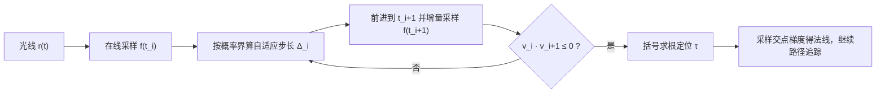

## 一句话总结

本文提出一套针对高斯过程隐式曲面（GPIS）的自适应光线步进算法，用"在线高斯采样 + 概率化步长界"把渲染中最昂贵的光线-曲面求交环节的每条光线开销大幅压低，在等时间预算下把渲染 MSE 最多降低 46 倍。

## 研究背景

- 领域现状：隐式曲面因为把几何与网格划分解耦、支持内外测试与光滑法线等鲁棒查询，一直是图形学中有吸引力的几何表示。高斯过程隐式曲面（GPIS）进一步把隐式函数建模成一个"分布"而非单一确定场，从而能系统地描述随机曲面、并在稀疏观测下做有原则的条件化。Seyb 等人在 2024 年证明：把物体外观建模为 GPIS 的"期望渲染"，可以得到一个统一框架，同时刻画类微表面反射与体散射等多样光传输效应。
- 核心痛点：尽管统一框架很优雅，GPIS 渲染却比常规的表面/体渲染昂贵得多。瓶颈在 GPIS-光线求交：沿每条光线要判断一个随机隐式函数在哪里穿过零点，这需要沿光线采样高维条件多元高斯分布。原方法把光线离散成均匀密集网格点，用带 Cholesky 分解的多元高斯采样（$$O(n^3)$$）实现，采样点越密越准但代价越高，实际用起来太慢。
- 本文 idea：用两个相互增强的想法攻这个瓶颈——其一是"在线采样"，随光线推进增量地抽取相关高斯样本；其二是"自适应步进"，用概率化的上下界，在可证明没有曲面的区域大步跨过。两者结合在保持 GPIS 渲染概率正确性的前提下，把每条光线的成本大幅降低。

## 方法

整体上，方法把 GPIS-光线求交重构成"沿光线自适应步进 + 增量采样一维高斯过程"的过程：给定光线 $$r(t) = \boldsymbol{x}_0 + t\boldsymbol{\omega}$$，沿线的 $$f(t) := f(\boldsymbol{x}_0 + t\boldsymbol{\omega})$$ 服从一维高斯过程，求交等价于找它第一个零点穿越。算法边走边采样、边判断相邻两点是否变号，直到把一个零点"夹住"再用括号法精确求根。

关键设计如下。

1. 在线高斯过程采样器（是什么/为什么/怎么做）。自适应步进要求采样点在"走到哪算到哪"时才确定，不能一次性预先给定，所以需要一个能按流式给点顺序、逐点采样却仍保持正确联合分布的采样器。做法是把联合分布按链式分解成一串条件分布：先从 $$\mathcal{N}(\mu(\boldsymbol{x}_1), k(\boldsymbol{x}_1,\boldsymbol{x}_1))$$ 采出第一个点，此后每个新点都在"已采历史"条件下从其后验一维高斯里抽取。为避免每步重解稠密矩阵逆（朴素做法整体是 $$O(n^4)$$），作者对核矩阵的 Cholesky 分解做增量的秩一更新：新增一个点时，$$L_{i+1}$$ 只需在 $$L_i$$ 基础上补一行，配合回代求 $$\boldsymbol{\beta}_i = L_i^{-1} k(X_i, \boldsymbol{x}_{i+1})$$，把每步降到 $$O(i^2)$$、整体降到 $$O(n^3)$$，相比朴素法省一个 $$n$$ 因子。

2. 高概率区间界（是什么/为什么/怎么做）。要"敢大步走"，得先量化"在一步之内出现零点穿越"的风险。作者在"均值/协方差连续可微、均值 Lipschitz 常数 $$\Lambda_\mu$$、核及其二阶导有界（$$\sigma^2$$ 与 $$M$$）"的假设下，推导出区间 $$[t_i, t_i + \Delta_i]$$ 上函数下确界的高概率下界，例如 $$\inf f \ge f(t_i) - (\Lambda_\mu + C_\eta \sqrt{M})\,\Delta_i$$，该界以不小于 $$(1-\eta)$$ 的概率成立。这里 $$\eta$$ 是用户指定的容忍度，$$C_\eta$$、$$Q_\eta$$ 是控制尾概率的常数（随 $$\eta$$ 变化，$$Q_\eta$$ 增长很慢）。对符号距离函数这类情形有 $$\Lambda_\mu = 1$$，界可解析算出。

3. 自适应步进求交（是什么/为什么/怎么做）。把上面的界反解成步长：取 $$\Delta_i = \max\!\left(\dfrac{\lvert \mu(t_i)\rvert - Q_\eta \sigma}{\Lambda_\mu},\ \dfrac{\lvert f(t_i)\rvert}{\Lambda_\mu + C_\eta \sqrt{M}},\ \Delta_{\min}\right)$$，即在"零点出现概率不超过 $$\eta$$"的前提下尽量大步走，同时用下限 $$\Delta_{\min}$$ 夹住以保证最终能收敛到零点。每步用在线采样器抽新点，若与上一点异号（乘积 $$\le 0$$）就判定区间内恰有一个根，改用二分或 Dekker-Brent 括号法求根（求根中每次函数求值也走在线采样器并追加为条件）。因为方法与基线的每条光线渐近复杂度同为 $$O(n^3)$$，真正的加速来自把有效采样点数 $$n$$ 大幅压小。

## 实验结果

主实验在"GPIS-光线求交"层面单独评估精度与开销（脱离下游路径追踪）：对同一条相机光线重复十万次随机求交，得到自由飞行距离的经验分布，用 Wasserstein 距离 $$W_1$$ 与高精度参考分布比较，在 32 条随机相机光线上取平均。三项指标越低越好。

| 方法 | W1 误差↓ | 每光线采样数↓ | 单次求交耗时↓（µs） |
|------|----------|----------------|----------------------|
| 本文 | 0.00044 | 6.0 | 37.9 |
| 基线 | 0.00509 | 74.8 | 2970.7 |
| 基线（等时间） | 0.05664 | 12.6 | 37.6 |

本文在采样点数只有基线约十二分之一的情况下，分布误差反而更低，说明大幅减样并未引入额外偏差；而当把基线步长放大到与本文等耗时（"基线等时间"）时，其分布误差显著恶化，凸显本文在精度-效率权衡上的优势。基线难以单靠调大步长把误差降到同等水平，因为它丢弃了沿光线的部分相关性（用 Renewal+ 模型近似分段间耦合）。

其余结论以文字补充：端到端等时间路径追踪渲染中，因为每次求交更便宜，本文能在相同时间预算内追更多路径（更高 spp），在所有测试场景下持续得到更低的图像 MSE（如某场景等时间下 0.009 对基线 0.210）；步长消融显示 0.5 倍步长与默认几乎无差别、2 倍步长则会漏掉零点产生可见误差，表明默认步长已接近"出错前的最大可用步长"；对 RBF 核的经验验证中，实测零点穿越率在所有 $$\eta$$ 阈值下都低于目标界，证实推导的界是保守的。

## 亮点与局限

- 亮点：
  - 不对 Seyb 等人的统一框架引入任何额外近似，保留其通用性与物理精度，只替换求交这一"内核"，是可直接嵌入现有 GPIS 渲染管线的 drop-in 替换。
  - 在线采样器用增量 Cholesky 秩一更新，把朴素 $$O(n^4)$$ 降到 $$O(n^3)$$，且支持"边走边定点"的流式采样。
  - 步长来自形式化的概率分析，在给定假设下"按构造"保证零点漏检概率不超过 $$\eta$$，对均值/核的具体形式不敏感。

- 局限：
  - 概率界在高方差区域偏保守，会限制步长、在复杂场景里削弱加速比。
  - 只针对标准核与常见条件化方案；扩展到更具表达力的先验或大规模数据集可能需要新的近似。
  - 更紧的数据相关界与可扩展的 GP 推断是进一步减少每光线查询数的方向。

## 延伸思考

- 本文与同期 Xu 等人（2025）基于稀疏卷积的实用化 GPIS formulation 被作者视为"正交"工作：一个提升底层 GP 推断效率，一个优化求交步进策略，二者结合可能带来叠加收益。
- "在可证明无根处大步跨越"的思路与 SDF 的球面追踪、局部 Lipschitz/区间算术求交同源，本文相当于把这套 bound-based marching 推广到了"随机隐式函数"的场景，值得思考它能否反哺确定性隐式曲面的自适应采样。
- 目前实现基于 CPU 双精度，法线/求根都串行依赖采样历史；如何把这种带状态的在线采样映射到 GPU 并行、以及能否用更紧的数据相关界进一步压小有效样本数 $$n$$，是把该方法推向实时的关键问题。
