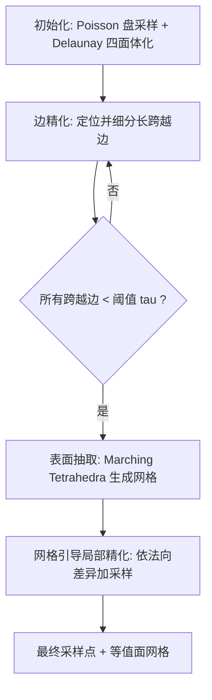

## 一句话总结

ADS 用一个渐进细化的 Delaunay 四面体骨架同时产出占据函数(Occupancy Function)表面的伪随机采样点和连接它们的等值面网格，且比现有方法少用约一个数量级的函数查询。

## 研究背景

占据函数是一种紧凑的隐式几何表示，把空间点分为内部($1$)与外部($-1$)两类，形状即两类的边界。它在神经隐式表示、快速缠绕数(Winding Number)、CSG 等场景中广泛出现，下游任务通常需要对其表面做稠密随机采样或提取网格。

难点在于占据函数只给出离散内外标号，既无法可靠地算到表面的距离，也没有可靠的梯度（对占据函数做有限差分噪声大且不可靠），甚至判断一个孤立点是否在表面上都很困难。现有两类方法各有短板：

- 射线投射类方法能产出随机采样，但样本之间没有连接关系，无法得到网格。
- 网格类方法（如 Marching Cubes、占据对偶轮廓 ODC）能得到等值面网格，但采样呈明显的网格轴向偏置。

两类方法都需要海量函数查询才能达到较高精度，而经典 Delaunay 精化网格化方法在这一设定下慢得无法接受（论文中一个例子需要约 36 分钟采 22K 点）。

## 方法

核心观察是：采样占据表面等价于构造大量分布良好的短"跨越边"(Crossing Edge)——两端点分居表面内外的线段。每条跨越边至少与表面相交一次，交点即表面样本，可用二分搜索在 $O(\log(1/\epsilon))$ 次查询内定位到精度 $\epsilon$。

ADS 用 Delaunay 骨架来批量生成这些跨越边，理由有三：3D Delaunay 中每个顶点平均约有 $15$ 条邻接边（远多于六面体网格的 $6$），大幅提高邻居落在表面另一侧的概率；维持 Delaunay 性质会让新引入的跨越边平均更短；含跨越边的四面体必与表面相交，其局部片拼起来就是闭合等值面，可用 Marching Tetrahedra 抽取。

给定占据函数 $\phi: \mathbb{R}^3 \rightarrow \{-1, 1\}$ 定义在有界域 $\Omega$ 上，流水线分四阶段：

初始化：用 Poisson 盘采样在包围域内布一组稀疏、间距良好的点并做 Delaunay 四面体化，在每个顶点查询 $\phi$ 得到内外标号。初始点集刻意稀疏以省查询。

边精化：迭代找出长于阈值 $\tau$ 的跨越边并沿边插入新顶点，Delaunay 会自动把新点连到附近顶点。每轮迭代平均把跨越边数量放大 $3$ 到 $4$ 倍。为避免把顶点放得离表面太近（会造成样本聚簇、破坏随机性），引入"障碍测试"(Barrier Test)：对候选中点 $m$ 查询其沿边左右两小步点 $m_l, m_r$ 的符号，若符号相同则加入中点，若不同（说明 $m$ 太贴表面）则改在靠近表面一端 $1/3$ 处插点。所有查询批量向量化以充分利用 GPU。待所有跨越边短于 $\tau$，再对每条边二分搜索定位交点。

表面抽取：用 Marching Tetrahedra 变体从骨架抽三角网格。由于每条网格边所在骨架三角形有两条短于 $\tau$ 的边，三角不等式保证等值面边长不超过 $2\tau$。

网格引导局部精化：边精化只保证相邻样本间距上界，可能漏掉细薄或高曲率细节。方法据等值面网格上顶点法向的差异来定位欠采样区域——顶点法向取其相邻等值面三角形法向的平均，并剔除边两端共享的三角形以更敏感地反映局部曲率。当边两端法向夹角超阈值、边足够长、且相关骨架四面体边足够长时才标记精化，在对应四面体的外心或边中点插入新顶点，再重复边精化与抽取。一般一轮精化即足够。

方法还可扩展到带上/下距离界的隐式函数：有上界时可免去障碍测试；有下界时二分搜索可替换为球体追踪(Sphere Tracing)，进一步提速。

## 实验结果

在 150 个输入上评测，覆盖三类占据函数来源：ShapeNet 学出的神经占据函数、缠绕数函数、神经显式函数交集(NESI)，各 $50$ 个；每个输入在 $\tau = 0.05, 0.03, 0.02$ 三种分辨率下采样。精度用 $L_1$ 倒角距离(Chamfer Distance)衡量。下表为跨所有分辨率与数据集聚合("all")的对比，各基线参数被调到产出精度最接近但仍略差于 ADS 的结果：

| 方法 | 倒角距离 $\times 10^3$ ↓ | 输出样本数 ↑ | 函数查询数 ↓ | 时间(s) ↓ |
| --- | --- | --- | --- | --- |
| 随机射线投射 (RRS) | 1.16 | 114,111 | 13,144,777 | 3.02 |
| 均匀射线投射 (IUS) | 1.14 | 118,109 | 11,286,081 | 2.83 |
| 占据对偶轮廓 (ODC) | 1.15 | 85,877 | 15,260,424 | 3.04 |
| Marching Cubes (MC) | 1.06 | 83,719 | 10,161,394 | 2.20 |
| ADS (本文) | 1.02 | 133,308 | 873,215 | 1.25 |

ADS 在取得更低倒角距离的同时，平均比各基线少用 $91\%$ 到 $94\%$ 的函数查询，速度显著更快，平均每个表面样本仅约 $6.5$ 次查询。它比网格类方法平均多产出约 $40\%$ 样本，适合做拒绝采样以逼近蓝噪声等目标分布。谱分析显示其差分域谱接近白噪声、经轻度 Poisson 盘过滤后更佳，而 MC/ODC 即便过滤后仍有明显偏置。对比经典 Delaunay 精化(CGAL)差距悬殊：神经占据函数上 CGAL 需约 $2.5$ 小时，ADS 仅 $0.71$ 秒达到同精度。运行环境为 AMD Ryzen 9 9900X + NVIDIA RTX 2080，平均显存约 $1.3$GB。

## 亮点与局限

亮点：

- 首个对占据函数同时产出随机采样与连接它们的等值面网格的方法，且查询量降低约一个数量级。
- 唯一支持曲率自适应采样的方法，高曲率区自动加密。
- 对占据函数来源无先验假设，可直接用于不同编码方式的输入；实现简单，作者承诺开源。
- 障碍测试、批量向量化查询等设计有效降低聚簇并契合 GPU 神经推理管线。

局限：

- 依赖初始采样至少与表面尺度弱相关；当形状远薄于函数域时初始骨架内部点太少会导致重建变差，需要更多精化轮次或更密初始骨架缓解。
- 表面上仍存在样本聚簇现象，障碍测试只能缓解而非根除。

## 延伸思考

ADS 把"隐式表面采样"重新表述为"生成大量分布良好的短跨越边"，并借 Delaunay 的高连通度与短边性质把这一目标做得又快又省查询，这种把采样与网格化统一在同一几何脚手架上的思路值得借鉴。它对神经占据函数尤其有价值：当函数评估成本高（GPU 推理）时，减少一个数量级的查询直接转化为可观的时间收益。可进一步思考的方向包括：如何从根本上抑制表面聚簇以直接得到蓝噪声、如何处理远薄结构的初始化难题，以及能否把这套自适应骨架推广到时变或更高维隐式场。
