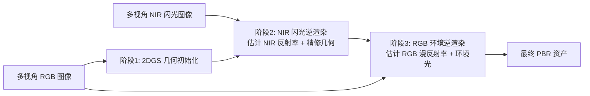

## 一句话总结

利用人眼不可见的近红外（NIR）闪光提供稳定的点光源着色线索，配合环境光下的 RGB 图像，通过三阶段逆渲染流程，在不受控的环境光照下鲁棒地重建物体的几何与反射率。

## 研究背景

- 领域现状：逆渲染（从图像反解几何、材质、光照）是图形学与视觉的核心问题。近年基于 CNN、Transformer、扩散模型的学习方法，以及基于可微渲染（体渲染、3D/2D 高斯泼溅）的分析-合成方法都取得了进展。
- 核心痛点：在不受控的环境光照下，反射率与光照之间存在强烈歧义，被动式（无主动光源）方法容易得到不一致、不准确的重建结果。主动光照可以缓解这一歧义，但可见光的强闪光会干扰周围的人和环境，只能在暗室里用，难以走出实验室。
- 本文 idea：改用近红外闪光。NIR 光对人眼不可见，因此可以打很强的 NIR 闪光而不干扰环境，从而获得在各种环境光下都稳定的点光源着色测量；同时 RGB 图像仍由自然环境光照亮，用来恢复可见光谱的反射率。二者互补，兼顾"鲁棒的几何/NIR 反射率"与"下游可用的可见光反射率"。这种分离之所以可行，是因为 NIR 闪光的发射光谱超出了 RGB 传感器的响应范围。

## 方法

整体框架是一个三阶段的 RGB-NIR 逆渲染流程：先用环境光下的 RGB 图像初始化几何（对光照鲁棒），再用 NIR 闪光图像估计表面粗糙度、金属度并精修几何，最后在已知几何与反射率的前提下从 RGB 图像恢复可见光漫反射率与环境光照。

关键设计分为三点：

1. **阶段一：几何初始化。** 对多视角 RGB 图像应用 2D 高斯泼溅（2DGS），得到在各种环境光下都鲁棒的几何。每个高斯用中心、主切向、缩放、不透明度以及球谐表示的视角相关辐亮度参数化，渲染用 alpha 混合完成。优化后只保留几何参数，辐亮度参数丢弃不用于后续阶段。

2. **阶段二：NIR 闪光逆渲染（鲁棒性的关键）。** NIR 闪光图像由点光源着色主导，通过"闪光开-闪光关"相减得到只含闪光贡献的 NIR 图像 $$I_{\text{NIR}} = I_{\text{NIR-on}} - I_{\text{NIR-off}}$$，去除环境贡献。每个高斯的 NIR 点光源着色建模为 $$R_{\text{NIR}}(g) = L_{\text{NIR}}(i;g)\, f_{\text{NIR}}(i,o;g)\,(i\cdot n)$$。NIR 反射率用基 BRDF 的加权和表示，$$f_{\text{NIR}}(i,o;g) = \sum_{k=1}^{N} w_k(g)\, f_{\text{NIR}}^{k}(i,o)$$，权重满足 $$\sum_k w_k(g)=1$$，每个基 BRDF 用 Disney BRDF 模型，含 NIR 漫反射率、粗糙度、金属度。优化损失包含光度重建、深度-法线一致性、掩膜对齐与边缘感知平滑先验。关键洞察是：粗糙度和金属度由微观几何与材质类型决定，基本与波长无关，因此把阶段二在 NIR 下估出的粗糙度、金属度直接共享到 RGB 域，为后续 RGB 阶段提供了对环境光鲁棒的约束。

3. **阶段三：RGB 环境逆渲染。** 此时几何、粗糙度、金属度已知，只剩 RGB 漫反射率 $$\rho_c$$ 和 RGB 环境光 $$L_{\text{env}}^{c}$$（$$c \in \{R,G,B\}$$）待求。入射光分解为直接与间接分量 $$L_c(i) = V(i) L_{\text{env}}^{c}(i) + L_{\text{indirect}}^{c}(i)$$，可见性与间接光用高斯光线追踪估计。RGB BRDF 同样用 Disney 模型但只剩漫反射率未知，因此不再用基 BRDF，避免高频细节损失。渲染方程用带多重重要性采样（MIS）的物理蒙特卡洛积分求解。为防止阴影被"烤"进反射率，用无阴影的 NIR 漫反射率梯度作为引导，构造边缘感知正则 $$L_{\text{RGB-edge}} = \exp(-k \lVert \nabla \rho_{\text{NIR}} \rVert)\, \lVert \nabla \rho_{\text{RGB}} \rVert$$。

此外，为采集密集多视角 RGB-NIR 数据，作者搭建了一套主动成像系统：四轮移动底盘 + 机械臂，装有像素对齐的 RGB-NIR 相机（用分色棱镜把可见光与 NIR 分到两块 CMOS）和同步 NIR 闪光。系统自动绕物体扫描，约 20 分钟完成一个物体的采集，并据此构建了首个包含闪光/无闪光 NIR 通道、覆盖多种环境光照的多视角 RGB-NIR 逆渲染数据集（真实场景 + Mitsuba 3 渲染的合成场景）。

## 实验结果

在合成数据集上与被动 RGB 方法（NeILF、TensoIR、GS-IR、R3DG、IRGS）及主动 RGB 方法 WildLight 比较，本文在漫反射率、粗糙度、法线、重光照等指标上全面领先：

| 方法 | Albedo PSNR↑ | Albedo LPIPS↓ | Roughness RMSE↓ | Normal MAE↓ | Relighting PSNR↑ |
|------|------|------|------|------|------|
| 本文 | 27.89 | 0.0680 | 0.0713 | 7.73 | 31.01 |
| WildLight | 21.10 | 0.1053 | 0.1472 | 7.84 | N/A |
| TensoIR | 17.40 | 0.0875 | 0.1586 | 19.30 | 20.22 |
| GS-IR | 17.24 | 0.1277 | 0.2207 | 16.37 | 27.17 |
| R3DG | 16.69 | 0.1173 | 0.1371 | 13.35 | 26.11 |
| IRGS | 13.96 | 0.0827 | 0.1174 | 10.48 | 26.45 |

其他实验以文字补充：在真实与合成数据集上，本文在多种室内环境光下都能得到稳定一致的反射率与环境光估计，室外含 NIR 环境光的场景也能可靠恢复 RGB/NIR 漫反射率与粗糙度。与扩散式方法 MaterialFusion 相比，本文的漫反射率残留着色更少、颜色偏差更小。BRDF 模型验证实验表明"RGB 与 NIR 共享粗糙度/金属度、各通道独立估计漫反射率"的假设能很好拟合实测高光谱 BRDF。消融显示去掉阶段二（NIR 闪光逆渲染）后重建精度明显下降，证明 NIR 点光源着色是鲁棒性的关键；方法对漫反射、镜面、金属三类材质均能准确重建，其中镜面材质因光照线索更强更局部，环境光恢复反而更好。

## 亮点与局限

- 亮点：
  - 用不可见 NIR 闪光把"主动光照的鲁棒性"带到了真实、不受控的日常环境，避免可见强光干扰人和场景。
  - 三阶段设计巧妙利用 RGB 与 NIR 的互补性，并借"粗糙度/金属度波长无关"把 NIR 阶段的稳健估计迁移到 RGB 阶段。
  - 配套自动化移动成像系统与首个多环境光多视角 RGB-NIR 逆渲染数据集，兼具方法与基准价值。
- 局限：
  - 难以扩展到米级大场景（掩膜误差、复杂间接光、遮挡、空间变化环境光）。
  - 对极端镜面材质表现不佳（几何初始化不准、自反射导致 NIR 着色线索不可靠）。
  - 强 NIR 环境光（如直射阳光）会压缩 NIR 闪光信号的有效动态范围，性能下降。
  - 染料、树叶等材质的 RGB 与 NIR 反射率可能不一致，违反共享参数假设。

## 延伸思考

该工作把"多光谱主动成像"与"高斯泼溅逆渲染"结合，思路可推广到其他不可见波段（如 SWIR、偏振）或与激光雷达/结构光融合来进一步稳定几何。共享粗糙度/金属度、分离漫反射率的假设在多光谱材质建模里值得深挖——哪些材质满足、哪些不满足，或许能形成一套"跨谱一致性"的先验。移动机器人自动扫描 + 语言驱动分割（SAM3）的采集范式，也让大规模真实世界 PBR 资产采集变得更现实，可能成为后续逆渲染数据集的标准工具链。
