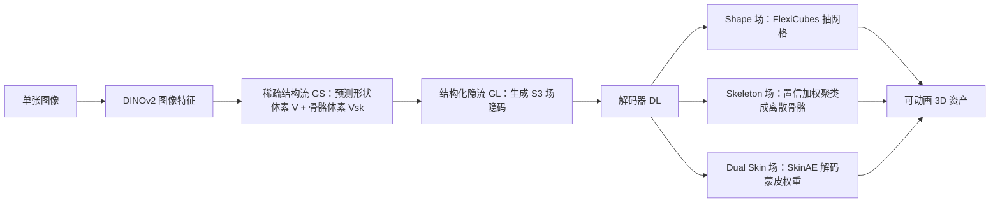

## 一句话总结

AniGen 把 3D 形状、骨骼、蒙皮权重统一成共享空间域上的三个连续场（$$S^3$$ Fields），用一个两阶段流匹配生成模型从单张图像直接生成"可直接驱动"的骨骼绑定 3D 资产，避免了传统"先建模后绑定"流水线的脆弱性。

## 研究背景

- 领域现状：以 TRELLIS 为代表的图像/文本到 3D 生成已经能合成视觉上很逼真的静态几何，两阶段（稀疏体素结构 + 结构化隐空间细化）范式成为主流。
- 核心痛点：生成的资产大多是"静态雕塑"——没有骨骼与蒙皮就无法驱动。想补上动画能力，通常走"生成后再自动绑定（generate-then-rig）"的串行流水线，但生成网格常带有拓扑瑕疵（融合的四肢、含糊的表面拓扑），自动绑定器高度依赖精确拓扑线索，于是产生缺骨、结构错乱、蒙皮鬼影等灾难性错误。作者认为根源在于表征错配：几何与关节结构本是相互纠缠的，串行处理丢掉了两者之间的跨模态先验。
- 本文 idea：把形状、骨骼、蒙皮都表示为定义在同一 3D 空间域上的连续场，让三者共享空间支撑与生成先验，进而"同时生长"几何与绑定，端到端联合生成。

## 方法

整体框架：先把三类信息压缩成 $$S^3$$ Fields 的结构化稀疏隐表示，再用两阶段流匹配生成——第一阶段（稀疏结构流 $$\mathcal{G}_S$$）从图像条件预测形状体素 $$V$$ 与骨骼体素 $$V_{sk}$$ 两套稀疏支撑；第二阶段（结构化隐流 $$\mathcal{G}_L$$）在这些支撑上"绘制"出稠密几何、蒙皮与骨骼场，最后解码为带骨骼与蒙皮的可动画资产。

关键设计分四点：

1. **$$S^3$$ Fields 统一表征**：把不规则的图（骨骼）和稀疏矩阵（蒙皮）都"抬升"为共享 $$\mathbb{R}^3$$ 域上的连续场。形状场 $$\mathcal{S}$$ 沿用稀疏体素存 FlexiCubes 的符号距离、法线、颜色等参数；骨骼场 $$\mathcal{B}$$ 不再是离散图，而是每点指向最近关节及其父关节的向量对 $$\mathcal{B}(x) = [(j(x)-x) \oplus (p(x)-x)]$$，这种相对参数化保证平移不变与局部性。由于关节常深埋体内，骨骼场用单独的骨骼体素 $$V_{sk}$$（被骨头穿过的体素并膨胀 2 体素）承载，而非复用只追踪表面的形状体素。

2. **置信衰减骨骼场**：在多个关节等距的 Voronoi 边界处，"最近骨头"身份会突变，回归目标不连续、监督含糊。作者引入标量置信度 $$c(x) \in [0,1]$$，用几何量显式监督：对体素中心 $$v_c$$，取最近关节 $$j_{gt}$$ 与次近 $$j_{gt}^{2nd}$$，定义 $$c_{gt}(v_c) = 1 - \lVert v_c - j_{gt} \rVert_2 / \lVert v_c - j_{gt}^{2nd} \rVert_2$$。再用 $$c_{gt}$$ 加权关节/父关节的回归损失，把梯度集中到骨头附近的高确定区域、抑制边界含糊区。推理时按置信度做加权迭代聚类（均值漂移式投票），把连续场收敛成离散关节并连接成骨架。相比 Bayesian 不确定性学习，这种显式先验监督更能压住噪声与冗余骨头。

3. **Dual Skin 场 + SkinAE**：蒙皮权重 $$W \in \mathbb{R}^{N_v \times N_j}$$ 的列数 $$N_j$$ 随类别剧烈变化（鱼约 10、人形约 52），标准固定维网络无法直接回归。作者把蒙皮分解成定义在 $$V$$ 上的表面蒙皮场 $$\mathcal{W}$$ 和定义在 $$V_{sk}$$ 上的骨骼蒙皮场 $$\mathcal{W}_{sk}$$，都映到固定维嵌入 $$\mathbb{R}^{D_{skin}}$$。恢复权重时查询顶点特征与各关节特征，经轻量 MLP 映到兼容空间后用 cross-attention + Softmax 得到满足单位分割（求和为 1）的权重。预训练的 SkinAE 把"变基数蒙皮回归"转成"定维特征匹配"，让固定架构网络能生成任意复杂度的绑定，且被验证对收敛至关重要。

4. **两阶段流匹配 + 跨结构适配器**：隐空间用去噪自编码器（DAE 而非 VAE），并把隐特征归一到单位 $$\ell_1$$ 范数超球面，防止模型靠放大隐范数走捷径而破坏流匹配轨迹。$$\mathcal{G}_S$$ 用双流 Transformer 分别预测形状与骨骼体素占据，块间用轻量线性适配器双向交换信息，保证骨骼"长"在几何范围内。$$\mathcal{G}_L$$ 同样多分支解码 $$S^3$$ 场隐码，并把归一化关节数作为条件经 AdaLN 注入，从而在推理时可调关节密度、控制绑定精细度而不改几何。

## 实验结果

数据集用 ArticulationXL（约 33K 绑定网格，取 1K 作测试）。由于没有现成的"端到端生成带绑定资产"方法，作者构造强基线：先用（在同域微调过的）TRELLIS* 生成形状，再接 UniRig / Anymate / Puppeteer / RigAnything 自动绑定。骨骼精度除了 Chamfer 式距离外，还引入最优传输的 Wasserstein 与拓扑感知的 Gromov–Wasserstein（GW）距离，蒙皮报 $$\ell_1 / \ell_2 / \mathrm{KL}$$。

主实验（骨骼与蒙皮精度，越低越好）核心对比：

| 方法 | Joint-to-Joint ↓ | Gromov–Wasserstein ↓ | Skin KL ↓ |
|------|------|------|------|
| AniGen | 0.174 | **0.286** | **2.919** |
| TRELLIS* + Anymate | 0.179 | 0.349 | 4.221 |
| TRELLIS* + UniRig | 0.205 | 0.397 | 5.903 |
| TRELLIS* + Puppeteer | 0.245 | 0.326 | 4.135 |
| TRELLIS* + RigAnything | 0.273 | 0.383 | 6.451 |

AniGen 在几乎所有指标上领先所有 TRELLIS*+ 绑定组合，尤其在衡量骨骼拓扑正确性的 GW 距离和蒙皮 KL 上优势显著；甚至优于部分"GT 网格 + 绑定"的上界参考组合。

其余实验用文字概述：几何质量上 AniGen（Chamfer 0.0409 / F-Score 0.88 / PSNR 25.12）与只做几何的 TRELLIS* 差距很小，说明联合建模骨骼蒙皮几乎不损几何保真度。推理耗时约 19s，与最快的串行基线相当，却省去了后处理绑定的重开销（UniRig 需 146s、RigAnything 127s）。消融显示：去掉置信度或换成 Bayesian 不确定性都会让骨骼变噪、冗余（GW 从 0.286 恶化到 0.337 / 0.310）；不预训练 SkinAE 则蒙皮与骨骼结构显著退化（Skin-KL 从 2.919 涨到 5.138）。

## 亮点与局限

- 亮点：
  - 把形状/骨骼/蒙皮统一为共享空间的连续场，端到端联合生成，从表征层面消除了"生成后绑定"的误差累积。
  - 置信衰减骨骼场巧妙处理了 Voronoi 边界的回归歧义，用显式几何先验替代难调的 Bayesian 不确定性。
  - Dual Skin 场 + 预训练 SkinAE 解耦了关节数量与网络架构，固定架构即可生成任意复杂度绑定，还能通过关节密度条件在线控制绑定精细度。
  - 在 in-the-wild 图像（真实照片、网图、AI 生成图）上对动物、人形、机械等广泛类别泛化良好。

- 局限：
  - 目前仅支持图像条件生成，未利用视频中更显式的运动与骨骼约束；作者提出未来扩展到视频输入以获得更时序一致的生成。
  - 纯几何指标上仍略逊于只做几何的生成器，属可接受的小代价。
  - 依赖 TRELLIS 预训练参数做 warm-start，且 ArticulationXL 规模相对小，绑定数据的覆盖面可能限制更罕见拓扑的泛化。

## 延伸思考

- 这项工作与 UniRig、RigAnything、Puppeteer、Anymate 等自动绑定方法形成鲜明对比路线：与其把绑定当作后处理，不如让几何与骨骼"共生"。这与近年"结构化隐空间联合生成"（如 TRELLIS 系列、ArtiLatent、Particulate）的趋势一致。
- 用最优传输 / Gromov–Wasserstein 作为骨骼拓扑的评测指标很值得借鉴——Chamfer 类度量对多对一匹配不敏感，掩盖了连通性错误，OT 度量能显式惩罚虚假分支与错误层级。
- "把不规则结构（图、稀疏矩阵）抬升为共享域上的连续场再统一生成"是一个可迁移的思路，或可推广到部件级铰接、材质、物理属性等更多"功能性"属性的联合生成。
- 值得追问：置信衰减与聚类恢复对关节数极多或高度对称结构（如多足昆虫、树状植物）的稳健性如何？关节密度条件能否进一步做到语义可控（指定手部更精细而躯干更稀疏）？
