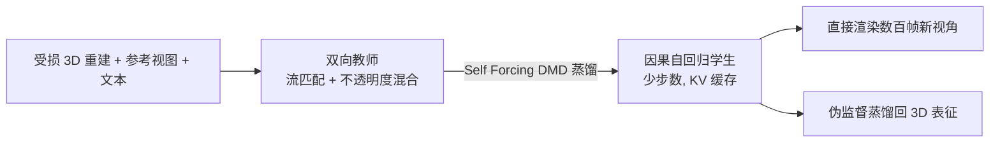

## 一句话总结

ArtiFixer 把一个预训练视频扩散模型改造成"以受损 3D 渲染为条件"的生成器，并蒸馏成少步数因果自回归模型，一次前向就能生成数百帧时序一致的新视角，既能直接出图、也能反哺回 3D 表征，从而修复并补全稀疏观测下残缺的 3D 重建。

## 研究背景

- 领域现状：新视角合成目前有两条主线。一是显式 3D 神经重建（NeRF、3D Gaussian Splatting），在稠密输入下能实时、高保真渲染；二是相机可控的图像/视频生成模型，能合成逼真且时序连贯的内容。
- 核心痛点：逐场景优化的 3D 重建，质量被输入观测的完整度死死卡住——稀疏或完全未观测的区域会出现空洞、伪影、错误几何，自由漫游时暴露无遗。用生成先验去修补这些区域的已有工作则有两个短板：(1) 可扩展性差，用图像扩散或双向视频模型一次只能生成有限帧数，为了一致性要走昂贵的迭代蒸馏；(2) 质量本身不足，生成器要么与已有场景内容不一致，要么在完全未观测区域彻底失效。
- 本文 idea：不把重建和生成当成互斥的两条路，而是让二者互补——生成模型作为强先验去修补残缺重建，而显式（虽含噪、不完整的）3D 表征反过来作为强条件锚定生成、抑制长程漂移与幻觉。据此提出两阶段管线：先训一个带"不透明度混合"的双向生成教师模型，再把它蒸馏成能一次生成数百帧的因果自回归模型。

## 方法

整体框架分两阶段。第一阶段（双向训练）把预训练文生视频模型 Wan 2.1 T2V-14B 微调成一个流匹配模型，学会把受损 RGB 渲染"搬运"成干净输出，关键是用渲染出的不透明度图把高斯噪声混入低不透明度区域以避免模式坍缩；第二阶段（因果蒸馏）用 Self Forcing 风格的 DMD 蒸馏把双向教师转成少步数因果自回归学生模型，可直接渲染新视角，也可作为伪监督蒸馏回底层 3D 表征。

关键设计有四点：

1. **不透明度感知的噪声混合（核心贡献）**。以往做法要么从高斯噪声出发、把受损渲染通道拼接进去（语义相似但一致性不足），要么直接从受损渲染潜变量 $$z_{deg}$$ 出发（一致性强但在完全未观测区退化为零，出现模式坍缩、无法外插）。本文取两者之长：把不透明度图 O 通过最大池化下采样到 $$O_z$$ 与潜变量空间对齐，构造源分布 $$z_{mix} = O_z z_{deg} + (1 - O_z)\boldsymbol{\epsilon}$$。已观测区（高不透明度）保留受损渲染的一致性，未观测区（低不透明度）平滑过渡到标准高斯先验从而恢复生成能力。因为最大池化不丢失源信息，一致性收益得以保留。这与图像修复中"已知区低噪声、未知区推向生成先验"的思路相通，但用的是连续不透明度信号而非二值掩码。作者在附录中给出了它与流匹配的相容性推导。

2. **条件注入架构**。从预训练文生视频模型出发，冻结 VAE 和文本编码器，只微调其余部分。受损渲染经冻结 VAE 编码并 3D 分块。相机控制与"往哪生成内容"的信号通过两条旁路注入：逐像素 Plücker 射线图 R（每像素六维向量，即方向与相机中心的叉乘）提供未观测区的相机控制，不透明度图 O 指示生成位置；二者都绕过 VAE，用 PixelUnshuffle 下采样后经逐块线性层 $$f_r$$、$$f_o$$ 加到视觉 token 上。可选的干净参考视图经 VAE 编码后，通过交叉注意力（配合 PRoPE 相对相机条件）提供场景上下文。$$f_r$$、$$f_o$$ 及新增的 value 投影都做零初始化以兼容预训练权重。

3. **因果蒸馏与自回归推出**。学生模型直接用教师权重初始化，不走前人那套需要预生成 ODE 轨迹数据集的复杂协议，而是简单加上块因果掩码、按 Diffusion Forcing 给各帧加不同噪声等级。随后按 Self Forcing 思路顺序生成视频块并用 KV 缓存条件化前序块，用 DMD 蒸馏成少步生成器（实验用 4 步，未观测区外常可更少）。得益于受损渲染和参考视图这些强条件信号，无需专门的长程训练也能抑制误差累积，因此只用与第一阶段相同的帧数训练、推理时用滚动 KV 缓存即可推广到任意长视频。

4. **3D 蒸馏（可选）**。由于自回归模型能一次一致地生成任意数量帧，不再受"双向模型单次帧数上限"或"逐帧不稳定"的约束，因此可以一次性生成全部所需新视角，再套标准 3D 重建，省去前人那种"生成—重建"交替的渐进蒸馏开销。3D 表征渲染快数个量级，从效率角度仍值得做。

数据方面，从 DL3DV-10K 用一套相机选择策略造出"重建—真值"配对样本：先算相机位姿距离（SO(3) 测地角加归一化平移距离），找出距离最大的相机对播种两组，再在每组内采样 2–12 个相机以得到不同稀疏度、带大片空洞的重建，逼模型学会补全。

## 实验结果

在 Mip-NeRF 360 稀疏视角重建上与大量基线对比（3/6/9 视角），三种变体全面领先。下表摘取 PSNR 与 LPIPS 两个代表指标（数值越高/越低越好）与最强的几个生成式基线对比：

| 方法 | PSNR↑ 3-view | PSNR↑ 9-view | LPIPS↓ 3-view | LPIPS↓ 9-view |
|------|------|------|------|------|
| GenFusion | 15.29 | 18.36 | 0.585 | 0.465 |
| GSFixer | 15.61 | 18.63 | 0.559 | 0.420 |
| CAT3D | 16.62 | 18.67 | 0.515 | 0.460 |
| ArtiFixer | 17.06 | 19.96 | 0.437 | 0.353 |
| ArtiFixer3D | 17.29 | 20.24 | 0.440 | 0.327 |
| ArtiFixer3D+ | 17.51 | 20.16 | 0.441 | 0.359 |

其余实验用文字概述：在 Nerfbusters 与 DL3DV 的伪影去除任务上，各变体较此前最好方法 Difix3D+ 提升约 2 dB PSNR；在专门制造大片未观测区的"新内容生成"DL3DV 划分上，较次优的 GenFusion 高出近 3 dB PSNR（ArtiFixer3D+ 达 20.15 dB），且 FID 大幅优于所有基线。诊断实验（Mip-NeRF 360）表明：把受损渲染当作去噪起点、而非通道拼接条件，是产出与源图一致结果的关键（通道拼接仅 14.52 dB，完整方法 17.99 dB）；不透明度混合与因果初始化各带来可观提升，其中初始化非必需但有稳定收益。逐步剥离条件显示，去掉初始渲染后仅靠参考视图仍能恢复场景高层结构，只留文本时退化为接近基座 Wan 2.1 的文生视频质量。速度上，因果蒸馏配合 KV 缓存与少步采样相较双向 Wan 2.1 骨干获得约 70 倍加速：14B 变体达 8.36 FPS，1.3B 变体 34.38 FPS，而蒸馏回 3D 后以原生 3DGUT 速度渲染达 268 FPS。

## 亮点与局限

- 亮点：
  - 不透明度混合优雅地化解了"一致性 vs 生成能力"的两难——用连续不透明度作为源分布权重，在已观测区保一致、在未观测区放开生成，且不丢失源信息。
  - 把双向教师蒸馏成因果自回归学生，一次前向生成数百帧，兼顾时序一致性与接近图像式方法的效率，同时闭环反哺 3D 重建（重建条件生成、生成又改善重建）。
  - 强条件信号让长视频训练大幅简化，无需专门的长程训练协议就能抑制误差累积并推广到任意长度。
  - 多个基准全面领先，提升幅度可观（1–3 dB PSNR），且 70 倍推理加速兼具实用性。

- 局限：
  - 训练成本极高——128 块 H100、约 15k GPU 小时，依赖 16.9B 参数级的 Wan 2.1 骨干，复现门槛高。
  - 强依赖初始 3D 重建作为条件信号，若初始重建（3DGUT）本身质量极差或场景与训练分布差异过大时的鲁棒性论文未充分探讨。
  - 数据构造依赖预训练度量深度估计器做尺度对齐、VLM 生成文本提示，引入了外部模型的误差与偏置。
  - 论文以定量指标与定性图为主，对生成内容"合理但非真实"（幻觉）的边界、以及在完全未观测区的可信度缺乏系统度量。

## 延伸思考

这篇工作可以放在"生成先验修补/扩展显式重建"这条脉络里看：相比 Difix3D+（确定性映射、无法补全空洞）和 CAT3D/ReconFusion（多视图图像扩散 + 迭代蒸馏）、GenFusion（双向视频模型），ArtiFixer 的关键差异是把"起点选择"从噪声或纯渲染换成不透明度加权混合，并用因果自回归换取长序列与效率。它与同组的 Lyra（单图前馈 3DGS 生成）形成互补：一个从零生成、一个增强已有重建。值得追问的方向包括：连续不透明度混合能否迁移到动态/4D 场景或大规模城市级重建；因果自回归的滚动 KV 缓存在超长轨迹（分钟级漫游）下漂移的实际上界；以及能否用更轻量骨干在保住质量的同时把训练成本压到学术可复现的范围。对做闭环仿真、VR/AR 自由漫游的场景，这种"重建打底 + 生成补全"的范式很有落地价值。
