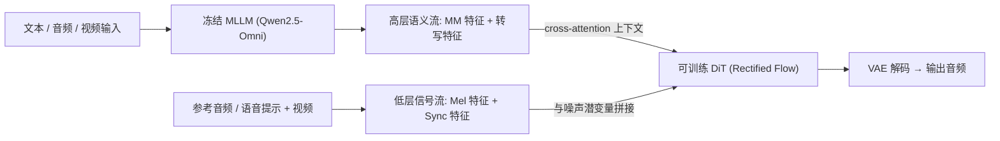

## 一句话总结

Audio-Omni 用"冻结的多模态大语言模型（MLLM）负责理解、可训练的扩散 Transformer（DiT）负责合成"这一解耦架构，第一次把音频的理解、生成、编辑三种能力统一到单一端到端框架里，并覆盖通用声音、音乐、语音三个域。

## 研究背景

- 领域现状：图像、视频领域的"理解 + 生成"统一模型进展很快，但音频域相对滞后。音频天然分成通用声音、音乐、语音三个分布差异极大的子域，已有统一尝试要么只覆盖语音、要么只覆盖音乐/通用音频，要么靠"工具调度"拼接多个专家模型而缺乏端到端优化。
- 核心痛点：现有音频编辑模型只能做编辑、无法扩展到理解或生成；而指令引导的音频编辑又缺乏大规模公开配对数据。已有合成数据管线靠"把孤立音频片段混起来"造样本，与真实世界中声音本就交织的场景存在明显域间隙，且难以处理风格迁移这类需要解耦音色与内容的任务。
- 本文 idea：保持 MLLM 冻结以保留其丰富的多模态知识，让它给可训练的 DiT 提供条件信号；再用一套"高层语义流 + 低层信号流"的混合条件机制，兼顾抽象指令与逐帧对齐；同时自建大规模编辑数据集 AudioEdit 补上数据短板。

## 方法

整体框架：输入的文本指令、音频、视频先经各自编码器送入冻结的 Qwen2.5-Omni-3B。对理解任务，MLLM 直接输出文本；对生成任务，它输出条件特征驱动一个用 Rectified Flow 训练的 DiT，DiT 在 VAE 潜空间里合成音频后再解码回波形。条件被拆成两条互补的流，分别以不同方式注入 DiT。

关键设计：

- 解耦架构与冻结 MLLM：理解模块是预训练且冻结的 MLLM，作为推理核心。作者不取最后一层，而是取倒数第二层的隐状态作为生成条件——实验发现最后一层过度专门化于文本预测，倒数第二层保留了更丰富、未被压缩的语义与声学细节。DiT 及各条件模块可训练，全模型约 7.9B 参数，其中 3.05B 可训练。
- 混合条件机制（两条流）：高层语义流由 MLLM 的多模态特征与转写编码器（字符级 + ConvNeXtV2）产出的转写特征拼接而成，提供指令级的全局引导；低层信号流由 Mel 编码器（来自参考音频或语音提示）与 Synchformer 的视频同步特征拼接而成，提供逐帧的时间对齐参考。
- 差异化注入：高层语义流作为上下文经 cross-attention 注入，让模型在每一步灵活查询抽象指令；低层信号流先与时间嵌入逐元素相加，再与 VAE 编码的含噪潜变量拼接作为 DiT 主输入，提供强的逐帧对齐，专为编辑与音画同步服务。消融证明"高层走 cross-attention、低层走拼接"是最优组合。
- 训练目标与掩码策略：用统一的 Rectified Flow 目标端到端训练，网络预测从数据到噪声的恒定速度场 $$v = x_1 - x_0$$，损失为 $$\mathcal{L} = \mathbb{E}_{t \sim U(0,1),\, x_0, x_1, c}\big[\lVert v_\theta(x_t, t, c) - (x_1 - x_0)\rVert^2\big]$$。语音训练时随机遮挡 20%~75% 的提示 mel 谱，迫使模型从部分声学信号推断说话人音色，从而自然获得零样本音色克隆与语音编辑能力。

数据集 AudioEdit：为解决编辑数据稀缺，作者设计双分支混合管线。真实数据分支从 VGGSound 挖掘：先用 Gemini 2.5 Pro 识别主要发声物体类别，再用 SAM-Audio 做源分离得到目标轨与残差轨，经 VAD 与 CLAP 语义对齐多级过滤（约 9.2% 保留率，人工校验约 83% 一致），产出 add/remove/extract 的配对；风格迁移则用 ZETA 在保持时序与音高的前提下转换风格再与残差轨混合。合成数据分支用 Scaper 把 ESC-50 前景事件随机混入 AudioCaps 背景（随机化起始时间、SNR、音高、时长伸缩）保证规模与多样性。最终得到超过 100 万条编辑配对样本。

## 实验结果

主实验为多模态生成基准上的对比（FAD 越低越好，TTS 用 WER）。Audio-Omni 在所有统一模型中稳定领先，并在文本到音乐（T2M）、语音合成（TTS）上超过专用专家模型。

| 方法 | 类型 | T2A FAD↓ | T2M FAD↓ | V2A FAD↓ | V2M FAD↓ | TTS WER↓ |
|------|------|------|------|------|------|------|
| AudioX | 专用 | 1.86 | 1.53 | 1.13 | 2.12 | - |
| F5-TTS | 专用 | - | - | - | - | 1.83 |
| Unified-IO2 | 统一 | 7.81 | 3.17 | - | - | 21.63 |
| MuMuLLaMA | 统一 | - | 5.89 | - | 52.25 | - |
| Audio-Omni | 统一 | 1.86 | 1.94 | 1.71 | 1.58 | 1.77 |

其余结果用文字概述：

- 理解：在 MMSU / MMAU 上，Audio-Omni（56.83 / 63.30）优于多数统一模型，接近专用理解模型，能力直接继承自冻结的 MLLM。
- 编辑：在自建 AudioEdit 测试集上，Audio-Omni 取得最优的 AE_FAD（3.27）、LSD（2.27）与 CLAP（0.32），全面超过 ZETA、SDEdit、MMEDIT 等编辑专用方法。
- 涌现能力：展示了知识增强生成（由"Jimi Hendrix 常用的乐器"推断出电吉他并合成对应旋律）、in-context 生成（提取给定钢琴录音的音色应用到新曲）、零样本音色转换与语音编辑，以及仅用英文训练却能跨语言（中西德法日）生成的能力。
- 消融：混合数据优于纯真实或纯合成；条件注入策略中"高层 cross-attention + 低层拼接"最佳；条件特征取倒数第二层显著优于最后一层与各种 query 机制。

## 亮点与局限

- 亮点：
  - 首个把音频理解、生成、编辑跨三大域统一的端到端框架，且用单一模型达到甚至超越专用模型的效果。
  - "冻结 MLLM + 可训练 DiT"的解耦设计既保留了大模型知识、又避免了昂贵的联合微调，还顺带带来知识增强、跨语言等涌现能力。
  - 贡献了超百万规模的指令引导音频编辑数据集 AudioEdit，其"真实挖掘 + 程序合成"的双分支管线本身有独立价值。

- 局限：
  - 条件流、编码器、Synchformer 等模块堆叠较多，约 7.9B 参数、推理需 100 步 ODE 求解，实时性与部署成本存疑（论文未给推理速度）。
  - 编辑数据高度依赖 Gemini、SAM-Audio、CLAP、ZETA 等外部模型，管线偏见与错误可能被继承；真实数据保留率仅约 9.2%。
  - 跨语言、知识增强等能力主要以定性展示为主，缺乏大规模定量评估。

## 延伸思考

- "冻结理解大模型 + 轻量可训练生成头"的范式，与视觉领域的统一模型思路一脉相承，Audio-Omni 把它系统性地搬到音频三域，值得关注这种解耦是否会成为多模态生成的通用配方。
- 倒数第二层特征优于最后一层的发现，呼应了不少表征研究——最后一层为特定预训练目标过度专门化。这对"如何从冻结大模型里取生成条件"是一个可复用的经验。
- 高层走 cross-attention、低层走拼接的条件注入结论，可能对图像/视频等其他模态的可控生成也有借鉴意义，是一个值得追问的通用设计问题。
