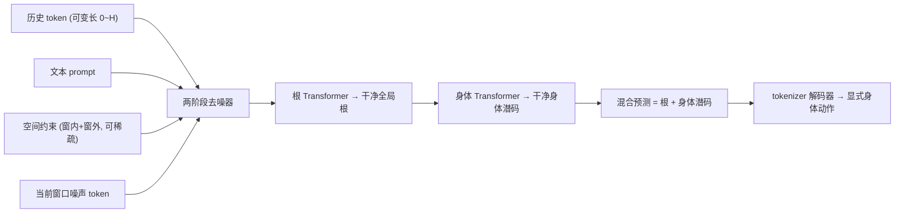

## 一句话总结

ARDY 用"显式根轨迹 + 隐式身体潜码"的混合表示搭配两阶段自回归扩散去噪器，在 33ms 级延迟下实现既能在线跟随文本、又能满足长时程运动学约束的实时可控人体动作生成。

## 研究背景

- 领域现状：文本驱动的人体动作生成分两条路。离线方法（扩散、生成式掩码建模）能精确跟随复杂文本和运动学约束（关键帧、关节位置），但要么一次性并行生成整段序列、要么推理太慢，不适合交互；在线/自回归方法能实时逐帧或逐块生成、可对用户输入即时反应，但普遍牺牲可控性。
- 核心痛点：现有在线方法难以两全——有的支持文本却不支持运动学约束，有的支持约束却不接受文本；少数同时支持两者的方法（如 DiP、DartControl）受限于很短的历史/未来上下文窗口，既无法理解需要长历史才能定位的复杂文本语义（比如"走路→弯腰捡东西→继续走"里前后都有走路），也无法执行超出当前生成窗口的长时程运动学目标（比如"10 秒后到达某点"）。
- 本文 idea：设计一个流式生成框架，用混合运动表示解耦"根"与"身体"，再用支持可变长历史上下文和长时程约束的两阶段自回归扩散去噪器，让实时生成同时具备复杂文本跟随能力和灵活的运动学目标控制能力，且无需额外的测试时优化或强化学习控制策略。

## 方法

ARDY 由两个组件构成：先训练一个运动 tokenizer 把高维身体运动压成紧凑潜码，再训练一个两阶段自回归扩散模型在"混合 token 空间"里去噪生成下一窗口动作。核心思路是把根轨迹保留为显式、可解释、可直接覆写的特征，把身体运动压进紧凑潜空间，从而兼顾"精确根控制"与"高效生成学习"。

关键设计：

1. 混合运动表示。每帧动作被拆成根特征 $$\boldsymbol{m}_{\text{root}}=(\boldsymbol{p},\cos\psi,\sin\psi)$$（全局根位置与朝向角）和身体特征。显式表示里身体是关节旋转、位置、速度、脚接触等高维量；混合表示则把身体部分换成 tokenizer 输出的潜向量 $$\boldsymbol{x}_{\text{body}}\in\mathbb{R}^{L}$$，得到 $$\boldsymbol{x}=(\boldsymbol{m}_{\text{root}},\boldsymbol{x}_{\text{body}})$$。全局根坐标避免了局部速度积分带来的累积误差，也便于直接覆写根特征以施加全局空间约束；潜身体表示则更紧凑、更利于生成建模。

2. 身体运动 tokenizer。非对称的条件自编码器：把连续 $$P=4$$ 帧打成一个 patch，编码器（8 层因果注意力 Transformer）压成潜 token，再与打 patch 的显式根特征沿特征维拼成混合 token $$\boldsymbol{x}^{1:T}=[\boldsymbol{m}^{1:T}_{\text{root}};\boldsymbol{x}^{1:T}_{\text{body}}]$$。解码器有个关键细节：先把全局根运动转成"局部表示"（朝向角速度、平面线速度、根高度）再作为条件，这一"全局转局部"能显著抑制脚滑。作者对比了普通 AE、VAE、FSQ 三种变体，FSQ（64 量化级、128 维）训练最稳定，选为默认。

3. 两阶段交错去噪器。这是精度与保真度兼得的核心。去噪网络接收可变长历史、文本、当前窗口噪声 token、以及可稀疏、可超出当前窗口的空间约束。约束用"带掩码的显式表示"给入：根部分直接覆写噪声 token 的根，$$\tilde{\boldsymbol{m}}^{1:C}_{\text{root}}=(1-\boldsymbol{v}_{\text{root}})\odot\boldsymbol{m}^{1:C}_{\text{root}}+\boldsymbol{v}_{\text{root}}\odot\boldsymbol{g}^{1:C}_{\text{root}}$$，实现对根轨迹的高精度控制；身体约束与掩码沿特征维拼接进输入；超窗口的长时程约束作为额外 token 拼入。每个去噪步里，根 Transformer 先预测干净全局根，detach 后喂给身体 Transformer 预测干净身体潜码，两者拼成混合预测再重新加噪进入下一步——这种交错保证了根与身体在整个去噪循环中持续互相影响。作者的假设是"在已知干净根的条件下预测身体，比根和身体一起联合生成更容易"，消融验证了两阶段优于单阶段。

训练上，去噪器用 DDPM 框架，损失是混合 token 的 L1 损失 $$\mathcal{L}_{\text{hybrid}}$$、解码后身体损失 $$\mathcal{L}_{\text{dec}}$$、专门惩罚约束未命中的目标损失 $$\mathcal{L}_{\text{goal}}=\lVert\boldsymbol{v}\odot(\hat{\boldsymbol{m}}_0-\boldsymbol{g})\rVert_1$$、以及关节位置与旋转正运动学一致性正则 $$\mathcal{L}_{\text{consist}}$$ 之和。历史长度 $$H$$ 和未来长度 $$F$$ 在训练中随机变化（0 到最大值），并用 10% 概率丢弃条件以支持无分类器引导。部署的去噪器约 156M 参数，文本编码用 LLM2Vec。推理时用截断滑动窗口管理长动作，并配一套"延迟感知重规划"：用已生成的 $$B$$ 帧缓冲边播放边作历史，从而掩盖较慢模型的推理延迟，让 4 步/10 步模型都能平滑衔接。

## 实验结果

主实验取大规模自建 Bones Rigplay 数据集（约 700 小时、150+ 演员、27 关节，测试集含训练未见动作类别）上对三项关键架构设计的消融。行是"配置"、列是"文本生成 + 约束条件生成"下的核心指标，最能体现每项设计的贡献：

| 配置 | R-prec.↑ | FID↓ | 关节旋转误差(°)↓ | 关键帧身体误差(m)↓ | 路点误差(m)↓ |
|------|----------|------|------|------|------|
| ARDY (完整) | 65.47 | 0.027 | 2.23 | 0.023 | 0.024 |
| 纯显式表示 | 53.90 | 0.065 | 1.67 | 0.136 | 0.203 |
| 全局根解码器(去掉全局转局部) | 64.94 | 0.028 | 2.88 | 0.044 | 0.060 |
| 单阶段架构 | 65.84 | 0.029 | 2.46 | 0.079 | 0.164 |

可以看到：混合表示相比纯显式在运动质量和约束精度上全面大幅领先；去掉"全局转局部"主要拉高脚滑（表中体现为约束精度下降）；单阶段虽在文本 R-prec 上略高，但空间约束误差（关键帧、路点）明显更大，印证两阶段对"同时满足文本与精确控制"的价值。超参分析进一步表明：生成窗口越长 FID/R-prec 越好，但过短（4 帧）会训练不稳、动作漂移；扩散步数 4 步已很有竞争力、10 步略优；FSQ 比普通 AE 训练更稳（AE 在 40 帧长窗口会发散）。

在公开 HumanML3D 基准上，ARDY 对比离线 SOTA MaskControl 与自回归方法 DiP 均有优势：无测试时优化时，ARDY 关节控制误差 4.15cm 远低于 MaskControl* 的 46.18cm，且延迟仅 0.15s（MaskControl 全流程优化需 68.65s）；对比 DiP，在窗外长时程目标下 ARDY 误差 2.92cm、FID 0.100，而 DiP 误差飙到 17.64cm、FID 1.453，说明 DiP 长时程规划能力不足。240 组人类感知对比中，ARDY 在运动质量、语义对齐、目标精度三项上均被显著偏好。

## 亮点与局限

- 亮点：
  - 混合表示是画龙点睛之笔——用显式全局根拿到精确、可直接覆写的空间控制，用潜身体拿到高效生成，两者的权衡设计得很干净。
  - 两阶段交错去噪把"根→身体"的因果结构显式建模，在少步扩散下仍能兼顾保真度与约束精度。
  - 可变长历史 + 窗外长时程约束是相对同类在线方法的实质性能力升级，原生支持而无需额外 RL/测试时优化。
  - 延迟感知重规划工程上很实用，让更强但更慢的模型也能用于实时交互。
- 局限：
  - 显式保留全部历史帧作上下文，超长时程任务下效率低，作者也承认需要更结构化的记忆机制。
  - 仍是多步迭代扩散，计算开销偏大（虽可降到 4 步）。
  - 纯运动学模型、不含物理动力学，仍会出现脚滑、抖动等伪影，物理正确性任务受限。
  - 最主要的定量优势建立在专有的 Bones Rigplay 数据集上，公开可复现性受数据可得性影响。

## 延伸思考

ARDY 的"显式根 + 隐式身体"分解，本质是把最需要精确控制、最适合稀疏全局约束的自由度留在可解释空间，把高维细节交给潜码，这个思路对其他需要"局部约束叠加在生成先验之上"的任务（如带轨迹约束的视频/相机运动生成、交互式布局）也有借鉴意义。作者点出的三个方向都很自然：结构化记忆（避免全历史注意力的线性膨胀）、shortcut/一致性扩散进一步压步数、以及与物理控制器耦合形成"运动学+动力学"统一生成模型——最后一点尤其关键，因为纯运动学的脚滑抖动正是当前 demo 里最容易被察觉的短板，而人形机器人等下游应用对物理可行性是硬要求。
