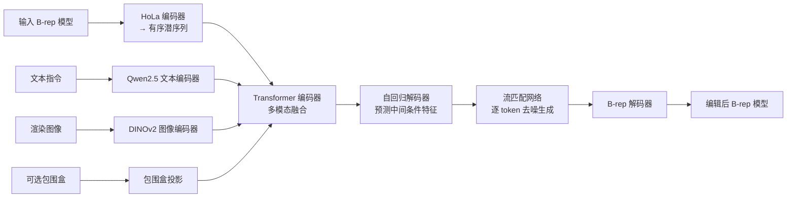

## 一句话总结

B-repLer 是首个直接在边界表示（B-rep）的学习潜空间中执行文本驱动 CAD 编辑的框架，无需构造历史（construction history），能对含自由曲面的复杂模型完成高层语义编辑，并给出仍然有效的高质量 CAD 输出。

## 研究背景

CAD 模型是工程设计与制造的行业标准，因其紧凑、精确而不可替代。但用自然语言驱动 CAD 编辑仍处于早期阶段，主要面临三重障碍：

- **语义鸿沟**：抽象的用户意图（如"加强这张桌子"）与底层的低阶几何操作之间缺乏语义连接。
- **数据缺失**：几乎没有公开的成对文本-编辑 CAD 数据集，无论是否带操作历史。
- **结构脆弱**：B-rep 由参数曲面（平面、B-Spline 等）经曲线裁剪、顶点连接构成，受严格拓扑规则约束，微小错误就会导致模型无效。

已有的多模态大模型方法（如 CAD-Editor）依赖 CAD 构造历史作为文本代理，而构造历史昂贵且常常不可得，这把它们的表达能力局限在简单的棱柱状形体上，无法处理大量只以最终边界描述存在的 B-rep 模型。B-repLer 的核心洞察是：借助直接的 B-rep 自编码器（如 HoLa-BRep）把复杂几何映射到连续潜空间，在该空间中编辑既能原生支持 B-Spline 自由曲面、绕开脆弱的文本代理，又因为解码器被训练为只产生有效输出而"设计上"规避了无效模型问题。

## 方法

B-repLer 把编辑建模为序列到序列的翻译问题，用一个变分自回归 Transformer 完成。输入 B-rep 模型经 HoLa 编码器映射为按曲面中心 XYZ 排序的潜序列；文本、图像与可选的编辑区域包围盒被投影后与 B-rep 特征融合，解码端自回归地预测中间条件特征，再由流匹配（flow matching）网络逐 token 生成编辑后的 B-rep 潜码。

关键设计点：

- **多模态融合编码**：B-rep 潜特征（经 HoLa 编码、投影到 768 维）、冻结 Qwen2.5 文本特征、冻结 DINOv2 图像特征、可选包围盒特征拼成输入序列。为对齐 2D 图像与 3D B-rep，对每个面用 RoIAlign 从 DINO 特征图裁取局部区域特征，加到对应面的 B-rep 潜特征上，注入图像感知信息。
- **变分自回归解码**：Transformer 解码器关注融合上下文与历史 token，预测中间条件特征，并由分类头判定序列结束（EOS）。
- **流匹配生成 token**：中间条件特征驱动流匹配网络，从高斯噪声出发经 100 步去噪生成下一个 32 维 B-rep 潜码，避免了向量量化带来的精度损失，天然适配可变长几何序列，并刻画文本编辑固有的"一对多"不确定性。

数据方面，作者构建了首个大规模数据集 **BrepEDIT-240K**，覆盖 52k 个独特形状、240k 次增删操作及多层级文本标注。构造流程为：在 Fusion360 中对 ABC 数据集模型随机删除某个面并依赖 CAD 内核"自愈"局部拓扑得到成对模型；从 32 个预设视角选最佳视角渲染前后图像并投影出编辑区域 2D 包围盒；再用 Gemini 2.5 Pro 对拼接的前后图像生成从详细到概括的五级编辑指令。虽然只做删除操作，但通过反向即得到"添加"，且 mLLM 会用 replace、enlarge、increase 等语义化算子标注，使模型能泛化到超出字面增删的语义编辑。

## 实验结果

在 CAD-Editor 测试集上与最先进方法对比（其中无条件生成模型 HNC-CAD、BrepGen、HoLa-BRep 不能编辑，仅报告写实性指标作参考）。B-repLer 不使用构造历史，仍在 D-CLIP 与人类偏好上显著领先，同时保持高有效率。

| Method | JSD ↓ | CD ↓ | Validity ↑ | D-CLIP ↑ | Human ↑ |
| --- | --- | --- | --- | --- | --- |
| HNC-CAD | 2.11 | 2.25 | - | - | - |
| BrepGen | 2.20 | 1.70 | - | - | - |
| HoLa-BRep | 1.66 | 1.99 | - | - | - |
| CAD-Editor | 3.06 | 2.11 | 99.79% | 0.25 | 38.4% |
| Ours | 2.96 | 1.76 | 97.13% | 0.34 | 61.6% |

消融实验证明变分自回归 Transformer 的必要性：换成确定性自回归后有效率从 78.4% 骤降到 45.6%（编辑的内在歧义要求生成多样合理输出，确定性模型难以胜任）；换成纯流匹配网络因潜空间变长、需填充/去填充引入噪声，D-CLIP 降到 -0.94。用户研究中，BrepEDIT-240K 在实用性、指令对齐、编辑复杂度、模型复杂度四个维度均以约 73%~78% 的偏好率胜过 CAD-Editor 数据集。

## 亮点与局限

亮点：

- 首个无需构造历史、直接在 B-rep 潜空间做文本驱动编辑的框架，原生支持 B-Spline 自由曲面。
- 变分自回归 Transformer 加流匹配，兼顾可变长序列、一对多歧义与无量化误差。
- 提出并开源思路构建 BrepEDIT-240K，用 Fusion360 加 mLLM 自动生成、可扩展的成对数据，摆脱对外部标注的依赖。
- 一个有趣发现：仅用几何信号预训练、无文本监督的潜空间，竟能与语言足够对齐以支持语义编辑。

局限：

- 直接建模潜空间有时会生成错位的曲面片或曲线，导致无效 B-rep；编辑上限仍受制于底层 HoLa-BRep 潜空间与解码器。
- 数据管线不显式建模或强制高层几何约束（对称、正交、平行），复杂设计场景下可能无法保持这些关系。
- 对涉及计数的指令（如"添加五个小长方体"）和复杂空间推理仍会失败。

## 延伸思考

这项工作把"在生成式潜空间里做编辑"的范式从图像、视频迁移到了高度结构化、对有效性极其敏感的 CAD 领域，关键在于借助一个"只会输出有效结果"的解码器来化解结构脆弱性。它也提示了一条低成本数据路线：用成熟 CAD 内核负责几何有效性、用 mLLM 负责语义标注，把单向删除操作反演成双向增删，从而绕开成对编辑数据稀缺的瓶颈。后续更值得关注的是如何把对称、平行等设计约束以及物理感知显式引入潜空间编辑，以及借 Fusion360 API 扩展到参数修改、堆叠操作等更丰富的编辑类型——这可能是让此类方法真正进入工程工作流的关键一步。
