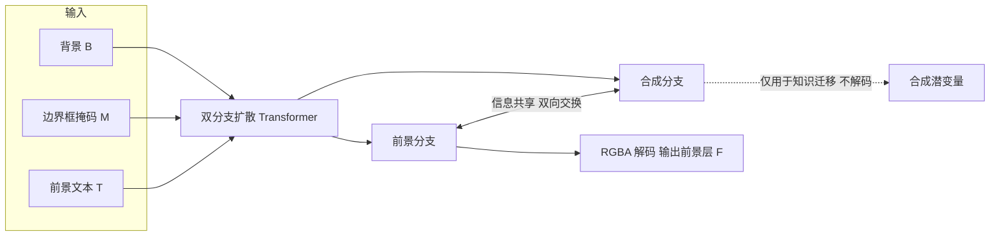

## 一句话总结

给定一张背景图、一个边界框和一句前景文字描述，BFS 用一个双分支扩散 Transformer 生成一张带阴影、反射等视觉效果、且能与背景自然融合的前景 RGBA 图层，靠"合成图像知识 → 图层知识"的跨模态迁移绕开分层数据稀缺的难题。

## 研究背景

- 领域现状：分层图像（一叠 RGBA 图层）是专业图像创作与编辑的标准表示，能非破坏性地独立操作各元素。随着扩散生成模型兴起，自动"分层图像合成"成为可控创作的热门方向，方法分为两派：分解式（把已有合成图拆成前景/背景层）和生成式（从噪声与文本直接生成各层）。
- 核心痛点：分解式往往难以把前景对象连同其阴影、反射等视觉效果一起干净地分离，且只能拆已有图、无法合成新图层。生成式能产出锐利的 alpha，但严重依赖大规模分层数据集——而这类数据极难获取：从合成图抠前景再修补背景，常在背景里留下"对象已不在、影子还在"的伪影；从 RGBA 前景库出发又受限于素材的多样性与规模；靠人工筛选/设计师拼合则成本高昂、无法规模化。
- 本文 idea：与其硬造高质量分层数据，不如借用"相对好学"的无分层（合成图）合成知识，去引导"更难学"的前景层合成。BFS 聚焦背景到前景（BG2FG）的合成范式，用一个双分支扩散架构让"合成图分支"和"前景分支"双向交换信息，再配一套两阶段半监督训练，把无分层图像数据的真实感迁移到前景层上。

## 方法

BFS 的主干是一对并行的扩散 Transformer：一支生成合成图 $$C$$、一支生成前景 RGBA 层 $$F$$，两支通过"信息共享模块"双向耦合。输入是背景 $$B$$、边界框掩码 $$M$$、前景文本 $$T$$，输出满足标准 alpha 混合 $$C = F_\alpha \cdot F_{rgb} + (1 - F_\alpha) \cdot B$$。推理时两支一起去噪，但只解码前景潜变量，合成图分支只用于知识迁移、不解码输出。

### 双分支耦合与信息共享模块

两支不是各干各的，而是在每个 Transformer 块的自注意力之前插入一个对称交叉注意力：用一支的 query 去查另一支的 key/value，得到 $$Z_{C \to F}$$ 与 $$Z_{F \to C}$$ 两条方向相反的消息。为节省训练量，$$W_Q, W_K, W_V$$ 共享自骨干并冻结，只用两组方向专属的 LoRA 增量 $$\Delta W^{C \to F}$$、$$\Delta W^{F \to C}$$ 去调制它们。两条消息拼接后过一个轻量 MLP $$g(\cdot)$$，拆成两支各自的残差 $$\Delta H_C$$、$$\Delta H_F$$，再加回各分支自注意力的输出。这样合成图分支学到的"真实场景该长什么样"就能持续渗透到前景分支。

### 冻结骨干、只训轻量参数

骨干选用图像修复扩散 Transformer Flux-Fill（因其任务天然贴近"在给定区域内补内容"）。骨干整体冻结，只训练两组方向专属的信息共享 LoRA 和那个轻量 MLP $$g(\cdot)$$。背景与合成图用 Flux-Fill 预训练的 RGB VAE 编码，前景 RGBA 层则用在自建数据上微调过的 RGBA VAE 编解码。推理时把噪声与背景潜变量、reshape 后的掩码在通道维拼接，沿 batch 维复制成两份送入两支。

### 第一阶段：带组合一致性的表示学习

先在一个"模拟合成"的分层数据集上教模型学会前景/背景/合成图之间的结构关系（alpha 混合行为、对象-图层语义）。数据构造借鉴 LayerDecomp，基于 RORem 物体移除数据集：对每张合成图用抠图技术从物体掩码抠出前景层，再用内部阴影生成网络补上模拟阴影，重新与背景合成，最后把物体掩码换成边界框掩码，得到 $$\{\hat{F}, B, \hat{M}, \hat{C}\}$$ 语料。与 LayerDecomp 随机配对前景背景不同，这里前景直接源自真实合成图，因此对物体位置和尺度的监督更可靠。损失用 flow-matching：对前景与合成两支都回归真值速度场 $$v^* = z_1 - z_0$$；再加一个组合一致性损失 $$L_{comp} = \lVert \Phi(\hat{z}_F, z_B) - \hat{z}_C \rVert_1$$，其中 $$\Phi$$ 是预训练并固定的潜空间合成网络，用一步去噪估计的干净潜变量来约束两支互相自洽。第一阶段目标 $$L_{first} = L_{flow} + 0.1 L_{comp}$$。

### 第二阶段：带分布正则的真实感增强

模拟数据的视觉效果不够真实，于是第二阶段用大量自然的无分层图像去精炼合成图分支，改进再通过信息共享模块传导到前景分支。做法是从 RORem 合成图里移除前景对象得到干净背景——注意此处不用 RORem 自带的修补背景（常残留前景影子），而改用 ObjectClear 把对象连同其效果一并移除。真实感损失 $$L_{real}$$ 只监督合成图分支；由于没有真值前景层，前景分支的输入用抠图网络对合成图抠出的代理输入 $$S$$ 替代（实验发现这对学习动态影响可忽略）。但只靠合成图监督会让前景分布逐渐偏离第一阶段建立的分布，因此再引入前景正则损失 $$L_{reg}$$，用第一阶段那份像素对齐的合成数据兜住前景分支。训练时按 80% 概率优化 $$L_{real} + 0.5 L_{comp}$$、20% 概率优化 $$L_{reg} + 0.5 L_{comp}$$ 交替进行。

## 实验结果

在 RORem 数据集 2000 张图上，与分解式组合基线 LD+OC（LayeringDiff 抠层 + ObjectClear 补背景）和生成式基线 LayerDiffuse 对比。前景用 CLIP 分数衡量与文本对齐；合成图（分解式则评估其背景层）用无参考美学指标 MUSIQ、MANIQA，用 KID 衡量与目标分布的距离，用 DINO 与真值直接比，并用对齐人类偏好的 HPSv3 打分。

| 方法 | FG CLIP↑ | MUSIQ↑ | MANIQA↑ | KID×1000↓ | DINO↑ | HPSv3↑ |
|------|------|------|------|------|------|------|
| LD+OC | 0.701 | 63.485 | 0.382 | -0.2 | 0.961 | 2.91 |
| LayerDiffuse | 0.770 | 67.221 | 0.425 | 11.0 | 0.467 | -3.03 |
| 本文 BFS | 0.721 | 67.886 | 0.437 | 0.2 | 0.875 | 3.70 |

LayerDiffuse 的 CLIP 最高，但那是因为它倾向生成占满画面的大前景、被该指标偏爱；其合成图的 KID、DINO 却大幅落后，说明生成结果严重偏离真值分布。LD+OC 靠 ObjectClear 在背景估计上 KID、DINO 很强，但拿不到新合成能力。BFS 的 CLIP 高于 LD+OC，合成图评估大幅优于 LayerDiffuse，且 HPSv3 全场最高。

18 名志愿者、20 个测试案例的用户研究进一步印证：在前景-文本对齐、视觉效果正确性、前景画质、放置合理性、前景背景协调性、合成图整体画质六个维度，BFS 平均 3.92，明显高于 LD+OC 的 3.60 和 LayerDiffuse 的 2.05。与物体插入方法对比中，BFS 在 MUSIQ/MANIQA/KID/DINO/HPSv3 上全面优于 PaintByInpaint 和 Flux-Fill，同时还额外产出可复用的显式前景图层。消融显示：去掉第一阶段前景质量与反射变差；去掉第二阶段合成图阴影不自然并传染到前景；去掉组合损失前景与合成图失去一致；去掉正则则 RGBA 分布崩塌、前景周围出现绿色光晕。

## 亮点与局限

- 亮点：
  - 把"数据稀缺"问题巧妙转化为"知识迁移"问题——不去硬造高质量分层数据，而是借易学的无分层合成知识引导难学的前景合成，思路清晰有效。
  - 双分支 + 对称交叉注意力 + 方向专属 LoRA 的耦合设计只训极少参数、冻结大骨干，工程上轻量；两阶段半监督训练管线可规模化扩展。
  - 前景层自带阴影/反射且与背景协调，是可编辑可复用的表示，能直接接入 Photoshop 等常规工作流，并支持前景抽取、参考图引导合成、多图层顺序合成等应用。

- 局限：
  - 双分支使推理变慢，生成单张需约 25 秒，而 Flux-Fill 骨干约 12 秒。
  - 训练数据依赖以对象为中心的抠图，透明物体高质量 alpha 稀缺导致透明物体插入困难；雾、雨滴等弥散、非对象中心的场景级效果也难生成。
  - 生成的视觉效果看似合理但不保证物理正确。

## 延伸思考

- 该工作与作者团队自己的分解式方法 LayeringDiff 形成互补：一个拆图、一个从背景造图，两者结合可想象成"编辑-再生成"的闭环工作流。
- "用易学模态知识迁移到难学模态"的双分支耦合范式，可能迁移到其他缺配对数据的任务，例如内在图分解、材质/光照分离等——凡是"合成端好学、逆向拆解端难学"的场景都值得一试。
- 作者提到未来想引入渲染工具链来生成物理正确的效果，这暗示了"生成式先验 + 物理渲染"的混合方向；对追求可控且物理合理的图像合成是值得追问的点。
- 推理 25 秒对交互式创作偏慢，如何在保留双向知识迁移收益的同时蒸馏或裁剪掉一支、走向单次前向，是实用化的关键。
