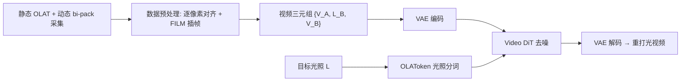

## 一句话总结

BodyReLux 用一套"静态 OLAT + 动态双拼曝光（bi-pack）"的采集流程，配合从文生视频大模型微调而来的视频扩散模型，实现了对特定人物全身表演的、可控且时序一致的高保真重打光。

## 研究背景

- 领域现状：给人物表演重打光是影视后期与内容创作的核心需求。近年扩散模型在**人脸**重打光上已相当成熟，但全身表演的重打光一直难以做到既可控、又真实、又时序稳定。
- 核心痛点：全身比人脸难得多——运动自由度大、自遮挡与互反射强，且服装材质千变万化（从亮面皮革到半透明网纱），随褶皱拉伸不断改变外观。要训练这样的模型，需要"同一段表演在不同光照下逐像素对齐"的视频数据，而高速切换光照采集会产生强烈频闪，令被摄者不适，也依赖上千 fps 的昂贵高速相机。
- 本文 idea：用普通电影摄影机（120fps）采集，把两段缓慢演变的球面光照序列 A、B 在 120Hz 上快速交替播放（数字 bi-pack）。因为切换频率超过人眼 60Hz 的闪烁融合阈值，被摄者只看到两种光照的平滑混合、无频闪。再叠加静态 OLAT 采集补足光照多样性，用这套混合数据微调视频扩散模型。

## 方法

整体框架：先在大型 LED 球内采集数据——静态 OLAT（逐光源拍摄，可线性合成任意 HDRI 光照）加上动态 bi-pack 视频（同一表演在两种光照下逐像素对齐），得到视频训练三元组 $$\{V_A, L_B, V_B\}$$；然后以预训练的 WAN2.2 5B 文生视频模型为骨干，微调成一个"视频到视频"的重打光模型，输入原视频与目标光照，输出重打光后的视频。

关键设计：

1. **采集与数据构造（bi-pack + OLAT）**：LED 球约 1600 个多光谱光源，可用 TTL 脉冲以亚微秒精度与快门同步切换。动态采集时两条 60fps 光序列交替成 120fps；由于两条序列对应帧仍有微小时间错位，用 FILM 插值出中间帧做时序对齐，得到逐像素对齐的 $$V_A'/V_B'$$。插值帧可能有瑕疵，因此只当作条件输入、不作监督目标，避免模型学会合成瑕疵。静态 OLAT 则通过线性空间合成随机 HDRI（从 Polyhaven 采样 50 张、随机水平旋转）补足极端方向光等光照多样性。

2. **OLAToken：一光一 token 的光照条件**：不把 HDRI 压成低维 embedding（会丢动态范围与方向信息），而是把每个光源当成一个 token——包含其 RGB 强度与相机空间方向，经小 MLP 对齐维度后用交叉注意力喂进 DiT。方向用类 NeRF 的 Fourier 特征编码，强度用一组不同 gamma（log 间隔 1/3 到 3）编码以增强色彩表达。这个设计内建两个贴合物理光传输的归纳偏置：**置换不变**（token 顺序不影响结果，像一组光源）和**可组合性**（交叉注意力近似光照的物理叠加）。为效率会先在半球上均匀采样 $$K$$ 个方向、把光源聚合到最近点。

3. **动态光照注意力**：为支持逐帧变化的光照（如环境绕人旋转、走入阳光），若只给 OLAToken 加时间编码，会出现"某帧光照泄漏到其它帧"。本文改用块对角注意力掩码，让某帧的视频 token 只关注该帧对应的光照 token；实现上把时间维和 batch 维展平做逐帧交叉注意力。

4. **训练与长视频推理**：冻结 VAE，仅微调 DiT，用标准 flow-matching 损失。训练时随机长宽比（1:2 到 2:1）、随机序列长度（9~37 帧）、限制 token 数约 5k 并随机裁剪、最近邻重定时做帧率增强，从而对不同画幅/分辨率/帧率鲁棒。推理时虽只训到 37 帧，但对 100 帧内仍鲁棒；更长视频用重叠窗口 + MultiDiffusion 融合成时序一致的结果，可处理超过 200 帧。8×A100 训练约 3 天。

## 实验结果

在留出的 bi-pack 光照序列（含新视角、新表演）上与多种基线对比。指标只在人体分割掩码内计算，T-PSNR 衡量时序一致性（当前帧与光流 warp 的邻帧之间的 PSNR）：

| 方法 | PSNR↑ | SSIM↑ | LPIPS↓ | T-PSNR↑ | 单帧推理↓ |
|------|-------|-------|--------|---------|-----------|
| 本文 BodyReLux | 23.43 | 0.9441 | 0.04208 | 27.90 | 1.8s |
| DifFRelight+ | 21.75 | 0.9425 | 0.08095 | 26.34 | 4.2min |
| SwitchLight3 | 16.88 | 0.8814 | 0.11945 | 26.84 | 1.7s |
| LuxPostFacto | 12.84 | 0.8407 | 0.13341 | 27.18 | 8.7s |
| Allfreq | 11.85 | 0.8139 | 0.20248 | 21.95 | 0.72s |

本文在重打光质量与时序一致性上均最优，速度也合理。DifFRelight+（把人脸重打光方法在本文数据上重训）因逐帧处理、且需跑数百次生成 OLAT 再合成，慢且在遮挡/快速运动区易出瑕疵；SwitchLight3 因物理渲染先验使皮肤过于油亮不自然；LuxPostFacto 等通用模型缺乏特定人物训练，会明显改变身份。整体上特定人物训练显著优于通用模型。

消融要点：去掉 bi-pack 视频数据（只用静态 OLAT 伪运动）无法泛化到真实人体动态；去掉 OLAT 数据则在极端方向光下失效；去掉 OLAToken（换成 CNN 编码 HDRI）重打光精度下降；去掉动态光照注意力会导致光照跨帧泄漏；去掉帧对齐质量相近但输出与输入存在时序错位、影响后期合成；从随机初始化训练（不用预训练权重）结果模糊、高光扩散、精度大跌。换 WAN2.1 1.3B 骨干性能相当，说明方法基本与骨干无关，但因 VAE 压缩比小推理约慢 5 倍。作者还验证了模型近似满足重打光的线性性：$$R(L_A + L_B) \approx R(L_A) + R(L_B)$$ 且 $$R(\alpha L) \approx \alpha R(L)$$。

## 亮点与局限

- 亮点：
  - bi-pack 采集巧妙绕开高速相机与频闪难题——用普通电影机在人眼不可察觉频闪的前提下拿到逐像素对齐的成对视频数据。
  - OLAToken 把光照建模成"一光一 token"，天然带来置换不变与可组合性，比把 HDRI 压成低维 embedding 更能保真动态范围与方向，且支持任意光源组合。
  - 充分利用预训练视频扩散先验，在真实采集数据上微调，兼顾真实感与时序一致性；长视频推理与多画幅增强让它对随手拍摄视频也鲁棒。
- 局限：
  - **特定人物（subject-specific）**：每个人物需专门采集与训练，无法即拿即用地泛化到任意新人物。
  - 依赖大型 LED 球等专业采集设备，数据获取门槛高。
  - 训练光照序列演变缓慢（约每秒一次变化），单靠动态数据的独立光照条件有限，需 OLAT 补足。
  - 模型只训重打光主体，背景重打光只是基座生成先验带来的"副产品"，并非可控结果。

## 延伸思考

- 与 DiffusionRenderer、UniRelight 等"合成数据训练"的通用重打光路线相比，本文押注"真实采集数据 + 特定人物"，用采集质量换泛化性——这条路线在影视级质量要求下更站得住，但可扩展性受限。一个自然的追问是：能否用本文的高质量真实数据去蒸馏/引导一个通用可泛化模型？
- OLAToken 这种"把物理量拆成 token 集合、靠交叉注意力的置换不变与可组合性近似物理叠加"的思路，可能迁移到其它需要条件可组合的生成任务（如多光源、多材质、多声源）。
- bi-pack 利用闪烁融合阈值获取成对监督的想法，或许能推广到其它需要"同场景不同物理状态成对数据"的采集场景。
