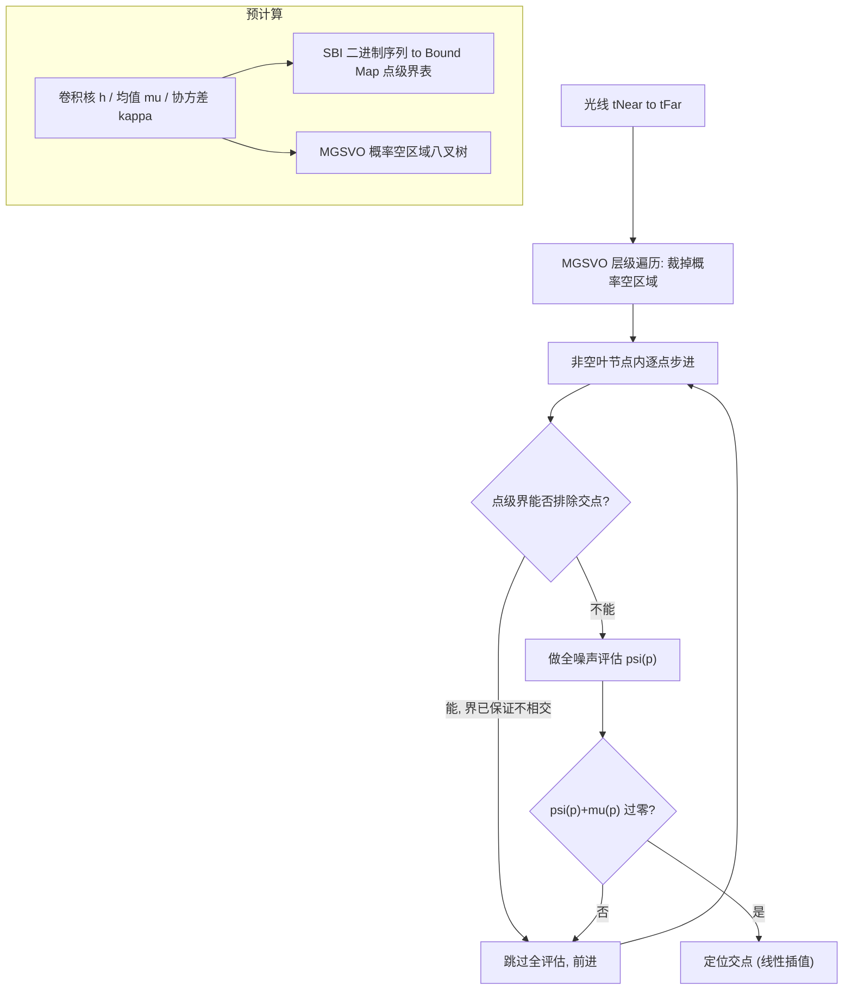

## 一句话总结

通过为高斯过程隐式曲面（GPIS）的光线步进推导出"点级"和"区域级"两种廉价的保守界，在真正做昂贵的噪声全评估之前就提前跳过绝大多数无交点的步进点，把 GPIS 求交（进而整体渲染）加速一到两个数量级。

## 研究背景

- 领域现状：经典光线传输把场景割裂成"确定性表面"和"参与介质"两类分别处理，难以刻画介于两者之间的外观（例如半透明、绒毛状的物体）。Seyb 等人提出的 GPIS 光线传输理论把表面、参与介质及其中间态统一到一个框架里：把曲面看成一个高斯过程 $$f \sim \mathrm{GP}(\mu, \kappa)$$ 的零水平集分布，渲染时对所有实现（realization）做集成平均。Xu 等人进一步用稀疏卷积噪声（sparse convolution noise）近似高斯过程，把函数空间视角下 $$O(n^3)$$ 的多元高斯采样降到 $$O(Nn)$$ 的噪声评估。
- 核心痛点：无论哪种做法，求"光线与曲面的交点"都依赖暴力光线步进——沿光线密集撒步进点，并在**每一个**步进点上做一次完整的噪声全评估。步进点数量随光线长度线性增长，全评估又不便宜，于是求交成了 GPIS 渲染的头号性能瓶颈。
- 本文 idea：关键观察是，要判定"这一点不可能有交点"，往往并不需要精确的噪声值，一个**便宜的保守界**就足够了。于是作者设计了一种便于预计算的脉冲类型，据此构造点级下界快速排除单个步进点，再用空间加速结构构造区域级界，直接把大片"概率上为空"的区域整段裁掉，从根上减少步进点数量。

## 方法

### 整体框架

方法分预计算和运行时两部分。预计算阶段：把稀疏卷积噪声的脉冲权重规整成只取 $$\pm 1/\sqrt{\lambda}$$ 两种取值、并按子格分层排布的**分层伯努利脉冲（Stratified Bernoulli Impulses, SBI）**，从而能用 0/1 二进制序列对实现分类并预存每类的界（bound map）；同时用均值/协方差函数离线构建**均值引导的稀疏体素八叉树（MGSVO）**标记概率空区域。运行时光线步进先遍历 MGSVO 跳过整段空区域，进入非空叶节点后再逐点用点级界过滤，只有当界无法排除交点时才真正做全评估。

### 关键设计

**1) 分层伯努利脉冲（SBI）：让实现可分类、可预计算。** 稀疏卷积噪声把零均值分量写成脉冲贡献之和 $$\psi(\boldsymbol{x}) = \sum_i w_i h(\boldsymbol{x}, \boldsymbol{q}_i)$$。以往用高斯权重 $$w_i$$，但作者指出稀疏卷积之所以趋于高斯是靠中心极限定理、而非权重本身必须高斯，因此可以只用两种权重 $$\pm 1/\sqrt{\lambda}$$（伯努利），并把每个格子（cell）再切成 $$N$$ 个子格（subcell），每个子格放一个脉冲。这样一条一维实现就被其脉冲权重的**符号序列**（一串 0/1 二进制）唯一分类，为逐类预存界打开了大门。作者用 Cramér–von Mises 统计量验证：随着每格脉冲数 $$N$$ 增大，SBI 近似仍快速收敛到目标高斯过程，且即便在较低 $$N$$ 下渲染结果与高斯脉冲也肉眼无差。

**2) 点级界与 Bound Map：跳过单点的全评估。** 由于核 $$h$$ 对称且随距离单调衰减，单个脉冲贡献的下界只取决于它到步进点的最近/最远子格端点距离，于是可以把"步进点右侧 $$N$$ 个脉冲"的贡献下界按其二进制序列 $$\mathbf{s}$$ 预计算成一张大小 $$2^N$$ 的表 $$B(\mathbf{s})$$；查询时把左右两侧序列的表项相加即得整体下界 $$\bar\psi(\boldsymbol{p})$$。当 $$N$$ 变大导致 $$O(2^N)$$ 存不下时，把长序列切成定长块（实现里 16 bit 一块）分别预存，空间降到 $$O(\lceil N/M \rceil 2^M)$$、查询降到 $$O(\lceil N/M \rceil)$$。步进时只要下界（配合均值项与路径条件更新项）已能保证不过零，就直接跳过全评估。作者还把该框架扩展到非平稳、各向异性核：把核参数离散化后作为 bound map 的额外维度即可。

**3) 区域级界与 MGSVO：整段裁掉概率空区域。** 点级界降低了每点成本，却没减少步进点总数。为此作者借三西格玛法则，对任意区域 $$V$$ 给出区域级界 $$\bar{\mu}_{\min}(V) - 3\bar\sigma(V) \le \psi(\boldsymbol{x}) \le \bar{\mu}_{\max}(V) + 3\bar\sigma(V)$$，凡满足 $$\bar{\mu}_{\min}(V) > 3\bar\sigma(V)$$ 或 $$\bar{\mu}_{\max}(V) < -3\bar\sigma(V)$$ 的区域即判为"概率空"。这些界通过 MGSVO 组织：当均值 $$\mu$$ 是有 Lipschitz 常数的函数（如常见的 SDF，天然 1-Lipschitz）时能给出严格界。光线步进只在非空叶节点区间内进行，并加均匀抖动缓解体素结构带来的走样。针对多物体场景，作者提出**解耦（disentangled）区域级界**：对每个物体独立判空，每个叶节点只维护"对它非空"的物体列表，从而只评估真正相关的 GPIS，避免"对所有物体取最小"导致的裁剪失效。

## 实验结果

作者在 Tungsten 渲染器上实现，基于 Seyb 等人的 GPIS 实现，CPU 为 i9-12900K。以 Seyb 等人的函数空间方法为基线（speedup ×1），Xu 等人的一维稀疏卷积方法为主要对比对象。下表取 1 spp 下的渲染统计，对比本文与 Xu 等人在"需做全评估的步进点数"和渲染时间上的差异——这是本文加速的核心来源。

| 场景 | 方法 | 全评估步进点 (M) | 求交耗时占比 | 渲染时间 (s) |
|------|------|------------------|--------------|--------------|
| Dragon | Xu et al. | 180.70 (100%) | 99.61% | 31.33 |
| Dragon | 本文 | 4.77 (2.6%) | 96.84% | 2.28 |
| Lion | Xu et al. | 169.69 (100%) | 99.47% | 29.73 |
| Lion | 本文 | 8.48 (5.0%) | 97.72% | 4.64 |
| Cloud | Xu et al. | 158.04 (100%) | 99.78% | 28.43 |

两种界合计把全噪声评估减少了最高 97.4%。等时（10 分钟）对比下，本文相对函数空间基线的 MSE 加速在多个场景达到约 ×100 甚至 ×118，相对 Xu 等人的一维稀疏卷积方法约 ×10。消融显示：单用区域级界即带来最大收益（直接裁空区域），点级界在小 $$N$$ 时锦上添花、但随 $$N$$ 增大重新变得关键；解耦区域级界明显优于纠缠版本；用 SBI 替换高斯脉冲本身（不加界）只带来微小提速，其真正价值在于支撑了预计算的界。

## 亮点与局限

- 亮点：
  - 把确定性隐式曲面的光线步进加速思想（Lipschitz 界、空间加速结构）成功迁移到"边渲染边采样"的随机隐式曲面 GPIS 上，抓住了"廉价保守界即可判非交"这一本质。
  - SBI 的二进制分类使得对随机实现做预计算成为可能，点级 bound map 与区域级 MGSVO 两级裁剪配合，收益可叠加。
  - 解耦区域级界针对多物体重叠场景的裁剪策略实用且有效。
- 局限：
  - 点级界依赖核的对称性、随距离单调衰减、非平稳时局部参数化且对参数单调等假设，限制了适用核的类别。
  - 区域级界是高置信界而非严格界，理论上引入偏差；当均值高频变化且无 Lipschitz 条件时，采样估界可能不可靠；大量物体的低概率占用区叠加后整体占用概率可能不再可忽略。
  - 对"处处高方差或均值近零"的场景，高概率空区域稀少，两种界都会失效。
  - 整个方法建立在一维稀疏卷积噪声上：并非所有协方差函数都有解析卷积核，且为采样表面法线，卷积核仍被限制为全局各向异性。

## 延伸思考

本文最有启发的一点是把"生成一个随机实现"拆成多个阶段，每个阶段只暴露关于实现形状的**部分但可行动**的信息，从而在完整实现构造出来之前就做出决策——区域级界只用均值/协方差，点级界再加上 SBI 权重，最后才做全评估。这套"分阶段推断、提前决策"的思路对其他昂贵随机过程的渲染与推断都可能通用。作者也指出 SBI 的潜力尚未挖尽：例如用 SBI 权重预计算 Lipschitz 界，可支撑自适应步长，去攻克当前失效的高方差场景。此外，方法目前在 CPU 上实现，向 GPU 迁移、以及与 NEE 等更完整的 Monte Carlo 估计器结合，都是值得追问的方向。
