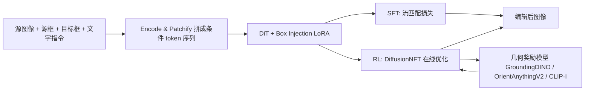

## 一句话总结

BoxCtrl 用"三面涂成不同 RGB 颜色的 3D 包围盒"作为视觉提示词，配合"先监督微调、再强化学习"的两段式训练，让扩散模型在单张真实图片上完成平移、缩放、旋转及其组合的精确几何编辑，同时保持物体身份和视觉真实感。

## 研究背景

- 领域现状：随着指令式图像编辑模型和多模态大模型的发展，很多编辑任务已经可行。为了追求更精确的空间控制，出现了大量用视觉提示做几何编辑的工作，可分为 2D 引导（控制点、2D 框、blob）和 3D 引导（先重建 3D 模型再投影回 2D）两类。
- 核心痛点：文本天生模糊，不适合"旋转 60 度""放大 1.2 倍"这类需要精确空间控制的任务；2D 引导在大幅 3D 变换（尤其大角度旋转）下会破坏结构，产生扭曲；3D 引导虽然表达力强，但依赖高质量 3D 重建，且要求用户会用 3D 软件，门槛高。此外带精确标注的成对几何编辑数据极其稀缺。
- 本文 idea：用 3D 包围盒作为基础表示，但把盒子的三个正交面涂成不同的 RGB 颜色，一次性编码位置、尺寸和朝向。这种"RGB 3D 包围盒"作为一种紧凑、直观的上下文视觉示例，让模型把几何控制和外观控制解耦，从而学到同色面之间的对应关系，准确理解几何意图。

## 方法

整体框架：以 FLUX.1-Kontext-dev（一个 DiT 扩散模型）为底座，输入源图像、源 RGB 3D 框、目标 RGB 3D 框和一段文字指令，模型推断两个框之间的几何变换并把它施加到源图物体上，输出编辑后的图像，其余内容保持不变。训练分两阶段：先用合成成对数据做监督微调（SFT）打好基础能力，再用真实世界的无配对数据做在线强化学习（RL）弥合"仿真到真实"的域差。

关键设计：

- RGB 3D 包围盒视觉提示：现有抽象视觉提示中，2D 框无法表达 3D 变换，单色（灰色）3D 框能表示位置和尺寸但对朝向有歧义。BoxCtrl 把盒子三个正交面涂成不同颜色，当模型看到同色面的旋转时就能推断朝向变化，从而在不引入冗余参数的前提下把位置、尺寸、朝向统一进一个视觉提示，并保证不同编辑配置之间足够可区分。同时提供源框和目标框作为上下文示例，让模型学"相对变换"，泛化到真实图。

- Box Injection LoRA 与通道偏置位置编码：为参数高效微调，在 DiT 注意力投影层和线性层（QKV、输出、FFN）注入并联 LoRA 权重；文字 token 与视觉 token 拼成序列，并用"通道偏置位置编码"给噪声潜变量、图像条件、源框、目标框四类 token 加上模态专属偏移以互相区分。

- 监督微调（SFT）：用成对合成数据训练，输入源图像、源框、目标框、文字指令，用流匹配损失优化，让模型具备基本几何编辑能力。但只靠 SFT 因合成与真实之间的域差而泛化受限。

- 强化学习（RL）与联合奖励：采用 DiffusionNFT 这一在线 RL 框架，用无配对真实数据显式优化几何精度。核心是联合奖励函数：平移与缩放用 GroundingDINO 检测编辑后物体框、计算与目标框的 IoU；旋转用 OrientAnything-V2 估计角度、以 $$r_{rot} = 0.5 + 0.5\cos(\theta_{pred} - \theta_{tgt})$$ 度量；视觉保真用 CLIP-I 图像相似度。三项加权求和构成联合奖励。为稳定优化，还设了"零奖励兜底"：检测置信度不达标（GroundingDINO 阈值 0.25、OrientAnythingV2 阈值 0.5）的样本判为无效并给零奖励。

- 数据构建：SFT 数据用 Kubric 引擎（基于 Blender + GSO 扫描物体）合成，从 GSO 中筛出 235 个干净且类别多样的物体，固定相机、随机选 HDRI 背景，对前景做随机平移（范围 [-0.5, 0.5]）、缩放（[0.3, 3.0]）、绕 y 轴旋转（[-180, 180]），每 30 度均匀采样并配对，共 23,976 个带精确变换参数和 3D 框标注的样本，再用 Gemini-2.5-Flash 生成文字描述。RL 数据取自 PIE-Bench 和 Subjects200k 的 1,164 个无配对样本（人 20%、动物 40%、场景 40%），用 DetAny3D 估计初始 3D 框、按指令变换得到目标框，无需真值编辑图。

## 实验结果

以 FLUX.1-Kontext-dev 初始化，在 512×512 图像上先 SFT 26K 步（LoRA rank 128），再 RL 60 epoch（LoRA rank 32）。在自建基准上对平移、缩放、旋转、组合四类任务与指令式编辑（FLUX-Kontext、Qwen-Image-Edit）、视觉提示编辑（Magic Fixup、FreeFine）、3D 感知生成（LooseControl、Build-A-Scene）等方法比较。下表摘取旋转任务与组合任务的核心指标（越高越好）：

| 方法 | 旋转 RotAcc↑ | 旋转 CLIP-I↑ | 组合 IoU↑ | 组合 RotAcc↑ |
|------|------|------|------|------|
| FLUX-Kontext | 0.515 | 0.980 | 0.456 | 0.554 |
| Qwen-Image-Edit | 0.695 | 0.910 | 0.352 | 0.634 |
| Magic Fixup | 0.511 | 0.844 | 0.509 | 0.626 |
| FreeFine | 0.585 | 0.830 | 0.458 | 0.572 |
| LooseControl | 0.505 | 0.956 | 0.444 | 0.549 |
| Build-A-Scene | 0.614 | 0.755 | 0.534 | 0.641 |
| 本文 | 0.899 | 0.901 | 0.682 | 0.841 |

指令式模型（FLUX-Kontext）往往几乎照抄输入、忽视几何指令而拿到虚高的相似度；Qwen-Image-Edit 因文本歧义空间映射不准；FreeFine 和 Magic Fixup 在平移缩放上尚可，但在复杂旋转和组合任务上明显吃力。本文在旋转和组合这两个最难任务上大幅领先。消融实验证实：RGB 框比灰色框更能捕捉面对应、区分朝向，"源框+目标框"双框比只给目标框显著更准；文字提示加不加影响很小，说明 RGB 框视觉提示主导生成；RL 在合成集上作用不大（SFT 已够），但在真实集上把 IoU 从 0.618 提到 0.682、RotAcc 从 0.752 提到 0.841，有效弥合域差（代价是 CLIP-I / DINO-I 轻微下降）。方法还在大幅变换、反射面、复杂光照、拥挤场景、遮挡、未见的 pitch/roll 旋转以及多物体迭代编辑等挑战场景中表现稳健。

## 亮点与局限

- 亮点：
  - RGB 三面着色的 3D 包围盒是一个简洁而巧妙的表示，用颜色一次性编码位置、尺寸、朝向，把几何控制和外观解耦，不需要显式 3D 网格重建。
  - "SFT + 在线 RL"两段式训练针对性地解决了成对数据稀缺和仿真到真实域差两大痛点，联合奖励覆盖平移缩放、旋转、保真三个维度。
  - 在旋转和组合编辑这类以往最容易失败的任务上取得明显领先，且支持单张真实图端到端编辑，用户门槛低。

- 局限：
  - 依赖 DetAny3D 在推理时检测源 3D 框、OrientAnything-V2 / GroundingDINO 提供奖励与评测，这些外部模型的误差会传导到编辑质量（论文也报告了约 1% 与 8% 的失败率）。
  - RL 在提升真实数据几何精度的同时让 CLIP-I / DINO-I 等保真指标下降，几何精度与身份保真之间存在权衡。
  - 合成 SFT 数据主要绕 y 轴旋转，pitch/roll 属零样本泛化；训练分辨率仅 512×512。

## 延伸思考

- "用彩色几何代理作为视觉提示"的思路可推广到更多可控生成场景，例如给相机位姿、光照方向或关节结构也配上带方向语义的着色代理，让扩散模型从颜色对应中读出控制意图。
- 与同期 3D 感知编辑工作（如把物体升成可编辑 3DGS 再操控的路线）相比，BoxCtrl 走的是"不重建、只给抽象几何提示"的轻量路径；两条路线在精度、可编辑自由度和真实感上的取舍值得对照。
- 强化学习阶段用现成检测/朝向模型当奖励，本质是把"可微/不可微的几何评测器"接入扩散后训练，这套奖励设计范式可迁移到布局、姿态等其他需要显式空间约束的生成任务。
