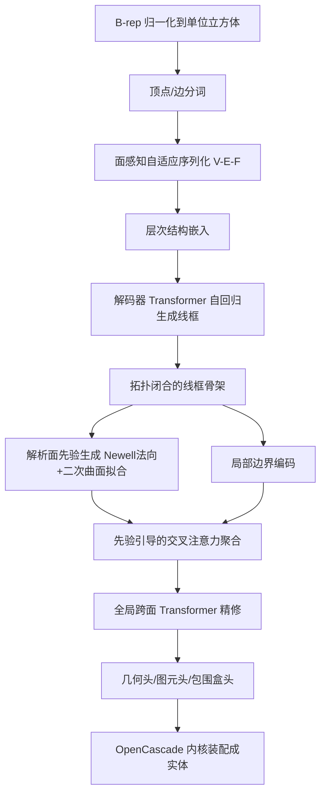

## 一句话总结

BrepForge 观察到 B-rep 中线框（拓扑）承载了远高于面（几何）的信息熵，据此把 B-rep 生成拆成"线框合成 + 边界约束的曲面实例化"两个阶段，用面感知的自回归模型先搭出拓扑闭合的骨架，再借助解析几何先验把曲面生成变成受约束的精修任务，从而在几何复杂度和拓扑有效性上超越现有方法。

## 研究背景

边界表示（B-rep）是现代 CAD 的事实标准，能对实体几何给出数学精确的描述。但基于学习的 B-rep 合成一直很难，核心难点在于离散拓扑与连续几何紧密耦合。

已有方法各有短板：

- **命令式方法**（DeepCAD、SkexGen 等）通过预测建模操作序列间接生成，但大多局限于"草图-拉伸"这类简单模式，且依赖稀缺的完整建模历史数据。
- **多阶段直接合成**（SolidGen、BrepGen、DTGBrepGen）把生成拆成级联子网络逐个预测图元，容易出现级联误差累积，早期的小误差会导致最终 B-rep 无效。
- **单阶段端到端方法**（HoLa-Brep、AutoBrep、BrepGPT 等）把所有几何实体压进统一图或一维长序列，学习负担重、训练不稳定，难以扩展到复杂模型。

作者提出一个关键洞察：B-rep 存在**信息不对称**——线框相比面承载了不成比例的大量信息。因为多数面来自低次典范图元（平面、圆柱），其内部几乎完全由边界决定；即便是自由曲面（NURBS）也被边缘骨架强约束。一旦线框确定，可行曲面空间就高度受限。因此把整个 B-rep 当作单体建模是冗余的。

## 方法

BrepForge 把 B-rep 合成分解为两阶段：先自回归生成拓扑一致的线框，再在边界约束下实例化曲面几何。

**阶段一：面感知自回归线框生成**

- **分词**：顶点用 10-bit 均匀网格量化到 $$\{0,1,\dots,1023\}$$，落入同格的顶点合并。边采用分层混合编码：直线不编码几何（由端点隐式确定），圆弧用量化中点 + 两端点三点定义，复杂曲线（椭圆、B样条等）先采样 32 点再用 RQ-VAE 压成 12 个离散 token。
- **自适应面感知序列化**：暂时放松全局流形约束，把线框拆成独立面的集合。每个面 $$S_i$$ 序列化为有序边界环（外环逆时针、内环顺时针），环内做顶点-边交错遍历：

$$S_i = [\langle \text{face\_start} \rangle, \langle \text{loop\_start} \rangle, \boldsymbol{v}_1^i, \langle \text{edge\_type} \rangle, \boldsymbol{e}_1^i, \boldsymbol{v}_2^i, \cdots]$$

各面序列按规范顺序拼接成完整线框 $$S = S_1 \oplus S_2 \oplus \cdots \oplus S_{N_f}$$。全局 V-E-F 拓扑之后可通过合并同坐标顶点、合并重合边来恢复。
- **层次结构嵌入**：每个 token 关联一个五元结构多重索引 $$I(S_k \mid S_{\lt k}) = (I_{\text{face}}, I_{\text{loop}}, I_{\text{type}}, I_{\text{geom}}, I_{\text{intra}})$$，编码其在 B-rep 层级中的角色而非绝对位置，带来结构不变性。

**阶段二：边界约束的曲面实例化**

- **对称不变面表示**：面归一化后在 UV 域采 $$32 \times 32$$ 网格得到 $$\boldsymbol{f}_i \in \mathbb{R}^{N \times N \times 3}$$。针对 UV 域固有的 $$D_4$$ 对称（一个物理面对应 8 种网格排布），做确定性几何规范化（按 $$L_1$$ 能量最大象限对齐左上），再用 CNN-VAE 压成 48 维隐码。
- **解析面先验**：用 Newell 算法估计稳健法向、投影建立局部正交基、拟合二次曲面、在外环包围盒上采 $$32 \times 32$$ 网格，得到先验 $$\boldsymbol{f}_i^{\text{prior}}$$。内环空洞不显式裁剪，交给 CAD 内核最终处理。
- **精修网络**：边界边用 1D 卷积（局部曲率）+ MLP（全局顶点对）双路编码；用门控残差交叉注意力把边界特征聚合到面描述子：

$$\boldsymbol{h}_i = \text{LayerNorm}(\boldsymbol{q}_i + g \cdot \text{Attn}(\boldsymbol{q}_i, \boldsymbol{K}_i, \boldsymbol{V}_i))$$

再用全局跨面 Transformer 做自注意力保证一致性，最后三个预测头分别回归隐码、分类图元类型（平面/圆柱/球/复杂）、精修包围盒。多任务损失为：

$$\mathcal{L} = \mathcal{L}_{\text{geom}} + \lambda_{\text{box}} \mathcal{L}_{\text{box}} + \lambda_{\text{type}} \mathcal{L}_{\text{type}}$$

推理时按类型做曲面拟合，与线框整合后用 OpenCascade 装配成实体。

## 实验结果

在 ABC 数据集（过滤后约 280k 单体模型，90/5/5 划分）上评测。无条件 B-rep 生成的主要结果如下，其中 CC 为圈复杂度，衡量结构复杂性：

| Method | COV (%↑) | MMD (↓) | JSD (↓) | Novel (%↑) | Unique (%↑) | Valid (%↑) | CC (↑) |
| --- | --- | --- | --- | --- | --- | --- | --- |
| BrepGen | 66.17 | 1.65 | 1.74 | 99.6 | 96.6 | 60.0 | 28.9 |
| DTGBrepGen | 65.99 | 1.63 | 1.61 | 99.7 | 96.4 | 64.6 | 32.6 |
| BrepDiff | 66.03 | 1.69 | 1.58 | 99.7 | 96.0 | 62.5 | 32.1 |
| Ours w/o refine | 59.45 | 2.01 | 1.97 | 99.1 | 95.6 | 57.4 | 35.3 |
| Ours w/o prior | 69.98 | 1.43 | 1.19 | 99.8 | 97.1 | 66.2 | 44.7 |
| Ours | 72.65 | 1.24 | 0.92 | 99.8 | 97.3 | 70.9 | 47.2 |

BrepForge 在所有指标上均领先，有效性达 70.9%、CC 达 47.2，说明生成的模型拓扑更丰富、水密性更好。消融显示：去掉解析先验会明显掉点，去掉精修网络（直接用先验当最终曲面）掉得更狠，二者缺一不可。线框生成方面，无条件生成的 COV/MMD/JSD 全面优于 BrepGen、DTGBrepGen、CLR-Wire；点云条件重建仅用 4,096 点即以 CD 0.76、EMD 2.11、F-score 0.93 超越需 20,000 点稠密输入的 RFEPS 与 NerVE。

## 亮点与局限

**亮点**

- 抓住了 B-rep 中"线框高熵、曲面低熵"的信息不对称，把难题因式分解为拓扑合成与几何精修，从根本上缓解了单体建模的表示瓶颈。
- 面感知序列化把复杂全局拓扑拆成局部重复的几何单元，直接编码 V-E-F 层级并保证拓扑闭合，靠简单合并即可恢复全局拓扑。
- 学习无关的解析几何先验提供了高质量"热启动"（99.3% 包围盒、95.3% 曲面 CD 误差落在最低误差区间），让网络专注残差精修。

**局限**

- 自回归序列长度较大（排除了超 8,000 token 的极端样本），计算效率仍有提升空间，作者将其列为未来工作。
- 面自编码器目前靠确定性规范化处理 $$D_4$$ 对称，尚未做到显式 $$D_4$$ 不变，方向歧义仍需缓解。
- 周期曲面需沿缝边切开以避免先验构造歧义，属于对数据的预处理约束。

## 延伸思考

- "高熵结构 + 低熵几何"的因式分解思路可能推广到其它拓扑-几何强耦合的生成任务，比如网格、场景图或建筑结构生成，核心是识别哪部分是真正的决策瓶颈。
- 把不可学习的解析先验当作生成的初始猜测、再让网络只学残差，这种"传统几何算法 + 神经精修"的混合范式在几何生成里很务实，既降低学习负担又提升可控性与有效性。
- 有效性从约 60% 提到 70.9% 仍不算高，说明纯学习方法离工业级 CAD 的严格拓扑要求还有距离；把 CAD 内核的几何约束更深地嵌入生成回路，或许是下一步关键。
