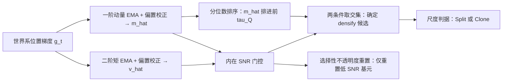

## 一句话总结

CAdam 把 3D 高斯的稠密化从"梯度幅值累积的启发式"重新诠释为"统计信号验证问题"，用 Adam 式的一阶动量分离出真实几何信号、用二阶矩构造的信噪比做门控，从而在文本到 3D 的生成式蒸馏中把高斯数量减少 85%–97%，且视觉质量基本持平。

## 研究背景

- 领域现状：优化式的生成式 3DGS（把预训练 2D 扩散/流模型的知识蒸馏进 3D 高斯空间，即 SDS、ISM、VFDS 这一系）已成为文本到 3D 合成的主力范式。但控制结构演化的核心机制——稠密化（densification）——几乎原封不动地沿用自重建导向的管线，没有针对生成式监督做适配。
- 核心痛点：标准稠密化依赖"位置梯度幅值累积"，其隐含假设是"梯度幅值是几何误差的可靠代理"。这在重建里成立（渲染图收敛到固定真值，梯度自然衰减，持续大梯度=欠重建）；但生成式监督由随机时间步、随机噪声和随机视角诱导的伪目标提供，梯度存在持续的非收敛性和方向抖动（作者称之为 zigzag 现象）。于是幅值累积无法区分"连贯的几何漂移"与"随机噪声波动"，陷入作者定义的稠密化困境（Densification Dilemma）：阈值过低会无节制地增殖冗余高斯，阈值过高又会抑制有效细化、导致几何欠拟合，且没有任何固定阈值能解决这个歧义。
- 本文 idea：既然噪声是零均值的，就不该看幅值，而该看"方向是否一致"。把梯度当向量累积——随机噪声因相位相消（destructive interference）互相抵消，一致的几何漂移则因相长（constructive interference）累积成稳定方向。再辅以基于分位数的场景上下文感知和基于信噪比的可靠性门控，实现只对统计上可靠的信号触发细化，并在信号消失时自动"软终止"稠密化。

## 方法

CAdam 的主干思想：把"何时稠密化"这一决策，从幅值检测改造为统计信号验证，整个流程分三步——先用动量向量提取真实几何信号，再用"分位数排序 + 内在信噪比"双条件筛选可靠候选，最后把结构操作（克隆/分裂）解耦出来只作用于验证通过的候选。

### 关键设计

- 基于动量的信号验证（Momentum-based Signal Verification）：把动量不当作优化加速器，而当作"验证几何信号是否连贯"的工具。直接在世界空间累积位置梯度（$$g_t = \nabla_{\mu_{xyz}} \mathcal{L}$$），去掉随机相机采样带来的投影相关抖动。用指数滑动平均更新动量并做偏置校正得到无偏估计 $$\hat{m}_t = m_t / (1 - \beta_1^t)$$。由于噪声零均值，高频波动被相消抵消、几何漂移被累积保留，于是 $$\hat{m}_t \approx \bar{g}_t$$（真实几何漂移）。这样即使在梯度幅值很小的细节区域，只要方向一致就能被检测到，正好补上幅值启发式失效的地方。对新生成的高斯，用该高斯自身的"年龄"而非全局迭代数做偏置校正。
- 上下文自适应选择（Context-Adaptive Selection）：单看动量绝对大小不够，因为梯度尺度会随优化衰减。于是引入两重条件。其一是分位数选择——用群体统计导出动态阈值，$$\hat{m}_i$$ 的范数只有超过全场景动量范数的 $$\tau_Q$$ 分位（如 0.9）才作候选；这天然形成"由粗到细"的自动调度：早期挑大动量的粗结构修正，后期全局梯度衰减时仍能相对地凸显细节区域。其二是基于信噪比的选择——用二阶原始矩 $$\hat{v}_t$$ 定义内在信噪比 $$\text{SNR}_t = \lVert \hat{m}_t \rVert^2 / (\sqrt{\lVert \hat{v}_t \rVert_1} + \epsilon)$$，只有 $$\text{SNR}_t > \tau_{\text{SNR}}$$ 才通过。噪声主导的高斯因相消而 $$\lVert \hat{m}_i \rVert$$ 小、因幅值累积而 $$\lVert \hat{v}_i \rVert$$ 大，故 SNR 低被过滤。两条件取交集：当几何收敛（$$\bar{g}_t \to 0$$）时动量中的连贯信号消失、方差项仍在累积，SNR 自然跌破阈值，从而实现软终止，避免继续产生冗余基元。
- 选择性结构细化（Selective Structural Refinement）：把"何时稠密化"与"如何改几何"解耦。触发只由统计一致性（动量 + SNR）决定，而克隆还是分裂仍沿用标准的空间尺度判据（$$\lVert S_i \rVert_\infty > \tau_{\text{scale}}$$ 则分裂，否则克隆），因此不引入新的几何超参、可无缝接入现有 3DGS 管线。此外提出选择性不透明度重置：标准做法周期性全局重置不透明度，会无差别损害合理几何、还制造人为梯度尖峰污染动量历史；CAdam 只对低 SNR 的不可靠基元重置为 0.01，使其在后续剪枝中被移除，兼顾稳定性（保留成型结构）与可塑性（清理噪声伪影）。

## 实验结果

主实验在三种蒸馏目标对应的代表性框架上评估：GaussianDreamer（SDS）、LucidDreamer（ISM）、FlowDreamer（VFDS），对比标准稠密化。核心结论是高斯数量与存储大幅下降，而质量指标（CLIP、ImageReward、HPS v2、NIQE）大体持平，其中 ImageReward 在三种目标下都有提升。

| 目标 / 方法 | ImageReward↑ | HPS v2↑ | NIQE↓ | 高斯数↓ | 存储↓ |
|------|------|------|------|------|------|
| SDS Baseline | -0.125 | 0.194 | 9.908 | 1067K | 46.4MB |
| SDS CAdam | -0.028 | 0.185 | 9.643 | 143K | 6.1MB |
| ISM Baseline | 0.413 | 0.225 | 6.438 | 1706K | 110.6MB |
| ISM CAdam | 0.518 | 0.225 | 8.167 | 81K | 5.3MB |
| VFDS Baseline | 0.436 | 0.235 | 7.183 | 3373K | 218.8MB |
| VFDS CAdam | 0.486 | 0.237 | 8.891 | 82K | 5.3MB |

其余实验用文字概述：用户研究（30 人盲测双选，2AFC）中 CAdam 总体偏好率 49.5% 对基线 50.4%，基本持平，说明压缩没有牺牲可感知质量。训练动态分析显示基线的基元数量爆炸式增长直至显存溢出（OOM），而 CAdam 稳定收敛在小得多的数量；梯度曲线上标准累积被噪声主导并衰减到噪声底，CAdam 则通过动量保留更持久的结构信号。消融显示：只用动量会在后期失控 OOM，加上上下文自适应选择能抑制增长但若无选择性不透明度重置则表征会被过度抑制直至消失，三者缺一不可。阈值敏感性实验表明 $$\tau_Q$$ 与 $$\tau_{\text{SNR}}$$ 构成一个在紧凑性与质量间可调的控制旋钮。

## 亮点与局限

- 亮点：
  - 诊断清晰——把生成式蒸馏中稠密化失效的根因归纳为"稠密化困境"，并从梯度=几何漂移+零均值噪声的分解出发，论证了幅值累积必然纠缠信号与噪声，理论动机扎实。
  - 方法优雅——复用 Adam 一/二阶矩的现成机制，把优化器里的"动量"重新诠释成"信号验证"，不引入新的几何超参，作为即插即用模块能横跨 SDS/ISM/VFDS 多种目标与多种主干。
  - 效果显著——85%–97% 的基元削减和成比例的存储节省，同时质量指标与人评基本持平，SNR 门控带来的软终止机制自然解决了"何时停止稠密化"这一长期靠手调的问题。
- 局限：
  - 并非无阈值方法——作者明确指出过松阈值会退回基线式过稠密，过紧阈值会对细弱结构（薄部件、低对比细节）欠稠密。
  - 质量"大体持平"而非全面提升——CLIP、NIQE 在部分设置下会波动甚至变差（如 ISM/VFDS 的 NIQE 上升），主打的是压缩效率而非保真度提升。
  - 遗留失败多源于生成主干本身提供的语义/多视角信号不一致，这与本文聚焦的密度控制正交，未在本文范围内解决。

## 延伸思考

- 把优化器的矩估计"跨界"用作结构演化的决策信号，是一个很有启发的视角迁移；类似思路或可推广到其他显式表征（如点云、体素、网格）的自适应细分场景，凡是监督带随机性的地方都可能存在同样的"幅值 vs 方向"错配。
- CAdam 与重建式 3DGS 的诸多稠密化改进（方向一致性约束、局部自适应阈值、后剪枝等）是互补的——本文强调的是"在随机监督下"这一区别性设定，若把这些重建侧技巧与信号验证结合，或能进一步压榨紧凑性。
- 值得追问的是内在 SNR 门控与不透明度、剪枝的耦合是否会在极端 prompt 下产生结构塌缩，以及分位数阈值随场景复杂度自适应（而非固定 0.9）是否能进一步缓解对细弱结构的欠稠密。
