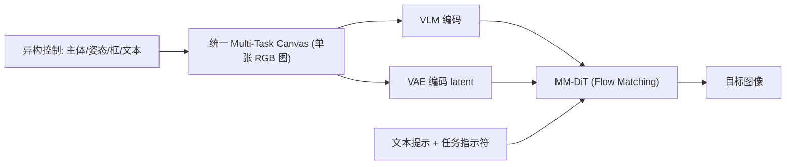

## 一句话总结

把主体参考图、空间布局、姿态骨架、文本标注框等异构控制信号全部"画"进同一张 RGB 画布图，让扩散模型直接读这张画布来做统一的视觉-空间推理，从而在一个模型里同时实现多主体合成、姿态控制和布局约束。

## 研究背景

- 领域现状：大规模扩散模型在图像质量和多样性上已经很强，但用户想同时用多种方式精确控制生成（比如既要指定主体身份、又要摆位置、还要限定姿态和版式）时仍很吃力。
- 核心痛点：现有控制机制各管一摊——ControlNet、T2I-Adapter 之类靠姿态/深度做结构控制；GLIGEN、CreatiDesign 之类靠框做布局控制；IP-Adapter 之类做主体注入。它们通常只解决孤立任务，且互不兼容。像 StoryMaker、ID-Patch 这种尝试同时做身份注入+空间控制的方法，依赖多个模块（ControlNet 叠 IP-Adapter）堆砌，复杂、只支持人脸注入、不支持框、泛化差。根本难点在于这些输入在结构和语义上高度异构，很难让一个模型联合解释并平衡它们。
- 本文 idea：与其为每种控制设计专门模块，不如把所有控制信号统一编码成一张"复合画布"RGB 图。模型看到的输入永远是一张图，天然规避了模态融合的架构复杂度，也让不同控制在同一像素空间里协同。

## 方法

整体框架是一个 VLM–Diffusion 架构：把统一的 Multi-Task Canvas（一张 RGB 图）交给视觉-语言模型编码成 token，再和该画布的 VAE latent、带噪 latent、文本提示嵌入一起送进多模态 DiT，用 Flow Matching 预测速度做去噪。训练时每一步只采样一种画布类型，但推理时能把从未一起见过的控制组合起来用。

关键设计分为三块：

1. **三种画布变体（Multi-Task Canvas）**。核心贡献是把不同复合任务归一到"一张 RGB 图"这一共享格式：
   - **Spatial Canvas**：把分割出来的主体贴到带遮罩的背景上，形成一张显式的复合图，用于多主体个性化合成。关键是用 Cross-Frame Sets（跨帧配对主体和背景）来构造，避免简单拼贴带来的"复制粘贴"伪影。
   - **Pose Canvas**：在 Spatial Canvas 上以特定透明度叠加姿态骨架。半透明是关键设计——骨架清晰可辨作结构引导，底下主体身份仍能被模型恢复。训练时随机丢弃主体片段，让"只有姿态、空画布"的情况也存在，从而支持姿态作为独立模态在推理时单独使用。
   - **Box Canvas**：直接把带文字标签的边界框画到画布上，每个框内写明该区域应出现哪个主体及其大小（人物标识按从左到右排序），实现无参考图的文本+框布局控制。
2. **任务指示符防串味**。因为不同画布代表不同控制含义，作者在用户提示前加一个短文本 token（如 `[Spatial]`、`[Pose]`、`[Box]`）作为任务指示符 c，消歧任务上下文、防止模式混合。
3. **Multi-Task Canvas Training 与涌现泛化**。用任务感知的 Flow-Matching 损失联合训练：

   $$L_{\text{flow}} = \mathbb{E}_{x_0,x_1,t,h,c}\left[\; \lVert v_\theta(x_t, t, [h; c]) - (x_0 - x_1) \rVert_2^2 \;\right]$$

   其中 $$x_0$$ 是目标 latent、$$x_1$$ 是噪声 latent、$$x_t$$ 是插值 latent，$$h$$ 是由画布得到的 VLM 嵌入与 VAE latent 的拼接，$$c$$ 是任务指示符，网络预测速度 $$v_t = x_0 - x_1$$。尽管每个训练样本只含单一控制类型，模型却能泛化到训练时从未见过的多控制组合——这种从单任务学习涌现出的多任务应用能力是本框架的关键性质。

实现上基于 Qwen-Image-Edit，用 LoRA（rank 128）微调注意力和图像/文本调制层、冻结前馈层以保留预训练画质；在 32 张 A100 上训练 200K 步。数据由 6M 跨帧图（1M 身份）的人物数据集构造 Spatial/Pose 画布，Box 画布借用 CreatiDesign 的框标注数据。

## 实验结果

在四个 benchmark（4P 合成、姿态叠加 4P 合成、布局引导合成、多控制合成）上对比 Qwen-Image-Edit、Nano-Banana（Gemini 2.5 Flash Image）、Overlay Kontext、CreatiDesign。指标含 ArcFace 身份相似度、HPSv3 画质、VQAScore 文图对齐、Control-QA 控制符合度（LLM 打 1–5 分）。下面取主实验"4P 合成"任务的方法×指标对比：

| 方法 | ArcFace↑ | HPSv3↑ | VQAScore↑ | Control-QA↑ |
|------|----------|--------|-----------|-------------|
| Qwen-Image-Edit | 0.258 | 13.136 | 0.890 | 3.688 |
| Nano-Banana | 0.434 | 10.386 | 0.826 | 3.875 |
| Overlay Kontext | 0.171 | 12.693 | 0.879 | 2.000 |
| 本文 | 0.592 | 13.230 | 0.901 | 4.000 |

本文在身份保持（ArcFace 0.592，远超次优 0.434）和控制符合度上均领先，同时画质与基础模型相当。其余三个 benchmark 结论一致：姿态引导合成中本文姿态对齐与身份保持最好；布局引导合成中甚至超过专门为该任务训练的 CreatiDesign；多控制合成里唯一能同时满足身份、姿态、框约束。消融显示，从只用 Spatial Canvas 逐步加入 Pose、Box 画布，Control-QA 从 4.156 升到 4.281、HPSv3 从 10.786 升到 12.044，验证多任务训练的有效性。所有 benchmark 结果均由同一个统一模型产生。

## 亮点与局限

- 亮点：
  - 用"一张 RGB 画布"这一极简统一接口消化所有异构控制，不需要额外模块或架构改动，计算成本恒定。
  - 涌现式泛化：只用单控制样本训练，推理时能组合从未一起见过的控制，扩展性好。
  - 无论主体数量多少都保持恒定计算成本，为多主体、多控制个性化提供了可扩展范式。
- 局限：
  - 受限于单张 RGB 画布的信息密度，能承载的控制信息量有上限（作者自己在附录讨论了这一点）。
  - 训练依赖 6M 规模的内部人物数据集，难以复现；主体主要围绕"人"，非人物体的泛化验证有限。
  - Nano-Banana 等闭源基线可能未用 segment 类输入训练，对比条件不完全对等。

## 延伸思考

把异构控制"渲染成一张图"再交给统一多模态模型，本质上是把控制问题从"架构设计"转移到"数据表示"，这和近年"一切皆序列/一切皆图像"的统一建模趋势一脉相承。值得追问的是：当控制种类继续增多（如深度、材质、光照、多视角），单张画布的信息密度瓶颈如何突破——是分层画布、多张画布拼接，还是引入非 RGB 的辅助通道？另外任务指示符这种"软路由"机制是否可扩展成更细粒度的控制强度调节，也是有意思的方向。
