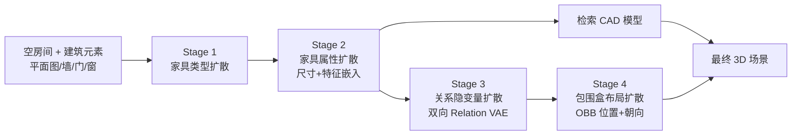

## 一句话总结

CasLayout 把 3D 室内家具布局生成拆成四个级联的条件扩散阶段（家具类型 → 家具属性 → 关系隐变量 → 包围盒），并用"稀疏关系图 + 双向 VAE"隐式建模物体间空间关系，从而在保真度、可控性和数据效率上都取得了 SOTA。

## 研究背景

- 领域现状：3D 室内场景合成已从早期基于规则的方法转向数据驱动的生成模型，近年扩散模型能提供较强的全局上下文，一些工作还引入场景图来引导生成。
- 核心痛点：端到端扩散模型试图直接学习家具类型、尺寸、朝向、位置的高维联合分布，在 3D-FRONT 这类数据量有限的数据集上很难可靠地学到完整流形；而引入场景图的方法普遍用**全连接稠密关系图**，$$N^2$$ 复杂度带来相互冲突的约束，且大多数物体对之间并没有内在设计逻辑（关系分布接近均匀、高熵噪声），既稀释了真正的功能约束，又与人类"只指定少数关键关系"的稀疏描述习惯不符。
- 本文 idea：借鉴专业设计师的工作流，把难解的联合生成拆解成一串条件概率子任务（级联扩散），显式地把墙/门/窗等建筑元素作为约束条件，并用稀疏关系图配合双向 VAE 把关系压缩进一个紧凑的节点对齐隐空间，实现直观、灵活且物理合理的可控生成。

## 方法

整体框架：给定一间带有平面图、墙、门、窗的空房间，CasLayout 依次运行四个 DDPM 扩散阶段，每一阶段的输出都作为下一阶段的条件输入，2D 平面图始终通过 cross-attention 注入每个网络，逐步从"要放什么"推进到"放在哪里"。

关键设计：

1. **级联四阶段分解**：把联合分布 $$p(\text{布局})$$ 因式分解成"类型 → 属性 → 关系 → 包围盒"的条件链。第一阶段在建筑元素条件下预测家具数量和类别（含 None 类判断存在性）；第二阶段生成尺寸与特征嵌入，其中特征嵌入用预训练 VQ-VAE 编码，仅用于从 3D-Future 检索 CAD 模型，不作为后续条件（避免小数据集上过拟合）；第三阶段生成关系隐变量；第四阶段生成朝向包围盒（OBB）。所有阶段共享同一个 Transformer 骨干（自注意力捕捉物体内部依赖 + cross-attention 融合平面图），并统一加一个对建筑元素 OBB 的辅助重建损失 $$L_{rc} = \frac{1}{m}\sum_{i=1}^{m}\lVert \boldsymbol{B}_i - \hat{\boldsymbol{B}}_i \rVert_2^2$$ 来保留结构信息。

2. **隐式稀疏关系建模**：作者先定义局部坐标系下的空间关系（方向、距离、对齐、对称，以及家具到墙/门/窗的距离），保证旋转不变性。再做图稀疏化——把家具按功能区（如就餐区、休闲区）分组，区内保留关系、区间只在每个区选一个锚点建关系。用熵 $$H(X) = -\sum_{i=1}^{n}\sum_{j=1}^{m} p(x_{ij}) \log_2 p(x_{ij})/n$$ 度量，客厅方向关系的平均熵从 1.62 降到 1.04，说明过滤掉了接近均匀分布的背景关系、保留了低熵的设计逻辑。

3. **双向 Relation VAE + 关系隐扩散**：稀疏化后若仍用显式 $$N \times N$$ 矩阵表示会造成冗余，于是设计一个 Transformer VAE 把有向关系图编码进 $$N$$ 个节点对齐的隐向量，把二次复杂度降到线性。编码器用"in-out cross attention"：对每个节点分别在其入度子图和出度子图上做两次 cross-attention 聚合双向关系上下文，再经自注意力交互。之后再训练一个 DDPM 在这个隐空间里合成关系隐变量。

4. **协同训练与建筑元素约束**：由于关系隐变量直接影响包围盒布局，关系 VAE 与包围盒扩散阶段联合训练（损失 1:1 加权），让扩散误差回传优化 VAE 隐空间的可用性。包围盒扩散用"self-cross-cross"注意力，第一层 cross-attention 关注关系隐变量以维持物体间关系一致性，第二层关注平面图特征以捕捉全局房间上下文。此外，级联的模块化设计天然支持用 LLM/VLM 替换类型与关系阶段，实现 text-to-scene、image-to-scene 等零样本任务。

## 实验结果

在 3D-FRONT 上按 DiffuScene / InstructScene 的划分评测。下表为主实验之一：带平面图条件生成、卧室场景，与主流基线的对比（↓ 越低越好）。CasLayout 为与其他方法相同数据设置训练的版本，CasLayout-G 为加了数据增强的通用模型。

| 方法 | FID↓ | KID↓ ×10⁻³ | SCA↓ % | TKL↓ ×10⁻² | IoU↓ % |
|------|------|------------|--------|------------|--------|
| LayoutGPT-GPT-4o | 20.42 | 6.45 | 75.68 | 7.12 | 0.56 |
| ATISS | 18.77 | 2.60 | 64.54 | 0.96 | 0.67 |
| DiffuScene | 18.48 | 2.73 | 62.62 | 1.53 | 1.16 |
| GLTScene | 19.80 | 2.93 | 65.34 | 0.81 | 0.62 |
| CasLayout | 17.53 | 1.28 | 59.62 | 0.95 | 0.55 |
| CasLayout-G | 17.17 | 1.50 | 60.51 | 1.02 | 0.38 |

其余结论用文字补充：在有/无平面图两种设置下，CasLayout 在 FID、KID、TKL、SCA 上全面领先；36 人用户研究中 CasLayout-G 的偏好率约 62%~64%，远超其它方法；关系可控性实验中各类关系的满足率约 90% 或更高；用最新采样器（UniPC 15 步 / DPM-Solver++ 25 步）可在单张 A6000 上 25~40 ms 生成一个场景，接近实时。消融验证了级联分解、稀疏关系（vs 稠密）、隐式表示（vs 显式）、协同训练以及 in-out attention（VAE 重建精度从稠密图的 91.07% 提到 99.39%）各组件的有效性；显式建模门窗把与门窗操作空间的重叠 IoU 从个位数提升到 17~25，说明有效避免遮挡。

## 亮点与局限

- 亮点：
  - 用"设计师工作流"启发的四阶段级联，把难学的高维联合分布拆成一串可控的条件分布，缓解数据稀缺、又天然暴露多个控制接口。
  - 稀疏关系图 + 双向 VAE 的隐式关系建模，从信息熵角度论证了"稀疏即降噪"，把二次复杂度压成线性隐空间，可控性与人类描述习惯对齐。
  - 一个统一模型（CasLayout-G）无需重训即可覆盖生成、补全、重排、编辑、text/image 驱动等多种任务，推理接近实时。
- 局限：
  - 依赖大规模标注 3D 场景数据，在分布外或极端场景（如家具数量远超训练集）会产生碰撞、不合理布局。
  - 级联结构的误差传播：早期阶段一旦出严重错误，后续阶段无法纠正。
  - 家具检索基于固定 CAD 库，风格多样性受限；关系建模只考虑成对关系，未覆盖高阶/群组关系；目前仅面向室内，扩展到室外/城市规划需重新定义关系与阶段。

## 延伸思考

- "把联合分布因式分解成条件级联"是应对小数据高维生成的通用思路，和自回归布局、扩散级联(如粗到细的 TSDF 生成)一脉相承，但这里的分解语义特别贴合设计流程，值得借鉴到其它结构化生成任务（如 UI 布局、电路布局）。
- 稀疏关系图 + VAE 隐空间的做法把"控制信号稀疏性"从工程优化上升为对人类认知的忠实映射，若能进一步支持群组/高阶关系与可微的关系编辑，会更接近真实设计工具。
- 用 LLM/VLM 做语义规划器、扩散模型做几何执行器的"分工"范式很实用，规避了 LLM 数值预测不准的短板；未来结合 image-to-3D 与神经形状生成，或可摆脱固定 CAD 库对风格多样性的束缚。
