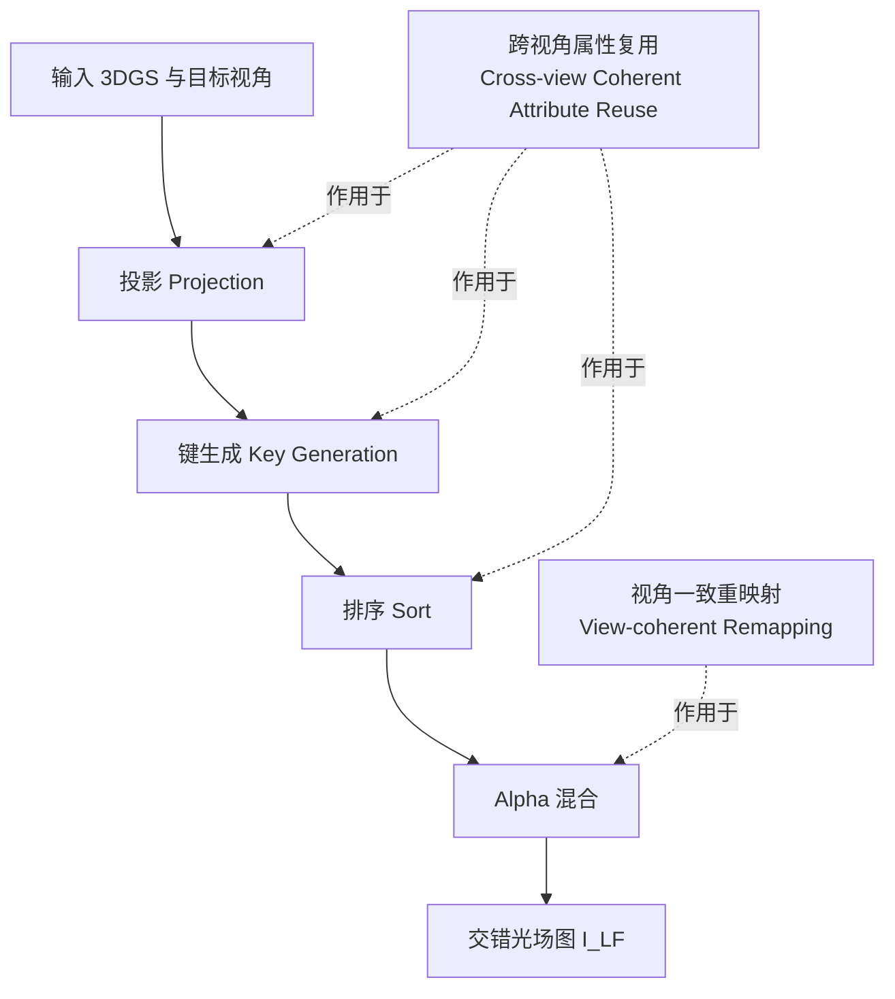

## 一句话总结

CoherentRaster 把 3D Gaussian Splatting 直接搬到光场显示器的子像素级光栅化上，通过跨视角属性复用消除冗余计算、再用视角一致重映射恢复 GPU 显存合并访问，实现消费级显卡上 4K 光场图像的实时渲染。

## 研究背景

光场显示器（Light Field Display, LFD）无需佩戴设备即可提供裸眼立体和连续运动视差，但它需要把几十到上百个视角的观测编码进一张交错（interlaced）图像里。这种多视角需求带来巨大的计算负担：传统流水线要为每个目标视角渲染完整图像再交错采样，计算与显存开销随视角数线性增长，在 2K 甚至更高分辨率下几乎无法实时。

3DGS 在单视角 2D 显示上通过基于瓦片（tile）的光栅化可以跑到数百帧，但直接扩展到 LFD 有两条已有加速路线各有硬伤：

- **子像素级渲染**（DirectL 及其 3DGS 扩展）只渲染真正出现在交错图中的子像素，避免无用像素。但交错布局下相邻子像素常来自不同视角，破坏了 GPU 依赖的空间局部性——同一 warp（32 线程）内的线程访问互不相干的视角属性，显存合并访问失效，warp 效率大幅下降。
- **多平面图像（MPI）方法**利用跨视角相干性让相邻视角共享中间结果，但高保真需要上百个深度平面，开销随分辨率急剧膨胀，在消费级硬件上难以实时。

CoherentRaster 的目标就是同时吃到子像素级渲染的省算优势和跨视角相干的复用优势，又不背上 MPI 的重量级中间表示。

## 方法

给定一组 3D 高斯 $$\boldsymbol{G} = \{G_i\}_{i=0}^{M-1}$$ 和显示器配置（目标视角集合与视点索引矩阵 $$\boldsymbol{V}$$），CoherentRaster 直接为每个子像素 $$(x, y, u)$$ 判定哪些高斯以什么颜色贡献，直接合成交错光场图 $$I_{LF}$$，而不生成任何完整的单视角图像。

流水线在标准 3DGS 的四个阶段（投影、键生成、排序、alpha 混合）上做子像素级扩展，并叠加两个核心策略。

**视点索引矩阵**：对柱透镜式 LFD，每个子像素按其在光栅单元内的水平偏移被指派到唯一视角索引：

$$d_{offset} = 3x + u + 3y \tan(\alpha) - K_{offset}$$

$$j = \left\lfloor \frac{N \cdot (d_{offset} \bmod L_x)}{L_x} \right\rfloor$$

其中 $$\alpha$$ 为光栅倾角、$$L_x$$ 为光栅线数、$$K_{offset}$$ 为透镜-面板错位偏移、$$N$$ 为视角总数。收集所有子像素的 $$j$$ 得到视点索引矩阵。

**跨视角属性复用（Cross-view Coherent Attribute Reuse）**：把 $$N$$ 个视角均匀划分成 $$K$$ 个不相交簇 $$\{V_0, \dots, V_{K-1}\}$$，每簇用几何中心视角 $$v_k'$$ 代表。观察到不同属性对视角变化的敏感度不同：

- 2D 均值 $$\boldsymbol{\mu}_{i,j}^{2D}$$ 随视角明显移动（直接影响瓦片覆盖），因此**逐视角**独立计算。
- 2D 协方差、深度、SH 颜色随邻近视角平滑变化，只在簇代表视角 $$v_k'$$ 计算一次并复用给簇内所有视角：

$$\boldsymbol{\Sigma}_{i,k}^{2D} = \Pi_{cov}(v_k'; G_i), \quad d_{i,k} = \Pi_{depth}(v_k'; G_i), \quad c_{i,k} = \Pi_{SH}(v_k'; G_i)$$

键生成时按簇（而非按视角）产生高斯-瓦片对，64 位排序键打包瓦片 ID、簇 ID 与深度 $$key_{i,t} = (t, k, d_{i,k})$$，大幅削减待排序的对数量。偶尔会把某高斯误分到簇内某些视角实际不可见的瓦片，但最终 alpha 混合按精确的均值/协方差评估，冗余高斯贡献的不透明度可忽略，不损画质。

**视角一致重映射（View-coherent Remapping）**：交错布局让同一瓦片内线程的视角索引发散，访问不同高斯列表。该策略先把子像素按视点索引排序，存进预计算查找表 $$\Psi$$（透镜几何固定，只算一次），使连续线程满足视角单调性：

$$\boldsymbol{V}[\Psi(r)] \leq \boldsymbol{V}[\Psi(r+1)]$$

于是同一 warp 内线程访问相同或相邻的高斯列表，恢复显存合并访问。最终子像素强度按前后向 alpha 混合累积：

$$C(\hat{x}) = \sum_{i \in N} c_{i,k}^{(u)} \alpha_i \prod_{p=1}^{i-1} (1 - \alpha_p)$$

$$\alpha_i = o_i \cdot \exp\left(-\frac{1}{2}(\hat{x} - \boldsymbol{\mu}_{i,j}^{2D})^\top \boldsymbol{\Sigma}_{i,k}^{2D-1} (\hat{x} - \boldsymbol{\mu}_{i,j}^{2D})\right)$$

注意均值用逐视角的 $$\boldsymbol{\mu}_{i,j}^{2D}$$，而协方差与颜色用簇复用的 $$\boldsymbol{\Sigma}_{i,k}^{2D}$$、$$c_{i,k}$$。

## 实验结果

在 RTX 5090 上，基于 gsplat 实现，默认簇大小取 8，集成 AccuTile 保证准确的高斯-瓦片相交。下表为与各类基线在渲染速度上的对比（FPS，越高越好）：

| Rendering | Method | Synthetic Blender 2K | Synthetic Blender 4K | Mip-NeRF 360 2K | Mip-NeRF 360 4K |
| --- | --- | --- | --- | --- | --- |
| Full-Frame | 3DGS | 5.8 | 4.1 | 3.9 | 2.1 |
| Full-Frame | 3DGS (batch=36) | 20 | 13 | 7.4 | 4.0 |
| Subpixel | Subpixel-3DGS | 28 | 19 | 11 | 5.7 |
| MPI | MPI | 0.8 | 0.4 | 0.8 | 0.4 |
| Ours | CoherentRaster | 88 | 56 | 30 | 16 |

相较全帧 3DGS 流水线取得约 7.6× 加速，同时以原始 3DGS 渲染作为伪真值衡量，画质仅有可忽略的下降（$$|V_k|=8$$ 时 Synthetic Blender 达 PSNR 约 52 dB、SSIM 约 0.999）。消融显示两个策略各有贡献：去掉两者退化为 Subpixel-3DGS（2K 28 FPS），单加重映射升到 67 FPS，再加复用达到 88 FPS。MPI 基线因深度平面离散化 PSNR 仅约 20 dB 且速度极慢。作者称这是首个在真实世界 3D 场景上实现超过 2K 分辨率实时光场渲染的方法。

## 亮点与局限

**亮点**

- 直接在子像素级做光栅化，从根源上避免了全帧多视角渲染的无用计算。
- 用"属性对视角敏感度分层"的洞察做跨视角复用：只逐视角算敏感的 2D 均值，其余簇内共享，既省算又不引入 MPI 那样的离散化伪影。
- 视角一致重映射用一次性预计算查找表恢复 warp 级显存合并，是一个几乎零额外开销的工程巧思。
- 在消费级 Looking Glass 显示器 + 单卡上跑通 4K 实时，实用价值明确，并开源代码。

**局限**

- 簇大小是效率与质量的显式权衡：簇越大越快，但高保真难以完全保持，需按显示规格调参（2K-63 视用 16、4K-71 视用 18）。
- 按簇生成键会把高斯误分到部分视角不可见的瓦片，虽被 alpha 混合自然抑制，但本质上是一种近似。
- 方法与柱透镜式交错 LFD 的几何强绑定，视点索引矩阵依赖固定的显示参数。
- 缺乏真实采集的 ground truth，画质以原始 3DGS 渲染作伪真值评估，衡量的是对 3DGS 的逼近程度而非绝对保真度。

## 延伸思考

这项工作本质是把"哪些计算真正影响最终交错像素"这个问题拆到子像素粒度，再用相干性把可共享的部分聚合起来——这套"敏感度分层 + 复用 + 内存重排"的思路对其他交错/多视角输出（如某些 AR 光波导、时分复用显示）可能同样适用。一个自然的延伸是让簇划分自适应：在视差平缓区域用大簇、在遮挡边界处细分，把当前固定簇大小的全局权衡变成局部最优。另外，跨视角复用的假设（协方差/颜色随视角平滑）在强高光或高频 SH 场景下可能失效，如何在这些区域回退到逐视角计算而不破坏 warp 一致性，是值得探索的方向。
