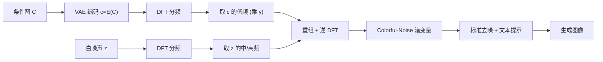

## 一句话总结

通过把扩散模型初始白高斯噪声的低频分量替换成参考图（色块/涂鸦/照片）的低频，就能在**不训练、几乎零额外开销**的情况下同时控制生成图像的整体结构与配色，而高频细节仍自由随机、保证多样性。

## 研究背景

- 领域现状：隐扩散与 flow-matching 模型是当前视觉内容生成的主流，它们把白高斯噪声潜变量逐步去噪成图像。白噪声"无结构、不可解释"的特性带来了多样性，但也让人难以从噪声层面控制或预测生成结果的具体视觉属性。
- 核心痛点：现有的可控生成大多依赖训练辅助网络（ControlNet、IP-Adapter、T2I-Adapter）、LoRA 微调、注意力操纵或噪声反演。这些方法要么需要训练/优化、要么任务专用，且多条件叠加时因抽象层级和空间精度不同容易相互干扰。直接操纵潜噪声本身因扩散模型脆弱、白噪声无结构而少有人碰。
- 本文 idea：作者对白高斯噪声做频率分析，发现**低频决定全局结构与配色、中频影响细微外观、高频几乎不影响视觉**。据此提出 Colorful-Noise——只把噪声的低频换成参考图低频（配合缩放系数保持"白度"），即可把结构和颜色注入到生成过程，是一条注入在去噪之前、与其它条件互不竞争的轻量路径。

## 方法

整体框架：给定一张 RGB 条件图 $$C$$ 和一个白噪声潜变量 $$z \sim \mathcal{N}(0,1)$$，先用 VAE 编码器把 $$C$$ 编码到潜空间得到 $$c = E(C)$$；再对 $$c$$ 和 $$z$$ 分别做 2D 离散傅里叶变换并按截止频率拆成低/中/高频；最后用条件图的低频替换噪声的低频，重组并逆变换，得到"有偏但仍近似白"的 Colorful-Noise，喂给标准去噪流程。

关键设计：

- **频率提取算子 F**：把潜变量 $$z \in \mathbb{R}^{C \times H \times W}$$ 逐通道做 DFT 得到 $$\hat{z}$$，再按两个截止值 $$\alpha, \beta \in [0,1]$$ 拆出低频（频率小于 $$\alpha$$）、中频、高频三段：$$\hat{z}_L, \hat{z}_M, \hat{z}_H = F(z; \alpha, \beta)$$。方法里只区分低频与其余，故取 $$\beta = 1$$。这是整套操作的数学积木，逆算子 $$F^{-1}$$ 负责重组并逆变换。
- **低频注入与条件公式**：核心是 $$z_c = F^{-1}(\gamma \hat{c}_L, \hat{z}_M, \hat{z}_H)$$，即用条件图低频 $$\hat{c}_L$$ 替换噪声低频，保留噪声自身的中高频。这样全局结构与配色由参考图决定，细节由噪声高频自由生成，从而在同一条件下也能产出多样结果。
- **缩放系数 γ 与"白度"保持**：自然图像的低频能量远高于白噪声，直接替换会让噪声偏离最优分布（"whiteness shift"）。引入 $$\gamma$$ 缩放注入频率的能量，用功率谱密度（PSD）跨通道带内功率的标准差衡量白度（越低越均匀）。消融显示：$$\alpha$$、$$\gamma$$ 越小越能保持谱平衡；$$\alpha$$ 过大会过度约束结构，$$\gamma$$ 过大导致模糊和掉色，较小的 $$\gamma$$ 能在颜色、结构与文本对齐间取得平衡。
- **参数按输入类型选取**：色彩涂鸦/草图本身低频占主导，用 $$\alpha = 0.03$$、$$\gamma \approx 0.04$$，只替换极少低频并强归一化；自然图像低频占比较低，用 $$\alpha = 0.125$$、$$\gamma \approx 0.2$$。还支持"遮罩条件"（仅在涂画区域替换噪声）与"全图条件"两种模式。方法与架构无关，在 UNet 的 SDXL 和 flow-based 的 Flux 上都成立，也可与 ControlNet、StyleAligned 等高频控制方法叠加而不冲突。

## 实验结果

在 Aesthetic-4K 评测集的 195 张图上，围绕三类"保色"任务与主流方法对比：图像变体（Image Variation）、色块到图（Colorfield-to-Image）、图到图色彩迁移（I2I Color Transfer）。指标为 CLIPScore（文图对齐，越高越好）和两种 Earth Mover's Distance（EMD，越低越好，Localized 衡量局部结构/色彩一致性，Global 衡量全局色彩分布）。下表取"图像变体"任务为主实验：

| 方法 | 引导类型 | CLIPScore↑ | L-EMD↓ | G-EMD↓ |
|------|------|------|------|------|
| SDXL | 仅文本 | 34.84 | 20.08 | 12.91 |
| T2I Adapter-Color | 反演 | 33.68 | 14.14 | 10.46 |
| Shum et al. 2025-ZS | 原图 | 32.25 | 17.40 | 2.10 |
| Ours | 低频 | 33.68 | 8.84 | 5.47 |

本文方法在保持文图对齐的同时，Localized-EMD（局部结构与色彩一致性）显著领先，且是所有对比方法中**唯一相对 SDXL 基线不增加任何显存或运行时开销**的方案。在色块到图、色彩迁移任务上也取得最佳或有竞争力的局部一致性。整体趋势是：引导越宽松（从全结构+色彩，到局部色彩，再到全局色彩分布），保色性能相应下降。此外还做了提示词层级消融（空/最简/详细/色彩感知/对抗五档），发现色彩感知提示能强化"颜色—主体"的语义对应，而对抗性提示揭示了方法在分布外情形下可能偏离预期条件的局限。

## 亮点与局限

- 亮点：
  - 真正的 training-free、零额外开销，只在去噪前对初始噪声做一次频域替换，实现极简。
  - 干净地把控制信号注入噪声层，避免与文本、结构、风格等条件相互竞争，可与 ControlNet / StyleAligned 等叠加使用。
  - 频率-语义对应的分析（低频=结构与颜色，高频=细节）跨架构成立（SDXL 与 Flux），并支撑了分层生成探索、色彩对齐、保色风格化等多种创意应用。
- 局限：
  - 需按条件输入的频率特性手工调 $$\alpha$$、$$\gamma$$，Flux 等模型对噪声扰动更敏感、需更小的值，因而更偏交互式、不适合全自动大规模生成。
  - 条件作用在潜空间，遮罩被大幅下采样，导致控制较粗、难做精细引导。
  - 分布外或对抗性条件下颜色可能被违背用户意图地重新解释；降低 $$\gamma$$ 有时能改善对齐，但也可能同时损害结构与颜色。

## 延伸思考

这项工作把"噪声即随机源"的常见假设换成"噪声是可解释、可分频操控的信号"，与 blue-noise 扩散、噪声反演、频率感知生成（如 FDS）等一脉相承，但胜在无需优化与训练。一个自然的追问是能否**学习图像与噪声潜变量之间的关系**，实现跨输入分布的自动选参，摆脱手工调 $$\alpha$$、$$\gamma$$ 的负担。作者也指出频率分解思路可延伸到视频、3D 等域，以及进一步做高频条件化、解耦颜色与结构等方向，对需要可控且低成本条件生成的场景很有参考价值。
