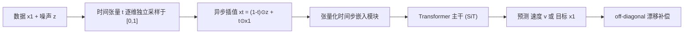

## 一句话总结

ComboStoc 指出扩散/流匹配模型训练时对"路径空间"的采样是有偏的，只需把标量时间步 $$t$$ 张量化、让数据的每个维度和属性各自异步采样一个 $$[0,1]$$ 内的时间值，就能均匀覆盖组合空间，从而显著加速图像训练、让结构化 3D 形状生成从"几乎不可用"变得可用，并顺带解锁了逐维度分级控制的推理新玩法。

## 研究背景

- 领域现状：扩散模型（DDPM、score-based、flow matching）在各领域是主流生成范式，它们都可统一到 stochastic interpolants 框架下——把源噪声分布沿一条插值路径变换到目标数据分布。当下最强的图像模型（DiT、SiT）用 Transformer 把图像当作一堆 patch token 并行生成，每个 token 又是高维特征向量。
- 核心痛点：现有训练只沿"源点到目标点"的单一插值路径（对角线）采样。作者证明这会造成**采样密度不均**：越靠近目标数据点密度越高，远离的区域训练不足。推理时一旦踩到这些欠训练区域就会产生低质量预测。对数据稀疏（如 PartNet 只有 18K 形状）或维度极高（图像 patch × 通道、3D 部件 × 多属性）的组合复杂场景，这个问题被维度灾难进一步放大。
- 本文 idea：与其只沿对角线采样，不如**充分采样源点与目标点张成的整个矩形子空间**。做法极简：把插值时间 $$t$$ 从标量改成与数据同形状的张量 $$\mathbf{t}$$，每个维度/属性独立均匀采一个 $$[0,1]$$ 的值。这样子空间内采样密度按构造即为均匀，故名 ComboStoc（Combinatorial Stochasticity）。

## 方法

整体框架：ComboStoc 只改动扩散训练里"时间步如何注入"这一处。标准插值 $$\mathbf{x}_t=(1-t)\mathbf{z}+t\mathbf{x}_1$$ 里的标量 $$t$$ 被替换为逐维度时间张量，得到 $$\mathbf{x}_\mathbf{t}=(1-\mathbf{t})\odot\mathbf{z}+\mathbf{t}\odot\mathbf{x}_1$$，其中 $$\odot$$ 是逐元素乘。训练时把不同 patch/部件、不同属性、不同特征通道都给不同的时间值，网络因此被迫在整个组合子空间上学习去噪，而不只是对角线上那一条路径。

关键设计：

1. **采样偏差的定量分析**。作者把某点 $$\mathbf{x}$$ 被采样到的密度写成对插值路径上所有高斯的积分 $$\rho(\mathbf{x})=\int_0^1 G_{\mathbf{p}_t}(\mathbf{x})\,dt$$，虽无闭式解，但可证明 $$(\mathbf{x}_1-\mathbf{x})\cdot\nabla\rho(\mathbf{x})>0$$，即密度沿着指向目标点的方向单调增长——严格说明了标准训练的覆盖会向数据点收缩。异步时间步则让子区域内密度均匀。

2. **张量化时间步嵌入**。因为时间从标量变成了与数据同形状的张量，SiT 的时间嵌入模块要改造：先对张量每个元素做正弦/余弦频率编码并压到很小的维度（$$C_C=4$$，远小于隐藏维 $$1152$$），再像 ViT patch embedding 那样把这张"时间特征图"嵌成 token。用广播语义把同一时间值分配给需要同步的多个维度，于是 unsync\_none / unsync\_patch / unsync\_vec / unsync\_all 等配置只是时间张量形状不同。

3. **证明仍是合法生成流**。作者把 flow matching 里以 $$\mathbf{x}_1$$ 为条件的向量场，换成以 $$(\mathbf{x}_0,\mathbf{x}_1)$$ 为条件、在矩形子空间上的时间无关向量场，并验证边缘化后的 $$\mathbf{u}_t$$ 与概率路径 $$p_t$$ 满足连续性方程，因此异步训练得到的模型在标准标量时间推理下依然生成正确分布。

4. **off-diagonal 漂移补偿**。若在异步采样点只回归原始速度 $$\mathbf{x}_1-\mathbf{z}$$，推理积分到终点会偏离目标 $$\mathbf{x}_1$$，偏移量为 $$(\mathbf{t}_0-t_0)\odot(\mathbf{x}_1-\mathbf{z})$$。作者定义 off-diagonal 偏移向量 $$\delta(\mathbf{x}_\mathbf{t})$$，让积分额外沿其负梯度（等价于最小化漂移势 $$\Phi=\tfrac{1}{2}\lVert\delta\rVert^2$$）走，把轨迹拉回目标点。他们还试过"锥形速度场"方案，但因归一化放大导致回归不稳、效果更差。

5. **两个域的落地**。图像沿用 SiT 的 $$v$$-prediction 隔离 ComboStoc 的效果；结构化 3D 形状则用 $$x$$-prediction，因为它把部件的存在指示 $$s$$、包围盒 $$\mathbf{b}$$、512 维形状码 $$\mathbf{e}$$ 混在一起，直接预测目标更稳。3D 形状表示为最多 $$L=256$$ 个叶子级语义部件的集合，部件索引置换不改变形状。

## 实验结果

主实验为结构化 3D 形状生成中"组合复杂度逐级增强"的消融（PartNet chair 类），最能体现核心主张——组合复杂度越强、方法越关键，其中 unsync\_none 几乎无法生成有意义的形状：

| 配置 | FPD↓ | COV↓ | MMD↓ |
|------|------|------|------|
| unsync\_none | 7.99 | 1.32 | 1.23 |
| unsync\_part | 4.71 | 1.03 | 1.95 |
| unsync\_att | 7.47 | 1.83 | 1.38 |
| unsync\_att\_part | 3.51 | **0.85** | 1.04 |
| unsync\_vec | 4.62 | 0.97 | **0.63** |
| unsync\_all | 4.04 | 0.86 | 0.68 |

其余结论用文字概述：

- 图像上，ComboStoc（unsync\_all）在 ImageNet 上系统性优于 SiT/DiT 基线——同为 XL 规模、参数还略少（673M vs 675M），400K 步 FID 15.69（SiT 17.2 / DiT 19.5）、800K 步 11.41（SiT 12.6 / DiT 14.3）；换算成墙钟时间的对比同样成立。四种配置里 unsync\_all 最好，unsync\_none 最差（因时间嵌入模块变小甚至略逊原始 SiT），说明增益来自组合采样而非架构。所有 FID 均用同步推理测得。
- 与专门利用部件层级信息的 StructureNet、StructRe 相比，ComboStoc 不用层级信息、直接生成叶子级部件，指标仍落在基线区间内，且视觉多样性更强。
- 漂移补偿消融（ImageNet 前 100 类）：off-diagonal drift minimization 的 FID 103.01、SSIM 0.262，优于无补偿（103.75 / 0.255）和锥形速度场（113.59 / 0.224）；标量指标提升不大但视觉上消除了保留区域边界的接缝。
- 分级控制应用：异步推理下可对参考图做连续（非二值）软 inpainting、按象限/通道设不同保留权重 $$t_0$$，还发现 VAE 潜空间早期通道偏结构、后期通道偏颜色；3D 上可固定部件底座做形状补全、给定部件做装配。

## 亮点与局限

- 亮点：
  - 改动极小（把标量时间步张量化）却普适，图像与结构化 3D 形状两个差异极大的域都受益，代码改动对基线架构侵入很低。
  - 有理论支撑：给出采样密度沿数据点收缩的证明，以及异步训练仍生成正确概率路径的连续性方程推导。
  - 训练加速与推理新能力"一鱼两吃"——同一套异步训练顺带解锁了逐维度分级控制、连续软 inpainting、部件装配等无需额外训练的应用。

- 局限：
  - ImageNet 上采用"半 batch 异步 + 半 batch 同步"的混合策略，作者自承可能次优、最优调度留待未来。
  - 3D 生成用的是 SiT-small 且依赖 Wang et al. 预训练的部件形状 VAE，规模与端到端程度有限；部件装配还简化为"旋转已给定"，旋转部件的更难情形未解决。
  - 分级控制里"统一步长"与"统一步数"两种推理调度差异很小，说明该接口的设计空间尚未充分挖掘。
  - CFG 强引导下（cfg=1.5）与 SiT 长训练模型的 FID 差距会缩小，极致质量优势主要体现在收敛速度与低数据场景。

## 延伸思考

- ComboStoc 与 REPA、DeepFlow、RAE 等加速/表征方向正交，作者提示可以叠加，值得验证组合复杂度采样 + 表征蒸馏能否进一步提速。
- 逐维度异步时间步的思想与视频扩散里"给后续帧更强噪声"、AR-Diffusion 的帧级时间步、以及像素级异步去噪等工作同源，但本文独有的视角是"训练期组合覆盖"，把它推广到视频、长序列或更复杂的属性图是自然方向。
- 连续 $$t_0$$ 掩码带来的软 inpainting 与分级控制，本质上统一了"保留 vs 生成"的二值 inpainting，若能与 ControlNet 类条件机制结合，可能给出更细粒度、无需专门训练的编辑接口。
- 把层级结构生成（结构规整）与扩散生成（多样性强）融合，是作者点名的开放问题，对结构化资产生产尤其有价值。
