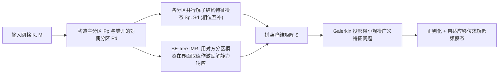

## 一句话总结

用"多套彼此错开的分区"给传统 Component Mode Synthesis（CMS，构件模态综合）补齐相位缺陷，再用一套免 Schur、免特征分解的界面模态近似，把大规模特征值问题（低频模态求解）的精度提升约三个数量级，同时在分布式集群上实现更好的时间与内存扩展性。

## 研究背景

- 领域现状：模态分析（求解低频特征值/特征向量）是工程与计算机图形学的基础工具。全局求解器（如 Krylov 子空间方法 SLEPc 配合分布式直接线性求解器 MUMPS）精度高，是精度基准；而 CMS 通过把大区域拆成子结构（substructure），把全局问题降维成子问题，在航空航天、汽车等领域及主流商用有限元软件（Nastran、ANSYS、Abaqus 等）里是主力方法。在图形学里，低频特征模态也是降阶仿真、可变形动画、物理蒙皮、谱几何（Laplace–Beltrami 特征分析）的基础构件。
- 核心痛点：CMS 用工作流效率换了一点精度，但它最大的软肋是收敛慢。要提精度就得抬高截止频率、纳入更多子结构特征模态，可这些新增模态频率（波数）远高于目标全局低频模态，几乎与目标模态正交，对逼近毫无帮助。作者的关键观察是：固定界面的子结构特征模态相当于"加窗傅里叶模态"，边界约束把基函数的相位钉死为零，于是任何在边界非零、相位不同的目标函数都表达不出来，单纯加基函数解决不了。另一个瓶颈是界面模态（耦合子结构）需要解稠密特征问题，其 Schur 补的组装与存储随界面自由度数量二次增长，内存开销极大，在需要的模态数较少时甚至主导整个计算。
- 本文 idea：既然单一分区的子结构模态相位被固定，那就再引入一个空间上错开（staggered）的第二分区。两个分区的子结构特征模态处在相近频段但相位不同，相互"补相位"，合起来就构成相位完备（phase-complete）的子空间，能高效逼近全局低频模态。同时，一个分区的界面往往落在另一个分区子结构的内部，于是可以用对方分区的低频模态在界面上的取值作为激励，免掉昂贵的 Schur 补和界面特征分解。

## 方法

整体框架：方法名为 MP-CMS。先在"主分区"（primal）与"对偶分区"（dual，把切割面移到主分区子结构质心处、最大化空间重叠）上各自并行求解子结构特征模态，得到相位互补的两套基；界面模态则用 Schur- 与 eigen-free 的方式从对方分区模态激励出静力响应来近似；最后把所有基拼成降维矩阵，做 Galerkin 投影得到一个小规模广义特征问题，并用带正则化的自适应移位求解。

关键设计：

1. 相位互补的多分区子空间（是什么/为什么/怎么做）。作者先用一维 Laplacian 特征问题给出直觉：固定 Dirichlet 边界下第 $$j$$ 个子结构特征模态是 $$\tilde{S}^{p}_{i,j} = \sin(j\pi t)$$，相位恒为零；再补一组同频不同相位的基 $$\tilde{S}^{d}_{i,j} = \sin(j\pi t + \phi)$$（如 $$\phi = \pi/2$$），靠三角积化和差，任意相位 $$\sin(j\pi t + \psi)$$ 都能表示出来，这就是"相位完备"。实践中，这些不同相位的基正是由一个空间平移过的、来自另一分区的子结构自然产生。最终子空间由主、对偶两分区的降维矩阵张成，$$u = [S^{p}, S^{d}] [z^{p}; z^{d}]$$。实验表明：在覆盖目标频段的前提下，相位完备基在同等降维自由度下显著降低低频误差，而单纯增加相位固定基只会降低高频误差。

2. Schur- 与 eigen-free 的界面模态近似（SE-free IMR）。传统 CMS 里界面模态用单位位移激励 $$S_{bb} = I$$ 解 $$S_{bI} = -K_{II}^{-1} K_{Ib} S_{bb}$$，而 Schur 补稠密矩阵内存随界面自由度二次增长。作者利用"一个分区的界面通常落在另一分区子结构内部"这一事实，把人为的单位激励换成对方分区低频模态在界面上的取值作为 Dirichlet 边界：$$S^{p \leftarrow d}_{bb} = U^{p}_{b} S^{d}_{I}$$，再解局部静力平衡 $$S^{p \leftarrow d}_{bI} = -(K^{p}_{II})^{-1} K^{p}_{Ib} S^{p \leftarrow d}_{bb}$$。这样界面模态只需解局部平衡问题，彻底绕开稠密 Schur 补的组装、存储与后续稠密特征分解，内存只依赖稀疏子结构矩阵。

3. 正则化求解奇异矩阵束。合并两分区的基（尤其加上界面模态）后，基之间很可能线性相关，导致降维后的刚度、质量矩阵秩亏，形成奇异矩阵束（K、M 共享零空间），常规求解器解不了。用 SVD 抽独立基代价过高且会破坏块稀疏结构。作者改用缩放单位阵正则化：$$(S^{T} K S + \mu I) x = \lambda (S^{T} M S + \sigma I) x$$。近零空间向量会被正则项主导，产生 $$\lambda \approx \mu/\sigma$$ 的"假"特征值，因此要求 $$\mu/\sigma > \alpha \lambda_{\text{cut-off}}$$ 且 $$\mu < \beta \lambda_{\min}$$（$$\alpha > 1$$，$$\beta \ll 1$$），把假特征值推到截止频率之外。参数由一个自适应移位算法启发式地搜出，精度可媲美昂贵的正交化方法。

## 实验结果

主实验为单机上四种方法在弹性问题（轴对齐分区）上的误差–效率对比。MP-CMS 相对相对特征值误差 $$\epsilon_{ev}$$ 在同等时间预算下比 CMS 系方法低约三个数量级，或达到同等精度快约三个数量级，且所需子结构特征模态数远少于传统方法。

| 方法 | 相对精度（同时间预算） | 界面处理 | 内存扩展性 |
|------|--------|--------|--------|
| MP-CMS（本文） | 基准，最优 | 免 Schur、免特征分解 | 仅依赖稀疏矩阵，最好 |
| CB-CMS（经典 Craig-Bampton） | 低约 3 个数量级 | 全量稠密 Schur 补 | 随界面自由度二次增长，差 |
| CMS-IMR（界面模态约简） | 明显偏低 | 局部特征问题降维 | 仍偏高 |
| AMLS（多层子结构） | 明显偏低 | 多层递归 | 仍有基生成开销 |

其余关键结果用文字补充：

- 扩展性：在 1000×1000 的方形网格强扩展、以及问题规模随节点数成比例增长的弱扩展测试中，MP-CMS 的时间扩展与 CB-CMS 接近但快约两个数量级，内存扩展显著更好（CB-CMS 内存被稠密界面矩阵主导，二次增长而 OOM）。时间与内存的负载均衡比约 0.9，而 CB-CMS 内存均衡仅约 0.6。
- 超大规模：在 Falcon 9 壳模型（1000 万顶点、3000 万自由度）、19 节点 MPI 集群上，每个子结构算 100 个模态，88 分钟求出前 3000 个全局模态，节点间通信仅 4.3 秒；3000 个模态最大残差 $$1.6 \times 10^{-4}$$，多数高频残差接近 $$10^{-6}$$。同规模下 CB-CMS 每节点需至少 2.82 TB 内存（远超 512 GB）而失败；SLEPc 配 MUMPS 用近两小时（放宽收敛阈值到 $$3 \times 10^{-2}$$）只算出 949 个模态，配 Cluster Pardiso 跑 7 小时未完成。
- 局部更新与复用：PCB 拓扑删改场景下局部更新比全量重算快约 2 倍；点阵微结构参数修改场景下比全量 MP-CMS 快 5.4 倍、比高度优化的 Spectra（配 CHOLMOD）快 2.24 倍。
- 分区策略：轴对齐分区更容易产生错开的相邻子结构，通常比 METIS 图分区精度更高、耗时更低；METIS 的界面交叉多，需要额外互补子结构来恢复相位完备，削弱效率优势。去掉互补子结构（PD-NC）误差会明显升高，验证了互补子结构的必要性。
- 图形学应用：用 MP-CMS 算出的模态基对同一龙模型做降阶模态动画（配合模态弯曲改善大形变视觉质量），说明该基不仅能做分析，也可直接作为图形学降阶子空间的前端。

## 亮点与局限

- 亮点：
  - "相位缺陷"这一诊断很到位——把子结构模态看成加窗傅里叶模态，一眼看出固定边界钉死相位，从而给出"多分区补相位"这个简洁而根本的解法，而非盲目堆基。
  - SE-free IMR 巧妙复用了多分区结构：一个分区的界面恰在另一分区内部，用对方模态当激励就免掉了 CMS 里最贵的稠密 Schur 补与界面特征分解，直击内存瓶颈。
  - 实测跨度大且诚实：从 2D Laplacian 到 3D 弹性、从桌面机到 19 节点集群、直至 3000 万自由度的火箭壳模型，且保留了 CMS 的局部更新、低通信开销等工程价值。
- 局限：
  - 默认用两个分区、轴对齐切割，对复杂拓扑要退回 METIS，此时界面交叉增多、需补更多互补子结构，效率优势下降；分区策略本身未做优化，是后续空间。
  - 子结构数 $$n_p$$ 增大时，虽局部特征求解变便宜，但矩阵约简与降维求解开销反而主导，端到端效率不一定提升。
  - 正则化参数靠启发式自适应移位搜索，作者也承认"更好的方法能进一步改进结果"，缺乏严格的参数选取理论保证。
  - 大规模并行结果多为模拟 MPI（SMPI）估计的墙钟时间与峰值内存，而非真机全量并行测量（受资源所限）。

## 延伸思考

- 与多层框架（如 AMLS）的结合是作者明确点出的方向：把多分区的相位互补思想引入递归层级，若能解决跨层的相位自适应问题，可能带来乘性的效率提升。
- "相位完备"的视角具有一般性——凡是靠固定边界局部基去逼近全局低频结构的场景（谱几何、Laplace–Beltrami 特征、降阶物理仿真），都可能借"错开分区补相位"来提升基质量，值得迁移探索。
- 对图形学而言，一个能快速局部更新、低通信、可扩展到千万级自由度的模态求解器，天然契合"设计–仿真–反馈"交互回路与降阶动画流水线；后续可关注它与实时子空间积分、物理蒙皮等下游任务的端到端整合。
- 正则化处理奇异矩阵束目前是工程启发式，若能引入更有原理的奇异束处理（如结构化去膨胀/deflation）替换缩放单位阵，可能在鲁棒性与精度上更有保障。
