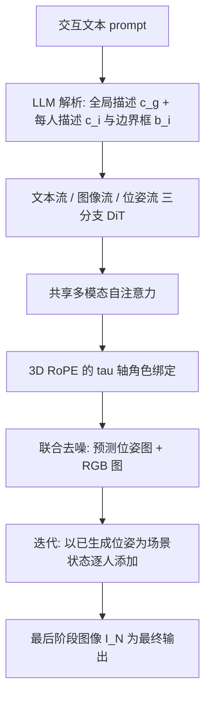

## 一句话总结

本文提出一个"位姿-图像"双流扩散 Transformer，把以人为中心的骨架结构先验注入预训练 FLUX 模型，让位姿与外观在生成中协同演化，并借助位姿可分解的特性以"逐人添加"的迭代方式渐进构建复杂的多人交互场景，从而显著改善文本对齐与场景多样性。

## 研究背景

文本生成图像模型在单主体上已相当成熟，但在多人交互场景上仍然吃力：常常塌缩为重复的布局、刻板的姿态和缺乏落地的交互关系。多人交互不同于多物体组合，它跨越了姿态、表情与社会情境构成的巨大组合空间，既要每个人在解剖上合理，又要人与人之间的空间关系、角色行为和相互作用协调一致。作者观察到，SDXL 这类模型常常遗漏实体或搞错人数，较新的 FLUX 虽然能刻画个体外观，却难以正确表现各自的角色与交互（比如"助手为神父倒水洗手"这一动作往往缺失），并且生成结果的姿态、视角、空间排布都趋于单一。

已有方法多依赖基于布局的生成，用大语言模型给出边界框等粗粒度结构线索。这类信号只能组织场景级构图，缺乏刻画人体细粒度结构与交互所需的粒度。本文主张越过粗糙的空间引导，把以人为中心的结构先验直接内化进扩散 Transformer 的生成过程中。贡献有三点:提出一种把结构先验注入预训练扩散 Transformer、并支持迭代式多人生成的双位姿-图像表示;提出用于评测多人交互合成多样性与对齐度的新基准 DrawWaldoWorlds;相比多种现有方法在多样性与保真度上都有显著提升。

## 方法

整体建立在 FLUX(一个 DiT 扩散 Transformer)之上。给定描述多人交互的文本,先用大语言模型把 prompt 解析为一个全局交互描述 $$c_g$$ 与一组有序的"每人描述 + 边界框" $$\{(c_i, b_i)\}$$,作为后续生成的结构化条件。核心由三部分组成:双位姿-图像表示、跨模态对齐、位姿引导的迭代生成。

### 双位姿-图像表示

作者把位姿作为一种与外观无关、刻画身体配置的紧凑表示,并将其直接纳入生成过程,让模型在生成时显式推理与交互相关的结构,而非把结构隐含在外观中。位姿以标准 OpenPose 可视化的 2D 位姿图像形式表达,这样可以直接复用 FLUX 的 VAE 编码器,最大化与预训练权重的兼容性。对编码后的位姿与图像输入加噪,并与 T5 文本嵌入拼接成多模态 token 序列。

架构上引入一条从图像分支参数初始化的并行位姿流,构成双分支扩散 Transformer:位姿流单独处理位姿 token,原始文本流与图像流保持不变,所有模态通过共享自注意力交互,再用各自的输出头分别去噪位姿与图像隐变量。为保护预训练先验,整个文本流与图像流被冻结,唯一新训练的模块是位姿流 Transformer 权重上的 LoRA 参数,以及从图像投影复制而来、随训练解冻的一对位姿流输入/输出投影层。这种选择性适配在保留骨干视觉质量的同时,通过位姿通路与共享注意力注入交互感知的结构先验。

### 跨模态对齐

作者复用扩散 Transformer 中已有的 3D 旋转位置编码 RoPE 来实现人物级的语义对齐。原始 FLUX 中,空间坐标 $$(x, y)$$ 编码视觉 token 的布局,而时间坐标 $$\tau$$ 在图像生成时恒为 0。本文重新利用这个闲置维度:所有属于同一人的 token,无论文本、位姿还是图像,都被赋予共享的 $$\tau$$ 索引,从而在文本、位姿与外观之间建立统一的角色身份。具体地,用边界框 $$b_i$$ 定位第 $$i$$ 个人的视觉 token,框内的图像与位姿 token 赋 $$\tau = i$$,对应描述 $$c_i$$ 的文本 token 也赋 $$\tau = i$$,框外 token 用 $$\tau = 0$$。这种角色感知的索引把每个人的文本描述绑定到位姿与图像中的对应区域,让边界框控制生成人物的空间布局,而无需修改骨干架构或新增参数。位姿与图像 token 在对应位置还共享相同的 $$(x, y)$$ 坐标,保证结构与视觉表示在生成过程中始终空间对齐。

### 位姿引导的迭代生成

位姿图像的一个额外优势是可分解:不同于多人交互的完整 RGB 图,位姿图可以定义在场景中任意人物子集上。作者据此把位姿当作"场景状态",采用逐人添加的迭代生成:第 $$i$$ 阶段在已合成的前 $$i-1$$ 人基础上加入第 $$i$$ 个人。场景状态定义为描绘到第 $$i$$ 阶段所有人的位姿图 $$P_i$$,以 $$P_0 = \varnothing$$ 表示空画布。该阶段把下一个人的描述追加进 T5 编码的文本输入 $$C_i = c_1 \oplus \cdots \oplus c_i$$,并把上一阶段位姿 $$P_{i-1}$$ 插入多模态序列作结构上下文;在 $$c_g$$、$$C_i$$、$$P_{i-1}$$ 条件下,模型联合预测更新后的位姿状态 $$P_i$$ 与对应图像 $$I_i$$。只有位姿状态被传递到下一阶段,最后阶段的图像 $$I_N$$ 即为输出。训练时每张 $$N$$ 人图像会分解出 $$N$$ 个监督阶段,中间阶段只监督位姿 $$P_i$$,末阶段同时监督 $$P_N$$ 与图像。这种做法把复杂的多人推理拆解为一系列更简单的子任务,并保持连贯的共享上下文。

训练数据来自 Who's Waldo 数据集,经过滤去除低质与无真实人际交互的图像后保留约 3 万张高质量交互图像,再用每人位姿检测与多模态大语言模型构造"全局交互描述 + 有序每人描述"的结构化标注,并用检测框把描述、位姿与空间布局逐人对齐。

## 实验结果

作者提出 DrawWaldoWorlds 基准,基于 Waldo and Wenda 测试集,为每张图生成三档递增细节的 prompt:聚焦交互的简短描述(Tier A)、中等细节(Tier B)、细粒度图像特定描述(Tier C),用于在不同 prompt 具体度下评测对齐与多样性。评测维度包括语义对齐(VQAScore 概率分 VQA Sim 与严格准确率 VQA Acc)与多样性(DINO Diff、LPIPS、GRADE)。下表为 DrawWaldoWorlds 主结果,本文方法在所有 prompt 档位的 VQA Acc 与聚合 VQA Sim 上均最优,多样性在 Tier A/B 上也优于多数基线。

| 方法 | 类型 | DINO Diff A / B ↑ | LPIPS A / B ↑ | GRADE A / B ↑ | VQA Acc A / B / C ↑ | VQA Sim ↑ |
| --- | --- | --- | --- | --- | --- | --- |
| FLUX [dev] | T2I | 0.52 / 0.50 | 0.60 / 0.59 | 0.31 / 0.25 | 0.71 / 0.56 / 0.39 | 0.83 |
| FLUX [dev] + SGI | T2I | 0.63 / 0.60 | 0.65 / 0.64 | 0.54 / 0.51 | 0.70 / 0.58 / 0.37 | 0.80 |
| SD3.5-Large | T2I | 0.55 / 0.52 | 0.64 / 0.61 | 0.27 / 0.24 | 0.68 / 0.55 / 0.31 | 0.76 |
| SDXL | T2I | 0.62 / 0.60 | 0.64 / 0.63 | 0.39 / 0.31 | 0.55 / 0.20 / 0.12 | 0.57 |
| FLUX Kontext [dev] | 编辑 | 0.61 / 0.59 | 0.66 / 0.65 | 0.55 / 0.52 | 0.50 / 0.34 / 0.28 | 0.61 |
| FLUX Fill [dev] | 修补 | 0.63 / 0.62 | 0.62 / 0.61 | 0.60 / 0.54 | 0.48 / 0.33 / 0.32 | 0.65 |
| CreatiLayout | 布局 | 0.54 / 0.54 | 0.60 / 0.61 | 0.55 / 0.50 | 0.41 / 0.10 / 0.06 | 0.55 |
| RealCompo | 布局 | 0.59 / 0.58 | 0.63 / 0.60 | 0.57 / 0.51 | 0.38 / 0.10 / 0.04 | 0.56 |
| 本文 Ours | — | 0.67 / 0.63 | 0.67 / 0.65 | 0.55 / 0.54 | 0.84 / 0.72 / 0.56 | 0.87 |

在 MultiHuman-Testbench(纯文生图设置)上,各方法得分更为接近,与该基准对人际交互强调较弱一致;但在 Multi Complex 子集上本文仍取得最高 VQA Acc,较次优基线高约 11 个百分点。用户研究中,本文结果被偏好的比例为对 FLUX [dev] 63.3%、对 FLUX Kontext [dev] 79.0%,与自动评测一致。

消融实验验证三个组件缺一不可:去掉位姿监督(w/o Pose)后各档 VQA Acc 平均下降约 20 点,甚至低于预训练基线,说明增益源于架构设计而非单纯的领域内数据;去掉角色感知 $$\tau$$ 轴编码(w/o RoPE)对齐下降,凸显跨模态位置编码在把每人描述绑定到视觉实体上的作用;去掉迭代生成(w/o Iter.)、改为一次性生成全部人物,对齐明显退化,证明逐人组合对拆解多人生成、减少语义纠缠至关重要。

## 亮点与局限

亮点在于:把位姿作为一等公民的"可分解结构模态"纳入生成,而非外部约束,使结构与外观协同演化;巧妙复用 DiT 中闲置的 RoPE 时间轴 $$\tau$$ 做人物级角色绑定,几乎零额外参数就实现了文本-位姿-图像的跨模态对齐;利用位姿的可分解性把多人生成转化为逐人添加的序列子任务,有效降低组合复杂度,尤其利于人数较多的 prompt;通过冻结骨干、仅训练位姿流 LoRA 的选择性适配,既保住预训练视觉质量又注入交互先验。

局限方面:方法依赖 LLM 解析出的每人描述与边界框,以及位姿检测的质量,前置模块的误差会传导到生成结果;训练数据规模约 3 万张、以真实人际交互图为主,跨域泛化仍有待观察;迭代生成随人数增加会拉长推理链路。作者在结论中指出,把结构化、可分解的表示作为生成模型的一等模态,为更忠实、可解释、可控的合成开辟了空间,并展望扩展到更丰富动态、更长时间跨度与更多样交互实体的复杂场景。

## 延伸思考

这项工作的核心思路是"用可分解的中间表示驯服组合复杂度":多人交互的难点在于组合空间爆炸,而位姿恰好提供了一个既紧凑、又与外观解耦、还能定义在任意人物子集上的结构表示,于是"逐人添加"就把一个高维联合分布拆成了一串条件更简单的子问题。这与许多生成任务中"先布局再填充"的分治范式一脉相承,但本文更进一步:布局(边界框)只是粗粒度骨架,真正承载交互语义的是细粒度位姿,且位姿是被模型联合预测而非外部给定的。

另一个值得玩味的点是对 RoPE $$\tau$$ 轴的再利用——在原模型里它是为视频等时序场景保留的闲置维度,这里被重新诠释为"角色身份轴"。这提示我们,预训练模型中往往存在未被充分利用的结构容量,通过重新定义坐标语义就能以极低成本注入新的归纳偏置,而不必新增参数或破坏骨干。这种"借壳"式的条件注入,对于在冻结大模型上做可控生成是一个很经济的范式。
