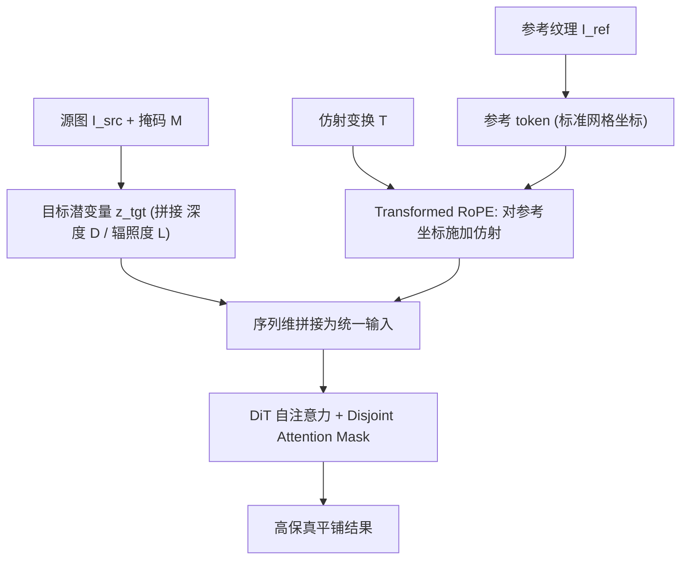

## 一句话总结

本文提出一个基于 Diffusion Transformer（DiT）的可控纹理平铺框架，核心是把用户指定的 2D 仿射变换直接注入参考纹理的旋转位置编码（RoPE），从而在不做像素级重采样的前提下，实现高保真、可精确控制（旋转/缩放/平移）的纹理贴合。

## 研究背景

- 领域现状：把一张参考纹理贴到场景图像的指定区域，是渲染与图像编辑的基础任务。传统 CG 走 UV 参数化能精确控制，但费力且需要 3D 专业知识；生成式方法（ControlNet、各类 inpainting 模型、材质迁移方法如 ZeST、MaterialFusion、MatSwap）大大降低了门槛。
- 核心痛点：现有生成方法大多只追求"语义上合理"，难以做到"结构上精确"。它们要么凭学到的分布"幻想"出纹理、丢失参考纹理的具体身份；要么像当前 SOTA 的 MatSwap 那样，靠显式地把纹理预先变形再喂进 cross-attention——这会带来破坏性下采样、丢高频细节，而且只能做简单缩放，无法完成复杂空间操作。此外通过文字描述（比如"30 像素重复、旋转 45 度的格纹"）来控制精度也不现实。
- 本文 idea：把"空间操控"和"视觉内容生成"解耦。不去变形像素，而是变形注意力所用的坐标系——对参考纹理 token 的位置编码施加用户定义的仿射变换，让参考像素始终保持高分辨率原样，再借助模型的生成先验从"单个变换后的重复单元"外推出周期性平铺。

## 方法

整体框架：把纹理映射重新表述为一个"视觉条件 inpainting"任务，跑在 DiT（具体基于 FLUX.1-Kontext-dev 的 Flow Matching Transformer）之上。输入包括源图 $$I_{src}$$、目标区域掩码 $$M$$、参考纹理 $$I_{ref}$$、以及一个近似屏幕空间物理摆放的 2D 仿射矩阵 $$\mathcal{T}$$。同时用现成估计器抽出深度图 $$D$$ 和辐照度图 $$L$$，经冻结 VAE 编码后作为显式几何/光照先验。目标潜变量沿通道拼接噪声潜变量、背景潜变量、下采样掩码与几何光照先验，参考纹理编码后零填充对齐通道，二者再沿序列维拼成统一输入 token。

关键设计分三块：

1. 坐标变换的旋转位置编码（Transformed RoPE）。DiT 用 2D RoPE 把空间信息编码进 query/key，使注意力得分只依赖相对位置 $$\Delta p = p_k - p_q$$。作者把参考纹理的规范齐次坐标 $$\tilde{p}^{ref}_{q,k}$$ 通过仿射矩阵映射到目标空间 $$\tilde{p}^{ref'}_{q,k} = \mathcal{T} \cdot \tilde{p}^{ref}_{q,k}$$，再用变换后的坐标给参考 key 施加 RoPE。这样目标位置的 query 与参考单元之间的有效相对位置趋近于零时，注意力就会去"取回"精确的高频参考特征，而无需任何显式重采样。把参考当作一个单元来处理，平铺就变成了模型学到的外推，而非硬编码映射。

2. 不相交注意力掩码（Disjoint Attention Mask）。把所有 token 分成参考、背景、目标（待补全）三个互不相交子集，构造一个加性偏置矩阵，用 $$-\infty$$ 严格禁止某些注意流向：背景只能看场景 token、看不到参考（防止参考纹理泄漏污染未编辑区域）；目标 token 拥有全可见性，既向参考取回对齐的纹理细节，又向背景整合全局光照与几何线索；参考 token 只能看自己，保持范例的结构完整、不被背景颜色渗染。

3. 潜空间融合注入物理先验。受 MatSwap 启发，把深度和辐照度先验拼进目标潜变量，用原始表面法线和着色强度来物理性地调制平铺出的纹理，使结果既保住参考图案又贴合场景 3D 表面拓扑与光照。训练上冻结 DiT 主干、只微调改造过的输入 embedder 并在所有线性投影里加入 LoRA（$$r = 128$$），先在 Blender 子集学基本平铺机制，再在真实感 Adaptation 子集做域泛化。

作者还构建了一个 15,000 对场景-纹理的合成基准数据集（14,000 对 Blender Cycles 渲染 + 1,300 对高保真 PBR 路径追踪），提供仿射变换矩阵和掩码的真值监督。

## 实验结果

主实验为"空间可控性 + 消融"（Synthesis 数据集）。由于基线没有显式坐标控制接口，作者给它们喂预先变形并平铺好的参考图以尽量公平比较。指标为 LPIPS↓、CLIP↑、Gram 矩阵损失↓。

| 方法 | LPIPS ↓ | CLIP ↑ | Gram ↓ |
|------|---------|--------|--------|
| ZeST | 0.2010 | 0.8641 | 10.29 |
| MatSwap | 0.1903 | 0.8563 | 3.318 |
| FLUX.2-dev | 0.2090 | 0.8922 | 2.643 |
| NanoBanana | 0.1789 | 0.9263 | 1.439 |
| MatSwap w. Ref-Net | 0.1286 | 0.8941 | 0.936 |
| 本文 | 0.1143 | 0.9250 | 0.606 |
| 消融 Global Explicit | 0.1627 | 0.8858 | 1.492 |
| 消融 Local Explicit | 0.1242 | 0.9006 | 1.068 |
| 消融 去掉 Disjoint Mask | 0.1337 | 0.9158 | 0.745 |

本文在几乎所有指标上领先。消融表明：显式像素变形（无论全局预平铺还是局部单元变形）都会因固定分辨率潜空间的下采样而引入几何冲突或走样模糊；去掉不相交掩码则会让背景特征污染参考表示、导致图案结构模糊。

其余实验用文字概述：在纹理保真度对比（含 260 合成 + 40 真实照片）中，本文在合成集全指标 SOTA；真实集上 FLUX.2-dev 的 Gram 距离略低，但它有"复制粘贴"偏差——原样搬 2D 图案却不做必要的几何形变，无法贴合 3D 结构。70 人（含 43 名专业设计师）的用户研究里，本文纹理保真度 Top-1 偏好率 42.0%，空间可控性更是拿下约 91% 的投票。作者还展示了对语义冲突（把花纹贴到苹果上）和非线性坐标网格等分布外场景的鲁棒泛化，尽管只在仿射样本上训练。

## 亮点与局限

- 亮点：
  - "变形坐标系而非变形像素"的思路很巧妙，用 RoPE 的相对位置性质把仿射变换转成注意力检索问题，天然避开重采样导致的高频细节丢失。
  - Disjoint Attention Mask 把参考、背景、目标三方的信息流严格隔离，兼顾了保真与无缝融合，消融验证了其必要性。
  - 提供了带真值监督（变换矩阵、掩码、深度、辐照度）的大规模数据集和标准化评测协议，并承诺开源代码与数据。
- 局限：
  - 在压缩的 VAE 潜空间里操作存在分辨率瓶颈，密集平铺时偶尔走样。
  - 缺少显式材质图（如粗糙度），表面反射依赖内部先验，高光不可控。
  - 单个仿射变换无法覆盖尖锐转折（如正交折面），复杂多面需多轮编辑。
  - 生成质量受上游深度/辐照度估计器限制，几何条件解耦不彻底时会出现原图案"鬼影"烘焙进结果的问题。

## 延伸思考

这条"把空间控制编码进位置嵌入、而不去物理变形输入"的路线，本质是利用 Transformer 显式坐标表示相对 U-Net 隐式网格的优势，值得推广到虚拟试衣、参考引导 inpainting、乃至视频里的一致性纹理传递。若能把仿射约束升级为可学习的稠密坐标场（论文已初步验证非线性网格注入的可行性），或许能摆脱"单一仿射难描述尖锐折面"的限制，逼近真正的 3D UV 级控制。另一个自然方向是把上游几何/光照估计与生成过程做联合优化，缓解鬼影问题，并引入显式 PBR 材质通道以获得可控高光。
