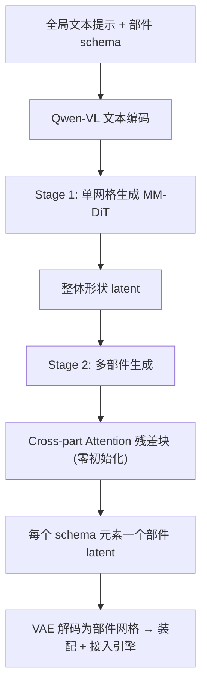

## 一句话总结

CubePart 提出首个开放词表、可按部件控制的 3D 网格生成框架：用户给一段全局文本提示和一份自定义的部件清单（schema），模型就生成一组语义部件网格，可以直接装配成完整物体并接入游戏引擎驱动动画与物理行为。

## 研究背景

游戏与交互应用里的 3D 资产很少是静态的：车轮要转、角色要动、盖子要开合，这些行为都由引擎中的动画绑定、物理系统和脚本围绕一组预定义的语义部件运作。要让资产可用，网格必须按照游戏代码期望的 schema 拆分成对应的语义部件。

问题在于：现有 3D 生成模型要么产出没有部件结构的整体网格，要么产出任意的、无法与应用需求对齐的部件划分。对一个明确要求"四个车轮 + 一个车身"的开发者来说，随机切分的模型和整体网格模型同样没用。

一个直觉方案是借助 2D 分割做部件控制，但 2D 掩码无法表达或控制从输入视角看不到的部件（比如动物背面的尾巴），而且 2D 控制信号提升到 3D 时具有视角依赖性和歧义。作者据此主张需要一个 3D 原生、schema 驱动的控制接口，并认为文本是最自然、最通用的控制模态：一段提示既能描述全局物体，又能显式给出一份开放式的部件名清单作为结构蓝图。

## 方法

CubePart 由一个高质量数据引擎和一个两阶段生成架构组成。核心是把"全局形状合成"与"部件级解码"分离。

Stage 1（单部件网格生成）：基于 vecset 扩散范式，用 3DShape2VecSet 的 VAE 把网格编码到无序潜向量集合，采用 MM-DiT 架构，并用 Qwen-VL 编码文本条件，做文本到 3D 的形状生成。采用 flow matching 目标训练，模型输入 latent 定义为在干净 latent 与噪声之间的插值，损失为：

$$\mathcal{L}=\mathbb{E}_{(Z_0,c)\sim\mathcal{D},\,Z_1,\,t}\;\lVert f_\theta(Z_t,t,c)-v_t\rVert^2,\quad v_t=Z_1-Z_0$$

其中 $Z_t=t\,Z_0+(1-t)\,Z_1$，时间步 $t$ 从 logit-normal 分布采样并按因子 4.0 平移。关键是 schema-aware 微调：预训练模型即便提示里包含 schema，也不保证生成所有目标部件，或会过度强调某些部件。作者用结构化提示微调——"{全局描述}. This object contains the following parts: {部件清单}."——确保所有请求的部件都出现且正确生成。模型下采样自 Qwen-Image，21 层、隐藏维 1536、约 1.9B 可训练参数。

Stage 2（多部件网格生成）：把单一整体网格解码成 $N$ 个部件 $O=\{p_i\}_{i=1}^{N}$，每个部件由一组潜 token 表示。用两个机制保证质量：

- Part-aware Prompting：文本条件结构化为"This object has the following parts: {全部部件}. Target to segment: {目标部件名}."，给模型全局上下文帮助判定分割边界。
- Cross-part Attention Block：仅靠文本上下文常导致部件重叠或不完整。作者不去改动预训练的局部注意力层（那会破坏预训练先验），而是插入专用的零初始化 Transformer 块做跨部件全局注意力，在最小干扰预训练能力的前提下实现部件间信息交换。共插入 4 个块（第 1、5、9、17 层）。

数据引擎：这是能做开放词表控制的基础。作者用 VLM 加一套 3D 版 "Set-of-Mark" 标注策略，构建了约 462K 资产、约 2.02M 部件的开放词表部件数据集，比 PartVerse-XL 大 11 倍以上。流水线四步：预处理（过滤退化几何、保留 2–32 个部件的资产）、VLM 质量过滤、VLM 部件聚类与命名、后处理（Dual Marching Cubes 转水密网格并采样点云）。标注核心是给每个资产渲染 14 个环绕视角，每视角生成一对图（带轮廓与编号标记的纹理渲染 + 每部件独立纯色渲染），配对输入 VLM（GPT-5）做跨图推理，把过分割的部件聚成功能性语义簇并起简洁名字（如把轮辋、轮胎、轮毂合并为 front left wheel）。数据集强调用"名字"而非"描述性 caption"，因为名字更贴近用户查询用词。

## 实验结果

在 PartObjaverse-Tiny 上评估，用 Chamfer Distance（CD，越低越好）和 F-score（越高越好），分别报告部件级与整体级指标。CubePart 在所有指标上一致超越基线，消融也验证了跨部件注意力与 Stage 1 预训练的价值。

| Method | Part CD ↓ | Part F-score ↑ | Holistic CD ↓ | Holistic F-score ↑ |
| --- | --- | --- | --- | --- |
| PartCrafter | 0.493 | 0.290 | 0.272 | 0.552 |
| PartPacker | 0.374 | 0.475 | 0.164 | 0.792 |
| PatchAlign3D + HoloPart | 0.309 | 0.549 | 0.050 | 0.970 |
| SAM3 + OmniPart | 0.309 | 0.630 | 0.053 | 0.970 |
| Ours w/o pre-training | 0.287 | 0.625 | 0.051 | 0.970 |
| Ours w/o Cross-Part Attention | 0.433 | 0.398 | 0.148 | 0.792 |
| Ours w/ PartCrafter-style attention | 0.386 | 0.529 | 0.089 | 0.864 |
| Ours | **0.251** | **0.743** | **0.048** | **0.974** |

去掉跨部件注意力时部件级精度大幅下降，说明部件间通信对解决几何边界至关重要；用 PartCrafter 式改造局部注意力层反而破坏预训练先验、明显更差；去掉 Stage 1 预训练则整体结构完整性下降。训练用 24 张 H200，Stage 1 约 3 天（1500 GPU-小时），Stage 2 约 18 小时（450 GPU-小时）；H200 上 Stage 1 推理 2–3 秒、Stage 2 推理 3–4 秒（含 VAE 解码）。应用上，生成的多部件网格可直接接入游戏平台，用 Lua 脚本按四阶段流程（焊接、绑定、动力控制、交互）驱动车辆行驶、角色动作、无人机飞行等行为，无需人工后处理。

## 亮点与局限

亮点：

- 把"部件结构"变成推理期的显式控制信号，用开放词表文本 schema 驱动，同一网格可按不同粒度切分（2 个部件时挡泥板并入车轮，4 个部件时显式分出挡泥板）。
- 零初始化跨部件注意力块设计巧妙：只插入不改动，兼顾部件间协调与预训练先验保留。
- 数据引擎用 3D-aware Set-of-Mark + VLM 全自动构建超大规模开放词表部件数据集，用简洁"名字"替代冗长 caption，更契合用户查询。

局限：

- 仅支持刚体分解，暂不支持有机角色蒙皮变形所需的顶点权重。
- 尽管跨部件注意力显著减少重叠，边界处部件仍可能相互穿插。
- 相对空间指代（"前左"对"后右"）继承了 VLM 标注的固有歧义，偶尔出现镜像错误、对称部件互换或沿某轴错位。

## 延伸思考

CubePart 最有意思的点是把"可控性"从几何层面上移到语义 schema 层面：控制信号不再是掩码或包围盒，而是一份人类可读、开放式的部件名清单，这天然契合下游代码对"命名部件"的需求。这条路线的上限很大程度受限于 VLM 标注质量——空间指代的一致性、遮挡部件的命名都是瓶颈，后续引入 3D 一致的坐标先验或人机协同校正也许能显著提升。另一个自然延伸是把刚体分解扩展到可变形部件：如果能在预测部件几何的同时预测骨骼绑定权重，就能一步打通"生成即可动"的角色资产流水线，这对游戏内容生产的价值会更直接。
