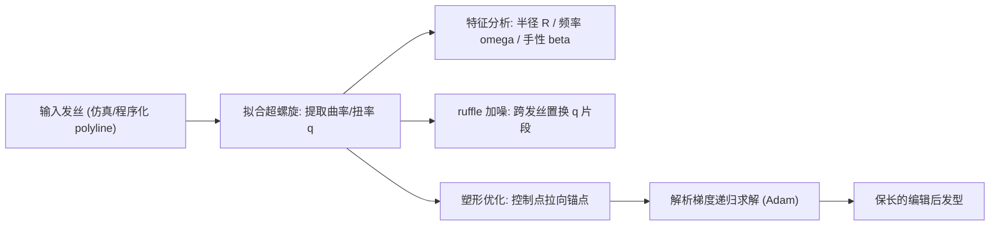

## 一句话总结

用"超螺旋（super-helix）"这一以曲率和扭率为一等公民的几何基元来表示紧密卷曲的头发，从而在曲率空间（而非位置空间）里对其做分析、加噪、拉伸、插值和引导等编辑操作，并给出可高效运行的解析梯度。

## 研究背景

- 领域现状：头发的建模、编辑、参数化与生成工具已发展了三十多年，但绝大多数（笼形变形、体积嵌入、噪声"scraggle"加毛躁等）都是为直发或波浪发设计的。
- 核心痛点：高度卷曲的头发由半径很小的紧密螺旋组成，其空间频率特征与顺滑头发差异很大。基于位置空间的既有工具在这类头发上失效——笼形变形只会拉扯扭曲发丝，噪声加毛躁会把结构化的高频卷曲抹平、趋向均匀分布。而超螺旋此前只被当作仿真基元，从未作为用户直接操纵的"编辑基元"。
- 本文 idea：把超螺旋从仿真基元升级为编辑基元。既然超螺旋天然由分段常值的曲率/扭率参数化，就直接在这套"曲率空间"坐标里做编辑。曲率坐标对整体旋转/平移不变，因此天然适合做插值与分析；而且所有操作都能保持发丝长度。方法对输入不挑，程序化生成或仿真得到的发型都能处理。

## 方法

整体框架分两条主线：先把发丝拟合成超螺旋、在其局部曲率向量 $$q$$ 上做特征分析与"加噪"（ruffle），再把发型塑形写成一个以 $$q$$ 为变量、把控制点拉向锚点的优化问题，并为该优化推导出精确解析梯度以保证效率。

关键设计：

1. **超螺旋几何与状态变量**。一根不可伸长的材料杆由中心线 $$r(s)$$ 和正交材料标架 $$F(s)=[t\ u\ v]$$ 描述，其绕标架的旋转率构成局部曲率向量 $$q=(\kappa_0,\kappa_1,\kappa_2)$$（一个扭率、两个曲率）。当 $$q$$ 分段常值时，每段的形状恰好是一段圆螺旋，可解析积分出标架和位置。多段以 $$C^1$$ 方式衔接即得一条超螺旋。作者选取堆叠所有局部曲率的 $$q\in\mathbb{R}^{3N}$$ 作为主状态变量——因为它对施加在发丝上的旋转不变，特别适合做插值和分析。借助已有工作可把任意 polyline 高效转换成超螺旋。

2. **发丝特征分析**。把每段的 Darboux 向量匹配到螺旋偏移的参数形式，可解析地读出每段的有效半径 $$R=\dfrac{\kappa}{\lVert\Omega\rVert^2}$$ 和空间频率 $$\omega=\dfrac{\lVert\Omega\rVert^2}{\tau}$$，用来定位特定频率/半径区域以及手性翻转的位置。进一步定义 $$\beta(s)=\dfrac{c'(s)\cdot\Omega(s)}{\lVert\Omega(s)\rVert}$$（$$c$$ 为中心曲线），其符号对应发丝顺/逆时针缠绕，其绝对值接近 1 或 0 分别表示螺旋式或平面波浪式缠绕。相比直接看噪声很大的 $$\omega$$，$$\beta$$ 有界于 $$[-1,1]$$，是更平滑的手性探针，便于识别"switchback"（手性折返）这类特征。

3. **Ruffle 加噪算子**。传统噪声加毛躁在所有空间频率上均匀位移，会把卷发的结构化高频抹平。作者提出在曲率空间做"置换式"加噪：给定一组超螺旋，先让前 $$N_m$$ 段与某条基线发丝保持一致（越靠根部的元素对最终形状影响越大），此后对第 $$i$$ 段以概率 $$\rho$$ 从该组所有发丝的第 $$i$$ 段中随机挑一个来替换。再辅以两组曲率间的平滑插值作为额外控制。这样能在保持单缕发丝内部连贯性的同时，让发丝更自然地散开。

4. **塑形优化与解析梯度**。塑形被写成：在保持各段长度不变的前提下，最小化调整 $$q$$ 使若干控制点 $$S(\lambda_k)$$ 逼近用户锚点 $$a_k$$，并对 $$q$$ 的位移加二次正则：$$q^*=\arg\min_q \sum_k \lVert S(\lambda_k)-a_k\rVert^2 + c\lVert q-q_0\rVert^2$$，其中 $$c$$ 控制发丝抵抗曲率变化的刚度。由于只改曲率、不动段长，变形后发丝天然保长。优化需要 $$\dfrac{\partial S}{\partial q}$$，作者据链式法则分 $$j>i$$、$$j=i$$、$$j\lt i$$ 三种情形推出解析表达式，$$j\lt i$$ 时靠递归，并用四张 $$(m,n)$$ 索引的中间导数表迭代填充、复用结果，避免递归调用树爆炸。多缕发丝再用 k-means 聚类分组、以骨架（armature）式的定向标架施加仿射变换来批量设定锚点，方便交互控制。

## 实验结果

作者用解析梯度与 PyTorch 的自动微分对比：解析法在优化中最大瓶颈（每步导数计算）上取得约 47 倍加速，来源于复用了本会形成庞大递归计算树中的重复项。下面汇总各发型塑形的规模与耗时（Intel Xeon 2.9GHz，带星号为分布式运行中最慢的 500 缕批次）：

| 场景 | 编辑发丝数 | 每丝段数 | 刚度 c | 核数 | 耗时 |
|------|-----------|---------|--------|------|------|
| Coily | 100 | 45 | 30 | 1 | 03:40 |
| Wavy | 2025 | 45 | 10 | 1 | 143:34 |
| Cage 对比 | 2024 | 45 | 100 | 1 | 35:07 |
| 遮眼 | 3292 | 90 | 20 | 8 | 13:41* |
| 马尾 | 18000 | 45 | 0.01 | 8 | 04:29* |
| 拉伸 | 90314 | 90 | 20 | 8 | 36:24* |

定性上：与笼形变形做"twist out"对比时，笼形即便高度细分也只是扭曲、缩放发丝，而本方法能让发丝向外散开并隐式保长；在插值实验中，全局 Darboux 坐标和 shape key 都会扭曲发丝，唯有局部曲率插值给出满意结果；ruffle 相比 Blender geometry nodes 的程序化 frizz 和 Maya XGen 的半径/频率随机化，能呈现更自然、更保持单缕连贯的散开质感。单缕优化在 100 段以内足够快、可视为交互级；迭代数随锚点初始距离增大而增多、随段数增多而减少。

## 亮点与局限

- 亮点：
  - 把超螺旋从仿真基元提升为直接可编辑的基元，编辑发生在曲率/扭率空间而非位置空间，对紧密卷发这种高频几何给出更自然的结果。
  - 编辑天然保长，且局部曲率坐标对刚体变换不变，使插值、分析、加噪都更稳健。
  - 推导出精确解析梯度并配合迭代填表复用，比自动微分快约一个数量级（约 47 倍），无需任何训练数据。
  - 对输入不挑：仿真、程序化、polyline 转换来的发型皆可处理。
- 局限：
  - 单缕可交互，但多缕整发型的优化会失去交互性（波浪例耗时超两小时）。
  - 状态向量只取局部曲率、忽略各段长度，缩窄了可互相插值的曲线范围。
  - 朝"增大/减小空间频率或半径"等特定目标去改曲率仍然困难；在不产生大幅偏移的情况下保持卷发整体走向也不平凡。

## 延伸思考

- 这项工作与作者团队此前的紧密卷发路线一脉相承（卷发仿真的 Lifted Curls、程序化生成卷发的 Curly-Cue、以及借鉴其 Fourier 中心曲线与 switchback 分析），可看作把"如何造/如何仿真卷发"补上了"如何编辑卷发"这一环，指向一个"数字美发沙龙"的愿景。
- 用更高阶优化方法替代 Adam 有望进一步缩短求解时间；把解析的超螺旋导数用到更广的发丝几何处理与仿真中也值得探索。
- 值得追问的是：忽略段长的限制若放开、把段长也纳入状态变量，插值表达力和塑形自由度能提升多少，代价又是什么？以及把接触/碰撞约束加入惩罚能量后，能否在编辑阶段就避免发丝穿插。
