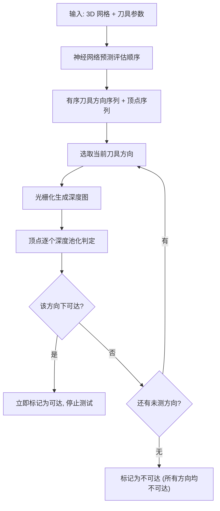

## 一句话总结

DeepMill++ 把减材制造中的刀具可达性分析重新表述为"基于光栅化的可见性与深度池化"问题放到 GPU 上做精确几何验证，只让神经网络负责给出刀具方向和网格顶点的评估顺序，从而在保持严格保守性的同时相比现有几何方法最高提速 9.5 倍。

## 研究背景

可制造性是可靠产品设计的核心，而刀具可达性（cutter accessibility）是减材制造中的基础约束：如果模型上的某些区域刀具够不到，那么这个设计在数控加工中就无法实现。判断可达性本质上是回答"从哪些刀具朝向能不发生碰撞地接触到每个表面点"。

现有方法存在一对矛盾：

- **传统几何方法**精确可靠，但需要对大量刀具朝向逐一做碰撞/遮挡检测，计算代价很高，难以支撑交互式设计和大规模路径规划。
- **端到端学习方法**（如前作 DeepMill）速度快，但缺乏保守性和泛化能力，容易把实际不可达的区域误判为可达。这种"非保守错误"在制造场景里是危险的——它会让下游误以为某处可加工，最终造成废件。

DeepMill++ 的目标就是在"几何方法的可靠/保守"与"学习方法的快"之间取得兼得：既要严格保守，又要足够快到支持交互。

## 方法

核心思想是**分工**：把"是否可达"的判定权完全交还给精确的几何计算，神经网络只用来"提速"，即预测一个高效的评估顺序，从而剪掉大量冗余计算，同时不牺牲保守性。

关键设计有两点：

1. **光栅化式几何验证**。把可达性与遮挡检测重述为可见性 + 深度池化问题：对某个刀具朝向做光栅化生成深度图，再用池化操作逐顶点判断该朝向下顶点是否可达。这一步天然适配 GPU 并行，且是精确的几何判定，因此保守性由几何计算本身保证。

2. **神经引导的评估顺序**。网络输入 3D 形状与刀具参数，输出一个有序的"刀具方向序列 + 顶点序列"。一旦某顶点在某个方向下被判为可达，就立刻标记为可达、不再继续测试；只有当一个顶点在**所有**采样方向下都不可达时，才被标记为不可达。好的顺序能让大多数顶点在很靠前的方向就被"提前命中"确认可达，从而大幅减少需要执行的光栅化—池化次数。

保守的可达性判定可写成对采样方向集合 $\mathcal{D}$ 的析取：

$$\mathrm{Acc}(\boldsymbol{v}) = \bigvee_{\boldsymbol{d}\in\mathcal{D}} \mathrm{vis}(\boldsymbol{v}, \boldsymbol{d})$$

其中 $\mathrm{vis}(\boldsymbol{v}, \boldsymbol{d})$ 由光栅化深度池化精确给出。神经网络不改变这个判定式，只改变遍历 $\mathcal{D}$ 与顶点的先后次序，因此无论网络预测好坏，最终结论始终与几何方法一致、保持保守。

## 实验结果

在从 ABC 数据集随机采样的 200 个网格上，与当前最优几何方法在匹配精度的前提下做对比：DeepMill++ 在保持高保守可达性精度的同时显著更快；消融实验进一步验证了各加速策略（神经引导顺序、光栅化、池化等）的贡献。

| 指标 | 几何方法 (SOTA) | DeepMill++ |
|---|---|---|
| 保守可达性精度 | 基准（精确） | 97.5% |
| 相对计算速度 | 1× | 最高 9.5× |
| 125K 三角面网格完整分析耗时 | 较慢 | 约 2.9 秒 |
| 非保守（危险）误判 | 无 | 无（严格保守） |
| 网格类型 / 刀具尺寸假设 | 通用 | 通用、无类别假设 |

结果图中，红色表示被正确预测的不可达区域，橙色表示 DeepMill++ 的保守假阳性（实际可达却被判为不可达）——注意这类错误是"偏安全"的，不会导致下游制造失败。方法同时支持均匀与非均匀网格、以及不同刀具尺寸。

## 亮点与局限

亮点：

- **保守性由构造保证**。把判定交给精确的光栅化几何验证，网络只排序，从根本上杜绝了端到端方法那种"把不可达当可达"的危险错误。
- **速度与可交互性**。最高 9.5× 提速、125K 面片 2.9 秒完成，足以支撑交互式设计与大规模路径规划。
- **通用性强**。适用于任意三角网格、多种刀具尺寸，无需类别假设，泛化性优于端到端预测器。

局限：

- 误差偏向保守假阳性（橙色区域），会把部分真正可达的区域判为不可达，可能牺牲一定的可加工空间/效率。
- 精度与速度依赖采样方向集合 $\mathcal{D}$ 的规模与神经网络给出的顺序质量；方向采样不足时保守性仍在，但可达性刻画的精细度会下降。
- 目前聚焦可达性/遮挡分析本身，尚未闭环到完整的刀具路径生成与实际加工验证。

## 延伸思考

DeepMill++ 展示了一种很有借鉴意义的"神经网络做调度、几何计算做判定"的混合范式：在安全攸关或需要严格保证的几何/制造问题里，与其让网络直接输出答案，不如让它去优化昂贵精确算法的执行顺序或搜索策略，这样既拿到了学习方法的速度，又不放弃可验证的正确性。这一思路可以推广到装配可行性、支撑结构检测、多轴加工路径规划等同样"精确但昂贵"的几何验证任务。另一个自然的延伸是把评估顺序的预测与刀具方向的自适应采样联合优化，进一步压缩保守假阳性区域，让"安全"与"高效可加工空间"之间的折中更靠近最优。
